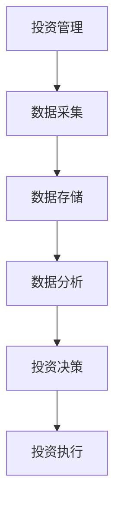

                 


# 《沃伦·巴菲特的长期持股策略分析》

---

## 关键词：  
沃伦·巴菲特, 长期持股, 价值投资, 投资策略, 股票估值, 安全边际  

---

## 摘要：  
本文深入分析了沃伦·巴菲特的长期持股策略，从其核心理念、数学模型、系统架构到实际应用，全面解析了这一策略的内在逻辑与实现方法。文章通过详细阐述巴菲特的价值投资理论、企业基本面分析、投资组合构建与管理等关键环节，结合数学模型和算法实现，为读者提供了一套完整的长期持股策略分析框架。  

---

## 第一部分：沃伦·巴菲特的长期持股策略概述  

### 第1章：长期持股策略的背景与意义  

#### 1.1 投资市场的基本概念  

##### 1.1.1 股票投资的基本概念  
股票投资是指通过购买公司股份，期望在未来通过股价上涨或分红收益获得投资回报。股票市场是投资者与企业之间的桥梁，投资者通过持股分享企业的成长收益。  

##### 1.1.2 长期投资与短期投资的定义  
- **长期投资**：投资者持有股票的时间跨度较长，通常超过一年，注重企业的长期价值增长。  
- **短期投资**：投资者持有股票的时间较短，通常在几天到几个月之间，主要关注市场波动带来的短期收益。  

##### 1.1.3 投资市场的核心要素  
1. **企业基本面**：包括企业的盈利能力、财务状况、行业地位等。  
2. **市场情绪**：投资者的心理预期和行为对市场价格的影响。  
3. **宏观经济环境**：如经济周期、利率政策、通货膨胀等。  

#### 1.2 投资者的角色与目标  

##### 1.2.1 投资者的分类  
1. **机构投资者**：如基金、保险公司、养老基金等。  
2. **个人投资者**：以个人名义进行股票投资的散户。  

##### 1.2.2 长期投资者的目标设定  
长期投资者通常设定复合年均增长率（CAGR）作为投资目标，追求稳健的长期收益，而非短期暴利。  

##### 1.2.3 投资者与市场的互动关系  
投资者的行为影响市场价格，而市场价格又反过来影响投资者的决策。长期投资者更注重企业基本面，较少受短期市场波动影响。  

#### 1.3 长期持股策略的起源与发展  

##### 1.3.1 价值投资的起源  
价值投资的鼻祖本杰明·格雷厄姆在20世纪初提出，强调以低于内在价值的价格买入股票。  

##### 1.3.2 巴菲特长期持股策略的形成  
沃伦·巴菲特师承格雷厄姆，但进一步发展了价值投资理论，提出了“安全边际”和“企业护城河”等概念。  

##### 1.3.3 长期持股策略在现代投资中的地位  
长期持股策略已成为机构投资者和高端个人投资者的重要策略，尤其在当前经济环境下，长期稳健的投资理念备受关注。  

---

### 第2章：巴菲特长期持股策略的核心理念  

#### 2.1 价值投资的基本原理  

##### 2.1.1 价值投资的定义  
价值投资是一种投资策略，强调以低于企业内在价值的价格买入股票，长期持有，等待市场回归理性。  

##### 2.1.2 价值投资的核心原则  
1. **安全边际**：买入价格低于内在价值，以降低投资风险。  
2. **企业内在价值**：通过财务指标和行业分析评估企业的实际价值。  
3. **长期持有**：避免频繁交易，降低交易成本和税务负担。  

#### 2.2 长期持股策略的关键要素  

##### 2.2.1 股票内在价值的评估  
企业内在价值 = 股东权益 + 预期收益 - 债务  
$$ V = E + F - D $$  
其中，\( V \) 是企业价值，\( E \) 是股东权益，\( F \) 是未来收益，\( D \) 是债务。  

##### 2.2.2 安全边际的概念  
安全边际 = 内在价值 - 市场价格  
$$ Margin = V - P $$  
当安全边际为正时，股票具有投资价值。  

##### 2.2.3 企业护城河  
企业护城河是指企业在行业中的竞争优势，如品牌、技术、成本优势等，能够确保企业长期盈利能力。  

#### 2.3 巴菲特定律与投资决策  

##### 2.3.1 巴菲特定律的核心内容  
巴菲特定律强调：  
- 投资者应选择具有强大竞争优势的企业。  
- 长期持有优质股票，避免频繁交易。  

##### 2.3.2 投资决策中的心理因素  
投资者容易受到贪婪和恐惧情绪的影响，长期持股策略要求投资者具备强大的心理素质，避免情绪化决策。  

##### 2.3.3 长期持股策略的风险控制  
1. 严格筛选投资标的，确保安全边际。  
2. 分散投资，降低风险集中度。  
3. 定期复盘，及时调整投资组合。  

---

## 第二部分：长期持股策略的数学模型与算法  

### 第3章：长期持股策略的数学模型与算法  

#### 3.1 股票估值模型  

##### 3.1.1 内在价值计算公式  
$$ V = \frac{E \times (1 + g)}{r - g} $$  
其中，\( V \) 是企业内在价值，\( E \) 是净利润，\( g \) 是增长率，\( r \) 是折现率。  

##### 3.1.2 股票安全边际计算公式  
$$ Margin = V - P $$  
其中，\( Margin \) 是安全边际，\( V \) 是内在价值，\( P \) 是市场价格。  

#### 3.2 投资组合优化算法  

##### 3.2.1 简单随机选择算法  
```python
import random

def random_stock_selector(stocks, num):
    selected = random.sample(stocks, num)
    return selected
```

##### 3.2.2 基于内在价值的排序算法  
```python
def value_investing_strategy(stocks):
    stocks_sorted = sorted(stocks, key=lambda x: x['V'] - x['P'])
    return stocks_sorted[:10]  # 选择前10只股票
```

---

## 第三部分：系统分析与架构设计  

### 第4章：系统架构与功能设计  

#### 4.1 系统功能设计  

##### 4.1.1 系统架构  


##### 4.1.2 系统功能模块  
1. 数据采集模块：收集企业财务数据、市场数据等。  
2. 数据分析模块：计算内在价值、安全边际等指标。  
3. 投资决策模块：基于数据分析结果，生成投资策略。  
4. 投资执行模块：执行交易指令，调整投资组合。  

---

## 第四部分：项目实战与应用  

### 第5章：项目实战与应用  

#### 5.1 环境安装与配置  
1. 安装Python和相关库（如pandas、numpy、scipy）。  
2. 数据源获取（如Yahoo Finance API）。  

#### 5.2 核心代码实现  

##### 5.2.1 股票估值函数  
```python
import pandas as pd

def calculate_intrinsic_value(finance_data):
    V = (finance_data['E'] * (1 + finance_data['g'])) / (finance_data['r'] - finance_data['g'])
    return V
```

##### 5.2.2 安全边际计算  
```python
def calculate_margin(V, P):
    return V - P
```

#### 5.3 实际案例分析  

##### 5.3.1 案例一：可口可乐  
1. 数据收集：可口可乐的财务数据和市场数据。  
2. 估值计算：计算可口可乐的内在价值。  
3. 安全边际分析：确定买入价格是否低于内在价值。  

#### 5.4 投资组合优化  

##### 5.4.1 组合优化算法  
```python
def optimize_portfolio(stocks):
    # 计算每只股票的安全边际
    margins = {stock['name']: stock['V'] - stock['P'] for stock in stocks}
    # 选择安全边际为正的股票
    selected = [name for name, margin in margins.items() if margin > 0]
    return selected
```

---

## 第五部分：总结与展望  

### 第6章：总结与展望  

#### 6.1 总结  
本文全面分析了沃伦·巴菲特的长期持股策略，从理论到实践，结合数学模型和系统架构，为投资者提供了完整的策略框架。  

#### 6.2 展望  
未来，随着人工智能和大数据技术的发展，长期持股策略将更加精准和高效。投资者可以利用机器学习算法优化股票筛选和投资组合管理，进一步提升投资效果。  

---

## 作者：  
**AI天才研究院/AI Genius Institute**  
**禅与计算机程序设计艺术/Zen And The Art of Computer Programming**  

---

通过以上内容，我们可以看到，长期持股策略不仅是一种投资理念，更是一种系统化的投资方法。通过数学模型、算法实现和系统架构的设计，投资者可以更好地理解和应用这一策略，实现长期稳健的投资收益。

