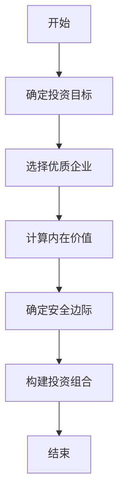
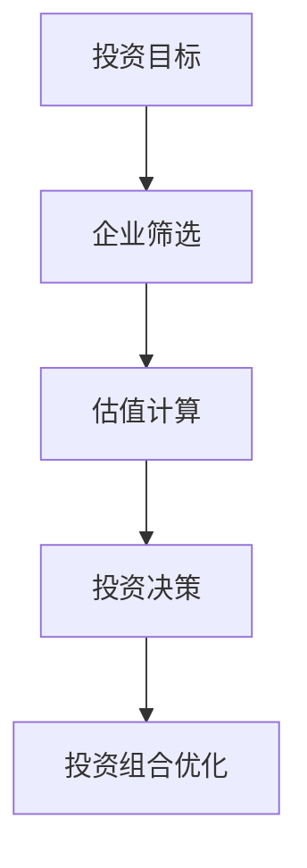

                 


# 沃伦·巴菲特：奥马哈预言家的价值投资策略

> 关键词：沃伦·巴菲特、价值投资、长期投资、安全边际、股票估值、投资策略、投资哲学

> 摘要：本文深入分析了沃伦·巴菲特的价值投资策略，探讨了他的投资理念、核心原则、数学模型以及系统架构。通过实际案例分析，揭示了巴菲特如何通过长期投资和安全边际实现财富增长，并为读者提供了价值投资的实践指南。

---

## 第1章: 沃伦·巴菲特与价值投资的背景介绍

### 1.1 沃伦·巴菲特的生平与投资理念

#### 1.1.1 巴菲特的成长经历与投资启蒙
沃伦·巴菲特（Warren Buffett）于1930年8月31日出生于美国奥马哈市，从小就展现出对数字和投资的浓厚兴趣。他在青少年时期就开始研究股票市场，阅读了大量投资书籍，并通过实践积累了宝贵的经验。巴菲特的早期经历为他后来的价值投资理念奠定了基础。

#### 1.1.2 巴菲特的投资哲学与价值观
巴菲特的价值投资哲学强调长期持有优质资产，注重企业的内在价值而非市场波动。他认为，投资的核心是找到那些具有持续竞争优势、良好管理和稳定收益的企业，并以合理的价格买入并长期持有。

#### 1.1.3 巴菲特与“奥马哈预言家”的称号
巴菲特因其在投资领域的卓越表现，被誉为“奥马哈预言家”。他在伯克希尔·哈撒韦公司（Berkshire Hathaway）的投资成绩，使他成为全球最知名的价值投资者之一。

### 1.2 价值投资的核心概念

#### 1.2.1 价值投资的定义与背景
价值投资是一种基于对公司内在价值评估的投资策略，强调以低于内在价值的价格买入优质股票。其核心在于识别市场的短期波动，抓住长期价值的机会。

#### 1.2.2 价值投资与其它投资策略的对比
与其他投资策略（如技术分析、短期交易）相比，价值投资更注重企业的基本面分析和长期盈利能力。它强调的是买入并持有优质资产，而非频繁交易。

#### 1.2.3 价值投资的边界与外延
价值投资不仅适用于股票市场，还可以扩展到其他资产类别，如房地产、债券等。其核心思想是寻找具有持续竞争优势的企业，无论其规模大小。

### 1.3 价值投资的核心要素与结构

#### 1.3.1 核心概念的原理分析
价值投资的核心要素包括：内在价值、安全边际、竞争优势。这些要素共同构成了巴菲特的投资决策框架。

#### 1.3.2 核心要素的特征对比表格
| 核心要素 | 特征 |
|----------|------|
| 内在价值 | 企业未来现金流的现值 |
| 安全边际 | 购买价格低于内在价值 |
| 竞争优势 | 企业具备长期竞争优势 |

#### 1.3.3 ER实体关系图架构的 Mermaid 流程图
```mermaid
erDiagram
    investor ->[拥有] investment
    investment ->[属于] company
    company ->[具备] competitive_advantage
    company ->[有] intrinsic_value
    investor ->[要求] margin_of_safety
```

---

## 第2章: 价值投资的核心理念与策略

### 2.1 价值投资的三大核心原则

#### 2.1.1 高质量企业的定义与特征
高质量企业是指那些具有持续竞争优势、稳定的现金流和良好管理的企业。巴菲特通常选择那些在行业内具有领先地位的企业，如可口可乐和苹果。

#### 2.1.2 安全边际的概念与计算
安全边际是指买入价格低于企业内在价值的部分。计算公式为：
$$ 安全边际 = 内在价值 - 购买价格 $$

#### 2.1.3 市场先生的理论与应用
巴菲特提出“市场先生”理论，认为市场波动是投资机会的来源。投资者应利用市场先生的恐慌或贪婪，进行逆向投资。

### 2.2 巴菲特的投资决策框架

#### 2.2.1 风险控制与投资安全边际
巴菲特强调风险控制，认为安全边际是保护投资者免受市场波动影响的关键。

#### 2.2.2 股票估值的三要素模型
股票估值的三要素模型包括：现金流、增长率和资本成本。

#### 2.2.3 投资组合的构建与优化
巴菲特的投资组合以集中投资为主，注重长期稳定的收益。

---

## 第3章: 巴菲特价值投资体系的数学模型与算法原理

### 3.1 价值投资的数学模型

#### 3.1.1 股票估值模型
股票的内在价值可以通过以下公式计算：
$$ V = \sum_{t=1}^{\infty} \frac{CF_t}{(1+r)^t} $$
其中，\( V \) 为内在价值，\( CF_t \) 为第 \( t \) 年的现金流，\( r \) 为折现率。

#### 3.1.2 安全边际计算
$$ 安全边际 = V - P $$
其中，\( P \) 为购买价格。

#### 3.1.3 投资组合优化
投资组合优化的目标是最大化收益，最小化风险。常用的风险衡量指标是标准差。

### 3.2 算法原理的 Mermaid 流程图


---

## 第4章: 巴菲特价值投资体系的系统分析与架构设计

### 4.1 投资体系的系统架构

#### 4.1.1 投资目标的设定与分解
投资目标包括：收益目标、风险控制目标等。

#### 4.1.2 投资策略的模块化设计
投资策略模块包括：企业筛选、估值计算、投资决策等。

#### 4.1.3 投资系统的整体架构图


### 4.2 投资系统的功能设计

#### 4.2.1 个股选择模块的功能设计
个股选择模块负责筛选具有竞争优势的企业。

#### 4.2.2 投资组合管理模块的功能设计
投资组合管理模块负责优化投资组合，分散风险。

#### 4.2.3 风险控制模块的功能设计
风险控制模块负责监控市场波动，调整投资策略。

---

## 第5章: 巴菲特价值投资体系的项目实战

### 5.1 项目环境与工具安装

#### 5.1.1 投资分析工具的安装与配置
推荐使用Excel或Python进行投资分析。

#### 5.1.2 数据获取与处理工具的安装
使用Yahoo Finance获取股票数据。

#### 5.1.3 投资组合管理系统的安装
可以使用第三方库如Pandas进行数据分析。

### 5.2 核心实现源代码

#### 5.2.1 股票估值模型的Python代码
```python
def calculate_intrinsic_value(cash_flows, discount_rate):
    return sum(cash_flow / (1 + discount_rate) ** t for t, cash_flow in enumerate(cash_flows))
```

#### 5.2.2 投资组合优化
使用均值-方差优化方法。

### 5.3 实际案例分析与解读

#### 5.3.1 案例一：可口可乐的投资策略
分析可口可乐的竞争优势和长期盈利能力。

#### 5.3.2 案例二：苹果的投资策略
评估苹果的创新能力和市场地位。

### 5.4 项目小结

#### 5.4.1 经验总结
长期投资优质企业是实现财富增长的关键。

#### 5.4.2 注意事项
注重风险控制，避免过度集中投资。

#### 5.4.3 拓展阅读
推荐阅读巴菲特的《聪明的投资者》。

---

## 第6章: 总结与展望

### 6.1 小结
价值投资的核心在于长期持有优质资产，注重安全边际和竞争优势。

### 6.2 投资建议
建议投资者学习巴菲特的投资理念，结合实际市场情况制定投资策略。

### 6.3 未来展望
随着市场的变化，价值投资策略需要不断调整和优化。

---

作者：AI天才研究院/AI Genius Institute & 禅与计算机程序设计艺术 /Zen And The Art of Computer Programming

