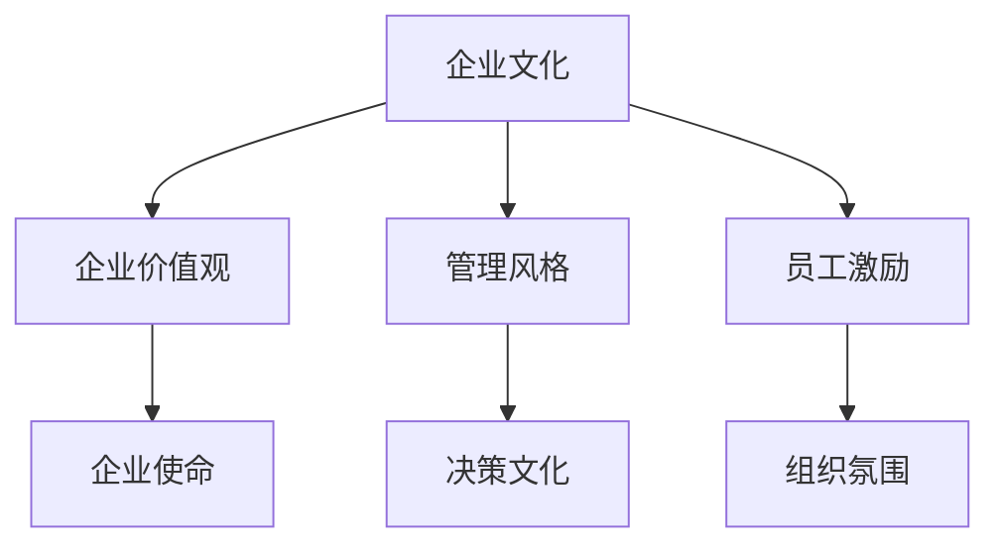
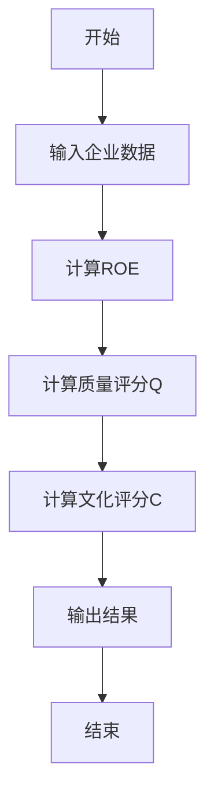

                 


# 《沃伦巴菲特的企业文化评估》

> 关键词：企业文化评估、巴菲特投资理念、企业价值观、管理风格、文化评分模型

> 摘要：本文详细探讨了沃伦巴菲特的企业文化评估方法，从背景与核心概念、算法与数学模型、系统分析与架构设计、项目实战等多个维度，深入分析了如何通过企业文化评估来预测企业长期价值。文章结合理论与实践，提供了详细的Python代码实现和实际案例分析，帮助读者全面理解巴菲特的企业文化评估理念。

---

## 第一部分: 企业文化评估的背景与核心概念

### 第1章: 企业文化评估的背景与问题背景

#### 1.1 什么是企业文化评估
- 从传统企业评估到文化评估的演进
  - 传统企业评估主要关注财务指标（如利润、收入、资产等）。
  - 企业文化评估将文化因素纳入评估体系，关注企业价值观、管理风格和员工激励。
- 企业文化评估的核心问题
  - 如何量化文化对企业价值的影响？
  - 如何构建一个可操作的企业文化评估模型？
- 企业文化评估的边界与外延
  - 企业文化评估的范围：包括企业内部文化、管理风格、员工关系等。
  - 外延：企业文化评估如何影响投资决策、企业并购等。

#### 1.2 为什么需要企业文化评估
- 传统企业评估的局限性
  - 仅关注财务指标可能导致对企业潜在风险的忽视。
  - 无法全面反映企业长期发展潜力。
- 文化对企业长期价值的影响
  - 企业文化是企业持续发展的关键因素。
  - 优秀的企业文化可以显著提升员工效率和企业凝聚力。
- 巴菲特投资理念中的文化因素
  - 巴菲特强调长期投资，重视企业治理和管理层质量。
  - 企业文化评估是巴菲特投资决策的重要组成部分。

#### 1.3 企业文化评估的核心要素
- 企业价值观与使命
  - 企业的核心价值观是企业文化的核心。
  - 使命是企业存在的意义，影响企业的长期目标。
- 管理风格与决策文化
  - 管理层的决策风格直接影响企业的战略方向。
  - 决策文化是企业文化的体现，影响企业的风险承受能力和创新能力。
- 员工激励与组织氛围
  - 员工激励机制是企业文化的重要组成部分。
  - 组织氛围直接影响员工的工作积极性和企业凝聚力。

### 第2章: 企业文化评估的核心概念与联系

#### 2.1 核心概念原理
- 企业文化评估的多维度模型
  - 从多个维度（如价值观、管理风格、员工激励）综合评估企业文化。
- 文化对企业绩效的影响机制
  - 企业文化通过影响员工行为和管理层决策，最终影响企业绩效。
- 巴菲特文化评估的独特视角
  - 巴菲特注重企业治理和管理层质量，强调企业文化的一致性和稳定性。

#### 2.2 核心概念对比分析
- 企业价值观 vs. 企业目标
  - 企业价值观是企业的核心理念，影响企业的目标制定和实现。
  - 企业目标是具体的目标，是价值观的体现。
- 管理风格 vs. 员工激励
  - 管理风格是管理层的决策方式，影响员工的工作态度。
  - 员工激励是通过奖励机制激发员工的积极性。
- 文化一致性 vs. 文化多样性
  - 文化一致性是企业文化的一致性，影响企业的稳定性。
  - 文化多样性是企业文化的不同方面，影响企业的创新能力。

#### 2.3 实体关系图（ER图）


---

## 第二部分: 企业文化评估的算法与数学模型

### 第3章: 巴菲特企业文化评估模型

#### 3.1 巴菲特文化评估模型概述
- 模型的输入与输出
  - 输入：企业财务数据、管理风格、员工激励机制。
  - 输出：企业文化评分、企业潜在价值预测。
- 模型的适用场景
  - 适用于长期股权投资评估。
  - 适用于企业并购中的文化评估。
- 模型的核心算法
  - 综合考虑财务指标和文化评分，预测企业长期价值。

#### 3.2 模型的数学表达
- 企业价值评估公式：
$$ V = \frac{E}{ROE} $$
  - 其中，$E$ 为企业的股权价值，$ROE$ 为净资产收益率。
- 文化评分公式：
$$ C = \alpha \cdot V + (1-\alpha) \cdot Q $$
  - 其中，$\alpha$ 为权重，$Q$ 为质量评分。

#### 3.3 算法流程图


#### 3.4 Python实现示例
```python
def calculate_roe(net_income, equity):
    return net_income / equity

def calculate_culture_score(roe, quality_score, alpha=0.7):
    return alpha * roe + (1 - alpha) * quality_score

# 示例数据
net_income = 100
equity = 5

ro

