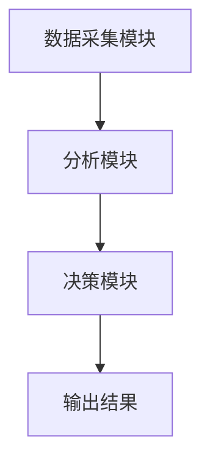
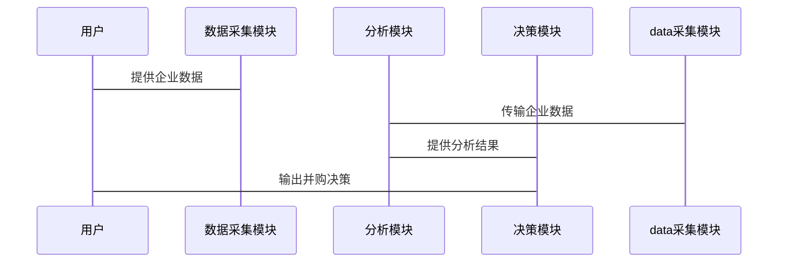

                 


# 沃伦巴菲特的并购策略分析

## 关键词：沃伦巴菲特，并购策略，价值投资，企业估值，竞争优势

## 摘要：  
本文深入分析了沃伦巴菲特的并购策略，从其投资哲学、分析框架到具体案例，系统阐述了巴菲特并购策略的核心要素、数学模型和实际应用。通过对企业基本面分析、竞争优势分析和估值模型的详细讲解，结合实际并购案例，总结出一套可操作的并购策略分析方法，并提出了具体的实施建议。

---

## 第一部分: 沃伦巴菲特并购策略的背景与核心理念

### 第1章: 沃伦巴菲特的生平与投资哲学

#### 1.1 沃伦巴菲特的生平简介
沃伦·巴菲特（Warren Buffett）于1934年8月30日出生于美国内布拉斯州的奥马哈市。他从小就展现出了对数字和投资的极大兴趣。巴菲特的父亲是一位律师，同时也是一位国会议员，这为巴菲特提供了良好的家庭环境和早期教育。巴菲特在高中时期就展现了卓越的商业头脑，他在15岁时就完成了自己的第一笔股票投资。

巴菲特的投资理念深受本杰明·格雷厄姆（Benjamin Graham）的影响。格雷厄姆是20世纪初著名的投资学家，提出了“价值投资”的概念，即寻找那些市场价格低于其内在价值的股票进行投资。巴菲特从格雷厄姆那里学到了如何计算股票的内在价值，并在此基础上形成了自己的投资哲学。

巴菲特的职业生涯始于1950年代，他最初通过合伙企业（巴菲特合伙公司）进行投资，逐步积累了大量的财富和声誉。1965年，他收购了伯克希尔·哈撒韦公司（Berkshire Hathaway），这成为他投资生涯的重要转折点。伯克希尔·哈撒韦公司不仅是巴菲特的主要投资工具，也成为了他践行价值投资理念的试验田。

#### 1.2 巴菲特的投资哲学
巴菲特的投资哲学以“价值投资”为核心，强调长期投资和安全边际。他主张寻找那些具有强大竞争优势、良好管理团队和合理估值的企业进行投资。以下是巴菲特投资哲学的核心要素：

1. **长期投资**：巴菲特认为市场短期波动难以预测，但长期趋势可以通过对企业基本面的深入分析来把握。
2. **安全边际**：巴菲特强调在投资时要留有安全边际，即以低于内在价值的价格买入股票，以降低投资风险。
3. **竞争优势**：巴菲特特别关注企业的竞争优势，例如成本优势、品牌优势和市场地位等。他认为只有具有持续竞争优势的企业才能长期为股东创造价值。
4. **管理团队**：巴菲特认为优秀的管理团队是企业成功的关键，他倾向于投资那些由诚实、有能力的管理团队领导的企业。

#### 1.3 巴菲特的合伙人制度
巴菲特通过合伙企业制度将投资者的利益与自己的利益紧密结合。合伙人制度的核心在于信任和长期合作，巴菲特通过这种方式吸引了大量优秀的投资人才，并共同分享投资成果。这种制度不仅为伯克希尔·哈撒韦公司的发展提供了资金支持，也为其积累了丰富的投资经验。

---

### 第2章: 巴菲特并购策略的背景

#### 2.1 美国企业并购的历史背景
20世纪中后期，美国企业并购市场经历了多次波动，但总体呈现出上升趋势。1980年代是美国企业并购的高峰期，许多企业通过并购实现了快速扩张。然而，这一时期的并购活动也伴随着大量的失败案例，许多企业因为盲目追求规模扩张而陷入了财务困境。

#### 2.2 巴菲特并购策略的形成
巴菲特的并购策略是在实践中不断总结和完善的。他早期的投资主要集中在股票市场，但随着伯克希尔·哈撒韦公司的不断发展，他开始将目光转向并购活动。巴菲特的并购策略以稳健和保守著称，他倾向于寻找那些具有强大现金流、良好管理和合理估值的企业。

巴菲特的并购策略具有以下几个特点：
1. **注重企业基本面**：巴菲特在并购前会对企业的财务状况、盈利能力和发展前景进行深入分析。
2. **关注企业竞争优势**：他倾向于投资那些具有持续竞争优势的企业，例如可口可乐和吉列公司。
3. **注重估值**：巴菲特强调以合理的价格进行并购，避免支付过高的溢价。

---

## 第二部分: 巴菲特并购策略的核心概念与分析框架

### 第3章: 巴菲特并购策略的核心概念

#### 3.1 价值投资与并购策略的关系
价值投资是巴菲特并购策略的核心理念。他认为，只有那些市场价格低于内在价值的股票才具有投资价值。并购策略则是通过寻找那些具有强大竞争优势和合理估值的企业，实现长期的资本增值。

#### 3.2 并购策略的关键指标
在并购过程中，巴菲特注重以下几个关键指标：
1. **企业估值指标**：包括市盈率（P/E）、市净率（P/B）和企业价值/息税前利润（EV/EBITDA）等。
2. **财务健康指标**：包括资产负债率、流动比率和净利润率等。
3. **企业竞争优势分析**：包括成本优势、品牌优势和市场地位等。

#### 3.3 巴菲特并购策略的核心要素
1. **安全边际**：巴菲特在并购时总是留有安全边际，确保以低于内在价值的价格进行投资。
2. **竞争优势**：他倾向于投资那些具有持续竞争优势的企业，以确保企业的长期盈利能力。
3. **管理团队**：优秀的管理团队是企业成功的关键，巴菲特在并购时会重点关注企业的管理团队。

### 第4章: 巴菲特并购策略的分析框架

#### 4.1 企业基本面分析
1. **财务报表分析**：包括利润表、资产负债表和现金流量表的分析。
2. **盈利能力分析**：包括净利润率、资产回报率和股东权益回报率等指标。
3. **偿债能力分析**：包括资产负债率、流动比率和速动比率等指标。

#### 4.2 企业竞争优势分析
1. **核心竞争力分析**：包括企业的成本优势、技术优势和品牌优势等。
2. **市场地位分析**：包括企业在市场中的占有率和竞争对手的情况。
3. **可持续竞争优势分析**：包括企业的护城河和长期发展能力。

#### 4.3 企业估值模型
1. **市盈率模型**：通过比较企业的市盈率与行业平均水平，判断企业的估值是否合理。
2. **市净率模型**：通过比较企业的市净率与行业平均水平，判断企业的估值是否合理。
3. **内在价值模型**：通过对企业未来现金流的折现，计算企业的内在价值。

---

## 第三部分: 巴菲特并购策略的算法原理与数学模型

### 第5章: 并购策略的算法原理

#### 5.1 并购策略的多因素分析模型
1. **多因素分析模型的构建**：通过对企业财务指标、竞争优势和管理团队等多方面进行综合分析，构建一个全面的分析框架。
2. **多因素分析模型的实现步骤**：
   - 收集企业的财务数据和行业数据。
   - 计算企业的估值指标和竞争优势指标。
   - 综合分析企业的投资价值。

3. **多因素分析模型的优缺点**：
   - 优点：能够全面分析企业的投资价值。
   - 缺点：分析过程较为复杂，需要大量的数据支持。

#### 5.2 巴菲特并购策略的决策树模型
1. **决策树模型的构建**：通过对企业财务状况、竞争优势和估值指标等进行分层分析，构建一个决策树模型。
2. **决策树模型的实现步骤**：
   - 确定企业的财务状况是否健康。
   - 分析企业的竞争优势是否显著。
   - 评估企业的估值是否合理。

3. **决策树模型的优缺点**：
   - 优点：能够清晰地指导并购决策。
   - 缺点：模型的复杂性较高，需要大量的数据支持。

### 第6章: 并购策略的数学模型与公式

#### 6.1 企业估值模型的数学公式
1. **市盈率模型**：
   $$ P/E = \frac{\text{股价}}{\text{每股净利润}} $$
2. **市净率模型**：
   $$ P/B = \frac{\text{股价}}{\text{每股净资产}} $$
3. **内在价值模型**：
   $$ V = \sum_{t=1}^{n} \frac{\text{现金流}_t}{(1 + r)^t} $$

#### 6.2 竞争优势分析的数学公式
1. **成本优势**：
   $$ \text{成本优势} = \frac{\text{行业平均成本}}{\text{企业实际成本}} $$
2. **品牌优势**：
   $$ \text{品牌优势} = \frac{\text{品牌价值}}{\text{行业平均品牌价值}} $$
3. **市场地位**：
   $$ \text{市场地位} = \frac{\text{企业市场占有率}}{\text{行业平均市场占有率}} $$

---

## 第四部分: 巴菲特并购策略的系统分析与架构设计

### 第7章: 并购策略的系统分析

#### 7.1 问题场景介绍
在企业并购过程中，如何选择具有长期竞争优势的企业是一个复杂的决策问题。本文通过构建一个全面的分析框架，帮助投资者在并购过程中做出更加明智的决策。

#### 7.2 系统功能设计
1. **领域模型**：
   - 企业基本面分析：包括财务指标和竞争优势分析。
   - 估值模型：包括市盈率、市净率和内在价值模型。
2. **系统架构设计**：
   - 数据采集模块：负责收集企业的财务数据和行业数据。
   - 分析模块：负责对企业进行多维度分析。
   - 决策模块：负责根据分析结果做出并购决策。

#### 7.3 系统架构图


#### 7.4 系统交互图


---

## 第五部分: 巴菲特并购策略的项目实战

### 第8章: 项目实战

#### 8.1 环境安装
在进行并购策略分析之前，需要安装以下工具：
1. Python编程环境（如Anaconda）。
2. 数据分析工具（如Pandas和NumPy）。
3. 图形绘制工具（如Matplotlib和Seaborn）。

#### 8.2 核心代码实现
以下是并购策略分析的核心代码示例：
```python
import pandas as pd
import numpy as np

def calculate_valuation_ratios(df):
    df['P/E'] = df['股价'] / df['每股净利润']
    df['P/B'] = df['股价'] / df['每股净资产']
    df['EV/EBITDA'] = df['企业价值'] / df['息税前利润']
    return df

def calculate_competitive_advantages(df):
    df['成本优势'] = df['行业平均成本'] / df['企业实际成本']
    df['品牌优势'] = df['品牌价值'] / df['行业平均品牌价值']
    df['市场地位'] = df['企业市场占有率'] / df['行业平均市场占有率']
    return df

# 示例数据
data = {
    '股价': [100, 200, 300],
    '每股净利润': [10, 20, 30],
    '每股净资产': [50, 60, 70],
    '企业价值': [500, 600, 700],
    '息税前利润': [50, 60, 70],
    '行业平均成本': [80, 90, 100],
    '企业实际成本': [70, 80, 90],
    '品牌价值': [100, 200, 300],
    '行业平均品牌价值': [80, 90, 100],
    '企业市场占有率': [20, 30, 40],
    '行业平均市场占有率': [15, 20, 25]
}

df = pd.DataFrame(data)
df = calculate_valuation_ratios(df)
df = calculate_competitive_advantages(df)
print(df)
```

#### 8.3 案例分析
以可口可乐公司为例，分析巴菲特的并购策略：
1. **财务状况**：可口可乐公司具有强大的现金流和良好的盈利能力。
2. **竞争优势**：可口可乐公司在饮料市场具有显著的品牌优势和成本优势。
3. **估值指标**：可口可乐公司的市盈率和市净率均低于行业平均水平，具有较高的投资价值。

#### 8.4 项目小结
通过实际案例分析，我们可以看到巴菲特并购策略的有效性。他通过对企业基本面、竞争优势和估值指标的综合分析，成功地选择了具有长期竞争优势的企业。

---

## 第六部分: 巴菲特并购策略的最佳实践与小结

### 第9章: 最佳实践与小结

#### 9.1 最佳实践
1. **注重企业基本面**：在并购前，要对企业的财务状况和竞争优势进行深入分析。
2. **关注估值指标**：确保以合理的价格进行并购，避免支付过高的溢价。
3. **长期投资**：选择那些具有持续竞争优势的企业，进行长期投资。

#### 9.2 小结
巴菲特的并购策略以价值投资为核心，强调对企业基本面、竞争优势和估值指标的综合分析。通过本文的分析，我们可以看到巴菲特并购策略的科学性和实用性。

---

## 作者：AI天才研究院/AI Genius Institute & 禅与计算机程序设计艺术 /Zen And The Art of Computer Programming

---

本文通过详细分析沃伦巴菲特的并购策略，从其投资哲学、分析框架到具体案例，系统阐述了巴菲特并购策略的核心要素、数学模型和实际应用。通过对企业基本面分析、竞争优势分析和估值模型的详细讲解，结合实际并购案例，总结出一套可操作的并购策略分析方法，并提出了具体的实施建议。

