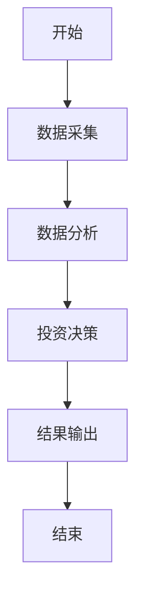
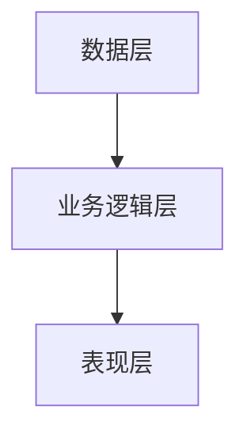
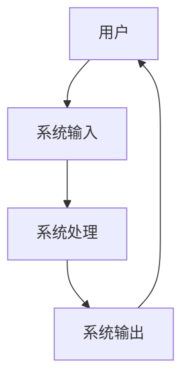

                 


# 沃尔特·施洛斯的价值投资实践指南

> 关键词：价值投资，沃尔特·施洛斯，内在价值，安全边际，投资策略，数学模型

> 摘要：本文详细介绍了沃尔特·施洛斯的价值投资方法，从基本概念到数学模型，从系统设计到项目实战，全面解析了价值投资的核心理念和实践技巧。通过本文，读者可以掌握如何运用价值投资策略进行投资决策，并通过实际案例和代码实现，深入理解价值投资的精髓。

---

## 第1章: 价值投资概述

### 1.1 价值投资的核心概念

#### 1.1.1 价值投资的定义与背景

价值投资是一种投资策略，强调以低于内在价值的价格购买优质资产。其核心理念是寻找市场低估的股票，通过长期持有实现资本增值。价值投资起源于20世纪初，由本杰明·格雷厄姆和大卫·多德提出，后来被沃尔特·施洛斯发扬光大。

#### 1.1.2 价值投资的基本原理

价值投资的两大核心原则是：

1. **内在价值**：企业的真正价值是其未来现金流的现值。
2. **安全边际**：以低于内在价值的价格买入股票，以降低投资风险。

#### 1.1.3 价值投资与其它投资策略的区别

与趋势投资和技术分析不同，价值投资关注企业的基本面，注重长期价值而非短期价格波动。

---

### 1.2 沃尔特·施洛斯的投资理念

#### 1.2.1 施洛斯的生平简介

沃尔特·施洛斯（Walter Schloss）是美国著名的价值投资者，师从本杰明·格雷厄姆。他以严谨的投资风格和长期的超额收益闻名，尤其是在1973-1974年的大熊市中表现卓越。

#### 1.2.2 施洛斯投资哲学的核心思想

施洛斯的投资理念可以总结为：

- **买入低估的股票**：寻找市盈率、市净率等指标低于行业平均水平的企业。
- **长期持有**：避免频繁交易，降低交易成本。
- **注重安全边际**：买入价格远低于内在价值。

#### 1.2.3 施洛斯投资策略的特点

1. **集中投资**：集中持有少数优质股票，而非分散投资。
2. **逆向投资**：在市场恐慌时买入，市场狂热时卖出。

---

### 1.3 价值投资的实践方法

#### 1.3.1 价值投资的基本步骤

1. **分析企业基本面**：包括财务状况、盈利能力、竞争优势等。
2. **计算内在价值**：使用DCF模型等方法评估企业的真实价值。
3. **寻找安全边际**：买入价格低于内在价值。
4. **长期持有**：耐心等待价值回归。

#### 1.3.2 价值投资的选股标准

- **低市盈率（P/E）**：低于行业平均水平。
- **低市净率（P/B）**：低于行业平均水平。
- **高股息率**：提供稳定的现金流。

#### 1.3.3 价值投资的风险控制

- **分散投资**：降低单一投资的风险。
- **严格选股**：确保买入价格具有足够的安全边际。

---

## 第2章: 价值投资的核心概念与理论框架

### 2.1 内在价值与市场价值

#### 2.1.1 内在价值的定义与计算方法

**内在价值**是企业未来现金流的现值，公式如下：

$$
\text{内在价值} = \sum_{t=1}^{\infty} \frac{\text{CF}_t}{(1 + r)^t}
$$

其中，CF<sub>t</sub>是第t年的现金流，r是折现率。

#### 2.1.2 市场价值与内在价值的关系

市场价值围绕内在价值波动，内在价值是市场的长期均衡价格。

#### 2.1.3 如何通过内在价值评估企业

以施洛斯为例，他会通过分析企业的收入、利润、现金流等指标，估算其内在价值。

---

### 2.2 安全边际

#### 2.2.1 安全边际的定义与作用

**安全边际**= 内在价值 - 市场价格

#### 2.2.2 安全边际的计算方法

$$
\text{安全边际} = \text{内在价值} - \text{市场价格}
$$

#### 2.2.3 安全边际在投资决策中的应用

- **安全边际为正时**：买入股票。
- **安全边际为负时**：卖出股票。

---

### 2.3 竞争优势与护城河

#### 2.3.1 竞争优势的定义与分类

竞争优势包括成本优势、品牌优势、技术优势等。

#### 2.3.2 护城河的类型与评估方法

护城河可以是：

- **宽 moat**：强大的竞争优势，难以被竞争对手复制。
- **窄 moat**：竞争优势较弱，容易被模仿。

#### 2.3.3 竞争优势在投资中的重要性

具有宽 moat 的企业更容易产生持续的超额收益。

---

## 第3章: 价值投资的数学模型与算法

### 3.1 内在价值计算模型

#### 3.1.1 现金流折现模型（DCF）

**DCF公式**：

$$
\text{企业价值} = \frac{\text{自由现金流}}{(1 + r)^n}
$$

#### 3.1.2 市盈率与市净率分析

- **市盈率（P/E）**：股价 / 每股收益。
- **市净率（P/B）**：股价 / 每股净资产。

#### 3.1.3 股息率与股息支付率分析

- **股息率**：股息 / 股价。
- **股息支付率**：股息 / 净利润。

---

### 3.2 投资组合优化算法

#### 3.2.1 马科维茨投资组合理论

马科维茨提出，最优投资组合是使风险最小化，同时达到预期收益。

#### 3.2.2 现实中的投资组合优化

根据投资者的风险承受能力，调整投资组合的资产配置。

#### 3.2.3 如何平衡风险与收益

- **风险厌恶者**：选择低风险投资。
- **风险偏好者**：选择高风险高收益投资。

---

### 3.3 风险评估与控制算法

#### 3.3.1 风险的定义与分类

风险包括市场风险、流动性风险、信用风险等。

#### 3.3.2 风险评估的数学模型

$$
\text{风险} = \text{标准差}(r)
$$

#### 3.3.3 风险控制的策略与方法

- **分散投资**：降低非系统性风险。
- **对冲交易**：降低系统性风险。

---

## 第4章: 价值投资的系统分析与架构设计

### 4.1 投资分析系统的功能设计

#### 4.1.1 系统目标与范围

构建一个自动化价值投资分析系统，辅助投资者进行投资决策。

#### 4.1.2 系统功能模块划分

- 数据采集模块：收集企业财务数据。
- 数据分析模块：计算内在价值、安全边际等指标。
- 投资决策模块：根据分析结果生成投资建议。

#### 4.1.3 系统功能流程图



---

### 4.2 系统架构设计

#### 4.2.1 系统架构的层次划分

- 数据层：存储企业数据。
- 业务逻辑层：执行数据分析和计算。
- 表现层：展示分析结果。

#### 4.2.2 系统架构的模块关系



---

### 4.3 系统接口与交互设计

#### 4.3.1 系统接口设计

- 数据接口：与数据库交互。
- 用户接口：接收用户输入，输出分析结果。

#### 4.3.2 系统交互设计



---

## 第5章: 项目实战

### 5.1 环境安装

#### 5.1.1 安装Python与相关库

```bash
pip install numpy pandas matplotlib
```

#### 5.1.2 数据源获取

从公开的股票数据库获取企业财务数据。

---

### 5.2 系统核心实现源代码

#### 5.2.1 DCF模型实现

```python
import numpy as np

def calculate_intrinsic_value(cash_flows, discount_rate):
    return np.npv(discount_rate, cash_flows)
```

#### 5.2.2 投资组合优化实现

```python
import pandas as pd

def optimize_portfolio(returns, weights):
    return pd.Series.dot(weights, returns)
```

---

### 5.3 实际案例分析

#### 5.3.1 案例分析

以施洛斯投资的某企业为例，计算其内在价值和安全边际。

#### 5.3.2 结果解读

根据分析结果，给出投资建议。

---

## 第6章: 总结与展望

### 6.1 总结

价值投资的核心是寻找市场低估的股票，通过长期持有实现资本增值。沃尔特·施洛斯的投资方法为投资者提供了宝贵的实践经验。

### 6.2 展望

随着技术的进步，价值投资将更加依赖数据分析和算法优化。未来，投资者可以利用更先进的工具和方法，提高投资决策的效率和准确性。

---

## 第7章: 最佳实践与注意事项

### 7.1 最佳实践

- **保持耐心**：价值投资需要长期持有。
- **持续学习**：关注市场动态，更新投资策略。
- **严格选股**：确保买入价格具有足够的安全边际。

### 7.2 注意事项

- **避免过度分散**：集中投资优质资产。
- **控制仓位**：避免杠杆过高，降低投资风险。

---

## 作者：AI天才研究院 & 禅与计算机程序设计艺术

---

通过本文的详细分析，读者可以全面理解沃尔特·施洛斯的价值投资方法，并将其应用于实际投资中。从理论到实践，从系统设计到代码实现，本文为价值投资者提供了全面的指导和实用的工具。

