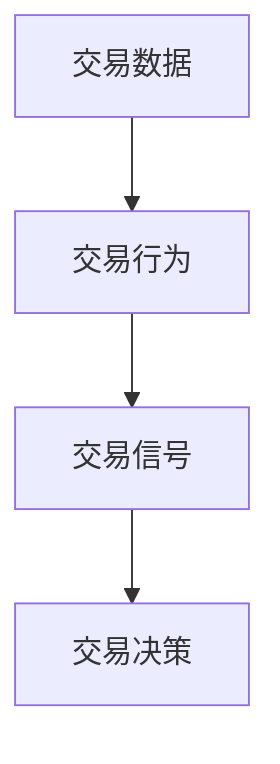
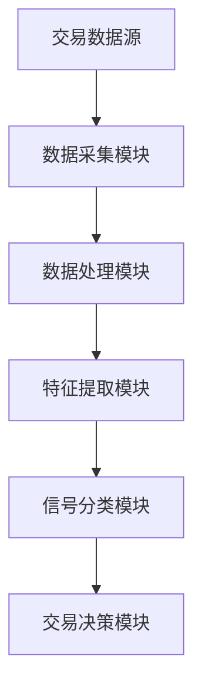
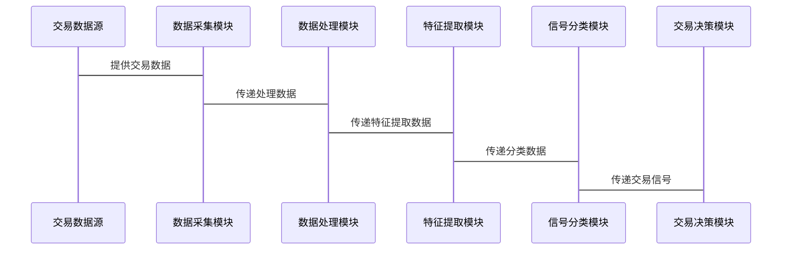

                 


# 沃尔特·施洛斯的公司内部人交易分析

## 关键词：内部人交易分析，沃尔特·施洛斯，交易信号识别，算法原理，系统架构设计

## 摘要：本文深入探讨沃尔特·施洛斯的内部人交易分析方法，从核心概念到算法实现，再到系统架构设计，结合实际案例，全面解析内部人交易分析的原理与应用。

---

## 第一部分：内部人交易分析概述

### 第1章：内部人交易分析的背景与概念

#### 1.1 内部人交易分析的定义与背景
内部人交易分析是一种通过对公司内部人员的交易行为进行分析，以识别潜在的市场信号的方法。这种方法基于一个基本假设：内部人员对公司未来的表现有更深入的了解，他们的交易行为往往能反映公司未来的财务状况或市场趋势。

##### 1.1.1 内部人交易的基本概念
内部人交易指的是公司内部人员（如高管、董事、主要股东等）基于对公司未来信息的掌握，进行的股票买卖行为。这些交易行为可能揭示了公司未来的财务状况、市场策略或行业趋势。

##### 1.1.2 内部人交易的法律与道德框架
内部人交易在许多国家和地区受到严格的法律监管。例如，美国证券交易委员会（SEC）规定，内部人员在进行交易时必须提前披露相关信息。然而，合法的内部人交易分析是基于公开的交易数据，通过技术手段识别交易信号，而非利用未公开信息进行交易。

##### 1.1.3 内部人交易在投资决策中的作用
内部人交易分析在投资决策中扮演着重要角色。通过分析内部人员的交易行为，投资者可以识别潜在的市场机会或风险。例如，如果公司高管大量增持公司股票，这可能是一个积极的信号，表明公司未来将有良好的表现。

#### 1.2 沃尔特·施洛斯的交易分析方法
沃尔特·施洛斯是内部人交易分析领域的先驱，他的方法以其独特性和高效性著称。

##### 1.2.1 施洛斯的交易分析核心理念
施洛斯的核心理念是通过分析内部人员的交易行为，识别潜在的交易信号。他认为，内部人员的交易行为往往反映了对公司未来表现的预期。

##### 1.2.2 施洛斯的交易信号识别方法
施洛斯的交易信号识别方法主要包括以下几个步骤：
1. 数据收集：收集公司内部人员的交易数据，包括交易时间、交易金额、交易方向等。
2. 数据分析：通过统计分析和模式识别，识别异常交易行为。
3. 信号分类：根据交易行为的特征，将交易信号分为不同的类别，如买入信号、卖出信号等。

##### 1.2.3 施洛斯方法与其他交易分析方法的对比
与其他交易分析方法相比，施洛斯的方法更加注重内部人员的交易行为，而非外部市场数据。这种方法的独特之处在于它能够从内部人员的交易行为中提取有用的信号，帮助投资者做出更明智的投资决策。

---

### 第2章：内部人交易分析的核心概念与联系

#### 2.1 内部人交易分析的原理
内部人交易分析的原理是通过分析内部人员的交易行为，识别潜在的交易信号。这些信号可以帮助投资者预测市场趋势或公司表现。

##### 2.1.1 内部人交易的信号识别
信号识别是内部人交易分析的核心步骤。通过分析交易数据，识别出异常的交易行为，这些行为可能预示着公司未来的表现。

##### 2.1.2 内部人交易的数学模型
内部人交易分析可以利用数学模型来识别交易信号。例如，可以使用统计模型来分析交易数据的分布情况，识别异常值。

#### 2.2 内部人交易分析的核心要素对比
内部人交易分析的核心要素包括交易数据、交易行为、交易信号等。

##### 2.2.1 交易数据的特征分析
交易数据的特征分析是内部人交易分析的基础。通过分析交易数据的特征，可以识别出异常的交易行为。

##### 2.2.2 交易行为的模式识别
交易行为的模式识别是内部人交易分析的重要步骤。通过识别交易行为的模式，可以预测未来市场趋势。

##### 2.2.3 交易信号的强度评估
交易信号的强度评估是内部人交易分析的关键。通过评估交易信号的强度，可以确定交易信号的有效性。

#### 2.3 内部人交易分析的ER实体关系图
以下是内部人交易分析的ER实体关系图：



---

### 第3章：内部人交易分析的算法原理

#### 3.1 内部人交易信号识别算法
内部人交易信号识别算法是内部人交易分析的核心部分。以下是具体的算法步骤：

##### 3.1.1 交易数据预处理
交易数据预处理是算法的第一步。通过预处理，可以消除数据中的噪声，提高数据的质量。

##### 3.1.2 交易行为特征提取
交易行为特征提取是算法的第二步。通过提取交易行为的特征，可以识别出异常的交易行为。

##### 3.1.3 交易信号分类算法
交易信号分类算法是算法的最后一步。通过分类算法，可以将交易信号分为不同的类别。

#### 3.2 算法实现的Python代码
以下是内部人交易信号识别算法的Python代码示例：

```python
def identify Insider_signal(data):
    # 数据预处理
    processed_data = preprocess(data)
    # 特征提取
    features = extract_features(processed_data)
    # 信号分类
    signal = classify(features)
    return signal
```

#### 3.3 数学模型与公式
内部人交易分析的数学模型可以帮助我们更好地理解交易信号的形成过程。

##### 3.3.1 交易信号强度公式
$$ signal\_strength = \sum_{i=1}^{n} (交易行为特征_i \times 权重_i) $$

##### 3.3.2 交易信号分类模型
$$ P(信号|特征) = \frac{P(特征|信号) \times P(信号)}{P(特征)} $$

---

### 第4章：内部人交易分析的系统架构设计

#### 4.1 系统功能设计
内部人交易分析系统的设计需要考虑多个功能模块。

##### 4.1.1 交易数据采集模块
交易数据采集模块负责收集公司内部人员的交易数据。

##### 4.1.2 交易行为分析模块
交易行为分析模块负责分析交易行为的特征，识别异常交易行为。

##### 4.1.3 交易信号生成模块
交易信号生成模块负责生成交易信号，并输出交易决策。

#### 4.2 系统架构图
以下是内部人交易分析系统的架构图：



#### 4.3 系统接口设计
系统接口设计需要考虑模块之间的交互。

#### 4.4 系统交互序列图
以下是系统交互的序列图：



---

## 第五部分：项目实战

### 第5章：内部人交易分析的项目实战

#### 5.1 环境安装与配置
要进行内部人交易分析，首先需要安装必要的软件和工具。

##### 5.1.1 Python环境的安装与配置
安装Python和相关的库，如Pandas、NumPy、Scikit-learn等。

##### 5.1.2 数据库的安装与配置
安装关系型数据库，如MySQL或PostgreSQL，并配置数据连接。

#### 5.2 系统核心实现源代码
以下是内部人交易分析系统的Python代码示例：

```python
import pandas as pd
from sklearn import preprocessing
from sklearn.tree import DecisionTreeClassifier

def preprocess(data):
    # 数据预处理
    processed_data = data.dropna()
    return processed_data

def extract_features(data):
    # 特征提取
    features = data[['交易金额', '交易时间', '交易方向']]
    return features

def classify(features):
    # 信号分类
    model = DecisionTreeClassifier()
    model.fit(features, target)
    return model.predict(features)

data = pd.read_csv('交易数据.csv')
processed_data = preprocess(data)
features = extract_features(processed_data)
signal = classify(features)
print(signal)
```

#### 5.3 代码应用解读与分析
通过对代码的解读与分析，可以更好地理解内部人交易分析的实现过程。

#### 5.4 实际案例分析
通过实际案例分析，可以验证内部人交易分析方法的有效性。

#### 5.5 项目小结
项目小结总结了内部人交易分析系统的实现过程和应用效果。

---

## 第六部分：最佳实践与小结

### 第6章：内部人交易分析的最佳实践

#### 6.1 小结
内部人交易分析是一种有效的投资决策工具，通过分析内部人员的交易行为，识别潜在的交易信号。

#### 6.2 注意事项
在实际应用中，需要注意数据的准确性和算法的有效性。

#### 6.3 拓展阅读
推荐一些相关的书籍和资源，供读者进一步学习。

---

## 作者：AI天才研究院/AI Genius Institute & 禅与计算机程序设计艺术/Zen And The Art of Computer Programming

---

希望这篇文章能够为您提供有价值的信息和启示！

