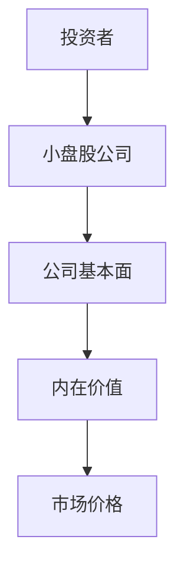
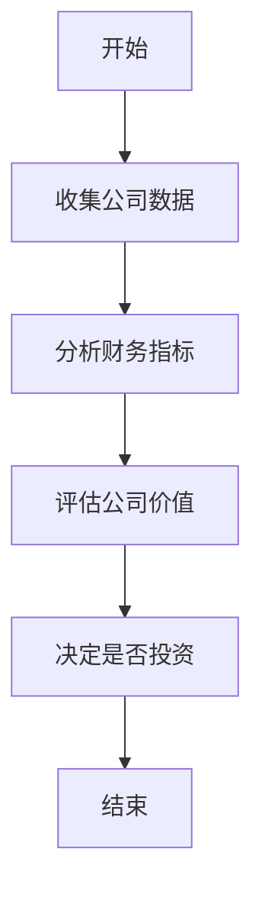
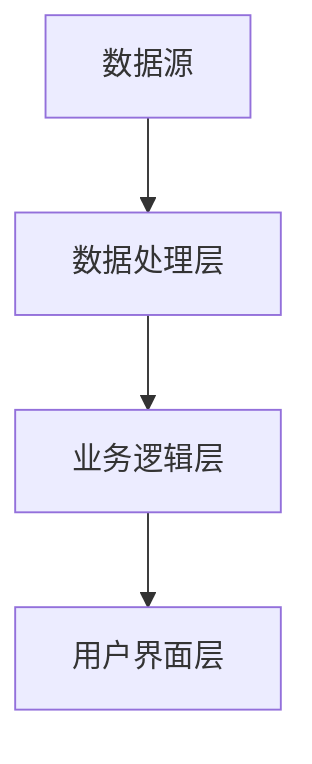

                 


# 沃尔特·施洛斯的小盘股价值投资：发掘被忽视的宝藏

## 关键词：
- 小盘股投资
- 价值投资
- 沃尔特·施洛斯
- 投资策略
- 投资系统

## 摘要：
本文深入探讨了小盘股价值投资的核心理念，以沃尔特·施洛斯的投资策略为切入点，分析了小盘股投资的背景、核心概念、算法原理、系统架构及实际应用。通过系统的方法，本文帮助投资者理解如何从小盘股市场中发现被忽视的宝藏，实现长期稳定的收益。

---

## 第1章: 小盘股投资的背景与重要性

### 1.1 小盘股市场的定义与特点
小盘股市场是金融市场中的一部分，通常指那些市值较小、流通股本较少的公司股票。与大盘股相比，小盘股具有以下特点：
- **高增长潜力**：小盘股公司通常处于成长阶段，具有较高的增长潜力。
- **低关注度**：相对于大盘股，小盘股往往被市场忽视，估值可能被低估。
- **高波动性**：小盘股市场的波动性通常较高，受市场情绪影响较大。
- **流动性风险**：小盘股的交易量较小，可能面临流动性风险。

### 1.2 价值投资的核心理念
价值投资是一种以基本面分析为基础的投资策略，强调以低于内在价值的价格购买优质资产。其核心理念包括：
- **长期持有**：价值投资者通常会长期持有股票，不因短期波动而改变投资策略。
- **安全边际**：买入价格应低于公司内在价值，以降低投资风险。
- **公司基本面**：关注公司的财务状况、盈利能力、管理团队等因素，选择具有竞争优势的公司。

### 1.3 沃尔特·施洛斯的投资风格
沃尔特·施洛斯是价值投资的代表人物之一，专注于小盘股投资。他的投资风格具有以下特点：
- **专注于小盘股**：施洛斯认为小盘股市场中存在许多被忽视的投资机会。
- **深度研究**：他强调对公司基本面的深入研究，尤其是公司的财务状况和盈利能力。
- **长期持有**：施洛斯通常会长期持有股票，除非公司的基本面发生了根本性变化。

---

## 第2章: 小盘股价值投资的核心概念与联系

### 2.1 核心概念原理
小盘股价值投资的核心原理在于发现市场中的估值偏差。通过深入分析公司的基本面，投资者可以找到那些市场价格低于内在价值的公司。这种策略的核心在于识别被市场忽视的优质公司。

### 2.2 核心概念属性对比表格
以下是价值投资与小盘股投资的对比表格：

| 概念       | 价值投资       | 小盘股投资       |
|------------|----------------|------------------|
| 核心目标   | 追求内在价值   | 发掘被低估小盘股 |
| 投资策略   | 长期持有       | 深度研究         |
| 风险管理   | 严格控制       | 高风险高回报     |

### 2.3 ER实体关系图（Mermaid流程图）



---

## 第3章: 小盘股价值投资的算法原理

### 3.1 基于基本面分析的评估算法
以下是基于基本面分析的评估算法流程图：



### 3.2 算法实现代码
以下是评估公司内在价值的Python代码示例：

```python
def calculate_intrinsic_value(finance_data):
    revenue = finance_data['revenue']
    profit = finance_data['profit']
    growth_rate = finance_data['growth_rate']
    return (revenue * (1 + growth_rate)) + profit
```

### 3.3 数学模型与公式
以下是计算内在价值的数学模型：

$$ \text{内在价值} = \frac{\text{未来现金流的现值}}{折现率} $$

---

## 第4章: 小盘股价值投资的系统分析与架构设计

### 4.1 投资系统功能设计
小盘股价值投资系统的核心功能包括：
- **数据收集模块**：从多个数据源获取公司基本面数据。
- **财务分析模块**：对公司的财务数据进行分析，评估其内在价值。
- **投资决策模块**：根据分析结果，生成投资建议。

### 4.2 系统架构设计（Mermaid架构图）



### 4.3 系统接口设计
- **数据接口**：通过API获取公司数据。
- **决策接口**：输出投资建议。

---

## 第5章: 小盘股价值投资的项目实战

### 5.1 环境安装
为了实现小盘股价值投资系统，需要安装以下工具和库：
- Python 3.8+
- Pandas、NumPy、Scikit-learn等数据分析库。
- Matplotlib或Seaborn用于可视化。

### 5.2 系统核心实现源代码
以下是系统核心实现的Python代码示例：

```python
import pandas as pd
import numpy as np

def calculate_intrinsic_value(finance_data):
    revenue = finance_data['revenue']
    profit = finance_data['profit']
    growth_rate = finance_data['growth_rate']
    return (revenue * (1 + growth_rate)) + profit

# 示例数据
data = {
    'revenue': [100, 200, 150],
    'profit': [20, 30, 25],
    'growth_rate': [0.1, 0.2, 0.15]
}

df = pd.DataFrame(data)
intrinsic_values = df.apply(lambda x: calculate_intrinsic_value(x), axis=1)
print(intrinsic_values)
```

### 5.3 实际案例分析
以某小盘股公司为例，分析其内在价值：

1. 收集公司基本面数据。
2. 计算公司内在价值。
3. 比较市场价格与内在价值，决定是否投资。

---

## 第6章: 小盘股价值投资的最佳实践

### 6.1 小结
小盘股价值投资是一种有效的投资策略，但需要投资者具备深入的分析能力和耐心。通过系统化的方法，投资者可以更好地发现被忽视的宝藏。

### 6.2 注意事项
- **风险控制**：小盘股市场波动性较大，需注意流动性风险。
- **持续学习**：市场变化快，需不断更新知识和策略。

### 6.3 拓展阅读
- 《小盘股投资指南》
- 《沃尔特·施洛斯的投资哲学》

---

## 作者：AI天才研究院/AI Genius Institute & 禅与计算机程序设计艺术 /Zen And The Art of Computer Programming

