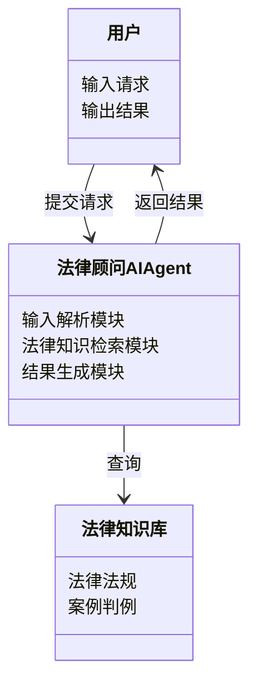
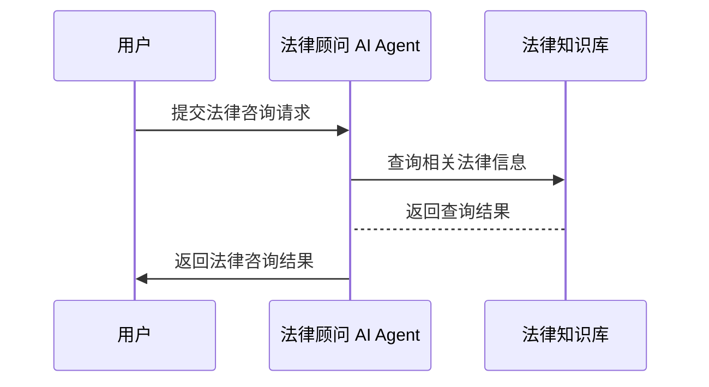

                 


# 第二部分: 法律顾问 AI Agent 的核心原理与技术实现

## 第4章: 大型语言模型（LLM）的原理与架构

### 4.1 LLM 的基本原理

#### 4.1.1 语言模型的训练目标
大型语言模型（LLM）的目标是通过大量文本数据的预训练，学习语言的结构和语义，从而能够生成连贯且有意义的文本。这种模型的核心思想是基于概率的预测，即给定一个词序列，预测下一个可能出现的词。这种预测能力使得模型能够理解上下文，并生成符合语法规则和语义逻辑的文本。

#### 4.1.2 概率生成模型的核心思想
LLM 的核心是概率生成模型，它通过计算每个词在给定上下文中的条件概率，来生成最可能的下一个词。具体来说，模型通过计算 $P(w_{n+1} | w_1, w_2, ..., w_n)$，即在已知前 $n$ 个词的情况下，第 $n+1$ 个词出现的概率，来生成文本。

#### 4.1.3 注意力机制与Transformer架构
现代 LLM 通常基于 Transformer 架构，其核心是注意力机制。注意力机制允许模型在生成每个词时，关注输入文本中所有位置的信息，并根据这些信息的重要性进行加权。这种机制使得模型能够捕捉到长距离依赖关系，并在生成文本时保持语义的一致性。

数学公式表示为：
$$
\text{Attention}(Q, K, V) = \text{softmax}\left(\frac{QK^T}{\sqrt{d_k}}\right)V
$$

其中，$Q$ 是查询向量，$K$ 是键向量，$V$ 是值向量，$d_k$ 是键的维度。

### 4.2 LLM 的训练与优化

#### 4.2.1 预训练任务的设计
LLM 的预训练通常采用自监督学习，目标是通过预测下一个词或重构输入文本来学习语言的表示。常用的预训练任务包括：
- **Masked Language Modeling (MLM)**：随机遮蔽部分词，并预测这些被遮蔽的词。
- **Next Sentence Prediction (NSP)**：预测下一个句子是否与当前句子相关。

#### 4.2.2 模型的并行训练策略
为了提高训练效率，现代 LLM 通常采用并行计算。模型可以通过数据并行和模型并行来扩展计算能力。数据并行将训练数据分成多个批次，分别在不同的 GPU 上并行训练；模型并行则将模型的参数分布在多个 GPU 上，每个 GPU 负责不同的部分。

#### 4.2.3 超参数优化与模型调优
模型的性能依赖于多个超参数的设置，如学习率、批量大小、训练轮数等。通过实验和交叉验证，可以找到最优的超参数组合，从而提高模型的性能。

## 第5章: 法律顾问 AI Agent 的系统架构

### 5.1 系统功能模块设计

#### 5.1.1 用户输入与解析模块
用户通过自然语言或结构化输入（如关键词、问题描述）与 AI Agent 进行交互。输入解析模块将用户的输入转化为系统可以处理的格式。

#### 5.1.2 法律知识检索与推理模块
该模块负责从法律知识库中检索相关法律法规、案例判例等信息，并进行逻辑推理，生成初步的法律意见。

#### 5.1.3 结果生成与输出模块
根据推理结果，生成符合用户需求的法律建议、合规检查报告等，并以自然语言或结构化数据的形式输出。

### 5.2 系统架构设计

#### 5.2.1 领域模型设计
以下是法律顾问 AI Agent 的领域模型设计：



#### 5.2.2 系统架构设计
以下是系统架构的 Mermaid 图：


### 5.3 系统接口设计

#### 5.3.1 输入接口
- **输入格式**：支持自然语言和结构化输入。
- **接口协议**：RESTful API 或 RPC。

#### 5.3.2 输出接口
- **输出格式**：自然语言文本或结构化数据（如 JSON）。
- **接口协议**：RESTful API 或 RPC。

### 5.4 系统交互流程

以下是系统交互流程的 Mermaid 图：



## 第6章: 法律顾问 AI Agent 的项目实战

### 6.1 环境安装

#### 6.1.1 安装 Python 环境
建议使用 Python 3.8 或更高版本。

#### 6.1.2 安装必要的库
安装以下库：
```bash
pip install transformers torch numpy
```

### 6.2 核心实现代码

#### 6.2.1 法律知识库的构建
以下是构建法律知识库的代码示例：

```python
import os
import json

class LegalKnowledgeBase:
    def __init__(self, knowledge_path):
        self.knowledge_path = knowledge_path
        self.knowledge = self._load_knowledge()

    def _load_knowledge(self):
        knowledge = {}
        for file in os.listdir(self.knowledge_path):
            with open(os.path.join(self.knowledge_path, file), 'r', encoding='utf-8') as f:
                data = json.load(f)
                knowledge.update(data)
        return knowledge

    def query(self, keywords):
        results = []
        for key, value in self.knowledge.items():
            if all(keyword in key for keyword in keywords):
                results.append(value)
        return results
```

#### 6.2.2 法律顾问 AI Agent 的实现

```python
from transformers import AutoTokenizer, AutoModelForMaskedLM
import torch

class LegalAdvisor:
    def __init__(self, model_name, knowledge_base):
        self.tokenizer = AutoTokenizer.from_pretrained(model_name)
        self.model = AutoModelForMaskedLM.from_pretrained(model_name)
        self.knowledge_base = knowledge_base

    def advise(self, query):
        inputs = self.tokenizer(query, return_tensors='pt')
        with torch.no_grad():
            outputs = self.model(**inputs)
        # 处理输出并结合知识库进行推理
        advice = self._generate_advice(outputs)
        return advice

    def _generate_advice(self, outputs):
        # 示例：结合知识库生成法律建议
        advice = "根据相关法律法规，建议您："
        return advice
```

### 6.3 代码应用解读与分析

#### 6.3.1 法律知识库的构建
上述代码定义了一个 `LegalKnowledgeBase` 类，用于从指定路径加载法律知识库数据。它支持通过关键词查询相关法律信息。

#### 6.3.2 法律顾问 AI Agent 的实现
`LegalAdvisor` 类使用预训练的 LLM 模型，结合法律知识库进行法律咨询。用户可以通过调用 `advise` 方法提交咨询请求，并获得生成的法律建议。

### 6.4 实际案例分析

#### 6.4.1 合同审查案例
用户提交一份合同，AI Agent 通过分析合同条款，识别潜在的法律风险，并生成合规建议。

#### 6.4.2 合规检查案例
用户提交企业运营数据，AI Agent 通过比对相关法律法规，生成合规检查报告。

### 6.5 项目小结

通过以上实现，我们可以看到法律顾问 AI Agent 的基本功能架构。实际应用中，还需要进一步优化模型性能、完善知识库内容，并设计良好的用户交互界面。

---

# 第三部分: 法律顾问 AI Agent 的最佳实践与未来发展

## 第7章: 最佳实践与注意事项

### 7.1 数据安全与隐私保护
在处理法律咨询时，用户的数据可能包含敏感信息，因此必须采取严格的数据安全措施，确保数据不被泄露或滥用。

### 7.2 模型的可解释性
法律咨询需要高度的可解释性，模型的决策过程必须透明，以便用户理解并信任 AI 的建议。

### 7.3 持续学习与模型更新
法律法规会不断更新，AI Agent 需要通过持续学习，保持其知识库的最新性。

## 第8章: 未来发展与展望

### 8.1 多模态法律顾问 AI Agent
未来的法律顾问 AI Agent 可能会结合视觉、语音等多种模态的信息，提供更全面的法律服务。

### 8.2 法律推理的深度优化
随着 AI 技术的进步，法律顾问 AI Agent 将能够进行更复杂的法律推理，提供更精准的法律建议。

### 8.3 法律服务的普惠化
通过 AI 技术，法律顾问服务的成本将大幅降低，使得更多人能够享受到高质量的法律服务。

---

# 作者

作者：AI天才研究院/AI Genius Institute & 禅与计算机程序设计艺术 /Zen And The Art of Computer Programming

