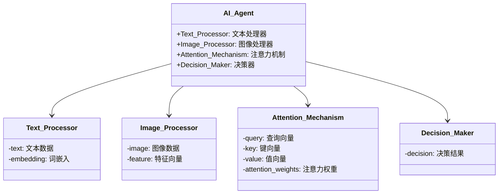
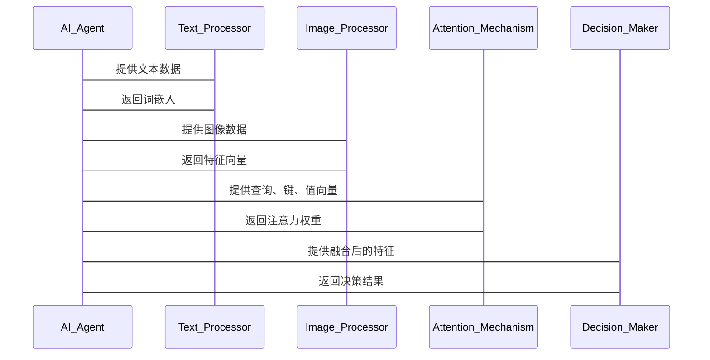

                 


# 《注意力机制在AI Agent多模态融合中的应用》

> 关键词：注意力机制，多模态融合，AI Agent，自注意力，多头注意力，深度学习

> 摘要：本文系统地探讨了注意力机制在AI Agent多模态融合中的应用，从基础概念到算法原理，再到系统架构设计和项目实战，全面解析了注意力机制如何提升多模态数据的处理能力，帮助AI Agent更高效地理解和融合多种数据源。

---

## 第一部分：注意力机制与多模态融合基础

### 第1章：注意力机制与多模态融合概述

#### 1.1 注意力机制的背景与概念

##### 1.1.1 从传统机器学习到注意力机制的演进
- **传统机器学习的局限性**：传统模型如SVM、随机森林等难以处理长距离依赖关系。
- **注意力机制的提出**：由Transformer模型提出，解决了序列模型中的并行计算和长距离依赖问题。
- **注意力机制的核心思想**：通过引入查询、键、值的概念，计算元素之间的相关性权重，突出重要信息。

##### 1.1.2 多模态数据的基本概念
- **多模态数据**：包括文本、图像、语音、视频等多种类型的数据。
- **多模态融合**：将不同模态的数据进行融合，以提高模型的表达能力。

##### 1.1.3 AI Agent的核心特点
- **AI Agent的定义**：能够感知环境、自主决策并执行任务的智能体。
- **AI Agent的功能**：信息处理、决策制定、交互能力、自适应学习。
- **AI Agent的多模态需求**：需要处理多种模态数据以提高智能性。

#### 1.2 注意力机制在多模态融合中的作用
##### 1.2.1 多模态数据的挑战
- **异构性问题**：不同模态的数据具有不同的特征和结构。
- **对齐问题**：如何在不同模态之间建立有效的关联。
- **语义鸿沟**：不同模态之间的语义差异。

##### 1.2.2 注意力机制的优势
- **自适应性**：能够动态调整对不同模态数据的关注程度。
- **高效性**：通过权重分配，突出重要信息，降低计算复杂度。
- **灵活性**：适用于多种模态数据的融合。

##### 1.2.3 多模态融合的目标与意义
- **目标**：提高模型的多模态理解和表达能力。
- **意义**：通过多模态融合，增强AI Agent的智能性和实用性。

---

### 第2章：注意力机制的核心原理

#### 2.1 自注意力机制的基本原理
##### 2.1.1 查询、键、值的计算
- **查询（Query）**：表示输入序列中的一个元素，用于匹配其他元素。
- **键（Key）**：表示输入序列中的另一个元素，用于匹配查询。
- **值（Value）**：表示输入序列中的第三个元素，用于生成输出。

##### 2.1.2 注意力权重的计算公式
- **注意力权重计算公式**：
$$
\text{Attention}(Q, K, V) = \text{softmax}\left(\frac{QK^T}{\sqrt{d_k}}\right)V
$$
其中，$d_k$ 是键的维度。

##### 2.1.3 自注意力机制的数学模型
- **自注意力机制的矩阵表示**：
$$
\text{Output} = \text{softmax}\left(\frac{QK^T}{\sqrt{d_k}}\right)V
$$

#### 2.2 多头注意力机制的原理
##### 2.2.1 多头机制的引入
- **多头机制的作用**：通过并行计算多个子空间中的注意力，提高模型的表达能力。
- **多头机制的数学表示**：
$$
\text{Multi-head}(Q, K, V) = \text{Concat}(\text{Head}_1, \text{Head}_2, \dots, \text{Head}_n)
$$
其中，$n$ 是头数。

##### 2.2.2 多头注意力的计算流程
- **线性变换**：将查询、键、值分别映射到多个子空间。
- **并行计算**：在每个子空间中计算自注意力。
- **拼接与变换**：将多个子空间的结果拼接并进行线性变换。

##### 2.2.3 多头机制的优势
- **增强表达能力**：通过多个子空间的并行计算，提高模型的灵活性。
- **降低计算复杂度**：通过并行计算，提高计算效率。

#### 2.3 其他注意力机制变体
##### 2.3.1 层次化注意力
- **层次化注意力的定义**：通过分层计算注意力权重，突出不同层次的信息。
- **层次化注意力的应用**：适用于长序列处理，提高模型的注意力分布能力。

##### 2.3.2 位置编码与相对位置注意力
- **位置编码**：通过引入位置信息，增强模型的位置感知能力。
- **相对位置注意力**：计算相对位置的信息，适用于序列数据的处理。

##### 2.3.3 可视化注意力机制
- **可视化注意力的定义**：通过可视化注意力权重，帮助理解模型的注意力分布。
- **可视化注意力的应用**：适用于图像和文本的多模态数据融合。

---

### 第3章：多模态数据的融合方法

#### 3.1 多模态数据的表示方法
##### 3.1.1 文本数据的表示
- **词嵌入**：通过Word2Vec、GloVe等方法将词表示为向量。
- **句嵌入**：通过BERT、GPT等模型将句子表示为向量。

##### 3.1.2 图像数据的表示
- **图像特征提取**：通过CNN等模型提取图像的特征向量。
- **图像语义表示**：通过Mask R-CNN等模型提取图像的语义信息。

##### 3.1.3 其他模态数据的表示
- **语音数据**：通过Mel谱图、MFCC等方法提取语音特征。
- **视频数据**：通过3D-CNN等模型提取视频特征。

#### 3.2 多模态融合的策略
##### 3.2.1 晚期融合
- **晚期融合的定义**：在特征提取后，对不同模态的特征进行融合。
- **晚期融合的优势**：适用于特征维度差异较大的情况。

##### 3.2.2 早期融合
- **早期融合的定义**：在特征提取过程中，对不同模态的特征进行融合。
- **早期融合的优势**：适用于特征维度相似的情况。

##### 3.2.3 跨模态注意力机制
- **跨模态注意力的定义**：通过注意力机制，将一种模态的信息引入到另一种模态的处理中。
- **跨模态注意力的应用**：适用于图像和文本的多模态数据融合。

#### 3.3 多模态融合的挑战
##### 3.3.1 数据异构性问题
- **数据异构性的定义**：不同模态的数据具有不同的特征和结构。
- **数据异构性的影响**：增加了数据融合的难度。

##### 3.3.2 跨模态对齐问题
- **跨模态对齐的定义**：如何在不同模态之间建立有效的关联。
- **跨模态对齐的解决方法**：通过共享特征空间、对齐模型等方法进行处理。

##### 3.3.3 跨模态理解的局限性
- **跨模态理解的定义**：通过一种模态的信息理解另一种模态的内容。
- **跨模态理解的挑战**：如何跨越不同模态之间的语义鸿沟。

---

## 第二部分：注意力机制在AI Agent中的应用

### 第4章：AI Agent的结构与功能

#### 4.1 AI Agent的基本概念
##### 4.1.1 AI Agent的定义
- **AI Agent**：能够感知环境、自主决策并执行任务的智能体。
- **AI Agent的分类**：根据智能性分为简单反应型、基于模型反应型、目标驱动型、实用驱动型等。

##### 4.1.2 AI Agent的功能
- **信息处理能力**：能够处理多种模态的数据。
- **决策制定能力**：基于多模态数据进行决策。
- **交互能力**：能够与用户或其他智能体进行交互。
- **自适应学习能力**：能够通过学习提高自身的性能。

#### 4.2 AI Agent的多模态需求
##### 4.2.1 多模态数据的重要性
- **多模态数据的优势**：通过融合多种模态的数据，提高模型的智能性和实用性。
- **多模态数据的应用场景**：如图像描述生成、语音识别、视频分析等。

##### 4.2.2 AI Agent的多模态处理能力
- **多模态数据的处理流程**：包括数据采集、特征提取、融合、决策等步骤。
- **多模态数据的融合策略**：如晚期融合、早期融合、跨模态注意力机制等。

#### 4.3 注意力机制在AI Agent中的作用
##### 4.3.1 注意力机制的核心作用
- **信息筛选**：通过注意力机制，筛选出重要的信息。
- **信息融合**：通过注意力机制，融合不同模态的数据。
- **动态调整**：根据环境的变化，动态调整注意力权重。

##### 4.3.2 注意力机制的优势
- **自适应性**：能够动态调整对不同模态数据的关注程度。
- **高效性**：通过权重分配，突出重要信息，降低计算复杂度。
- **灵活性**：适用于多种模态数据的融合。

---

## 第五章：系统架构设计与实现

### 5.1 问题场景介绍
#### 5.1.1 系统目标
- **系统目标**：设计一个基于注意力机制的AI Agent，能够处理多种模态的数据，提高决策的准确性和效率。

#### 5.1.2 项目介绍
- **项目名称**：基于注意力机制的多模态AI Agent设计与实现。
- **项目背景**：随着多模态数据的广泛应用，如何高效地处理和融合多模态数据成为一个重要问题。

#### 5.1.3 项目功能需求
- **功能需求1**：能够处理文本、图像等多种模态的数据。
- **功能需求2**：通过注意力机制，实现多模态数据的融合。
- **功能需求3**：能够根据融合后的信息进行决策。

### 5.2 系统功能设计
#### 5.2.1 领域模型（Mermaid类图）


#### 5.2.2 系统架构设计（Mermaid架构图）


#### 5.2.3 系统接口设计
##### 5.2.3.1 输入接口
- **文本输入接口**：接收文本数据，进行预处理和特征提取。
- **图像输入接口**：接收图像数据，进行预处理和特征提取。

##### 5.2.3.2 输出接口
- **决策输出接口**：输出决策结果。
- **注意力权重输出接口**：输出注意力权重。

#### 5.2.4 系统交互流程（Mermaid序列图）


### 5.3 环境安装与系统实现
#### 5.3.1 环境配置
- **Python版本**：3.8及以上
- **深度学习框架**：TensorFlow或PyTorch
- **其他依赖**：numpy、matplotlib、scikit-learn等

#### 5.3.2 核心实现代码
##### 5.3.2.1 注意力机制实现
```python
import tensorflow as tf

def scaled_dot_product_attention(query, key, value):
    # 计算点积
    attention = tf.matmul(query, key, transpose_b=True)
    # 缩放
    d_k = tf.shape(key)[-1]
    attention = attention / tf.math.sqrt(tf.cast(d_k, tf.float32))
    # 计算注意力权重
    attention_weights = tf.nn.softmax(attention)
    # 加权求和
    output = tf.matmul(attention_weights, value)
    return output, attention_weights
```

##### 5.3.2.2 多头注意力机制实现
```python
def multi_head_attention(query, key, value, num_heads):
    # 线性变换
    query = tf.layers.dense(query, units=d_model)
    key = tf.layers.dense(key, units=d_model)
    value = tf.layers.dense(value, units=d_model)
    # 拆分头
    query = tf.split(query, num_heads, axis=-1)
    key = tf.split(key, num_heads, axis=-1)
    value = tf.split(value, num_heads, axis=-1)
    # 并行计算
    attention_outputs = []
    for i in range(num_heads):
        attention_output, _ = scaled_dot_product_attention(query[i], key[i], value[i])
        attention_outputs.append(attention_output)
    # 拼接
    attention_output = tf.concat(attention_outputs, axis=-1)
    # 线性变换
    attention_output = tf.layers.dense(attention_output, units=d_model)
    return attention_output
```

#### 5.3.3 代码应用解读与分析
- **代码功能**：实现自注意力机制和多头注意力机制。
- **代码优势**：通过并行计算，提高计算效率。
- **代码扩展性**：可以扩展到更多的头数和不同的模态数据。

#### 5.3.4 项目小结
- **项目总结**：通过注意力机制，实现了多模态数据的融合，提高了AI Agent的智能性和决策能力。
- **项目意义**：为多模态AI Agent的设计和实现提供了参考。

---

## 第六章：最佳实践与总结

### 6.1 最佳实践
#### 6.1.1 注意力机制的选择
- **选择自注意力机制**：适用于序列数据的处理。
- **选择多头注意力机制**：适用于多种模态数据的融合。

#### 6.1.2 模型优化技巧
- **参数调节**：通过调节学习率、批量大小等参数，优化模型性能。
- **正则化**：通过Dropout等方法，防止过拟合。

#### 6.1.3 代码实现注意事项
- **数据预处理**：确保不同模态的数据格式一致。
- **模型训练**：通过交叉验证等方法，提高模型的泛化能力。

### 6.2 小结
- **注意力机制的优势**：通过动态调整注意力权重，突出重要信息，提高模型的性能。
- **多模态融合的意义**：通过融合多种模态的数据，提高模型的智能性和实用性。

### 6.3 展望
- **未来研究方向**：探索更高效的注意力机制，如位置编码、相对位置注意力等。
- **应用场景拓展**：将注意力机制应用于更多领域，如自然语言处理、计算机视觉、机器人控制等。

---

## 作者：AI天才研究院/AI Genius Institute & 禅与计算机程序设计艺术 /Zen And The Art of Computer Programming

---

通过本文的系统介绍，读者可以全面了解注意力机制在AI Agent多模态融合中的应用，从基础概念到算法原理，再到系统架构设计和项目实战，帮助读者掌握注意力机制的核心思想和实际应用技巧。

