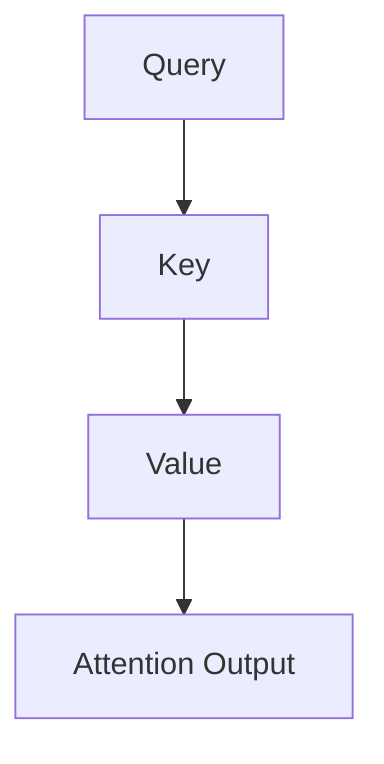
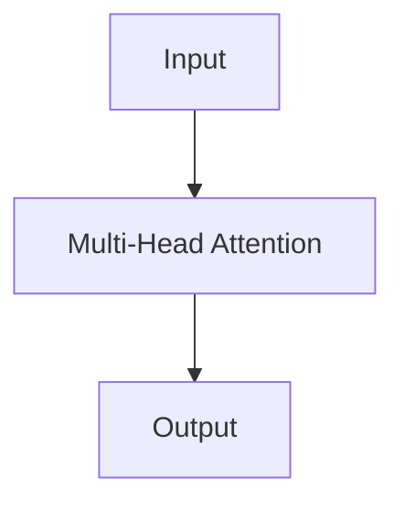
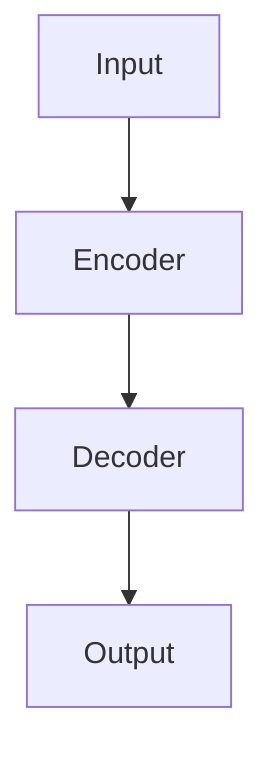
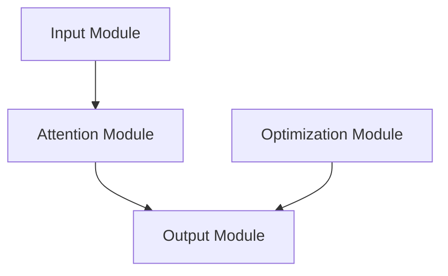
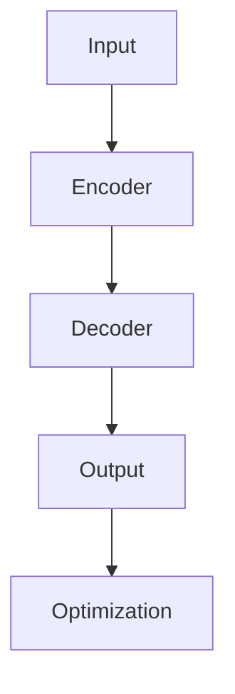
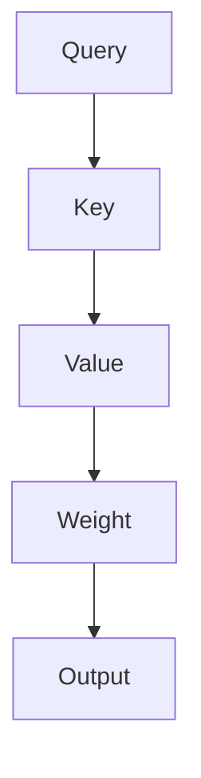

                 


# 注意力机制：提升AI Agent的关注点

> 关键词：注意力机制，AI Agent，自然语言处理，计算机视觉，Transformer，深度学习

> 摘要：注意力机制是人工智能领域的一项重要技术，它通过模拟人类的注意力集中机制，提升AI Agent的信息处理效率和准确性。本文将从注意力机制的基本概念、数学模型、算法实现、系统架构到项目实战，全面解析如何利用注意力机制提升AI Agent的关注点。

---

# 第一部分：注意力机制的背景与应用

## 第1章：注意力机制的背景与应用

### 1.1 注意力机制的定义与背景

#### 1.1.1 问题背景：AI Agent的信息处理挑战
AI Agent需要处理大量信息，但信息的复杂性和冗余性导致效率低下。注意力机制通过模拟人类的注意力集中能力，帮助AI Agent聚焦于关键信息，提升处理效率。

#### 1.1.2 注意力机制的核心概念
注意力机制是一种选择性关注输入数据中重要部分的技术，通过计算权重分配，突出关键信息，弱化次要信息。

#### 1.1.3 注意力机制的外延与边界
注意力机制不仅用于单模态数据（如文本、图像），还可以扩展到多模态数据处理，广泛应用于自然语言处理、计算机视觉等领域。

### 1.2 注意力机制的发展历程

#### 1.2.1 从神经科学到AI的演变
注意力机制的灵感来源于人类神经系统的研究，模拟人脑对外界信息的筛选和聚焦过程。

#### 1.2.2 从简单模型到复杂架构的演进
从早期的单头注意力机制到多头注意力机制，再到更复杂的架构，注意力机制在模型复杂性和性能上不断优化。

#### 1.2.3 当前研究热点与未来趋势
当前研究集中在注意力机制的优化、多模态应用和高效计算。未来可能在动态注意力分配和自适应机制方面取得突破。

### 1.3 注意力机制的应用场景

#### 1.3.1 自然语言处理中的应用
在文本生成、机器翻译和问答系统中，注意力机制帮助模型关注输入中的关键信息。

#### 1.3.2 计算机视觉中的应用
用于图像分割、目标检测和视频分析，提升模型对感兴趣区域的关注度。

#### 1.3.3 AI Agent中的注意力机制
在多任务处理和复杂环境中，注意力机制帮助AI Agent高效分配计算资源，提升任务执行效率。

---

## 第2章：注意力机制的核心概念与联系

### 2.1 注意力机制的数学模型

#### 2.1.1 注意力机制的公式推导
注意力机制的基本公式如下：
$$
\text{Attention}(Q, K, V) = \text{softmax}\left(\frac{QK^T}{\sqrt{d_k}}\right)V
$$
其中，$Q$是查询，$K$是键，$V$是值，$d_k$是键的维度。

#### 2.1.2 Scaled Dot-Product Attention的实现
Scaled Dot-Product Attention的实现流程如下：
1. 计算查询和键的点积。
2. 对点积结果进行缩放。
3. 使用softmax函数计算权重。
4. 将权重与值向量相乘，得到最终输出。

使用mermaid图表示：


#### 2.1.3 多头注意力机制的原理
多头注意力机制通过并行计算多个注意力头，提升模型的表达能力。流程如下：
1. 将输入数据分成多个头。
2. 每个头独立计算注意力权重。
3. 将结果拼接并线性变换。

使用mermaid图表示：


### 2.2 注意力机制的核心要素

#### 2.2.1 查询（Query）
查询用于确定关注的区域或信息。

#### 2.2.2 键（Key）
键用于匹配输入数据中的相关部分。

#### 2.2.3 值（Value）
值是与键相关联的数据，注意力权重应用于值向量。

### 2.3 注意力机制与AI Agent的关系

#### 2.3.1 注意力机制在AI Agent中的作用
通过注意力机制，AI Agent可以高效分配计算资源，提升任务执行效率。

#### 2.3.2 注意力机制与其他机制的协同
注意力机制与强化学习、图神经网络等技术协同工作，提升AI Agent的智能水平。

#### 2.3.3 注意力机制的优化与改进
通过剪枝、稀化注意力等方法，优化注意力机制的计算效率。

---

## 第3章：注意力机制的算法实现与优化

### 3.1 注意力机制的算法实现

#### 3.1.1 Transformer模型的结构
Transformer模型由编码器和解码器组成，编码器负责将输入数据编码，解码器负责生成输出。

使用mermaid图表示：


#### 3.1.2 多头注意力机制的实现
多头注意力机制的实现流程：
1. 输入数据经过线性变换。
2. 分头计算查询、键和值。
3. 并行计算多个头的注意力权重。
4. 拼接结果并线性变换。

#### 3.1.3 位置编码的引入
位置编码用于引入序列的位置信息，通常使用绝对位置编码或相对位置编码。

### 3.2 注意力机制的优化方法

#### 3.2.1 剪枝优化
通过剪枝技术减少计算量，提升效率。

#### 3.2.2 相关优化
引入相关矩阵，提升注意力计算的准确性。

#### 3.2.3 深度优化
通过增加模型深度，提升注意力机制的表达能力。

### 3.3 注意力机制的数学模型与公式

#### 3.3.1 Scaled Dot-Product Attention公式
$$
\text{Attention}(Q, K, V) = \text{softmax}\left(\frac{QK^T}{\sqrt{d_k}}\right)V
$$

#### 3.3.2 多头注意力机制的数学推导
多头注意力机制的公式如下：
$$
\text{Multi-Head Attention}(Q, K, V) = \text{Concat}(h_1, h_2, \dots, h_n)W^o
$$
其中，$h_i$表示第$i$个头的注意力输出，$W^o$是输出的线性变换矩阵。

---

## 第4章：注意力机制的系统架构与设计

### 4.1 系统架构设计

#### 4.1.1 系统模块划分
系统分为输入模块、注意力计算模块、输出模块和优化模块。

#### 4.1.2 模块之间的关系
输入模块提供数据，注意力计算模块处理数据，输出模块生成结果，优化模块提升性能。

使用mermaid图表示：


#### 4.1.3 系统架构图
使用mermaid图表示系统架构：


### 4.2 系统功能设计

#### 4.2.1 领域模型设计
领域模型包括查询、键、值和注意力权重。

使用mermaid图表示：


#### 4.2.2 功能模块实现
功能模块包括查询生成、键匹配、值获取和注意力计算。

#### 4.2.3 系统交互流程
系统交互流程如下：
1. 输入数据。
2. 计算查询、键和值。
3. 计算注意力权重。
4. 生成输出结果。

---

## 第5章：注意力机制的项目实战

### 5.1 项目环境配置

#### 5.1.1 环境需求
Python 3.8以上版本，TensorFlow或PyTorch框架。

#### 5.1.2 安装依赖
安装必要的库，如numpy、pandas、tensorflow等。

### 5.2 核心代码实现

#### 5.2.1 注意力机制的实现
```python
import tensorflow as tf

def scaled_dot_product_attention(query, key, value):
    dk = tf.cast(tf.shape(key)[-1], tf.float32)
    attention_logits = tf.matmul(query, key, transpose_b=True)
    attention_logits = attention_logits / tf.sqrt(dk)
    attention_weights = tf.nn.softmax(attention_logits, axis=-1)
    output = tf.matmul(attention_weights, value)
    return output
```

#### 5.2.2 多头注意力机制的实现
```python
def multi_head_attention(query, key, value, num_heads):
    d_model = tf.shape(query)[-1]
    d_k = d_model // num_heads
    query = tf.transpose(query, [0, 2, 1, num_heads])
    key = tf.transpose(key, [0, 2, 1, num_heads])
    value = tf.transpose(value, [0, 2, 1, num_heads])
    attention = tf.map_fn(lambda x: scaled_dot_product_attention(x[0], x[1], x[2]), (query, key, value))
    attention = tf.transpose(attention, [0, 2, 1, num_heads])
    output = tf.reshape(attention, [-1, tf.shape(attention)[1], num_heads * d_k])
    return output
```

#### 5.2.3 位置编码的实现
```python
def position_encoding(positions, d_model):
    encoding = tf.zeros([positions, d_model])
    position = tf.cast(tf.range(positions), tf.float32)
    div_term = tf.exp(tf.cast(tf.log(10000.0) * tf.range(d_model, 0, -1, tf.float32) * 2, tf.float32))
    encoding[:, 0::2] = tf.sin(position * tf.pi / (10000.0 / div_term))
    encoding[:, 1::2] = tf.cos(position * tf.pi / (10000.0 / div_term))
    return encoding
```

### 5.3 案例分析与详细讲解

#### 5.3.1 案例分析
在自然语言处理任务中，使用多头注意力机制的模型在文本生成和机器翻译任务中表现优异。

#### 5.3.2 详细讲解
通过具体案例，分析注意力机制在不同任务中的应用效果和优化方法。

### 5.4 项目总结

#### 5.4.1 项目总结
总结项目实施过程中的经验和教训，提出改进建议。

#### 5.4.2 项目意义
强调注意力机制在提升AI Agent性能和效率方面的重要作用。

---

## 第6章：总结与展望

### 6.1 总结
注意力机制是人工智能领域的重要技术，通过模拟人类的注意力集中机制，显著提升了AI Agent的信息处理能力。

### 6.2 未来展望
未来，注意力机制可能在动态调整、多模态处理和边缘计算方面取得更多突破。

### 6.3 最佳实践Tips

#### 6.3.1 实践建议
在实际应用中，注意模型的可解释性和计算效率。

#### 6.3.2 注意事项
避免过度依赖注意力机制，结合其他技术手段提升系统性能。

#### 6.3.3 拓展阅读
推荐阅读相关论文和书籍，深入理解注意力机制的理论和应用。

---

# 作者：AI天才研究院 & 禅与计算机程序设计艺术

感谢您的阅读！希望本文对您理解注意力机制有所帮助。

