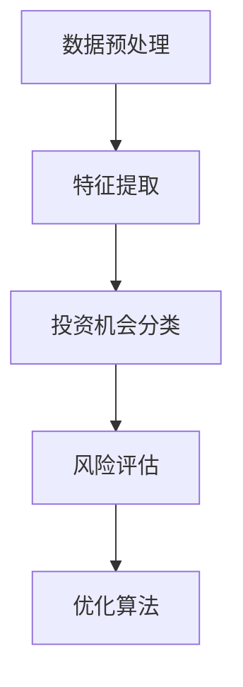

                 


# 海洋经济开发中的投资机会分析

> 关键词：海洋经济，投资机会，可持续发展，风险评估，净现值，内部收益率

> 摘要：本文系统地分析了海洋经济开发中的投资机会，从背景、核心概念、分析框架、算法、系统架构到项目实战，全面探讨了如何在海洋经济中寻找投资机会，评估其可行性和风险，并提供实际案例和最佳实践建议。

---

## 第一部分: 海洋经济开发中的投资机会分析概述

### 第1章: 海洋经济开发的背景与现状

#### 1.1 海洋经济的定义与内涵

- **1.1.1 海洋经济的定义**
  海洋经济是指以海洋资源为基础，通过开发、利用和保护海洋资源所形成的经济活动和产业。它涵盖了渔业、航运、能源、旅游、科研等多个领域。

- **1.1.2 海洋经济的核心构成要素**
  - **资源要素**：包括海洋生物资源（如鱼类、海洋植物）、矿产资源（如砂、天然气 hydrates）、水资源等。
  - **技术要素**：涉及海洋探测、环境监测、能源转换等技术。
  - **政策要素**：包括海洋法律法规、国际公约、环保政策等。

- **1.1.3 海洋经济与可持续发展的关系**
  海洋经济的发展必须与环境保护相结合，强调资源的可持续利用，避免过度开发导致的生态破坏。

#### 1.2 海洋经济开发的现状与趋势

- **1.2.1 全球海洋经济发展的现状**
  全球海洋经济年均增长率为4%左右，海洋渔业、能源开发、旅游等领域发展迅速。

- **1.2.2 中国海洋经济的发展现状**
  中国是全球海洋经济的重要参与者，海洋生产总值占全国GDP的比重逐年提高，主要集中在东部沿海地区。

- **1.2.3 海洋经济开发的趋势与挑战**
  - **趋势**：绿色能源开发、智能化渔业、海洋生态保护技术的应用。
  - **挑战**：资源枯竭、环境破坏、国际竞争加剧。

#### 1.3 投资机会分析的背景与意义

- **1.3.1 投资机会分析的定义**
  对潜在投资项目的盈利能力、风险和可行性进行系统分析的过程。

- **1.3.2 海洋经济开发中的投资机会特点**
  - 资源丰富但开发难度大。
  - 投资周期长，回报见效慢。
  - 受政策和环境因素影响显著。

- **1.3.3 投资机会分析在海洋经济发展中的作用**
  为投资者提供科学决策依据，优化资源配置，推动产业可持续发展。

---

### 第2章: 海洋经济开发中的核心概念与联系

#### 2.1 海洋经济开发的核心概念

- **2.1.1 海洋资源的分类与特点**
  - **可再生资源**：如渔业资源、滨海旅游资源，具有再生性但需合理利用。
  - **不可再生资源**：如海底矿产，需谨慎开发。

- **2.1.2 海洋技术的创新与应用**
  - 先进探测技术：如声呐、卫星遥感。
  - 绿色能源技术：如潮汐能、风能发电。

- **2.1.3 海洋政策与法规的影响**
  - 国际法规：如《联合国海洋法公约》。
  - 国内政策：如海洋保护区划、环保补贴。

#### 2.2 核心概念的联系与对比

- **2.2.1 海洋资源与技术的对比分析**
  | 要素 | 海洋资源 | 海洋技术 |
  |------|----------|----------|
  | 特点 | 自然存在，可再生或不可再生 | 人类创新，解决资源开发难题 |
  | 例子 | 鱼类资源 | 海洋探测技术 |

- **2.2.2 技术与政策的相互作用**
  - 技术进步推动政策完善，如环保技术推动海洋保护区设立。
  - 政策支持促进技术创新，如政府补贴推动可再生能源技术发展。

- **2.2.3 资源开发与环境保护的关系**
  - 协调开发与保护，避免生态破坏。
  - 绿色开发模式：如生态旅游、可持续渔业。

#### 2.3 实体关系图（ER图）

```mermaid
erd
  MarineResources
  TechInnovation
  PoliciesAndRegulations

  MarineResources --|> MarineEconomy
  TechInnovation --|> MarineEconomy
  PoliciesAndRegulations --|> MarineEconomy
```

---

### 第3章: 海洋经济开发中的投资机会分析框架

#### 3.1 投资机会分析的理论基础

- **3.1.1 投资组合理论**
  投资者通过合理配置资产组合，降低风险，提高收益。

- **3.1.2 资本资产定价模型（CAPM）**
  $$ E(R_i) = R_f + \beta_i (E(R_m) - R_f) $$
  其中，\( E(R_i) \) 是资产的预期收益率，\( R_f \) 是无风险利率，\( \beta_i \) 是资产的贝塔系数，\( E(R_m) \) 是市场预期收益率。

- **3.1.3 风险评估与管理**
  通过情景分析、压力测试等方法，识别和应对潜在风险。

#### 3.2 海洋经济开发中的投资机会分析框架

- **3.2.1 投资机会的识别与筛选**
  - 识别高潜力领域：如海洋能源、生态旅游。
  - 筛选优质项目：评估项目的技术可行性、市场前景和财务状况。

- **3.2.2 投资项目的可行性分析**
  - 技术可行性：项目是否具备成熟的技术支持。
  - 经济可行性：投资回报是否可行。
  - 社会可行性：是否符合环保和社会责任要求。

- **3.2.3 投资风险的评估与控制**
  - 系统性风险：如市场波动、政策变化。
  - 非系统性风险：如项目失败、技术问题。

#### 3.3 投资机会分析的数学模型

- **3.3.1 净现值（NPV）公式**
  $$ NPV = \sum_{t=0}^{n} \frac{CF_t}{(1+r)^t} $$
  其中，\( CF_t \) 是第 \( t \) 年的现金流，\( r \) 是贴现率。

- **3.3.2 内部收益率（IRR）公式**
  $$ IRR = r \text{ 使得 } NPV = 0 $$

- **3.3.3 风险调整回报模型**
  $$ R = R_f + \beta \times (R_m - R_f) + \text{风险溢价} $$

---

### 第4章: 海洋经济开发中的投资机会分析算法

#### 4.1 投资机会分析的算法原理

- **数据预处理与特征提取**
  - 清洗数据，处理缺失值和异常值。
  - 提取关键特征，如项目规模、地理位置、政策支持等。

- **投资机会的分类与预测**
  使用机器学习算法（如决策树、随机森林）对项目进行分类，预测其是否为优质投资机会。

- **风险评估与优化算法**
  通过优化算法（如遗传算法）调整投资组合，降低风险，提高回报。

#### 4.2 投资机会分析的mermaid流程图



---

### 第5章: 海洋经济开发中的系统分析与架构设计

#### 5.1 系统功能设计

- **领域模型（mermaid类图）**
  ```mermaid
  classDiagram
      class MarineResources {
          Name
          Quantity
          Location
      }
      class TechInnovation {
          Type
          Description
          Cost
      }
      class InvestmentOpportunity {
          ID
          Name
          ROI
          RiskLevel
      }
      MarineResources --> InvestmentOpportunity
      TechInnovation --> InvestmentOpportunity
  ```

- **系统架构设计（mermaid架构图）**
  ```mermaid
  container 海洋资源管理系统的架构 {
      MarineResourcesManagementSystem
  }
  ```

- **系统接口设计**
  - 数据输入接口：接收海洋资源、技术创新等数据。
  - 分析接口：执行投资机会分析。
  - 输出接口：展示分析结果。

- **系统交互（mermaid序列图）**
  ```mermaid
  sequenceDiagram
      User ->> 系统输入: 提供数据
      系统输入 ->> 数据处理模块: 处理数据
      数据处理模块 ->> 分析模块: 执行分析
      分析模块 ->> 用户: 输出结果
  ```

---

### 第6章: 项目实战

#### 6.1 环境安装

- 安装Python和相关库（如NumPy、Pandas、Scikit-learn）。

#### 6.2 核心代码实现

```python
import numpy as np
import pandas as pd
from sklearn.tree import DecisionTreeClassifier

# 示例数据
data = {
    '项目': ['项目1', '项目2', '项目3'],
    '规模': [100, 200, 150],
    '地理位置': ['沿海', '内陆', '沿海'],
    '政策支持': [True, False, True],
    '预期回报': [15, 10, 20]
}

df = pd.DataFrame(data)

# 特征提取
X = df[['规模', '地理位置', '政策支持']]
y = df['预期回报']

# 训练模型
model = DecisionTreeClassifier()
model.fit(X, y)

# 预测新项目
new_project = {'规模': 150, '地理位置': '沿海', '政策支持': True}
new_X = pd.DataFrame([new_project])
prediction = model.predict(new_X)
print("预测回报：", prediction)
```

#### 6.3 案例分析

- **案例背景**：某沿海城市计划开发海洋旅游项目。
- **分析步骤**：收集数据、特征提取、模型训练、结果预测。
- **结果解读**：预测回报率为18%，属于优质投资机会。

#### 6.4 项目小结

- 代码实现展示了如何利用机器学习进行投资机会分析。
- 案例分析验证了模型的有效性。

---

### 第7章: 总结与展望

#### 7.1 总结

- 本文系统地分析了海洋经济开发中的投资机会，从理论到实践提供了全面指导。
- 强调了可持续发展的重要性，提出了科学的投资分析方法。

#### 7.2 最佳实践 tips

- 投资者应关注政策变化和技术创新。
- 注重风险评估，合理配置资产。

#### 7.3 未来展望

- 绿色能源开发将带来新的投资机会。
- 智能化技术的应用将进一步提升海洋经济的开发效率。

---

**作者：AI天才研究院/AI Genius Institute & 禅与计算机程序设计艺术 /Zen And The Art of Computer Programming**

