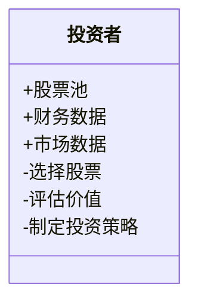
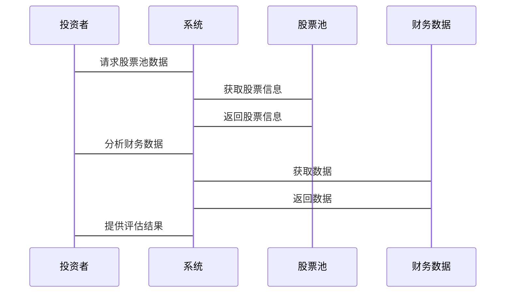

                 


# 深入解析价值投资理念：从格雷厄姆到巴菲特的演变

## 关键词：价值投资，格雷厄姆，巴菲特，安全边际，基本面分析，长期投资

## 摘要

价值投资是一种以长期稳健收益为目标的投资策略，起源于20世纪，由本杰明·格雷厄姆和沃伦·巴菲特共同发展。本文将详细分析价值投资的理念，从格雷厄姆的安全边际理论到巴菲特的护城河分析，探讨其核心要素、量化方法和系统架构，结合实例进行实战分析，并总结价值投资的关键点和注意事项。

---

## 第一章：价值投资概述

### 1.1 价值投资的基本概念

#### 1.1.1 价值投资的定义

价值投资是一种以低于内在价值的价格买入优质资产的投资策略，强调对企业的深入分析和长期持有。

#### 1.1.2 核心理念

- **安全边际**：买入价格低于内在价值，确保投资的安全性。
- **长期持有**：关注企业的长期价值，而非短期波动。

#### 1.1.3 与其他投资策略的区别

| 投资策略 | 短期交易 | 基本面分析 | 安全边际 |
|----------|----------|------------|----------|
| 价值投资 | 否       | 是         | 是       |
| 技术分析 | 是       | 否         | 否       |
| 成长投资 | 否       | 是         | 否       |

### 1.2 价值投资的历史演变

#### 1.2.1 起源

价值投资的理念可以追溯到格雷厄姆在20世纪20年代的理论，他提出“市场先生”概念，强调市场波动中的投资机会。

#### 1.2.2 格雷厄姆的贡献

格雷厄姆的安全边际理论和防御性投资策略为价值投资奠定了基础，他的著作《证券分析》是经典教材。

#### 1.2.3 巴菲特的发展

巴菲特继承并发展了格雷厄姆的理论，引入企业护城河概念，强调管理层和长期竞争优势。

---

## 第二章：格雷厄姆的价值投资理念

### 2.1 投资哲学

#### 2.1.1 安全边际理论

安全边际是买入价格与内在价值的差距，确保即使估值有误，也能避免重大损失。

$$\text{安全边际} = \text{内在价值} - \text{市场价格}$$

#### 2.1.2 防御性投资策略

通过分散投资和严格选股，降低市场波动带来的风险。

### 2.2 选股方法

#### 2.2.1 低市盈率法

选择市盈率低于行业平均水平的股票，识别低估企业。

#### 2.2.2 低市净率法

通过市净率评估企业价值，寻找被市场低估的资产。

#### 2.2.3 高股息率法

关注高股息率企业，结合股息率与股价波动进行分析。

### 2.3 经典案例分析

分析格雷厄姆如何通过安全边际理论选择投资标的，避免市场波动带来的损失。

---

## 第三章：巴菲特的价值投资演变

### 3.1 投资理念

#### 3.1.1 长期投资策略

巴菲特强调长期持有优质资产，避免频繁交易。

#### 3.1.2 护城河分析

选择具有竞争优势的企业，评估其长期盈利能力。

### 3.2 选股方法

#### 3.2.1 企业护城河分析

通过行业地位、竞争优势等指标评估企业的长期发展潜力。

#### 3.2.2 管理层分析

关注管理层的诚信和能力，确保企业稳健发展。

#### 3.2.3 财务指标分析

通过ROE、毛利率等指标评估企业的财务健康状况。

### 3.3 经典投资案例

分析巴菲特投资可口可乐和伯克希尔哈撒韦的成功经验，展示其投资策略的实际应用。

---

## 第四章：价值投资的核心要素

### 4.1 核心要素

#### 4.1.1 企业基本面分析

通过财务报表分析企业的盈利能力、成长性和稳定性。

#### 4.1.2 企业估值方法

使用DCF模型等方法评估企业的内在价值。

#### 4.1.3 安全边际

确保买入价格低于内在价值，降低投资风险。

### 4.2 风险管理

#### 4.2.1 风险控制的重要性

通过分散投资和严格选股，降低市场波动带来的影响。

#### 4.2.2 风险管理策略

设定止损点，定期评估投资组合，及时调整。

#### 4.2.3 应对市场波动

保持长期视角，避免短期市场波动影响投资决策。

---

## 第五章：价值投资的系统分析与架构设计

### 5.1 问题场景介绍

价值投资需要系统化的分析框架，帮助投资者做出科学决策。

### 5.2 系统功能设计

使用Mermaid类图展示价值投资系统的功能模块：



### 5.3 系统架构设计

使用Mermaid架构图展示系统的整体架构：

```mermaid
context diagram
    核心系统: 价值投资分析系统
        投资者 <-- [选择股票] -->
        股票池
        财务数据
        市场数据
        - 评估价值
        - 制定策略
```

### 5.4 系统接口设计

通过API获取实时数据，进行自动化分析和评估。

### 5.5 系统交互设计

使用Mermaid序列图展示投资者与系统之间的交互：



---

## 第六章：价值投资的项目实战

### 6.1 环境安装

安装必要的工具和软件，如Python、Pandas、Matplotlib等。

### 6.2 核心实现代码

使用Python代码进行企业估值分析：

```python
import pandas as pd
import numpy as np

def calculate_intrinsic_value(financial_data):
    # 假设使用DCF模型进行估值
    free_cash_flow = financial_data['free_cash_flow']
    discount_rate = financial_data['discount_rate']
    growth_rate = financial_data['growth_rate']
    
    # 简单DCF估值模型
    intrinsic_value = (free_cash_flow * (1 + growth_rate) ) / (discount_rate - growth_rate)
    return intrinsic_value

# 示例数据
data = {
    'free_cash_flow': 100,
    'discount_rate': 0.1,
    'growth_rate': 0.05
}

intrinsic_value = calculate_intrinsic_value(data)
print(f"内在价值: {intrinsic_value}")
```

### 6.3 实例分析

以苹果公司为例，分析其财务数据和市场地位，评估其投资价值。

### 6.4 分析与解读

通过数据和模型，展示价值投资策略的实际应用效果。

---

## 第七章：价值投资的最佳实践

### 7.1 小结

价值投资是一种长期有效的策略，关键在于深入分析和严格执行。

### 7.2 注意事项

- 避免情绪化投资
- 定期复盘和调整
- 保持学习和更新

### 7.3 拓展阅读

推荐书籍和资源，帮助读者进一步学习和深入理解价值投资。

---

## 第八章：总结与展望

### 8.1 总结

价值投资通过深入分析和长期持有，实现稳健收益。格雷厄姆的安全边际理论和巴菲特的成长分析方法，为投资者提供了全面的分析框架。

### 8.2 展望

随着金融市场的变化，价值投资需要不断适应新的环境，结合技术分析和大数据工具，进一步提升投资决策的科学性。

---

## 作者：AI天才研究院 & 禅与计算机程序设计艺术

