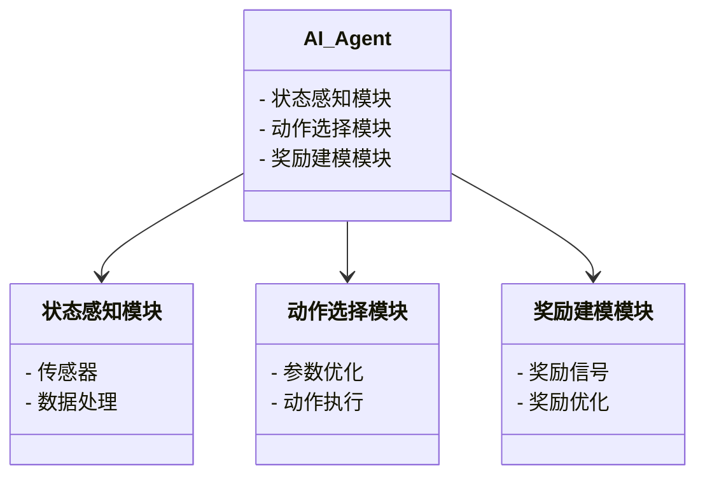
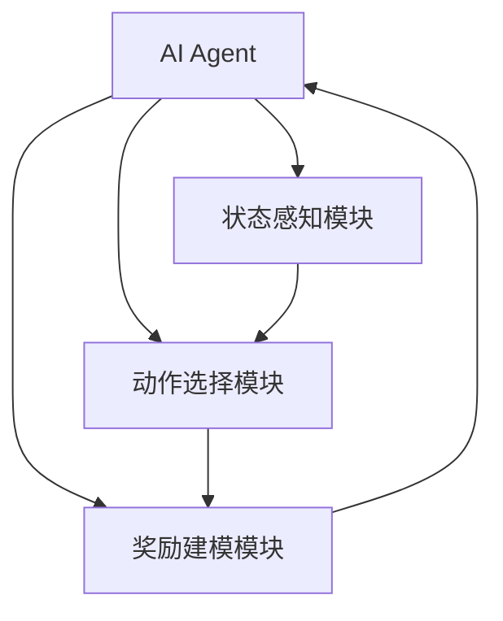
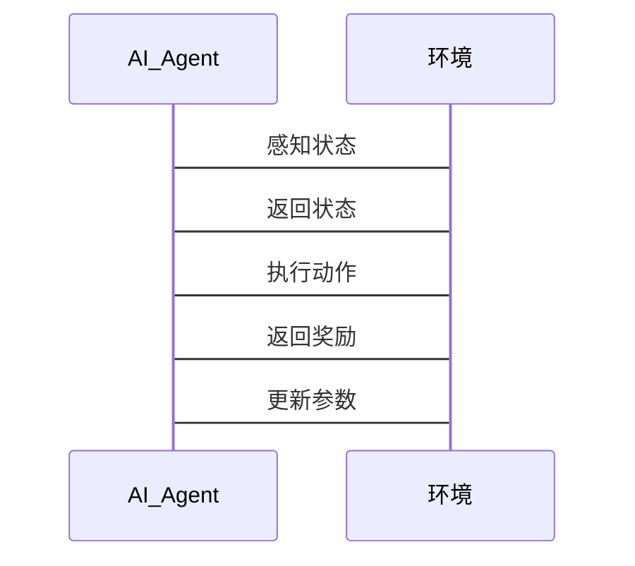

                 


# 深度元学习在AI Agent快速适应中的应用

## 关键词：深度元学习、AI Agent、快速适应、MAML、ReMAML、系统架构

## 摘要：本文探讨了深度元学习在AI Agent快速适应中的应用，详细介绍了深度元学习的基本原理、AI Agent的适应机制、核心算法（MAML和ReMAML）的实现细节、系统架构设计以及实际项目案例。通过理论与实践结合，展示了如何利用深度元学习提升AI Agent的适应能力，为相关领域的研究和应用提供了参考。

---

# 第一部分：深度元学习与AI Agent基础

## 第1章：深度元学习与AI Agent概述

### 1.1 深度学习与元学习的基本概念

深度学习是一种通过多层神经网络模拟人类学习过程的技术，其核心在于通过层次化的特征提取，实现对复杂数据的建模。元学习则是在此基础上的进一步发展，旨在通过学习如何学习，快速适应新任务。

#### 1.1.1 深度学习的核心原理

深度学习通过多层非线性变换，将输入数据映射到高维特征空间，提取数据的高层次特征。其核心算法包括卷积神经网络（CNN）、循环神经网络（RNN）和变压器（Transformer）等。

#### 1.1.2 元学习的定义与特点

元学习是一种学习如何学习的技术，旨在通过优化元学习目标函数，使得模型能够快速适应新任务。其特点是：
- 快速适应：在新任务上线后，仅需少量样本即可完成适应。
- 通用性：适用于多种任务和领域。
- 模块化：通过元学习器和任务学习器的分离，实现模块化设计。

#### 1.1.3 AI Agent的基本概念

AI Agent（智能体）是指在环境中能够感知状态、决策并执行动作的智能系统。其核心能力包括：
- 状态感知：通过传感器获取环境信息。
- 动作选择：基于当前状态和目标，选择最优动作。
- 奖励建模：通过奖励信号优化决策策略。

### 1.2 深度元学习的背景与意义

随着AI Agent在复杂动态环境中的广泛应用，快速适应能力成为关键需求。深度元学习通过元学习器的指导，帮助AI Agent在新任务上线时快速调整参数，无需大量数据支持。

#### 1.2.1 AI Agent快速适应的需求背景

在实际应用中，AI Agent需要在动态变化的环境中快速适应新任务，例如：
- 智能客服系统需要快速适应新客户的问题类型。
- 自动驾驶系统需要快速适应新交通规则或道路状况。

#### 1.2.2 深度元学习在快速适应中的作用

深度元学习通过优化元学习目标函数，使得AI Agent能够快速调整参数，适应新任务。其优势包括：
- 快速收敛：通过元学习器的指导，减少适应时间。
- 通用性：适用于多种任务和领域。

### 1.3 深度元学习的核心概念

深度元学习与AI Agent的结合是其核心，元学习器通过优化元学习目标函数，指导任务学习器快速适应新任务。

#### 1.3.1 元学习的数学模型

元学习的目标函数通常包括两部分：任务损失和元损失。任务损失用于优化任务学习器，元损失用于优化元学习器。

$$ \text{元学习目标函数} = \text{任务损失} + \text{元损失} $$

#### 1.3.2 AI Agent的适应机制

AI Agent通过状态感知、动作选择和奖励建模实现适应。深度元学习通过优化动作选择和奖励建模，提升适应速度。

---

## 第二部分：深度元学习的核心原理

## 第2章：深度元学习的数学模型与算法

### 2.1 元学习的数学模型

元学习的数学模型通常包括任务学习器和元学习器。任务学习器负责执行具体任务，元学习器负责优化任务学习器的参数。

#### 2.1.1 元学习的目标函数

元学习的目标函数通常包括任务损失和元损失。任务损失用于优化任务学习器，元损失用于优化元学习器。

$$ \text{元学习目标函数} = \sum_{i=1}^{N} L_i(\theta) + \lambda L_{\text{meta}}(\phi) $$

其中，$\theta$ 是任务学习器的参数，$\phi$ 是元学习器的参数，$N$ 是任务数量，$\lambda$ 是调节系数。

#### 2.1.2 元学习的优化算法

元学习的优化算法通常采用梯度下降方法，优化任务学习器和元学习器的参数。

### 2.2 深度元学习的算法原理

深度元学习的核心算法包括MAML和ReMAML。

#### 2.2.1 MAML算法的详细解释

MAML（Meta-Algorithm for Adaptive Model Learning）是一种经典的元学习算法。其核心思想是通过优化任务学习器的参数，使得在新任务上线时，任务学习器能够快速调整参数，适应新任务。

MAML的优化过程如下：
1. 对于每个任务，优化任务学习器的参数，使其在该任务上的损失最小。
2. 优化元学习器的参数，使得任务学习器的参数在多个任务上的平均损失最小。

数学推导：
$$ \min_{\phi} \sum_{i=1}^{N} L_i(\theta_i) + \lambda L_{\text{meta}}(\phi) $$

其中，$\theta_i$ 是任务学习器在任务 $i$ 上的参数，$\phi$ 是元学习器的参数。

#### 2.2.2 ReMAML算法的改进

ReMAML（Robust Meta-Learning）是一种改进的元学习算法，旨在提升元学习器的鲁棒性。其核心思想是通过引入对抗训练，使得元学习器能够在多种任务中保持稳定。

ReMAML的优化过程如下：
1. 优化任务学习器的参数，使其在对抗训练中保持稳定。
2. 优化元学习器的参数，使其在多种任务中保持鲁棒性。

数学推导：
$$ \min_{\phi} \sum_{i=1}^{N} L_i(\theta_i) + \lambda L_{\text{meta}}(\phi) $$

其中，$\theta_i$ 是任务学习器在任务 $i$ 上的参数，$\phi$ 是元学习器的参数。

---

## 第三部分：AI Agent的适应机制与系统架构

## 第3章：AI Agent的适应机制

### 3.1 AI Agent的基本适应过程

AI Agent的适应过程包括状态感知、动作选择和奖励建模。

#### 3.1.1 状态感知

状态感知是AI Agent获取环境信息的关键步骤。通过传感器或接口，AI Agent能够感知环境的状态，例如图像、文本或数值。

#### 3.1.2 动作选择

动作选择是AI Agent基于当前状态和目标，选择最优动作的过程。深度元学习通过优化动作选择，提升适应速度。

#### 3.1.3 奖励建模

奖励建模是AI Agent通过奖励信号优化决策策略的关键步骤。深度元学习通过优化奖励建模，提升适应效果。

### 3.2 深度元学习在适应机制中的应用

深度元学习通过优化动作选择和奖励建模，提升AI Agent的适应能力。

#### 3.2.1 动作选择的优化

深度元学习通过优化动作选择，使得AI Agent能够快速调整参数，适应新任务。

#### 3.2.2 奖励建模的优化

深度元学习通过优化奖励建模，使得AI Agent能够更好地理解奖励信号，提升决策质量。

### 3.3 AI Agent的适应能力评估

AI Agent的适应能力评估包括适应速度和适应效果。

#### 3.3.1 适应速度的评估指标

适应速度是AI Agent在新任务上线后完成适应所需的时间。深度元学习通过优化适应过程，提升适应速度。

#### 3.3.2 适应效果的评估方法

适应效果是AI Agent在新任务上线后完成适应后的性能指标。深度元学习通过优化适应效果，提升AI Agent的性能。

---

## 第四部分：系统分析与架构设计

## 第4章：AI Agent的系统架构

### 4.1 系统功能设计

AI Agent的系统功能设计包括状态感知、动作选择和奖励建模。

#### 4.1.1 领域模型类图

领域模型类图展示了AI Agent的核心模块及其关系。



#### 4.1.2 系统架构设计

系统架构设计展示了AI Agent的模块及其交互。



### 4.2 系统交互设计

系统交互设计展示了AI Agent与环境的交互过程。



---

## 第五部分：项目实战

## 第5章：深度元学习的项目实现

### 5.1 项目环境配置

项目环境配置包括安装必要的依赖库，例如TensorFlow、Keras和numpy。

```python
import tensorflow as tf
from tensorflow import keras
import numpy as np
```

### 5.2 核心代码实现

核心代码实现包括定义元学习器和任务学习器，以及优化算法。

```python
class MetaLearner:
    def __init__(self):
        self.model = self.build_model()
    
    def build_model(self):
        # 定义元学习器的网络结构
        model = keras.Sequential([
            keras.layers.Dense(64, activation='relu'),
            keras.layers.Dense(1, activation='sigmoid')
        ])
        return model

class TaskLearner:
    def __init__(self):
        self.model = self.build_model()
    
    def build_model(self):
        # 定义任务学习器的网络结构
        model = keras.Sequential([
            keras.layers.Dense(64, activation='relu'),
            keras.layers.Dense(1, activation='sigmoid')
        ])
        return model
```

### 5.3 代码解读与分析

代码解读与分析包括元学习器和任务学习器的交互过程。

### 5.4 案例分析与详细讲解

案例分析与详细讲解包括一个实际应用案例，例如智能客服系统。

### 5.5 项目小结

项目小结总结了项目的实现过程和主要成果。

---

## 第六部分：最佳实践与总结

## 第6章：深度元学习的最佳实践

### 6.1 小结

小结总结了全文的核心内容和主要结论。

### 6.2 注意事项

注意事项包括在实际应用中需要注意的问题，例如数据质量、模型选择和优化方法。

### 6.3 未来展望

未来展望探讨了深度元学习在AI Agent快速适应中的未来发展方向，例如多任务学习、强化学习和自适应学习。

---

## 作者

作者：AI天才研究院/AI Genius Institute & 禅与计算机程序设计艺术 /Zen And The Art of Computer Programming

---

通过以上内容，我们可以看到，深度元学习在AI Agent快速适应中的应用具有广阔的应用前景和研究价值。通过结合深度学习和元学习的核心原理，AI Agent能够快速适应新任务，提升其在复杂动态环境中的表现。未来的研究可以进一步探索多任务学习、强化学习和自适应学习，以实现更高效的AI Agent适应能力。

