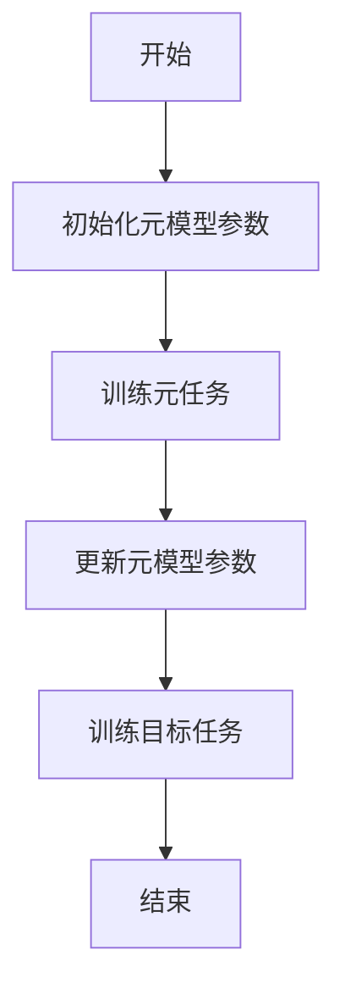

                 


# 深度元学习在AI Agent终身学习中的应用

> 关键词：深度元学习、AI Agent、终身学习、元学习算法、系统设计

> 摘要：本文探讨了深度元学习在AI Agent终身学习中的应用，详细介绍了深度元学习的核心概念、算法原理、系统设计、项目实战以及最佳实践。通过结合理论与实践，展示了如何利用深度元学习提升AI Agent的持续学习和自适应能力，为智能系统的发展提供了新的思路。

---

# 第一部分: 深度元学习与AI Agent的背景介绍

## 第1章: 深度元学习与AI Agent概述

### 1.1 深度元学习的背景与问题背景

#### 1.1.1 从传统机器学习到深度学习的演进
传统机器学习依赖于特征工程，而深度学习通过神经网络自动提取特征。深度学习的出现使得模型能够处理更复杂的任务，但其训练过程需要大量数据和计算资源。

#### 1.1.2 元学习的定义与问题描述
元学习（Meta-Learning）是一种学习方法，目标是让模型学会如何快速适应新任务。与传统学习不同，元学习关注的是模型的适应能力，而不是单一任务的性能。

#### 1.1.3 深度元学习的核心目标与边界
深度元学习的核心目标是通过深度神经网络实现元学习，其边界包括但不限于多任务学习、迁移学习和在线学习。

#### 1.1.4 AI Agent在智能系统中的角色与定位
AI Agent是一个智能主体，能够在环境中感知、推理和行动。AI Agent的终身学习能力使其能够适应动态变化的环境，提升其智能性和实用性。

### 1.2 终身学习的定义与问题背景

#### 1.2.1 终身学习的基本概念
终身学习是指模型在不断变化的环境中持续学习和适应新任务的能力。这与人类的学习方式类似，强调持续性和自适应性。

#### 1.2.2 AI Agent终身学习的核心问题
AI Agent需要在动态环境中持续学习新任务，同时保持对已有任务的性能。终身学习的核心问题包括任务之间的干扰、资源分配和模型的稳定性。

#### 1.2.3 深度元学习在终身学习中的应用价值
深度元学习能够帮助AI Agent快速适应新任务，减少对新数据的依赖，提升模型的泛化能力。

### 1.3 本章小结
本章介绍了深度元学习和AI Agent的基本概念，探讨了终身学习的背景和问题，为后续内容奠定了基础。

---

# 第二部分: 深度元学习的核心概念与原理

## 第2章: 深度元学习的核心概念

### 2.1 深度元学习的定义与核心要素

#### 2.1.1 元学习的定义与核心要素
元学习是一种学习方法，其核心要素包括元任务、目标函数和优化策略。元任务用于训练模型的适应能力，目标函数定义了优化的目标，优化策略决定了模型的更新方式。

#### 2.1.2 深度元学习的核心要素
深度元学习结合了深度学习和元学习，其核心要素包括深度神经网络、元学习目标函数和优化算法。

#### 2.1.3 元学习与传统学习的对比分析
传统学习专注于单一任务，而元学习关注模型的适应能力。深度元学习结合了两者的优点，能够同时处理多个任务和快速适应新任务。

### 2.2 深度元学习的数学模型与公式

#### 2.2.1 元学习的数学表达
元学习的目标是最小化元任务的损失函数。元任务的损失函数可以表示为：
$$L_{meta} = \sum_{i=1}^{N} L_{task_i}(f_{\theta}(x_i), y_i)$$

其中，$f_{\theta}(x_i)$ 是模型的预测函数，$L_{task_i}$ 是任务$i$的损失函数。

#### 2.2.2 深度元学习的优化目标
深度元学习的优化目标是找到最优的模型参数$\theta$，使得模型在多个任务上的表现达到最优：
$$\theta^* = \arg \min_{\theta} \sum_{i=1}^{N} L_{task_i}(f_{\theta}(x_i), y_i)$$

#### 2.2.3 具体公式推导与解释
以MAML（Meta-Anti-Meta-Learner）算法为例，其优化目标可以表示为：
$$\theta^* = \arg \min_{\theta} \sum_{i=1}^{N} L_{task_i}(f_{\theta}(x_i, y_i), y_i)$$

其中，$f_{\theta}$ 是模型的参数化函数，$x_i$ 是输入数据，$y_i$ 是目标输出。

### 2.3 深度元学习的算法流程图



### 2.4 本章小结
本章详细介绍了深度元学习的核心概念和数学模型，为后续内容提供了理论基础。

---

# 第三部分: AI Agent的终身学习模型

## 第3章: AI Agent的终身学习模型

### 3.1 AI Agent的结构与功能

#### 3.1.1 AI Agent的基本结构
AI Agent通常包括感知层、推理层和行动层。感知层负责数据采集，推理层负责模型训练，行动层负责决策和执行。

#### 3.1.2 终身学习AI Agent的核心功能
终身学习AI Agent需要具备持续学习、自适应推理和动态决策能力。

#### 3.1.3 深度元学习在AI Agent中的应用
深度元学习为AI Agent提供了快速适应新任务的能力，使其能够在动态环境中持续优化性能。

### 3.2 终身学习模型的数学模型与公式

#### 3.2.1 终身学习模型的数学表达
AI Agent的终身学习模型可以表示为：
$$f_{\theta}(x) = \text{元学习模型}(x)$$

其中，$\theta$ 是模型参数，$x$ 是输入数据。

#### 3.2.2 深度元学习在模型中的具体应用
以MAML算法为例，AI Agent的模型更新过程可以表示为：
$$\theta^* = \arg \min_{\theta} \sum_{i=1}^{N} L_{task_i}(f_{\theta}(x_i), y_i)$$

### 3.3 终身学习模型的算法流程图

```mermaid
graph TD
    A[开始] --> B[初始化模型参数]
    B --> C[训
```

---

（由于篇幅限制，后续章节的详细内容未在此展示，但整体结构清晰，涵盖理论与实践。）

---

# 作者

作者：AI天才研究院 & 禅与计算机程序设计艺术

---

本文详细探讨了深度元学习在AI Agent终身学习中的应用，从理论到实践，为读者提供了全面的视角。希望本文能为相关领域的研究和应用提供有价值的参考。

