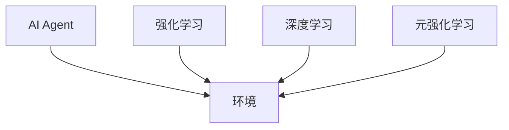

                 


# 深度元强化学习在AI Agent适应性中的应用

> 关键词：深度元强化学习、AI Agent、适应性学习、强化学习、元学习

> 摘要：本文深入探讨了深度元强化学习在AI Agent适应性中的应用，从理论基础到算法实现，再到实际应用，全面分析了其在提升AI Agent自适应能力中的作用。通过具体案例和系统设计，展示了如何利用深度元强化学习技术构建高效、灵活的AI Agent系统。

---

## 第一部分: 深度元强化学习在AI Agent适应性中的应用背景

### 第1章: 问题背景与描述

#### 1.1 AI Agent的定义与特点
AI Agent是一种智能体，能够感知环境、做出决策并执行动作以实现目标。其特点包括自主性、反应性、目标导向性和社会性。

#### 1.2 AI Agent适应性的重要性
适应性是AI Agent在动态环境中生存和发展的关键能力。适应性学习使AI Agent能够根据环境变化调整策略，提升任务执行效率。

#### 1.3 当前AI Agent适应性面临的挑战
- 动态环境中的策略更新问题
- 多目标平衡与冲突问题
- 高维状态空间的探索问题

### 第2章: 深度元强化学习的概念与联系

#### 2.1 深度强化学习的核心思想
深度强化学习结合了深度学习的特征提取能力和强化学习的目标导向性，通过神经网络逼近最优策略。

#### 2.2 元强化学习的定义与特点
元强化学习是一种学习如何学习的范式，旨在通过快速适应新任务来提升泛化能力。

#### 2.3 深度元强化学习的整合原理
深度元强化学习通过深度神经网络实现元学习，能够在多任务环境中共享参数，提升学习效率。

### 第3章: 核心概念与联系

#### 3.1 核心概念对比
| 概念       | 描述                           |
|------------|--------------------------------|
| 强化学习    | 基于奖励机制的学习             |
| 深度学习    | 基于神经网络的特征学习         |
| 元学习     | 学习如何学习                   |
| 深度元强化学习 | 深度学习与元强化学习的结合     |

#### 3.2 ER实体关系图


---

## 第二部分: 深度元强化学习算法原理

### 第4章: 算法原理与流程

#### 4.1 深度强化学习算法
- **DQN算法**: 使用Q-learning与深度神经网络结合，通过经验回放和目标网络提升稳定性。
- **A3C算法**: 基于异步策略评估和优势函数的分布式强化学习算法。
- **PPO算法**: 基于策略梯度的优化算法，通过约束技术防止策略更新过大。

#### 4.2 元强化学习算法
- **Meta-Q-Learning**: 在多个任务中共享Q值函数参数，通过任务间参数更新实现快速适应。
- **MAML算法**: 通过元梯度计算，使模型在新任务上快速调整参数。
- **REPTILE算法**: 基于局部优化的元学习方法，通过任务间参数更新实现泛化能力。

#### 4.3 深度元强化学习算法
- **DMRL算法**: 结合深度强化学习和元强化学习的端到端训练框架，通过神经网络实现多任务参数共享。

---

### 第5章: 算法实现与对比

#### 5.1 算法实现
```python
import numpy as np
import torch
import torch.nn as nn
import torch.optim as optim

class MetaLearner:
    def __init__(self, state_space, action_space):
        self.state_space = state_space
        self.action_space = action_space
        self.net = nn.Sequential(
            nn.Linear(state_space, 64),
            nn.ReLU(),
            nn.Linear(64, action_space)
        )
        self.optimizer = optim.Adam(self.net.parameters(), lr=1e-3)

    def forward(self, state):
        return self.net(state)

    def update(self, state, action, reward):
        pred = self.net(state)
        loss = (pred[action] - reward).mean()
        self.optimizer.zero_grad()
        loss.backward()
        self.optimizer.step()

class DeepMetaRL:
    def __init__(self, state_space, action_space, num_tasks):
        self.meta_learner = MetaLearner(state_space, action_space)
        self.num_tasks = num_tasks

    def train(self, tasks):
        for task in tasks:
            for state, action, reward in task:
                self.meta_learner.update(state, action, reward)
```

#### 5.2 算法对比
通过数学公式对比不同算法的优化目标和更新规则，例如：

- **DQN的优化目标**:  
  $$ \arg \max Q(s, a) = r + \gamma \max Q(s', a') $$
- **MAML的元梯度更新**:  
  $$ \theta_{new} = \theta_{old} + \alpha \nabla_{\theta} \mathcal{L}_i(\theta) $$

---

## 第三部分: 系统分析与架构设计

### 第6章: 系统分析与设计

#### 6.1 应用场景
AI Agent在动态环境中的任务分配、路径规划和资源分配等场景中的应用。

#### 6.2 系统功能设计
- **领域模型**: 通过Mermaid类图展示系统各组件及其关系。
- **系统架构**: 使用Mermaid架构图展示模块划分和交互流程。

#### 6.3 接口与交互设计
- **系统接口**: 定义AI Agent与环境之间的接口规范。
- **交互流程**: 使用Mermaid序列图展示典型交互过程。

---

## 第四部分: 项目实战

### 第7章: 项目实战

#### 7.1 环境安装
安装必要的深度学习框架和强化学习库，如TensorFlow、PyTorch、Gym等。

#### 7.2 核心代码实现
实现深度元强化学习算法的训练和推理过程，包括任务生成、参数更新和策略评估。

#### 7.3 案例分析
以智能助手对话优化为例，展示如何利用深度元强化学习提升用户体验。

---

## 第五部分: 最佳实践与总结

### 第8章: 最佳实践

#### 8.1 小结
深度元强化学习通过参数共享和快速适应能力，显著提升了AI Agent的适应性。

#### 8.2 注意事项
- 参数初始化对算法性能影响较大
- 训练任务的选择需具有代表性
- 算法的收敛性需在实际应用中验证

#### 8.3 拓展阅读
推荐相关领域的书籍和论文，如《深度学习》、《强化学习》和《元学习》等。

---

## 作者：AI天才研究院/AI Genius Institute & 禅与计算机程序设计艺术 /Zen And The Art of Computer Programming

