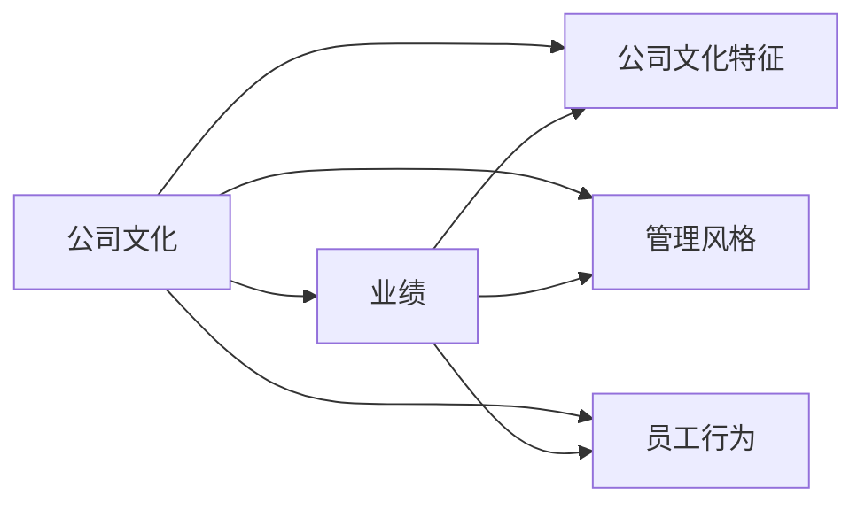

                 

# 深度学习分析公司文化与业绩关系

> 关键词：公司文化，业绩，深度学习，神经网络，公司管理，数据科学，人工智能

> 摘要：本文探讨了如何利用深度学习技术分析公司文化与业绩之间的关系。通过定义公司文化和业绩的核心概念，介绍深度学习的基本原理，分析深度学习在公司文化与业绩关系中的应用，并详细讲解了深度学习模型的设计与实现，最后通过实际案例展示了系统的设计与实现过程。

---

# 第一部分: 公司文化与业绩关系的背景与基础

## 第1章: 公司文化与业绩关系的背景介绍

### 1.1 公司文化的定义与核心要素

#### 1.1.1 公司文化的定义
公司文化是指企业在长期的经营活动中形成的价值观念、行为准则和思维方式的总和。它包括企业的使命、愿景、核心价值观以及员工的共同信念。

#### 1.1.2 公司文化的核心要素
- **使命与愿景**：企业的目标和未来发展方向。
- **核心价值观**：企业在经营活动中坚持的基本原则。
- **管理风格**：企业领导者处理问题的方式和风格。
- **员工行为规范**：员工在工作中应遵循的行为准则。

#### 1.1.3 公司文化与企业绩效的关系
公司文化直接影响员工的工作态度、团队协作能力和创新精神，进而影响企业的整体绩效。例如，具有开放和包容文化的公司更容易吸引和留住优秀人才，从而提高企业的竞争力。

### 1.2 业绩的定义与衡量标准

#### 1.2.1 业绩的定义
业绩通常指企业在一定时期内实现的财务和非财务成果，包括销售收入、利润、市场份额和员工满意度等。

#### 1.2.2 业绩的衡量标准
- **财务指标**：如净利润率、毛利率和资产回报率等。
- **市场表现**：如市场份额和品牌知名度。
- **员工满意度**：员工对公司的满意度和忠诚度。

#### 1.2.3 公司文化与业绩的关系
公司文化通过影响员工的行为、团队协作和企业创新间接影响业绩。例如，良好的公司文化可以提高员工的工作效率和创造力，从而提升企业的市场竞争力。

### 1.3 深度学习在分析公司文化与业绩关系中的作用

#### 1.3.1 深度学习的定义
深度学习是一种机器学习技术，通过多层神经网络模拟人类的思维方式，能够自动提取数据中的特征和模式。

#### 1.3.2 深度学习在企业分析中的应用
深度学习广泛应用于自然语言处理、图像识别和时间序列分析等领域，能够帮助企业从大量数据中提取有价值的信息。

#### 1.3.3 深度学习如何帮助分析公司文化与业绩关系
通过分析公司文化数据和业绩数据，深度学习可以识别公司文化对业绩的具体影响因素，例如，团队协作能力对销售收入的影响。

### 1.4 本章小结
本章介绍了公司文化和业绩的核心概念，以及深度学习在分析两者关系中的作用，为后续分析奠定了基础。

---

## 第2章: 公司文化与业绩关系的核心概念与联系

### 2.1 公司文化的核心概念

#### 2.1.1 公司文化的主要类型
- **创业文化**：鼓励创新和冒险。
- **层级文化**：强调等级和规范化。
- **客户导向文化**：以客户为中心。

#### 2.1.2 公司文化的层次结构
公司文化通常包括公司层面、部门层面和团队层面的文化。

#### 2.1.3 公司文化的影响因素
- **领导者的行为**：领导者的决策和行为对公司文化有重要影响。
- **员工互动**：员工之间的沟通和协作也影响公司文化。
- **外部环境**：市场需求和行业竞争也会影响公司文化。

### 2.2 业绩的核心概念

#### 2.2.1 业绩的构成要素
- **财务业绩**：如净利润和营业收入。
- **市场业绩**：如市场份额和品牌影响力。
- **员工业绩**：如员工满意度和工作效率。

#### 2.2.2 业绩的驱动因素
- **公司战略**：明确的战略目标能够指导企业的经营方向。
- **资源配置**：合理分配资源能够提高效率。
- **团队协作**：良好的团队协作能够提升整体业绩。

#### 2.2.3 业绩的波动性与稳定性
业绩可能会因市场环境和内部管理的变化而波动，但稳定的文化和战略能够帮助企业在波动中保持稳定。

### 2.3 公司文化与业绩关系的实体关系图

### 2.4 本章小结
本章详细分析了公司文化与业绩的核心概念，并通过实体关系图展示了两者之间的联系。

---

## 第3章: 深度学习分析公司文化与业绩关系的算法原理

### 3.1 深度学习的基本原理

#### 3.1.1 神经网络的基本结构
神经网络由输入层、隐藏层和输出层组成，通过权重和激活函数进行信息处理。

#### 3.1.2 深度学习的核心算法
- **反向传播算法**：用于训练神经网络。
- **梯度下降算法**：用于优化模型参数。

#### 3.1.3 深度学习的训练过程
包括前向传播、计算损失、反向传播和参数更新四个步骤。

### 3.2 深度学习在公司文化与业绩分析中的应用

#### 3.2.1 文本挖掘与情感分析
通过分析员工反馈和公司政策文本，识别公司文化特征。

#### 3.2.2 时间序列分析
分析业绩的时间序列数据，识别公司文化对业绩的影响趋势。

#### 3.2.3 关联规则挖掘
识别公司文化特征与业绩之间的关联规则。

### 3.3 深度学习模型的数学模型与公式

#### 3.3.1 神经网络的数学模型
$$ y = f(Wx + b) $$

#### 3.3.2 深度学习的损失函数
$$ L = \frac{1}{n}\sum_{i=1}^{n}(y_i - \hat{y_i})^2 $$

#### 3.3.3 梯度下降算法
$$ W = W - \eta \frac{\partial L}{\partial W} $$

### 3.4 本章小结
本章介绍了深度学习的基本原理及其在公司文化与业绩分析中的具体应用。

---

## 第4章: 深度学习分析公司文化与业绩关系的系统设计

### 4.1 系统分析与设计

#### 4.1.1 问题场景介绍
我们希望通过深度学习分析公司文化与业绩的关系，帮助企业优化管理策略。

#### 4.1.2 系统功能需求
- **数据收集**：收集公司文化数据和业绩数据。
- **数据预处理**：清洗和特征提取。
- **模型训练**：训练深度学习模型。
- **结果分析**：分析模型输出并提出管理建议。

#### 4.1.3 系统功能需

---

（由于篇幅限制，本文仅展示部分章节内容。完整文章将包含更多详细内容，如系统架构设计、项目实战、结果分析等部分。）

