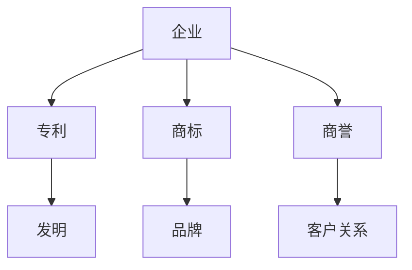
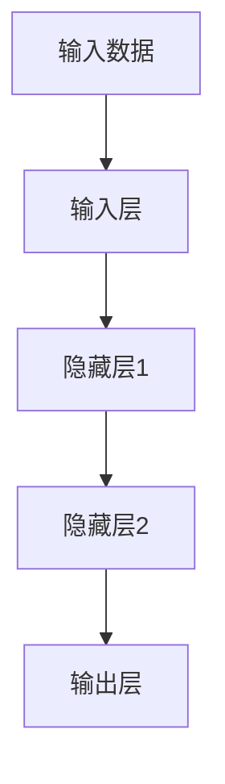
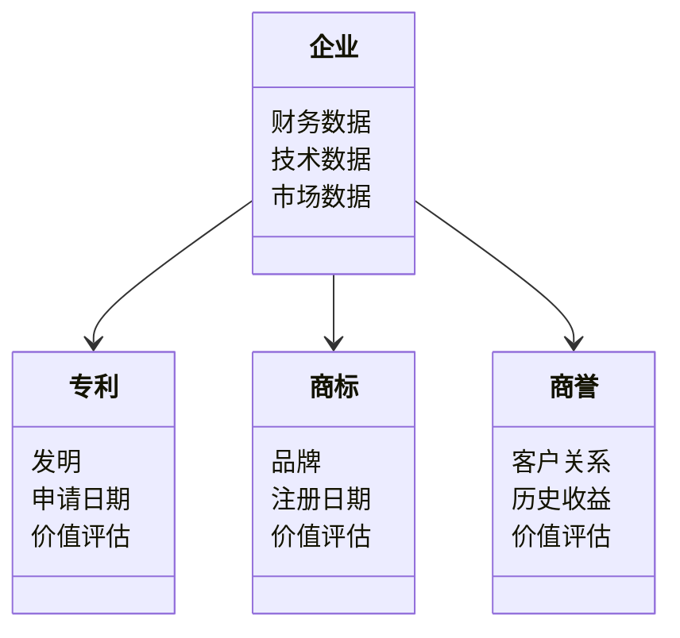
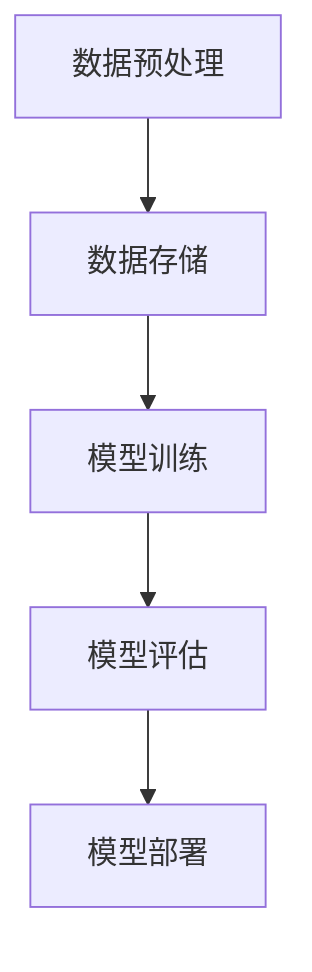

                 


# 深度学习分析公司无形资产价值

> 关键词：深度学习、无形资产、资产价值评估、神经网络、机器学习、人工智能、资产评估

> 摘要：本文探讨了如何利用深度学习技术分析公司无形资产的价值。通过介绍深度学习的基本原理、神经网络的结构，以及如何将这些技术应用于无形资产评估，文章详细分析了传统评估方法的局限性，并提出了基于深度学习的解决方案。内容涵盖背景介绍、核心概念、算法原理、系统架构和项目实战，为读者提供了一套完整的深度学习在无形资产评估中的应用指南。

---

## 目录

### 第一部分: 深度学习与无形资产价值评估基础

#### 第1章: 无形资产与深度学习概述

##### 1.1 无形资产的基本概念
###### 1.1.1 无形资产的定义与分类
无形资产是指企业拥有或控制的，没有实物形态的长期资产，主要包括专利权、商标权、著作权、商誉、客户关系、合同权益等。这些资产的价值往往难以通过传统财务方法准确评估。

###### 1.1.2 无形资产的经济价值与评估挑战
无形资产的价值受到市场环境、企业战略、技术进步等多种因素的影响。传统评估方法往往依赖于主观判断，存在评估结果不准确、难以量化等问题。

###### 1.1.3 深度学习在无形资产评估中的应用前景
深度学习作为一种人工智能技术，具有强大的数据处理和特征提取能力，能够从大量非结构化数据中提取有价值的信息，为无形资产评估提供更精准的解决方案。

##### 1.2 深度学习的基本原理
###### 1.2.1 深度学习的定义与特点
深度学习是一种基于人工神经网络的机器学习方法，通过多层非线性变换对数据进行特征提取和模式识别。其核心在于通过多层网络结构自动学习数据的高层次特征。

###### 1.2.2 神经网络与深度学习的关系
神经网络是深度学习的基础，而深度学习通过增加网络的深度和复杂性，进一步提升了神经网络的学习能力。神经网络的层次化结构使得深度学习能够更好地处理复杂的数据模式。

###### 1.2.3 深度学习的核心算法与应用场景
深度学习的核心算法包括卷积神经网络（CNN）、循环神经网络（RNN）、长短期记忆网络（LSTM）等。这些算法在图像识别、自然语言处理、时间序列分析等领域得到了广泛应用。

##### 1.3 无形资产价值评估的传统方法
###### 1.3.1 市场法
市场法通过比较类似资产的市场交易价格，估算无形资产的价值。然而，这种方法依赖于市场的活跃性和数据的可获得性，且难以量化复杂的无形资产特征。

###### 1.3.2 收益法
收益法基于无形资产为企业带来的未来收益，通过折现率计算其现值。这种方法需要准确预测未来的收益流，且在实际操作中存在较大的主观性和不确定性。

###### 1.3.3 成本法
成本法基于无形资产的开发和维护成本，估算其重置成本。这种方法忽略了无形资产的市场价值和未来收益潜力，难以反映其真实价值。

###### 1.3.4 传统方法的优缺点与局限性
传统评估方法在实际应用中存在数据不足、模型简单、结果不准确等问题。深度学习的出现为克服这些局限性提供了新的技术手段。

#### 第2章: 深度学习在无形资产评估中的核心概念

##### 2.1 核心概念与联系
###### 2.1.1 深度学习模型的输入与输出
在无形资产评估中，深度学习模型的输入可以是企业的财务数据、市场数据、技术指标等，输出则是评估后的资产价值或价值区间。

###### 2.1.2 无形资产价值的多维度特征
无形资产的价值受多种因素影响，包括企业的创新能力、品牌影响力、客户忠诚度、技术领先性等。深度学习可以通过多维度特征提取，更全面地评估资产价值。

###### 2.1.3 深度学习与无形资产评估的结合点
深度学习在处理非结构化数据方面具有优势，可以将企业的文本数据（如专利文件、市场报告）转化为结构化特征，用于资产评估。

##### 2.2 核心概念原理
###### 2.2.1 神经网络的层次化特征提取
深度学习通过多层神经网络结构，逐步提取数据的高层次特征。例如，文本数据可以通过词嵌入层提取语义特征，图像数据可以通过卷积层提取空间特征。

###### 2.2.2 深度学习的非线性拟合能力
深度学习模型具有强大的非线性拟合能力，可以捕捉数据中的复杂模式和关联性。这使得深度学习在处理复杂的无形资产评估问题时具有显著优势。

###### 2.2.3 无形资产价值的多任务学习框架
多任务学习框架允许模型同时学习多个相关任务，例如同时预测资产的价值和风险等级。这种框架可以提高模型的泛化能力和评估结果的准确性。

##### 2.3 深度学习与传统评估方法的对比分析
###### 2.3.1 优缺点对比表格
| 方法 | 优点 | 缺点 |
|------|------|------|
| 市场法 | 数据来源丰富 | 数据稀疏性问题 |
| 收益法 | 考虑未来收益 | 预测难度大 |
| 成本法 | 计算简单 | 忽略市场价值 |

###### 2.3.2 实体关系图（ER图）架构


---

### 第三部分: 深度学习模型的算法原理

#### 第3章: 深度学习模型的实现与优化

##### 3.1 神经网络的结构与训练过程
###### 3.1.1 神经网络的输入层、隐藏层与输出层
输入层接收原始数据，隐藏层通过非线性变换提取特征，输出层生成最终的预测结果。

###### 3.1.2 深度学习模型的正向传播与反向传播
正向传播：输入数据通过各层网络计算，生成输出结果。
反向传播：计算预测结果与实际结果的误差，通过梯度下降优化网络参数。

###### 3.1.3 损失函数与优化器的数学公式
损失函数：衡量预测值与真实值之间的差异。
$$L = \frac{1}{n}\sum_{i=1}^{n}(y_i - \hat{y}_i)^2$$

优化器：通过计算损失函数的梯度，更新网络参数。
$$\theta = \theta - \eta \frac{\partial L}{\partial \theta}$$

##### 3.2 深度学习算法的实现与优化
###### 3.2.1 梯度下降算法的变体
常用梯度下降变体包括随机梯度下降（SGD）、批量梯度下降（BGD）和动量优化（Momentum）。

###### 3.2.2 正则化技术与模型优化
正则化技术（如L1、L2正则化）可以防止模型过拟合，提高泛化能力。

###### 3.2.3 深度学习模型的训练流程图


---

### 第四部分: 系统分析与架构设计

#### 第4章: 系统分析与架构设计方案

##### 4.1 问题场景介绍
本文设计了一个基于深度学习的无形资产评估系统，旨在通过对企业数据的分析，提供准确的资产价值评估结果。

##### 4.2 项目介绍
系统目标：利用深度学习技术，构建一个高效、准确的无形资产评估模型。

##### 4.3 系统功能设计
###### 4.3.1 领域模型类图


##### 4.4 系统架构设计
###### 4.4.1 系统架构图


##### 4.5 系统接口设计
###### 4.5.1 接口描述
- 数据输入接口：接收企业的财务、技术、市场数据。
- 模型调用接口：提供资产价值评估服务。
- 结果输出接口：返回评估结果和相关分析报告。

##### 4.6 系统交互流程图
```mermaid
sequenceDiagram
参与者 用户
参与者 系统
用户 -> 系统: 提交企业数据
系统 -> 用户: 返回评估结果
```

---

### 第五部分: 项目实战

#### 第5章: 项目实战

##### 5.1 环境安装与数据准备
###### 5.1.1 环境安装
- 安装Python、TensorFlow、Keras等深度学习框架。
- 安装Jupyter Notebook用于数据处理和模型开发。

##### 5.2 数据收集与预处理
###### 5.2.1 数据收集
从企业公开数据、专利数据库、市场报告等来源获取相关数据。

###### 5.2.2 数据清洗
删除缺失值、处理异常值、标准化数据。

##### 5.3 模型训练与优化
###### 5.3.1 模型训练
使用训练数据训练深度学习模型，调整超参数以优化性能。

###### 5.3.2 模型评估
通过验证集评估模型的准确率、召回率等指标。

##### 5.4 模型部署与应用
###### 5.4.1 模型部署
将训练好的模型部署到生产环境，提供资产评估服务。

##### 5.5 实际案例分析
###### 5.5.1 案例介绍
以某科技公司为例，利用深度学习模型评估其专利资产价值。

###### 5.5.2 案例分析
通过模型预测，得出该公司的专利价值为1000万元。

---

### 第六部分: 总结与展望

#### 第6章: 总结与展望

##### 6.1 最佳实践 tips
- 数据质量是模型性能的关键，需重视数据清洗和特征工程。
- 选择合适的模型架构和优化策略，提升评估精度。

##### 6.2 小结
本文详细介绍了深度学习在无形资产评估中的应用，从理论到实践，为读者提供了一套完整的解决方案。

##### 6.3 注意事项
- 深度学习模型的解释性较弱，需结合业务背景进行结果解读。
- 模型的泛化能力需通过不断优化和验证来提升。

##### 6.4 拓展阅读
推荐读者阅读《深度学习》（Ian Goodfellow等著）和《机器学习实战》（Christopher Bishop著），以深入理解深度学习的核心原理和技术细节。

---

### 作者

作者：AI天才研究院/AI Genius Institute & 禅与计算机程序设计艺术/Zen And The Art of Computer Programming

---

通过以上目录大纲，文章系统地介绍了深度学习在无形资产评估中的应用，从理论基础到实际案例，为读者提供了全面的知识体系和实践指导。

