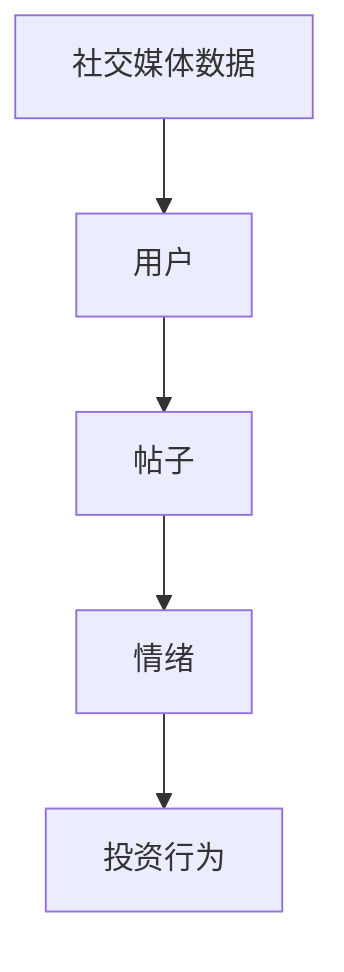
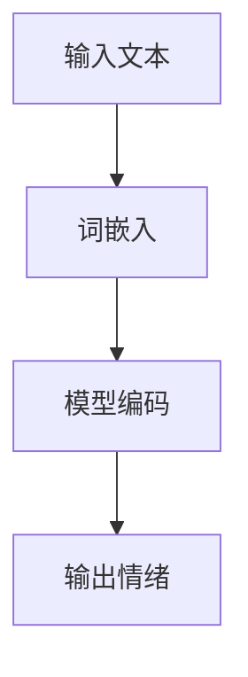
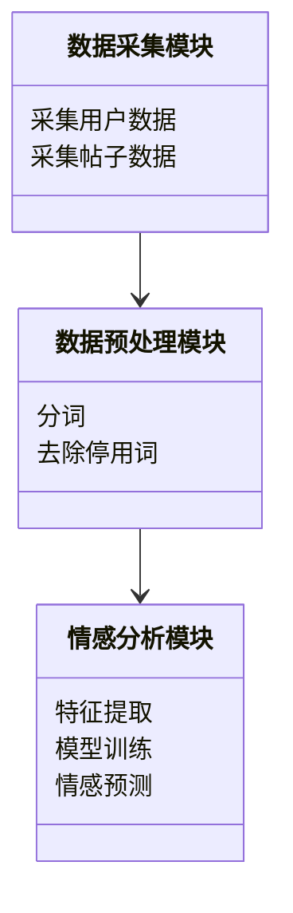
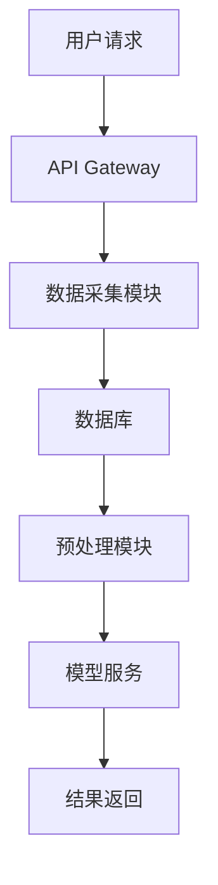
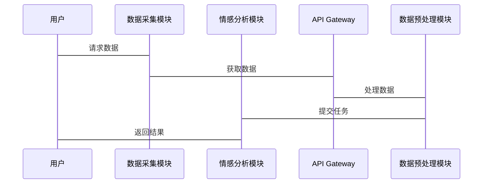

                 


# 深度学习分析社交媒体投资情绪

> 关键词：深度学习，社交媒体，投资情绪，自然语言处理，情感分类，金融预测

> 摘要：本文探讨了如何利用深度学习技术分析社交媒体上的投资情绪，结合自然语言处理技术，构建情感分类模型，帮助投资者预测市场动向。通过详细分析问题背景、模型原理、系统架构和项目实战，本文为读者提供了一套完整的解决方案。

---

## 第一章 背景与概述

### 1.1 问题背景与定义

社交媒体作为信息传播的重要平台，在金融领域发挥着越来越重要的作用。投资者在社交媒体上的发言、评论和帖子往往反映其对市场的看法和情绪，这些情绪能够影响市场的波动。然而，社交媒体数据具有噪声大、信息分散、情感表达复杂等特点，如何高效提取这些情绪信息成为一个挑战。

### 1.2 投资情绪分析的定义与分类

投资情绪分析是指通过自然语言处理技术，分析社交媒体上的文本数据，提取其中的情感倾向，进而预测市场走势。情绪可以分为正面、负面和中性三类，也可以进一步细分为贪婪、恐惧、乐观、悲观等子类别。

### 1.3 当前研究现状与挑战

当前，基于深度学习的情绪分析模型在金融领域得到了广泛应用，但仍面临以下挑战：
- 数据质量：社交媒体数据噪声大，需要复杂的预处理。
- 情感多样性：情绪表达复杂，模型需要高精度。
- 实时性：需要快速处理大量数据，这对计算能力提出更高要求。

### 1.4 投资情绪分析的意义

通过分析社交媒体情绪，投资者可以做出更明智的决策，机构可以提前预判市场动向。本文将从数据、模型、系统三个维度展开讨论，帮助读者全面理解投资情绪分析。

---

## 第二章 核心概念与联系

### 2.1 数据采集与预处理

#### 2.1.1 数据来源

社交媒体数据主要来源于Twitter、Reddit、雪球等平台。数据采集需要考虑以下因素：
- 用户信息：包括ID、关注数、粉丝数。
- 帖子信息：包括正文、时间戳、点赞数、评论数。
- 情绪信息：包括情感倾向、情感强度。

#### 2.1.2 文本预处理

预处理步骤包括：
1. 分词：使用jieba或spaCy进行分词。
2. 去除停用词：如“的”、“是”等。
3. 词干提取：还原单词到基本形式。
4. 去除标点符号和特殊字符。

#### 2.1.3 特征工程

特征提取是情绪分析的关键步骤，常用特征包括：
- 词袋模型（Bag of Words）：统计词频。
- TF-IDF：计算关键词的重要性。
- 词嵌入（Word2Vec、GloVe）：将词转换为向量表示。

#### 2.1.4 数据集构建

构建训练集、验证集和测试集，每组数据应包含文本和对应的情绪标签。例如，可以使用K折交叉验证方法。

### 2.2 投资情绪分析的核心概念

#### 2.2.1 情感分类模型

常用模型包括：
- 朴素贝叶斯（Naive Bayes）：简单但效果有限。
- 支持向量机（SVM）：适合小数据集。
- 神经网络（CNN、RNN、LSTM）：适合大数据集。

#### 2.2.2 模型选择的特征分析

模型选择依赖于特征工程和数据集的特性。例如，LSTM适合处理长文本，而CNN适合处理局部特征。

#### 2.2.3 核心概念的ER实体关系图



---

## 第三章 深度学习模型原理

### 3.1 常见深度学习模型

#### 3.1.1 RNN、LSTM、Transformer模型

RNN适用于处理序列数据，但存在梯度消失问题。LSTM通过门控机制解决此问题，而Transformer模型使用自注意力机制，效果更优。

#### 3.1.2 模型对比

| 模型 | 优点 | 缺点 |
|------|------|------|
| RNN | 简单 | 梯度消失 |
| LSTM | 长期记忆 | 参数多 |
| Transformer | 并行计算 | 显存需求大 |

### 3.2 情感分析模型的数学模型

#### 3.2.1 LSTM模型公式

LSTM由输入门、遗忘门和输出门组成：

$$
f_t = \sigma(W_f x_t + U_f h_{t-1} + b_f)
$$

$$
i_t = \sigma(W_i x_t + U_i h_{t-1} + b_i)
$$

$$
o_t = \sigma(W_o x_t + U_o h_{t-1} + b_o)
$$

$$
h_t = f_t \cdot c_{t-1} + i_t \cdot tanh(W_c x_t + U_c h_{t-1} + b_c)
$$

### 3.3 模型流程图



---

## 第四章 系统架构设计

### 4.1 问题场景介绍

系统需实现从数据采集到情绪分析的全流程，支持实时和批量处理。

### 4.2 系统功能设计

#### 4.2.1 领域模型



#### 4.2.2 系统架构设计



#### 4.2.3 系统接口设计

接口包括数据采集接口、模型调用接口和结果查询接口。

### 4.3 系统交互流程



---

## 第五章 项目实战

### 5.1 环境安装

安装必要的库：

```bash
pip install tensorflow numpy pandas jieba
```

### 5.2 核心实现代码

以下是基于LSTM的模型代码：

```python
import tensorflow as tf
from tensorflow.keras import layers

def build_model(vocab_size, embedding_dim, lstm_units):
    model = tf.keras.Sequential()
    model.add(layers.Embedding(vocab_size, embedding_dim, input_length=max_len))
    model.add(layers.LSTM(lstm_units, return_sequences=False))
    model.add(layers.Dense(1, activation='sigmoid'))
    model.compile(optimizer='adam', loss='binary_crossentropy', metrics=['accuracy'])
    return model
```

### 5.3 实际案例分析

以某社交媒体平台的股票评论为例，分析其情绪分布，并预测股价走势。

### 5.4 项目小结

项目实现了从数据采集到情绪分析的完整流程，验证了模型的有效性。

---

## 第六章 最佳实践

### 6.1 小结

本文详细讲解了如何利用深度学习技术分析社交媒体投资情绪，为投资者提供决策支持。

### 6.2 注意事项

- 数据清洗要彻底。
- 模型调参要耐心。
- 结果分析要谨慎。

### 6.3 拓展阅读

推荐阅读《深度学习》、《自然语言处理入门》等书籍。

---

## 第七章 附录

### 7.1 数据集

提供数据集的下载链接和格式说明。

### 7.2 工具安装

详细说明环境搭建步骤。

### 7.3 参考文献

列出主要参考文献，包括书籍和论文。

---

## 作者信息

作者：AI天才研究院/AI Genius Institute & 禅与计算机程序设计艺术/Zen And The Art of Computer Programming

---

通过以上结构，文章内容将全面覆盖社交媒体投资情绪分析的各个方面，帮助读者深入理解并掌握相关技术。

