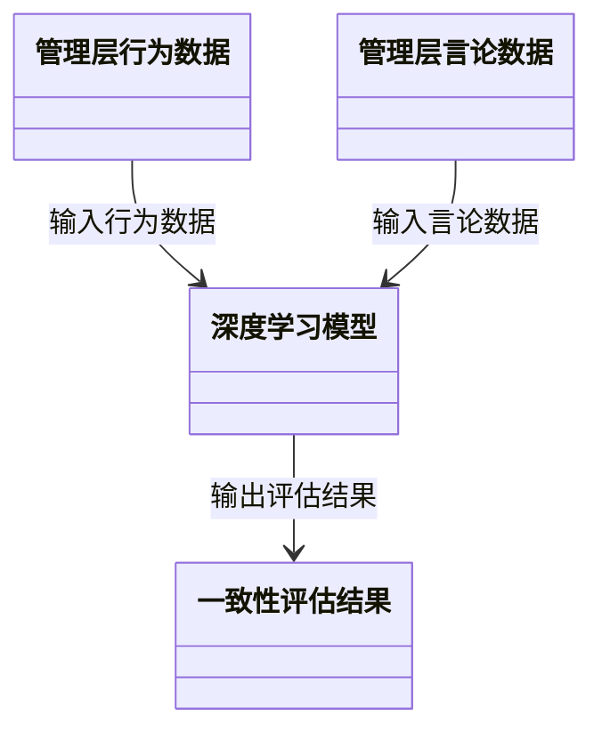

                 


# 深度学习分析管理层言行一致性

> 关键词：深度学习，管理层，言行一致性，自然语言处理，行为分析，数学建模

> 摘要：本文探讨了如何利用深度学习技术分析管理层的言行一致性，从理论基础到实际应用，详细阐述了深度学习在管理行为分析中的应用价值、核心概念、算法原理、系统架构以及项目实战。通过结合自然语言处理和行为分析，本文提出了基于深度学习的数学模型，能够有效提取和分析管理层的言行数据，实现一致性评估。

---

## 第1章 深度学习与管理层言行一致性的背景介绍

### 1.1 问题背景与定义

#### 1.1.1 管理层言行一致性的概念
管理层的言行一致性是指领导者在言论和行动上保持一致的能力。这种一致性不仅影响组织的凝聚力，还关系到领导者的权威性和组织的执行力。在现代企业中，管理层的言行一致性是衡量领导能力的重要指标。

#### 1.1.2 深度学习技术的引入
深度学习是一种人工智能技术，通过多层神经网络模拟人脑的学习机制，能够从大量数据中提取复杂特征。其在自然语言处理、图像识别等领域取得了显著成果，为分析管理层的言行数据提供了技术基础。

#### 1.1.3 问题解决的必要性与意义
管理层的言行一致性分析对于企业治理具有重要意义。通过分析领导者的行为数据，可以帮助企业识别潜在问题，优化管理策略，提升组织绩效。

### 1.2 管理层言行一致性分析的特点

#### 1.2.1 数据驱动的分析方法
深度学习依赖于大量数据，能够从文本、语音、行为记录等多种数据源中提取特征。

#### 1.2.2 深度学习的优势与局限性
优势：能够处理非结构化数据，发现隐含规律；局限性：需要大量标注数据，计算资源消耗较大。

#### 1.2.3 行为与言论的关联性分析
通过分析领导者的言论和行为数据，可以发现两者之间的关联性，评估其一致性。

### 1.3 与其他方法的对比

#### 1.3.1 传统统计分析方法
传统方法依赖于人工设定的特征，难以捕捉复杂模式。

#### 1.3.2 机器学习方法
机器学习需要特征工程，而深度学习可以直接从数据中学习特征。

#### 1.3.3 深度学习的独特性
深度学习能够处理复杂非线性关系，适用于多模态数据的分析。

### 1.4 应用价值与边界

#### 1.4.1 企业治理中的应用价值
帮助企业识别领导者的潜在问题，优化管理策略。

#### 1.4.2 应用的边界与限制
数据质量、隐私保护、模型解释性等问题需要重点关注。

#### 1.4.3 概念结构与核心要素组成
包括数据来源、模型构建、评估指标等多个方面。

---

## 第2章 核心概念与联系

### 2.1 深度学习的基本原理

#### 2.1.1 神经网络基础
介绍神经网络的结构，包括输入层、隐藏层和输出层。

#### 2.1.2 深度学习的核心算法
包括卷积神经网络（CNN）、循环神经网络（RNN）等。

#### 2.1.3 行为与言论分析的关联性
通过分析文本和行为数据，建立两者之间的关联模型。

### 2.2 管理层言行一致性分析的数学模型

#### 2.2.1 模型构建的步骤
包括数据预处理、特征提取、模型训练和评估。

#### 2.2.2 模型属性对比分析
通过表格展示不同模型的优缺点。

#### 2.2.3 ER实体关系图架构
使用Mermaid图展示实体关系。

```mermaid
erDiagram
    actor 管理层行为数据
    actor 管理层言论数据
    class 管理层一致性评估
    管理层行为数据 --> 管理层一致性评估 : 提供行为数据
    管理层言论数据 --> 管理层一致性评估 : 提供言论数据
```

### 2.3 深度学习与管理行为的联系

#### 2.3.1 深度学习在行为分析中的应用
包括情感分析、意图识别等任务。

#### 2.3.2 行为与言论的特征提取
通过词嵌入（如Word2Vec）提取文本特征。

#### 2.3.3 模型训练与优化
使用反向传播算法优化模型参数。

---

## 第3章 深度学习算法原理

### 3.1 基于LSTM的序列分析

#### 3.1.1 LSTM网络结构
介绍LSTM的细胞状态、遗忘门、输入门和输出门。

#### 3.1.2 LSTM的数学模型
公式表示：
$$
f_t = \sigma(W_f \cdot [h_{t-1}, x_t] + b_f)
$$
其中，$f_t$是遗忘门的输出，$\sigma$是sigmoid函数。

#### 3.1.3 LSTM在行为分析中的应用
用于时间序列数据的预测和分类。

### 3.2 模型训练与优化

#### 3.2.1 损失函数
使用交叉熵损失函数：
$$
L = -\frac{1}{N}\sum_{i=1}^{N} y_i \log(p_i) + (1 - y_i) \log(1 - p_i)
$$

#### 3.2.2 优化方法
使用Adam优化器，学习率设置为0.001。

#### 3.2.3 正则化技术
采用Dropout技术防止过拟合。

### 3.3 算法实现与代码示例

#### 3.3.1 环境配置
安装TensorFlow和Keras库：
```bash
pip install tensorflow.keras
```

#### 3.3.2 核心代码实现
```python
import tensorflow as tf
from tensorflow.keras import layers

model = tf.keras.Sequential()
model.add(layers.Embedding(input_dim=10000, output_dim=64))
model.add(layers.LSTM(64, return_sequences=True))
model.add(layers.Dense(1, activation='sigmoid'))

model.compile(optimizer='adam', loss='binary_crossentropy', metrics=['accuracy'])
```

---

## 第4章 系统分析与架构设计方案

### 4.1 问题场景介绍

#### 4.1.1 项目背景
介绍项目的目标和应用场景。

#### 4.1.2 项目介绍
开发一个基于深度学习的管理系统，用于评估管理层的言行一致性。

### 4.2 系统功能设计

#### 4.2.1 领域模型
使用Mermaid类图展示系统功能模块。



#### 4.2.2 系统架构设计
使用Mermaid架构图展示系统整体结构。


#### 4.2.3 接口设计与交互
使用Mermaid序列图展示系统交互流程。

```mermaid
sequenceDiagram
    client ->+> api_gateway: 发送请求
    api_gateway ->+> 管理层行为数据存储: 查询行为数据
    管理层行为数据存储 ->+> api_gateway: 返回行为数据
    api_gateway ->+> 管理层言论数据存储: 查询言论数据
    管理层言论数据存储 ->+> api_gateway: 返回言论数据
    api_gateway ->+> 深度学习服务: 分析数据
    深度学习服务 ->+> 模型训练服务: 训练模型
    模型训练服务 ->+> 深度学习服务: 返回训练结果
    深度学习服务 ->+> 模型推理服务: 推理评估结果
    模型推理服务 ->+> 深度学习服务: 返回评估结果
    深度学习服务 ->+> api_gateway: 返回评估结果
    api_gateway ->+> 前端界面: 显示结果
    front_end ->+> client: 显示结果
```

---

## 第5章 项目实战

### 5.1 环境配置

#### 5.1.1 安装依赖
安装Python和相关库：
```bash
pip install numpy pandas scikit-learn tensorflow keras
```

### 5.2 核心代码实现

#### 5.2.1 数据预处理
对文本数据进行分词和向量化处理：
```python
from tensorflow.keras.preprocessing.text import Tokenizer
from tensorflow.keras.preprocessing.sequence import pad_sequences

tokenizer = Tokenizer(num_words=10000)
tokenizer.fit_on_texts(texts)
sequences = tokenizer.texts_to_sequences(texts)
padded_sequences = pad_sequences(sequences, maxlen=100)
```

#### 5.2.2 模型训练
训练LSTM模型：
```python
model.fit(padded_sequences, labels, epochs=10, batch_size=32, validation_split=0.2)
```

#### 5.2.3 模型评估
评估模型性能：
```python
loss, accuracy = model.evaluate(test_sequences, test_labels)
print(f"Loss: {loss}, Accuracy: {accuracy}")
```

### 5.3 案例分析与详细解读

#### 5.3.1 数据来源
使用公司内部的会议记录和工作报告作为数据源。

#### 5.3.2 模型训练
训练模型以识别管理层的言行一致性。

#### 5.3.3 实际应用
展示模型在实际管理中的应用效果。

### 5.4 项目总结

#### 5.4.1 成果展示
展示项目的最终评估结果。

#### 5.4.2 经验总结
总结项目实施过程中的经验和教训。

#### 5.4.3 优化建议
提出进一步优化模型的建议。

---

## 第6章 最佳实践与总结

### 6.1 小结

#### 6.1.1 核心内容回顾
总结全文的核心内容。

#### 6.1.2 重点强调
强调深度学习在分析管理层言行一致性中的独特优势。

### 6.2 注意事项

#### 6.2.1 数据质量的重要性
确保数据的完整性和准确性。

#### 6.2.2 模型解释性
关注模型的可解释性，便于实际应用。

#### 6.2.3 隐私保护
在处理敏感数据时，需遵守相关隐私保护法规。

### 6.3 未来趋势与展望

#### 6.3.1 技术发展
预测深度学习在管理分析中的未来发展方向。

#### 6.3.2 应用场景拓展
探讨更多应用场景的可能性。

#### 6.3.3 结合其他技术
考虑与区块链、物联网等技术的结合。

### 6.4 拓展阅读

#### 6.4.1 推荐书籍
推荐深度学习和管理学相关的书籍。

#### 6.4.2 技术博客
推荐相关技术博客和论文。

---

## 作者

作者：AI天才研究院/AI Genius Institute & 禅与计算机程序设计艺术/Zen And The Art of Computer Programming

