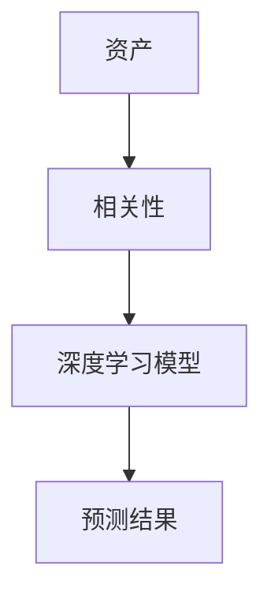
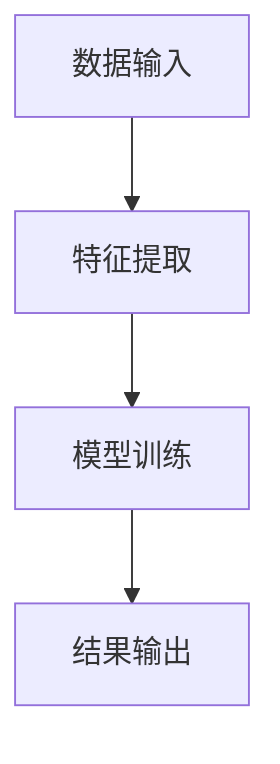
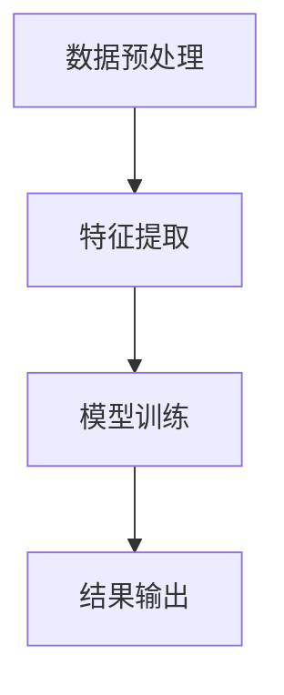
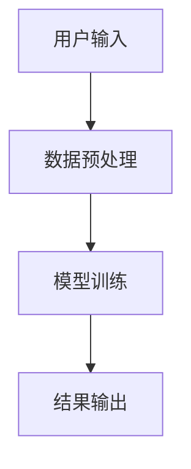

                 

# 深度学习在跨资产相关性分析中的应用

> 关键词：深度学习，跨资产相关性分析，系统架构，数学模型，算法原理，项目实战

> 摘要：本文系统地探讨了深度学习在跨资产相关性分析中的应用，从基础理论到实际应用，涵盖数据预处理、模型选择、系统架构设计及项目实战。通过详细讲解核心概念、算法原理和系统架构，本文为读者提供了一套完整的解决方案。

---

# 第1章 跨资产相关性分析的背景与深度学习的引入

## 1.1 跨资产相关性分析的背景

### 1.1.1 什么是跨资产相关性分析

跨资产相关性分析旨在研究不同资产（如股票、债券、基金等）之间的相互关系。通过分析这些关系，投资者可以优化投资组合，降低风险。

### 1.1.2 跨资产相关性分析的必要性

传统方法在处理高维、复杂数据时表现不佳。深度学习能够捕捉非线性关系，提供更精准的分析。

### 1.1.3 跨资产相关性分析的边界与外延

包括数据范围、时间窗口和资产类别。分析需结合市场动态，考虑资产间的相互影响。

### 1.1.4 跨资产相关性分析的核心要素组成

数据源、特征工程、模型选择和结果评价。

## 1.2 深度学习的引入

### 1.2.1 传统相关性分析的局限性

难以处理高维和非线性关系，无法捕捉复杂模式。

### 1.2.2 深度学习的优势与适用场景

擅长处理复杂数据，能发现隐藏模式，适用于金融时间序列分析。

### 1.2.3 深度学习在跨资产分析中的应用价值

提升预测精度，优化投资组合。

## 1.3 本章小结

深度学习通过捕捉复杂模式，解决了传统方法的局限，为跨资产分析提供了新思路。

---

# 第2章 跨资产相关性分析的核心概念与联系

## 2.1 跨资产相关性分析的核心概念

### 2.1.1 跨资产数据的特征

多维、时间序列和异构性。

### 2.1.2 跨资产相关性的定义

两个资产价格变动的相关性，分为正相关和负相关。

### 2.1.3 跨资产相关性分析的模型类型

线性回归、主成分分析和深度学习模型。

### 2.1.4 跨资产相关性分析的评价指标

相关系数、均方误差和准确率。

## 2.2 深度学习模型的核心原理

### 2.2.1 神经网络的基本原理

通过层结构和激活函数处理数据。

### 2.2.2 深度学习模型的训练过程

包括正向传播、损失计算和反向传播。

### 2.2.3 深度学习模型的特征提取能力

自动学习特征，无需手动提取。

## 2.3 跨资产相关性分析与深度学习的关系

### 2.3.1 跨资产相关性分析的复杂性

数据复杂和关系多样性。

### 2.3.2 深度学习在处理复杂关系中的优势

捕捉非线性关系，适合复杂场景。

### 2.3.3 跨资产相关性分析与深度学习的结合方式

数据预处理、特征提取和模型训练。

## 2.4 核心概念对比表格

| 比较项                  | 传统统计方法      | 深度学习模型      |
|-------------------------|-------------------|------------------|
| 数据类型                | 低维、线性         | 高维、非线性       |
| 模型复杂性              | 简单              | 复杂              |
| 需要特征工程            | 需要              | 自动提取          |

## 2.5 ER实体关系图架构

## 2.6 本章小结

深度学习通过自动提取特征，有效处理复杂关系，提升分析精度。

---

# 第3章 深度学习的基础知识

## 3.1 神经网络的基本原理

### 3.1.1 神经元模型

基本单位，通过激活函数处理输入。

### 3.1.2 网络层与激活函数

不同层处理不同特征，激活函数引入非线性。

### 3.1.3 损失函数与优化器

衡量预测与真实差异，优化器调整参数。

## 3.2 深度学习的常见模型

### 3.2.1 卷积神经网络（CNN）

适合图像数据，通过卷积提取特征。

### 3.2.2 循环神经网络（RNN）

适合序列数据，处理时间依赖性。

### 3.2.3 Transformer模型

基于注意力机制，适合长序列。

## 3.3 深度学习的特征工程

### 3.3.1 特征提取

自动学习数据特征。

### 3.3.2 特征选择

选择重要特征。

### 3.3.3 特征变换

转换特征以适应模型。

## 3.4 本章小结

深度学习模型通过多层结构，自动提取复杂特征。

---

# 第4章 深度学习在跨资产相关性分析中的应用

## 4.1 数据预处理

### 4.1.1 数据清洗

处理缺失值和异常值。

### 4.1.2 数据标准化

归一化处理，消除量纲影响。

### 4.1.3 数据增强

增加数据多样性，提升模型泛化能力。

## 4.2 模型选择与优化

### 4.2.1 模型选择策略

选择适合任务的模型。

### 4.2.2 模型调优方法

调整超参数，优化性能。

### 4.2.3 模型评估指标

准确率、召回率和F1分数。

## 4.3 系统架构设计

### 4.3.1 系统功能设计

数据输入、特征提取、模型训练和结果输出。

### 4.3.2 系统架构图

## 4.4 项目实战

### 4.4.1 环境安装

安装Python和相关库。

### 4.4.2 核心实现代码

使用Keras框架，定义模型结构，训练和评估。

### 4.4.3 代码解读

详细注释代码功能，解释每一步操作。

### 4.4.4 实际案例分析

分析结果，验证模型有效性。

## 4.5 本章小结

通过实际案例，展示了深度学习在跨资产分析中的应用。

---

# 第5章 深度学习算法的数学模型与原理

## 5.1 深度学习模型的数学表示

### 5.1.1 神经网络的数学表达

使用矩阵和向量表示输入和权重。

### 5.1.2 激活函数的数学形式

Sigmoid、ReLU等函数的数学表达。

### 5.1.3 损失函数的数学公式

交叉熵损失函数的详细推导。

## 5.2 深度学习算法的数学推导

### 5.2.1 前向传播的数学推导

计算输出的过程。

### 5.2.2 反向传播的数学推导

计算梯度的过程。

## 5.3 算法实现的代码解析

### 5.3.1 神经网络实现代码

定义模型、编译和训练。

### 5.3.2 激活函数实现代码

实现ReLU和Sigmoid函数。

## 5.4 本章小结

数学模型是深度学习的基础，理解其原理有助于优化模型。

---

# 第6章 系统架构设计与实现

## 6.1 系统架构设计

### 6.1.1 系统功能设计

模块化设计，明确各部分功能。

### 6.1.2 系统架构图

## 6.2 接口设计

### 6.2.1 数据接口

定义输入格式和数据接口。

### 6.2.2 模型接口

定义模型输入和输出接口。

## 6.3 交互流程设计

### 6.3.1 交互流程图

## 6.4 本章小结

系统架构设计确保了各部分协同工作，提升了整体性能。

---

# 第7章 项目实战与案例分析

## 7.1 项目实战

### 7.1.1 环境安装

安装必要的Python库。

### 7.1.2 核心代码实现

实现数据预处理、模型训练和结果输出。

## 7.2 案例分析

### 7.2.1 数据来源

使用公开金融数据集。

### 7.2.2 模型训练

训练深度学习模型，预测相关性。

## 7.3 结果分析

### 7.3.1 模型表现

准确率和召回率分析。

### 7.3.2 案例解读

分析模型预测结果，验证有效性。

## 7.4 本章小结

项目实战展示了深度学习在跨资产分析中的应用效果。

---

# 第8章 总结与展望

## 8.1 本章总结

深度学习在跨资产分析中展现出巨大潜力。

## 8.2 最佳实践 tips

选择合适模型，优化数据预处理。

## 8.3 小结

深度学习为跨资产分析提供了新思路。

## 8.4 注意事项

注意数据质量和模型调优。

## 8.5 未来展望

探索更高效算法和多模态数据融合。

---

# 作者：AI天才研究院 & 禅与计算机程序设计艺术

---

本文系统地探讨了深度学习在跨资产相关性分析中的应用，从基础理论到实际应用，为读者提供了全面的解决方案。

