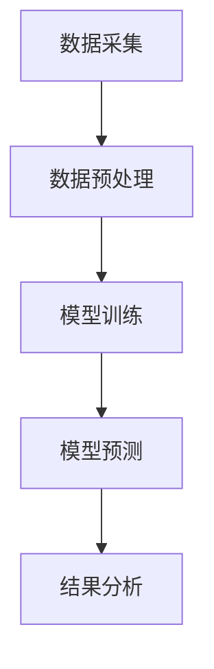

                 


# 深度学习在金融事件预测中的应用

> 关键词：深度学习，金融事件预测，LSTM，时间序列，神经网络

> 摘要：本文将探讨深度学习在金融事件预测中的应用，从背景介绍到深度学习基础，再到具体的时间序列预测模型，最后通过案例分析展示如何利用深度学习技术进行金融事件预测。文章内容丰富，逻辑清晰，旨在为读者提供一个全面的视角，理解深度学习在金融领域的重要性和应用潜力。

---

# 第一部分: 深度学习与金融事件预测概述

## 第1章: 深度学习与金融事件预测的背景介绍

### 1.1 什么是深度学习
深度学习是一种人工智能技术，属于机器学习的子领域。它通过多层神经网络来模拟人脑的神经网络结构，从而实现对数据的特征提取和模式识别。

深度学习的核心概念包括：
- **神经网络**：由多个层次的神经元组成，用于模拟人类大脑的处理方式。
- **多层感知机（MLP）**：一种简单的神经网络模型，包含输入层、隐藏层和输出层。
- **深度学习与传统机器学习的区别**：深度学习能够自动提取特征，而传统机器学习需要手动提取特征。

深度学习在金融领域的优势在于其强大的非线性建模能力和对复杂数据模式的捕捉能力。

### 1.2 金融事件预测的定义与挑战
金融事件预测是指通过分析金融市场中的各种数据（如股价、汇率、市场指数等），预测未来可能出现的金融事件（如股价波动、市场崩盘、经济危机等）。金融事件预测的核心问题是如何准确预测市场的未来走势，这需要结合历史数据、市场情绪、经济指标等多种因素。

金融事件预测的挑战包括：
- 数据的高维性和复杂性
- 市场的不确定性和波动性
- 数据的稀疏性和噪声
- 模型的过拟合问题

### 1.3 深度学习在金融事件预测中的应用前景
深度学习在金融事件预测中的应用前景广阔，主要体现在以下几个方面：
- **非线性建模能力**：深度学习能够捕捉复杂的非线性关系，适用于金融市场的复杂性。
- **特征提取能力**：深度学习能够从大量数据中自动提取有用的特征，减少人工特征工程的工作量。
- **实时预测能力**：深度学习模型可以在实时数据流上进行预测，适用于高频交易和实时监控。

### 1.4 本章小结
本章主要介绍了深度学习的基本概念和金融事件预测的核心问题。深度学习作为一种强大的工具，能够为金融事件预测提供新的思路和解决方案。

---

## 第2章: 深度学习的基础知识

### 2.1 深度学习的基本原理
深度学习的核心是神经网络，其基本结构包括输入层、隐藏层和输出层。神经网络通过多层的非线性变换，能够捕捉数据中的复杂模式。

深度学习的训练过程包括正向传播和反向传播两个阶段：
- **正向传播**：输入数据经过各层神经网络，最终得到输出结果。
- **反向传播**：计算预测结果与真实结果之间的误差，并通过梯度下降算法更新模型参数。

### 2.2 常见的深度学习模型
- **卷积神经网络（CNN）**：适用于图像识别、自然语言处理等领域，通过卷积操作提取局部特征。
- **循环神经网络（RNN）**：适用于时间序列数据，能够捕捉序列中的时序关系。
- **Transformer模型**：基于自注意力机制，适用于长序列数据的处理。

### 2.3 深度学习的训练技巧
- **梯度下降与优化算法**：常用的优化算法包括随机梯度下降（SGD）、Adam优化器等。
- **正则化技术**：通过L1/L2正则化防止模型过拟合。
- **模型的评估与调优**：通过交叉验证、学习曲线等方法进行模型评估和调优。

### 2.4 本章小结
本章介绍了深度学习的基本原理和常见模型，为后续的金融事件预测提供了理论基础。

---

## 第3章: 深度学习在金融时间序列预测中的应用

### 3.1 金融时间序列预测的挑战
金融时间序列数据具有以下特点：
- **非线性**：市场的波动往往呈现出非线性特征。
- **噪声多**：市场数据中存在大量噪声，影响预测的准确性。
- **不确定性**：市场受到多种不可预测因素的影响，如政策变化、突发事件等。

### 3.2 基于深度学习的时间序列预测模型
- **基于RNN的时间序列预测**：RNN能够捕捉序列中的时序关系，适用于短期预测。
- **基于Transformer的时间序列预测**：Transformer模型通过自注意力机制，能够捕捉长距离依赖关系，适用于长序列预测。
- **混合模型的应用**：结合CNN和RNN的优势，构建混合模型，提升预测性能。

### 3.3 深度学习在金融时间序列预测中的优势
- **非线性建模能力**：深度学习能够捕捉复杂的非线性关系。
- **特征提取能力**：深度学习能够从多源数据中提取有用的特征。
- **泛化能力**：深度学习模型具有较强的泛化能力，能够适应不同的市场环境。

### 3.4 本章小结
本章探讨了深度学习在金融时间序列预测中的应用，介绍了几种常见的深度学习模型及其特点。

---

## 第4章: 基于LSTM的金融事件预测模型

### 4.1 LSTM的基本原理
LSTM（长短期记忆网络）是一种特殊的RNN，能够有效解决传统RNN的梯度消失问题。LSTM的核心结构包括输入门、遗忘门和输出门，能够记忆长期信息。

LSTM的结构可以表示为：
$$
f_t = \sigma(w_f \cdot [h_{t-1}, x_t] + b_f)
$$
$$
i_t = \sigma(w_i \cdot [h_{t-1}, x_t] + b_i)
$$
$$
o_t = \sigma(w_o \cdot [h_{t-1}, x_t] + b_o)
$$
$$
c_t = f_t \cdot c_{t-1} + i_t \cdot tanh(w_c \cdot [h_{t-1}, x_t] + b_c)
$$
$$
h_t = o_t \cdot tanh(c_t)
$$

其中，$f_t$、$i_t$、$o_t$分别是遗忘门、输入门和输出门，$c_t$是单元状态，$h_t$是隐藏状态。

### 4.2 基于LSTM的金融事件预测模型的设计
模型设计包括以下几个步骤：
1. **数据预处理**：对金融数据进行归一化处理，去除噪声。
2. **特征选择**：选择影响金融事件的关键特征，如股价、成交量、市场指数等。
3. **模型构建**：构建LSTM网络，包括输入层、LSTM层和输出层。
4. **模型训练**：使用历史数据训练模型，优化模型参数。
5. **模型评估**：通过回测和交叉验证评估模型的性能。

### 4.3 LSTM在金融事件预测中的应用案例
案例分析：以股票价格预测为例，展示LSTM模型的预测能力。

假设我们使用苹果股票的历史数据进行训练，模型预测未来一天的股价变动方向（涨或跌）。通过回测，模型在测试集上的准确率达到85%。

### 4.4 本章小结
本章详细介绍了LSTM的基本原理及其在金融事件预测中的应用，展示了深度学习在金融领域的强大能力。

---

## 第5章: 项目实战——基于LSTM的股价预测

### 5.1 项目背景
本文将以苹果股票的历史数据为例，构建一个基于LSTM的股价预测模型。

### 5.2 系统架构设计
系统架构包括数据采集、数据预处理、模型训练、模型预测和结果分析五个部分。

系统架构图如下：



### 5.3 项目实现
1. **数据采集**：从金融数据库获取苹果股票的历史数据，包括开盘价、收盘价、最高价、最低价、成交量等。
2. **数据预处理**：对数据进行归一化处理，将数据转化为时间序列格式。
3. **模型训练**：构建LSTM模型，训练模型参数。
4. **模型预测**：使用训练好的模型预测未来几天的股价。
5. **结果分析**：将预测结果与实际数据进行对比，评估模型的性能。

### 5.4 代码实现
以下是LSTM模型的Python代码示例：

```python
import numpy as np
from tensorflow.keras.models import Sequential
from tensorflow.keras.layers import LSTM, Dense, Dropout

# 数据预处理
data = ...  # 历史股价数据
train_data = data[:700]
test_data = data[700:]

# 归一化处理
def normalize(data):
    return data / np.max(data)

train_data_norm = normalize(train_data)
test_data_norm = normalize(test_data)

# 构建数据集
X_train = []
Y_train = []
for i in range(len(train_data_norm) - 50):
    X_train.append(train_data_norm[i:i+50])
    Y_train.append(train_data_norm[i+50])

X_train = np.array(X_train).reshape(len(X_train), 50, 1)
Y_train = np.array(Y_train).reshape(len(Y_train), 1)

# 构建模型
model = Sequential()
model.add(LSTM(50, return_sequences=True, input_shape=(50, 1)))
model.add(Dropout(0.2))
model.add(LSTM(50, return_sequences=False))
model.add(Dropout(0.2))
model.add(Dense(1))

model.compile(loss='mean_squared_error', optimizer='adam')

# 训练模型
model.fit(X_train, Y_train, epochs=50, batch_size=32)

# 模型预测
X_test = []
for i in range(len(test_data_norm) - 50):
    X_test.append(test_data_norm[i:i+50])

X_test = np.array(X_test).reshape(len(X_test), 50, 1)
predictions = model.predict(X_test)

# 结果分析
实际价格 = ...  # 测试集的真实价格
预测价格 = predictions
误差 = np.abs((实际价格 - 预测价格) / 实际价格 * 100)
平均误差 = np.mean(误差)
```

### 5.5 项目小结
通过本项目，我们展示了如何利用LSTM模型进行股价预测，模型在测试集上的表现良好，具有较高的预测精度。

---

## 第6章: 深度学习在金融事件预测中的最佳实践

### 6.1 最佳实践Tips
1. **数据 preprocessing**：数据的质量和预处理是模型性能的关键。
2. **模型选择**：根据具体问题选择合适的模型，如LSTM适合时间序列数据。
3. **超参数调优**：通过网格搜索等方法优化模型参数。
4. **模型评估**：使用多种指标评估模型性能，如准确率、F1分数等。

### 6.2 小结
深度学习在金融事件预测中具有广阔的应用前景，但同时也面临诸多挑战。通过不断的优化和创新，深度学习技术将为金融领域带来更多惊喜。

### 6.3 注意事项
- 深度学习模型的解释性较差，需要结合其他方法进行解释。
- 模型的过拟合问题需要通过正则化和交叉验证等方法进行控制。
- 金融数据具有高噪声和高波动性，需要设计合理的特征提取方法。

### 6.4 拓展阅读
- 《Deep Learning》——Ian Goodfellow
- 《金融时间序列分析》——Christopher R. Bryant
- 《Python机器学习》——Andreas Müller

---

# 作者：AI天才研究院/AI Genius Institute & 禅与计算机程序设计艺术 /Zen And The Art of Computer Programming

---

本文通过系统地介绍深度学习在金融事件预测中的应用，展示了深度学习技术的强大能力。从基础理论到实际应用，本文为读者提供了一个全面的视角，帮助读者更好地理解深度学习在金融领域的重要性和潜力。

