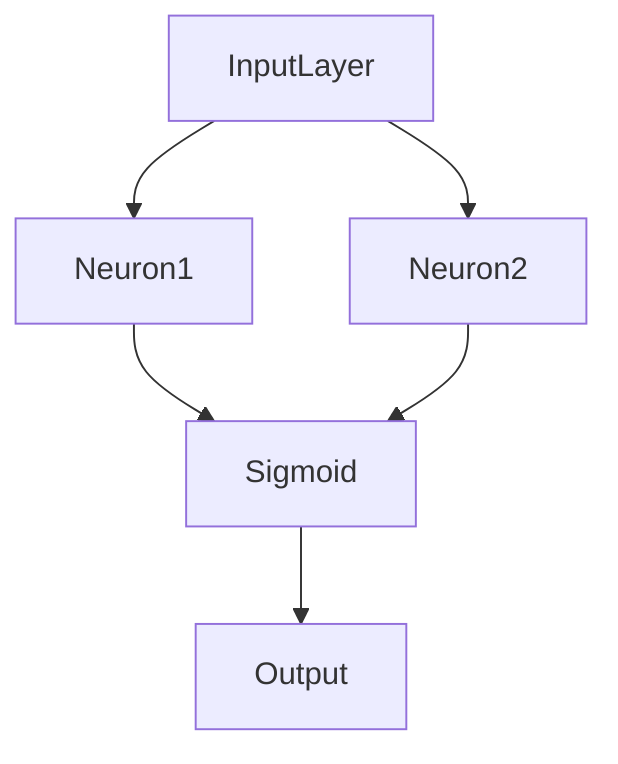
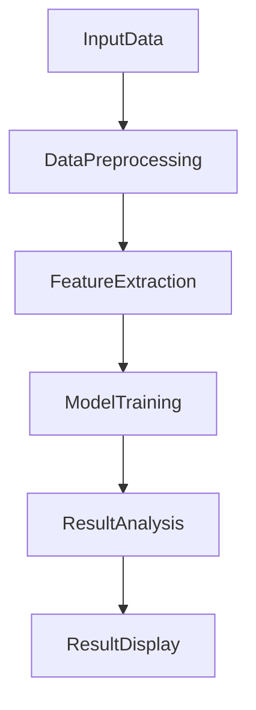
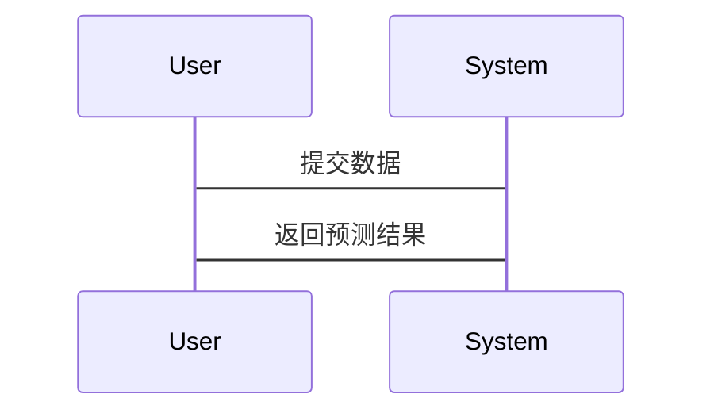

                 


# 深度学习预测公司创新突破

> 关键词：深度学习，公司创新，预测模型，机器学习，人工智能，数据分析，创新管理

> 摘要：本文详细探讨了深度学习技术在预测公司创新突破中的应用。通过分析深度学习的核心算法、创新数据的特征提取与模式识别，结合实际案例，展示了如何利用深度学习构建创新预测模型，为企业提供科学的决策支持。

---

## 第1章 深度学习与公司创新预测概述

### 1.1 深度学习的基本概念

#### 1.1.1 深度学习的定义
深度学习（Deep Learning）是机器学习（Machine Learning）的一个分支，通过模拟人脑神经网络的结构和功能，利用多层非线性变换来学习数据的特征表示。与传统机器学习方法相比，深度学习能够自动提取数据中的高层次特征，无需人工特征工程。

#### 1.1.2 深度学习的核心特点
- **非线性表示**：通过多层网络结构，能够捕捉数据中的非线性关系。
- **自动特征提取**：无需手动提取特征，模型能够从原始数据中学习有用的表示。
- **高维度处理**：适用于高维数据，如图像、文本和时间序列等。

#### 1.1.3 深度学习与传统机器学习的区别
| 特性 | 深度学习 | 传统机器学习 |
|------|----------|---------------|
| 数据需求 | 数据量大 | 数据量较小 |
| 特征工程 | 自动提取 | 需要手动设计 |
| 模型复杂度 | 高复杂度 | 较低复杂度 |
| 应用场景 | 复杂任务（如图像识别、自然语言处理） | 简单任务（如分类、回归） |

### 1.2 公司创新预测的背景与意义

#### 1.2.1 创新在企业中的重要性
创新是企业保持竞争优势的核心能力。通过预测创新趋势，企业可以提前布局技术研发、市场拓展和产品设计，从而在竞争中占据主动。

#### 1.2.2 创新预测的挑战与机遇
- **挑战**：创新数据的不确定性、多因素影响、数据维度高等。
- **机遇**：深度学习技术的快速发展为创新预测提供了新的可能性。

#### 1.2.3 深度学习在创新预测中的应用潜力
深度学习能够从海量数据中提取隐含的模式和关联，为创新预测提供科学依据。例如，通过分析专利数据、市场趋势和研发投入，深度学习可以帮助企业预测未来的创新方向和潜在突破点。

### 1.3 深度学习预测公司创新突破的可行性分析

#### 1.3.1 深度学习在模式识别中的优势
深度学习在图像识别、自然语言处理等领域表现出色，能够识别复杂的数据模式。这些技术可以应用于创新数据的分析，如专利文本的情感分析、技术趋势预测等。

#### 1.3.2 创新数据的可挖掘性
创新数据通常包括专利申请、学术论文、市场报告等。这些数据具有丰富的特征信息，可以通过深度学习进行挖掘和分析。

#### 1.3.3 技术与业务结合的可能性
深度学习技术可以与企业创新管理紧密结合，例如通过构建创新预测模型，辅助企业制定研发战略和投资决策。

## 第2章 深度学习的核心算法与数学模型

### 2.1 神经网络基础

#### 2.1.1 神经网络的结构
神经网络由输入层、隐藏层和输出层组成。每一层包含多个神经元（节点），节点之间通过权重（weight）和激活函数（activation function）连接。

图2-1：神经网络结构示意图  


#### 2.1.2 激活函数的作用
激活函数引入非线性，使得神经网络能够学习复杂的模式。常用的激活函数包括Sigmoid、ReLU（Rectified Linear Unit）、Tanh等。

#### 2.1.3 损失函数与优化器
损失函数衡量预测值与真实值之间的差异。优化器（如随机梯度下降SGD、Adam）通过最小化损失函数更新模型参数。

### 2.2 深度学习中的反向传播算法

#### 2.2.1 反向传播的原理
反向传播（Backpropagation）是一种用于计算损失函数相对于模型参数梯度的方法。通过链式法则，将损失函数的梯度从输出层传播到输入层，更新各层的权重。

#### 2.2.2 梯度下降的优化方法
梯度下降是一种常用的优化算法，通过不断更新权重参数，使得损失函数最小化。

#### 2.2.3 层叠误差校正的数学推导
假设一个简单的三层神经网络，输出层的误差可以通过以下公式传播到隐藏层：
$$ \Delta w_{ij} = \eta \cdot \delta_j \cdot a_i $$
其中，$\eta$是学习率，$\delta_j$是输出层误差，$a_i$是隐藏层的激活值。

### 2.3 深度学习中的数学模型

#### 2.3.1 神经网络的数学表达
神经网络可以表示为：
$$ y = f(x, w) $$
其中，$x$是输入，$w$是权重，$f$是网络的非线性函数。

#### 2.3.2 激活函数的数学形式
Sigmoid函数的数学表达式为：
$$ f(x) = \frac{1}{1 + e^{-x}} $$

#### 2.3.3 损失函数的数学公式
交叉熵损失函数为：
$$ L = -\sum_{i=1}^{n} [y_i \log(\hat{y}_i) + (1 - y_i) \log(1 - \hat{y}_i)] $$
其中，$y_i$是真实标签，$\hat{y}_i$是预测概率。

### 2.4 深度学习算法的实现步骤

#### 2.4.1 数据预处理
数据预处理包括归一化、特征选择和数据增强。

#### 2.4.2 模型训练
通过随机梯度下降（SGD）优化模型参数，训练过程包括前向传播和反向传播。

#### 2.4.3 模型评估与优化
通过验证集评估模型性能，调整超参数（如学习率、批量大小）优化模型。

---

## 第3章 深度学习在公司创新预测中的应用

### 3.1 公司创新预测的核心问题

#### 3.1.1 创新数据的特征提取
创新数据包括专利申请数量、技术领域分布、专利引用情况等。

#### 3.1.2 创新趋势的识别
通过时间序列分析，识别技术领域的创新趋势。

#### 3.1.3 创新潜力的评估
评估某项技术的创新潜力，预测其未来的发展方向。

### 3.2 深度学习在文本数据中的应用

#### 3.2.1 文本数据的特征提取
利用词嵌入（如Word2Vec、GloVe）提取文本特征。

#### 3.2.2 基于深度学习的文本分类
通过卷积神经网络（CNN）或循环神经网络（RNN）进行文本分类，预测技术领域的创新潜力。

#### 3.2.3 文本情感分析与创新预测
通过情感分析技术，识别专利文本中的情感倾向，预测技术的创新性。

### 3.3 深度学习在时间序列数据中的应用

#### 3.3.1 时间序列数据的特征提取
提取时间序列的统计特征（如均值、方差）和模式特征（如周期性、趋势）。

#### 3.3.2 基于LSTM的创新趋势预测
长短时记忆网络（LSTM）适合处理时间序列数据，可以用于预测技术领域的创新趋势。

#### 3.3.3 时间序列模型的优化方法
通过超参数调优和模型融合，优化时间序列预测模型的性能。

### 3.4 深度学习在多模态数据中的应用

#### 3.4.1 多模态数据的特征融合
将文本、图像、时间序列等多种数据源进行特征融合，提高预测精度。

#### 3.4.2 基于多模态深度学习的创新预测
通过多模态深度学习模型，综合分析多种数据源，预测公司的创新突破。

---

## 第4章 深度学习预测公司创新突破的系统设计与实现

### 4.1 系统架构设计

#### 4.1.1 系统功能模块
系统包括数据采集模块、特征提取模块、模型训练模块、结果展示模块。

#### 4.1.2 系统架构图


#### 4.1.3 系统接口设计
系统接口包括数据输入接口、模型训练接口和结果展示接口。

#### 4.1.4 系统交互流程图


### 4.2 系统实现细节

#### 4.2.1 数据采集与预处理
使用爬虫技术采集专利数据，进行数据清洗和归一化处理。

#### 4.2.2 模型训练与优化
通过K折交叉验证优化模型，选择最优超参数。

#### 4.2.3 结果展示与分析
将预测结果可视化，提供直观的分析报告。

---

## 第5章 深度学习预测公司创新突破的项目实战

### 5.1 项目背景与目标

#### 5.1.1 项目背景
以某科技公司为例，预测其未来的创新方向。

#### 5.1.2 项目目标
构建创新预测模型，为企业制定研发战略提供支持。

### 5.2 项目实现步骤

#### 5.2.1 环境安装
安装Python、TensorFlow、Keras等依赖库。

#### 5.2.2 数据预处理
对专利数据进行清洗和特征提取。

#### 5.2.3 模型训练
选择合适的深度学习模型进行训练，评估模型性能。

#### 5.2.4 模型部署
将训练好的模型部署到生产环境，提供实时预测服务。

### 5.3 项目代码实现

#### 5.3.1 数据预处理代码
```python
import pandas as pd
from sklearn.preprocessing import StandardScaler

data = pd.read_csv('patent_data.csv')
scaler = StandardScaler()
scaled_data = scaler.fit_transform(data)
```

#### 5.3.2 模型训练代码
```python
import tensorflow as tf
from tensorflow.keras import layers

model = tf.keras.Sequential([
    layers.Dense(64, activation='relu'),
    layers.Dense(1, activation='sigmoid')
])
model.compile(optimizer='adam', loss='binary_crossentropy', metrics=['accuracy'])
model.fit(scaled_data, labels, epochs=10, batch_size=32)
```

### 5.4 项目分析与总结

#### 5.4.1 项目分析
通过项目实践，验证了深度学习在公司创新预测中的有效性。

#### 5.4.2 项目总结
总结项目中的经验教训，提出改进建议，为后续研究提供参考。

---

## 第6章 总结与展望

### 6.1 总结
本文详细探讨了深度学习在公司创新预测中的应用，从理论到实践，展示了如何利用深度学习技术构建创新预测模型。

### 6.2 未来展望
未来，随着深度学习技术的不断发展，创新预测将更加精准和智能化。可以通过引入更多数据源和优化模型结构，进一步提升预测效果。

---

## 作者：AI天才研究院 & 禅与计算机程序设计艺术

---

