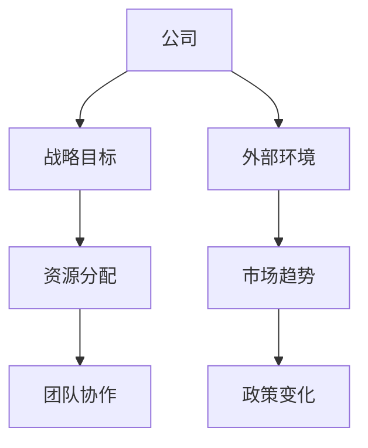
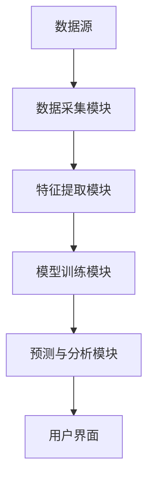
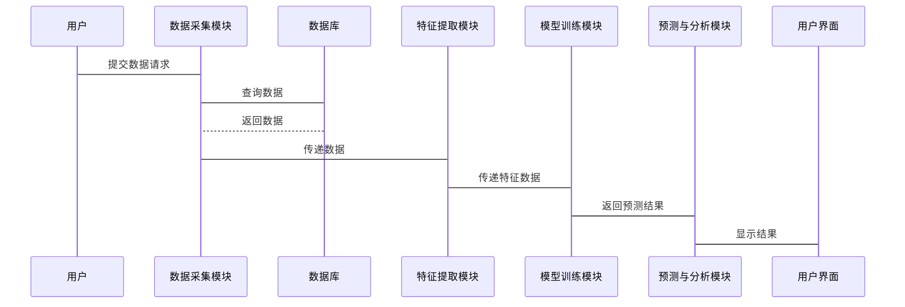

                 


# 深度学习预测公司战略转型成功率

## 关键词：深度学习，战略转型，公司成功率，预测模型，LSTM，机器学习，数据驱动决策

## 摘要：  
本文通过深度学习技术，探讨如何预测公司战略转型的成功率。文章从战略转型的定义与挑战出发，结合深度学习的核心原理，详细分析了基于LSTM的预测模型的构建与优化方法。通过实际案例和系统架构设计，展示了如何利用深度学习技术帮助企业做出更明智的战略转型决策。文章最后总结了深度学习在战略转型预测中的优势与未来发展方向。

---

# 第1章: 战略转型成功率预测的背景与问题

## 1.1 战略转型的定义与挑战

### 1.1.1 战略转型的定义与核心要素  
战略转型是指企业在面对内外部环境变化时，对自身的业务模式、组织结构、运营方式等进行重大调整的过程。其核心要素包括目标设定、资源分配、团队协作和外部环境适应能力。  

### 1.1.2 战略转型中的常见失败原因  
- **目标不明确**：战略转型缺乏清晰的目标和方向。  
- **资源不足**：资金、技术或人力资源不足。  
- **执行不力**：管理层和员工的执行力不足。  
- **外部环境变化**：市场竞争加剧或政策变化影响转型效果。  

### 1.1.3 深度学习在战略转型中的应用潜力  
深度学习能够通过分析历史数据和市场趋势，预测战略转型的成功率，帮助企业提前制定应对策略。

---

## 1.2 公司战略转型成功率预测的必要性

### 1.2.1 企业战略转型的复杂性分析  
战略转型涉及多个部门和利益相关者，具有高度的不确定性和复杂性。  

### 1.2.2 成功率预测对企业价值的意义  
通过预测战略转型的成功率，企业可以优化资源分配，降低转型失败的风险，提高整体竞争力。  

### 1.2.3 深度学习在预测中的独特优势  
深度学习能够处理非线性关系和复杂数据模式，适用于高度动态和不确定的商业环境。

---

## 1.3 深度学习与战略转型预测的结合

### 1.3.1 深度学习的核心原理  
深度学习通过多层神经网络，从数据中自动提取特征，适用于复杂模式的识别和预测。  

### 1.3.2 战略转型数据的特征与挑战  
战略转型数据通常具有非线性、时序性和多维性的特点，且数据质量和完整性可能存在问题。  

### 1.3.3 深度学习在战略转型预测中的优势  
- **非线性关系建模**：深度学习能够捕捉复杂的数据关系。  
- **自动特征提取**：无需手动提取特征，减少人为误差。  
- **实时预测能力**：适用于动态变化的商业环境。

---

# 第2章: 深度学习预测模型的核心概念与联系

## 2.1 深度学习模型的基本原理

### 2.1.1 神经网络的基本结构  
神经网络由输入层、隐藏层和输出层组成，通过权重调整和激活函数实现信息处理。  

### 2.1.2 深度学习与传统机器学习的对比  
| 特性          | 深度学习                | 传统机器学习          |  
|---------------|-------------------------|-----------------------|  
| 模型复杂性     | 高                     | 低                   |  
| 特征工程      | 自动提取                | 需手动提取            |  
| 数据需求      | 需大量数据              | 数据量相对较小        |  

### 2.1.3 深度学习的核心算法  
- **LSTM**：适用于时序数据的预测。  
- **CNN**：适用于图像和文本数据的处理。  

---

## 2.2 战略转型预测的核心要素

### 2.2.1 公司内部因素  
- 财务状况  
- 组织结构  
- 团队能力  

### 2.2.2 外部环境因素  
- 市场趋势  
- 竞争环境  
- 政策变化  

### 2.2.3 战略转型的阶段划分与特征提取  
- **阶段划分**：转型通常分为准备阶段、执行阶段和整合阶段。  
- **特征提取**：包括战略目标、资源分配、团队协作等指标。

---

## 2.3 深度学习模型与战略转型预测的联系

### 2.3.1 深度学习模型的输入与输出  
- **输入**：公司内外部数据（如财务数据、市场数据）。  
- **输出**：战略转型的成功率预测值。  

### 2.3.2 战略转型数据的特征工程  
- 数据清洗与预处理  
- 特征选择与降维  

### 2.3.3 深度学习模型的可解释性问题  
- 深度学习模型通常被视为“黑箱”，难以解释具体预测原因。

---

## 2.4 战略转型预测的实体关系图



---

# 第3章: 深度学习预测模型的算法原理

## 3.1 基于LSTM的时序预测模型

### 3.1.1 LSTM的基本结构与工作原理  
LSTM通过遗忘门、输入门和输出门实现时序数据的建模。  

### 3.1.2 LSTM在战略转型预测中的应用  
LSTM适用于具有时序性的战略转型数据，能够捕捉时间依赖性特征。

### 3.1.3 LSTM模型的训练与优化  
- **模型训练**：使用历史数据训练LSTM模型。  
- **超参数优化**：调整学习率、批量大小等参数。  

---

## 3.2 深度学习模型的数学公式

### 3.2.1 LSTM的核心公式  
- 遗忘门：$f_t = \sigma(W_f \cdot [h_{t-1}, x_t] + b_f)$  
- 输入门：$i_t = \sigma(W_i \cdot [h_{t-1}, x_t] + b_i)$  
- 输出门：$o_t = \sigma(W_o \cdot [h_{t-1}, x_t] + b_o)$  
- 隐状态：$h_t = o_t \cdot \cosh(W_c \cdot [h_{t-1}, x_t] + b_c)$  

---

## 3.3 深度学习模型的代码实现

### 3.3.1 环境安装  
```bash
pip install tensorflow pandas numpy
```

### 3.3.2 核心代码实现  
```python
import tensorflow as tf
from tensorflow.keras.layers import LSTM, Dense, Dropout
from tensorflow.keras.models import Sequential

# 模型构建
model = Sequential()
model.add(LSTM(64, input_shape=(timesteps, features)))
model.add(Dropout(0.2))
model.add(Dense(1, activation='sigmoid'))

# 模型编译
model.compile(loss='binary_crossentropy', optimizer='adam', metrics=['accuracy'])

# 模型训练
model.fit(X_train, y_train, epochs=10, batch_size=32)
```

---

## 3.4 深度学习模型的性能评估

### 3.4.1 模型评估指标  
- 准确率  
- 召回率  
- F1分数  

### 3.4.2 模型调优  
- 调整神经网络层数和节点数。  
- 改变学习率和批量大小。  

---

# 第4章: 深度学习预测模型的系统分析与架构设计

## 4.1 问题场景介绍  
企业需要预测战略转型的成功率，以便优化资源分配和制定应对策略。

## 4.2 系统功能设计

### 4.2.1 数据采集模块  
- 从数据库中提取公司内外部数据。  

### 4.2.2 特征提取模块  
- 对数据进行清洗和特征工程。  

### 4.2.3 模型训练模块  
- 使用深度学习模型训练预测模型。  

### 4.2.4 预测与分析模块  
- 输出战略转型成功率预测结果，并提供可视化分析。

---

## 4.3 系统架构设计

### 4.3.1 系统架构图  


---

## 4.4 系统接口设计  
- 数据接口：与数据库交互。  
- 模型接口：与训练模块交互。  

---

## 4.5 系统交互流程图  



---

# 第5章: 深度学习预测模型的项目实战

## 5.1 环境安装  
```bash
pip install tensorflow pandas numpy scikit-learn
```

---

## 5.2 系统核心实现

### 5.2.1 数据预处理  
```python
import pandas as pd
import numpy as np

# 数据加载
data = pd.read_csv('strategic_transformation.csv')

# 数据清洗
data.dropna(inplace=True)
data = data.iloc[:100]  # 取前100条数据
```

### 5.2.2 模型训练  
```python
from sklearn.model_selection import train_test_split
from tensorflow.keras.models import Sequential
from tensorflow.keras.layers import LSTM, Dense, Dropout

# 数据分割
X = data.drop('success_rate', axis=1).values
y = data['success_rate'].values

X_train, X_test, y_train, y_test = train_test_split(X, y, test_size=0.2)

# 模型构建
model = Sequential()
model.add(LSTM(64, input_shape=(X_train.shape[1], 1)))
model.add(Dropout(0.2))
model.add(Dense(1, activation='sigmoid'))

# 模型编译
model.compile(loss='binary_crossentropy', optimizer='adam', metrics=['accuracy'])

# 模型训练
model.fit(X_train, y_train, epochs=10, batch_size=32)
```

---

## 5.3 代码应用解读与分析  
- **数据预处理**：加载数据并进行清洗。  
- **模型训练**：构建LSTM模型并进行训练。  
- **预测与评估**：使用测试数据评估模型性能。

---

## 5.4 实际案例分析  
假设某公司转型数据如下：  
```python
test_data = np.array([[100, 200, 300]])
prediction = model.predict(test_data)
print(prediction)
```

---

## 5.5 项目小结  
通过深度学习模型，我们可以有效地预测公司战略转型的成功率，为企业制定科学的转型策略提供支持。

---

# 第6章: 深度学习预测模型的最佳实践

## 6.1 小结  
深度学习在战略转型成功率预测中具有独特优势，能够帮助企业优化资源分配和降低转型风险。

## 6.2 注意事项  
- 数据质量是模型性能的关键。  
- 模型调优需要结合实际业务需求。  
- 深度学习模型的可解释性问题需要注意。  

## 6.3 拓展阅读  
- 《Deep Learning》——Ian Goodfellow  
- 《机器学习实战》——周志华  

---

# 结语  
通过本文的深入分析与实践，我们展示了如何利用深度学习技术预测公司战略转型的成功率，为企业制定更明智的转型决策提供了理论依据和实践指导。

---

# 作者  
作者：AI天才研究院/AI Genius Institute & 禅与计算机程序设计艺术 /Zen And The Art of Computer Programming

