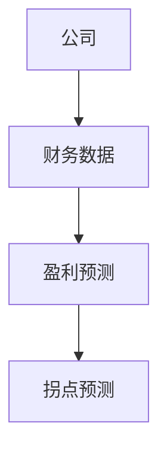
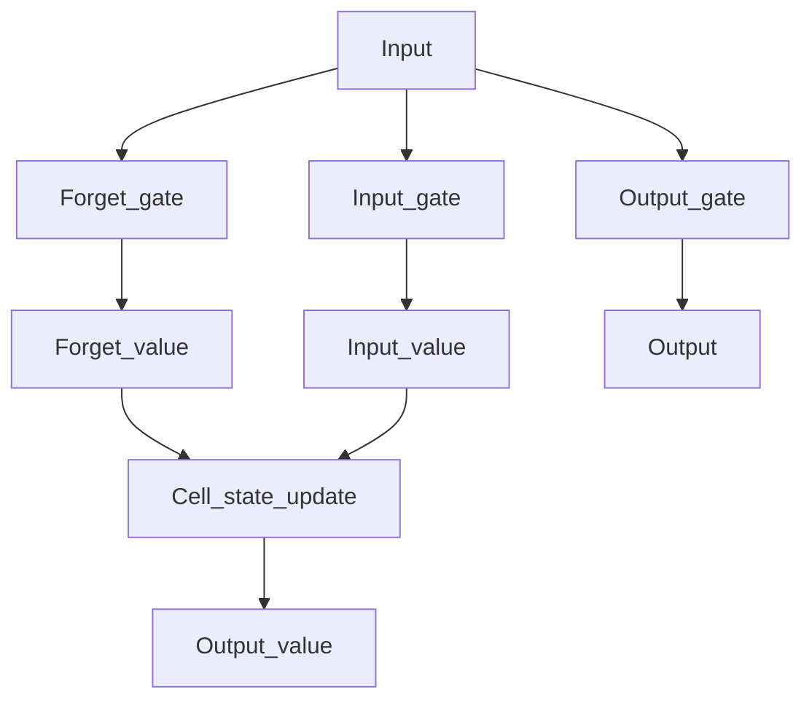
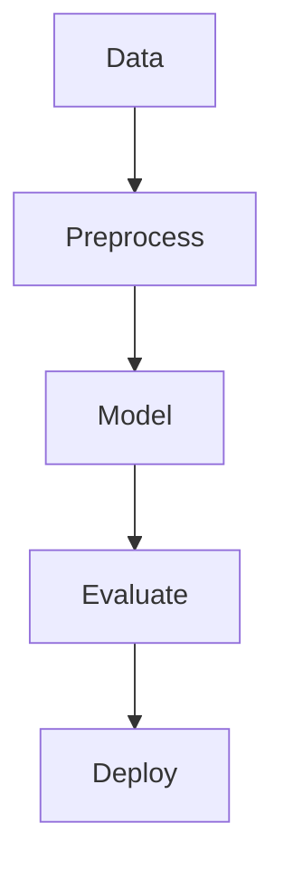
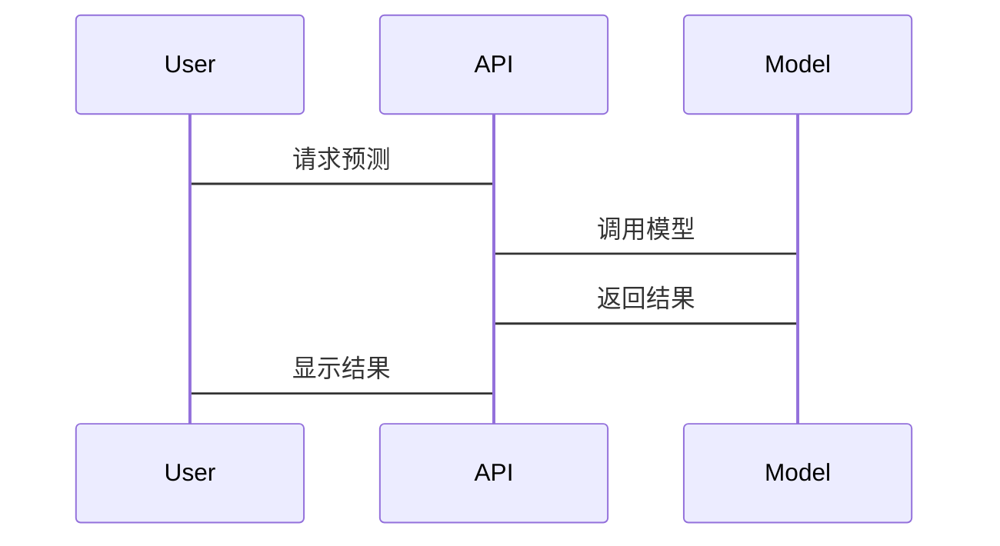

                 


# 深度学习预测公司盈利拐点时机

## 关键词：深度学习，盈利拐点，LSTM，时间序列分析，预测模型

## 摘要：本文探讨如何利用深度学习技术，特别是LSTM模型，预测公司盈利拐点。通过分析财务数据和市场趋势，构建数学模型，设计系统架构，并结合实际案例，详细阐述深度学习在预测中的应用。

---

# 第一章：背景介绍

## 1.1 盈利拐点的定义与重要性

### 1.1.1 盈利拐点的定义

盈利拐点是指公司从亏损到盈利或从盈利到亏损转变的关键时间点。准确预测拐点，可以帮助企业及时调整战略，抓住市场机遇或规避风险。

### 1.1.2 盈利拐点对企业战略的意义

- 提前识别市场变化，优化资源配置。
- 避免重大经济损失，抓住增长机会。
- 帮助投资者做出更明智的决策。

### 1.1.3 深度学习在预测中的作用

深度学习擅长处理复杂数据模式，适用于时间序列分析，能够捕捉非线性关系，提高预测准确性。

## 1.2 深度学习的基本概念

### 1.2.1 深度学习的定义

深度学习是一种通过多层非线性变换模拟数据处理的机器学习方法，常用于图像识别、自然语言处理等领域。

### 1.2.2 深度学习的核心特点

- 多层非线性变换
- 自动特征提取
- 高容错性

### 1.2.3 深度学习与传统机器学习的区别

| 特性 | 深度学习 | 传统机器学习 |
|------|----------|---------------|
| 特征提取 | 自动       | 手动         |
| 模型复杂度 | 高        | 较低         |
| 数据需求 | 大量      | 较少         |

---

# 第二章：核心概念与联系

## 2.1 相关模型原理

### 2.1.1 LSTM网络结构

LSTM通过细胞状态和门控机制处理长期依赖关系，适合时间序列数据。

### 2.1.2 Transformer模型

基于自注意力机制，适用于捕捉全局模式，但计算复杂度较高。

### 2.1.3 模型选择

| 模型 | 优点 | 缺点 |
|------|------|------|
| LSTM | 处理序列数据能力强 | 易遗忘近期信息 |
| Transformer | 并行计算高效 | 参数量大 |

## 2.2 模型对比分析

### 2.2.1 对比表格

| 模型 | 参数量 | 适用场景 | 优缺点 |
|------|--------|-----------|--------|
| LSTM | 中等    | 时间序列 | 易遗忘 |
| Transformer | 高     | 全局模式 | 计算复杂 |

### 2.2.2 ER实体关系图



---

# 第三章：LSTM网络原理

## 3.1 LSTM结构解析

### 3.1.1 细胞状态更新

细胞状态 $$ c_t $$ 表示长期信息，通过遗忘门控制保留或遗忘。

### 3.1.2 门控机制

- 遗忘门 $$ f_t $$：决定遗忘哪些信息。
- 输入门 $$ i_t $$：决定输入哪些信息。
- 输出门 $$ o_t $$：决定输出哪些信息。

## 3.2 LSTM流程图



---

# 第四章：数学模型与公式

## 4.1 LSTM公式

- 遗忘门：$$ f_t = \sigma(W_f x_t + U_f h_{t-1}) $$
- 输入门：$$ i_t = \sigma(W_i x_t + U_i h_{t-1}) $$
- 细胞状态更新：$$ c_t = f_t \cdot c_{t-1} + i_t \cdot tanh(W_c x_t + U_c h_{t-1}) $$
- 输出门：$$ o_t = \sigma(W_o x_t + U_o h_{t-1}) $$
- 输出：$$ h_t = o_t \cdot tanh(c_t) $$

---

# 第五章：系统架构设计

## 5.1 系统架构图



## 5.2 接口设计

- 输入接口：接收财务数据。
- 输出接口：返回预测结果。

## 5.3 交互流程图



---

# 第六章：项目实战

## 6.1 环境安装

```bash
pip install tensorflow pandas numpy
```

## 6.2 核心代码实现

```python
import tensorflow as tf
import pandas as pd
import numpy as np

# 数据加载
data = pd.read_csv('financial_data.csv')

# 数据预处理
# 更多预处理代码...

# 模型构建
model = tf.keras.Sequential([
    tf.keras.layers.LSTM(64, return_sequences=True),
    tf.keras.layers.Dropout(0.2),
    tf.keras.layers.LSTM(32),
    tf.keras.layers.Dense(1)
])

# 编译模型
model.compile(loss='mean_squared_error', optimizer='adam')

# 训练模型
model.fit(x_train, y_train, epochs=10, batch_size=32)
```

## 6.3 案例分析

以苹果公司为例，使用其股价数据训练模型，预测盈利拐点。

---

# 第七章：最佳实践与小结

## 7.1 注意事项

- 数据清洗：处理缺失值和异常值。
- 特征选择：选取相关性高的特征。
- 模型调优：调整超参数和优化算法。

## 7.2 小结

深度学习，尤其是LSTM模型，在预测公司盈利拐点方面表现出色，但需要结合业务知识和数据特征，才能达到最佳效果。

---

# 作者：AI天才研究院 & 禅与计算机程序设计艺术

