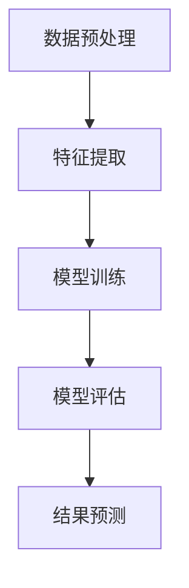
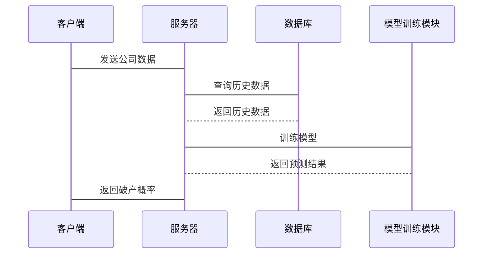

                 


# 深度学习预测公司破产风险概率

> 关键词：深度学习，公司破产，风险预测，LSTM，CNN，数学模型

> 摘要：本文将深入探讨如何利用深度学习技术，特别是LSTM和CNN模型，来预测公司破产风险概率。文章将从背景介绍、核心概念、算法原理、系统架构到项目实战，逐步分析，帮助读者全面理解并掌握这一技术。

---

# 第一部分: 公司破产风险预测的背景与挑战

## 第1章: 研究背景与问题描述

### 1.1 研究背景

#### 1.1.1 研究背景概述
公司破产是企业生命周期中的一个重要转折点，准确预测破产风险可以帮助企业和投资者做出更明智的决策。然而，传统的统计方法在处理复杂金融数据时存在局限性，深度学习的引入为这一领域带来了新的可能性。

#### 1.1.2 研究意义与价值
- 提高预测准确性，降低企业风险。
- 为投资者提供更可靠的决策依据。
- 推动深度学习在金融领域的应用。

#### 1.1.3 当前研究现状与不足
- 现有研究多依赖传统统计模型，如逻辑回归。
- 数据复杂性高，传统方法难以捕捉非线性关系。
- 深度学习在破产预测中的应用尚未得到充分探索。

### 1.2 问题描述

#### 1.2.1 研究目标
构建一个基于深度学习的模型，准确预测公司破产风险概率。

#### 1.2.2 研究问题的边界与外延
- 边界：仅考虑财务和经营指标。
- 外延：未来可能扩展到其他因素，如市场环境。

#### 1.2.3 核心问题的分解与分析
- 数据特征提取。
- 模型选择与优化。
- 预测结果的解释与应用。

## 第2章: 破产风险预测的核心概念与联系

### 2.1 核心概念与原理

#### 2.1.1 数据特征与属性分析
- 财务指标：如资产负债率、净利润率。
- 经营指标：如收入增长率、市场占有率。
- 偿债指标：如流动比率、速动比率。

#### 2.1.2 深度学习模型的基本原理
- 神经网络的基本结构：输入层、隐藏层、输出层。
- 深度学习的优势：非线性特征提取能力强。

#### 2.1.3 破产风险预测的数学模型框架
- 数据预处理：标准化、缺失值处理。
- 模型训练：使用训练数据拟合模型。
- 模型评估：准确率、召回率、F1分数。

### 2.2 核心概念的属性特征对比

#### 2.2.1 数据特征的属性对比表格
| 数据特征       | 描述                         | 对破产预测的影响 |
|----------------|------------------------------|------------------|
| 资产负债率      | 负债与资产的比率             | 高比率可能预示风险 |
| 净利润率        | 利润与收入的比率             | 低利润率可能增加破产风险 |
| 流动比率        | 流动资产与流动负债的比率       | 低比率可能无法偿还短期债务 |

#### 2.2.2 模型性能的对比分析
- 准确率：模型预测的准确性。
- 召回率：模型预测为破产的准确率。
- F1分数：综合准确率和召回率的指标。

#### 2.2.3 实验结果的对比与优化
- 对比不同模型的性能，选择最优模型。
- 调整超参数，优化模型性能。

### 2.3 ER实体关系图与流程图

#### 2.3.1 数据模型的ER图
```mermaid
er
  entity 破产公司数据 {
    key: 公司ID
    attribute: 财务指标, 经营指标, 偿债指标
  }
  entity 预测结果 {
    key: 预测ID
    attribute: 破产概率, 预测时间
  }
  破产公司数据 --> 预测结果: 预测结果基于破产公司数据
```

#### 2.3.2 算法流程图


---

# 第二部分: 深度学习算法原理与实现

## 第3章: 深度学习模型的选择与优化

### 3.1 深度学习模型的基本原理

#### 3.1.1 神经网络的数学基础
- 神经元模型：感知机。
- 激活函数：如ReLU、sigmoid。
- 损失函数：如交叉熵损失。

#### 3.1.2 深度学习模型的训练过程
- 前向传播：输入数据，计算输出。
- 后向传播：计算梯度，更新参数。

#### 3.1.3 模型的过拟合与欠拟合问题
- 过拟合：模型在训练数据上表现好，但泛化能力差。
- 欠拟合：模型无法有效捕捉数据特征。

### 3.2 常用深度学习模型的比较

#### 3.2.1 LSTM网络的结构与特点
- 长短期记忆网络，适合处理序列数据。
- 结构：输入门、遗忘门、输出门。

#### 3.2.2 CNN网络的结构与特点
- 卷积神经网络，适合处理图像数据。
- 卷积核、池化层。

#### 3.2.3 RNN网络的结构与特点
- 循环神经网络，适合处理序列数据。
- 长期依赖问题。

### 3.3 模型优化与调参

#### 3.3.1 超参数的选择与优化
- 学习率：如0.001。
- 隐藏层层数：如2层。
- 批大小：如64。

#### 3.3.2 模型的正则化方法
- L2正则化：防止过拟合。
- 早停：监控验证集损失。

#### 3.3.3 模型的加速与并行化
- 使用GPU加速。
- 并行训练。

## 第4章: 破产风险预测的数学模型与公式

### 4.1 破产风险预测的数学模型
- 模型输入：公司财务指标。
- 模型输出：破产概率。

#### 4.1.1 损失函数
$$ \text{损失函数} = -\frac{1}{N}\sum_{i=1}^{N} [y_i \ln(p_i) + (1-y_i)\ln(1-p_i)] $$
其中，$y_i$是真实标签，$p_i$是预测概率。

#### 4.1.2 优化器
$$ \text{Adam优化器} $$

#### 4.1.3 模型结构
- LSTM网络结构：输入层→隐藏层→输出层。

---

# 第三部分: 系统分析与架构设计方案

## 第5章: 系统分析与架构设计

### 5.1 问题场景介绍
- 数据来源：公司财务报表。
- 业务目标：预测破产风险。

### 5.2 系统功能设计

#### 5.2.1 领域模型


#### 5.2.2 系统架构设计


#### 5.2.3 系统接口设计
- 输入接口：接收公司数据。
- 输出接口：返回破产概率。

#### 5.2.4 系统交互流程图


---

# 第四部分: 项目实战

## 第6章: 项目实战

### 6.1 环境安装与配置

#### 6.1.1 安装Python
```bash
python --version
```

#### 6.1.2 安装深度学习库
```bash
pip install tensorflow keras matplotlib
```

### 6.2 系统核心实现源代码

#### 6.2.1 数据预处理
```python
import pandas as pd
from sklearn.preprocessing import StandardScaler

# 加载数据
data = pd.read_csv('company_data.csv')

# 分离特征和标签
X = data.drop('bankruptcy', axis=1)
y = data['bankruptcy']

# 标准化
scaler = StandardScaler()
X_scaled = scaler.fit_transform(X)
```

#### 6.2.2 构建LSTM模型
```python
from tensorflow.keras.models import Sequential
from tensorflow.keras.layers import LSTM, Dense, Dropout

model = Sequential()
model.add(LSTM(64, input_shape=(X_scaled.shape[1], 1)))
model.add(Dropout(0.5))
model.add(Dense(1, activation='sigmoid'))
model.compile(loss='binary_crossentropy', optimizer='adam', metrics=['accuracy'])
```

#### 6.2.3 训练模型
```python
model.fit(X_scaled, y, epochs=10, batch_size=64, validation_split=0.2)
```

#### 6.2.4 评估模型
```python
score = model.evaluate(X_scaled, y)
print('Accuracy:', score[1])
```

### 6.3 案例分析与详细解读

#### 6.3.1 数据可视化
```python
import matplotlib.pyplot as plt

plt.hist(y, bins=2)
plt.show()
```

#### 6.3.2 模型预测
```python
 predictions = model.predict(X_scaled)
```

---

# 第五部分: 最佳实践与总结

## 第7章: 最佳实践与总结

### 7.1 小结
- 深度学习在破产预测中的应用潜力巨大。
- LSTM模型表现优于传统方法。

### 7.2 注意事项
- 数据质量影响模型性能。
- 模型部署需考虑计算资源。

### 7.3 拓展阅读
- 《深度学习》——伊恩·格雷厄姆
- 《Python机器学习》——阿斯马·巴塔

---

作者：AI天才研究院/AI Genius Institute & 禅与计算机程序设计艺术 /Zen And The Art of Computer Programming

