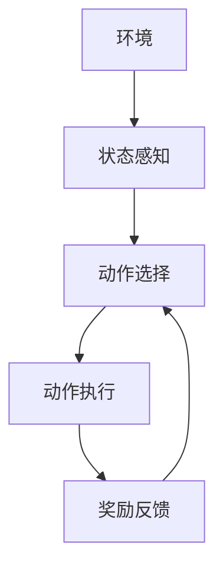

                 


# 深度强化学习在AI Agent决策优化中的应用

## 关键词

- 深度强化学习
- AI Agent
- 决策优化
- 强化学习算法
- 系统设计

## 摘要

深度强化学习（Deep Reinforcement Learning，DRL）作为一种结合了深度学习和强化学习的先进AI技术，近年来在AI Agent的决策优化中得到了广泛应用。本文将从理论基础、算法原理、系统设计和项目实战四个方面，详细探讨深度强化学习在AI Agent决策优化中的应用。通过分析DQN、Actor-Critic等核心算法，结合实际案例，阐述如何利用深度强化学习提升AI Agent的决策能力。本文旨在为读者提供一个全面而深入的视角，帮助理解并掌握深度强化学习在AI Agent中的应用技巧。

---

# 第一部分：深度强化学习与AI Agent决策优化基础

## 第1章：深度强化学习概述

### 1.1 深度强化学习的基本概念

#### 1.1.1 什么是深度强化学习
深度强化学习（Deep Reinforcement Learning）是人工智能领域的一个重要分支，它结合了深度学习和强化学习的优势。通过深度神经网络来逼近最优策略，强化学习通过与环境的交互获得经验，并基于奖励机制优化策略。

深度强化学习的核心在于通过大量与环境的交互，学习如何在复杂环境中做出最优决策。与传统的强化学习相比，深度强化学习引入了深度神经网络，能够处理高维、非结构化的输入数据，如图像、语音和文本等。

$$ V(s) = \argmax_a Q(s,a) $$

#### 1.1.2 强化学习的核心概念
在强化学习中，智能体通过与环境交互，获得奖励或惩罚，从而学习如何做出最优决策。强化学习的核心概念包括：

1. **状态（State）**：环境在某一时刻的描述。
2. **动作（Action）**：智能体在某一状态下做出的决策。
3. **奖励（Reward）**：智能体在某一状态下采取某动作后，环境给予的反馈。
4. **策略（Policy）**：智能体在某一状态下选择动作的概率分布。
5. **价值函数（Value Function）**：衡量某个状态或动作对目标的价值。

$$ R(s, a) = \text{奖励函数} $$

#### 1.1.3 深度强化学习的独特优势
深度强化学习结合了深度学习强大的特征提取能力和强化学习的决策优化能力，能够在复杂动态环境中实现端到端的学习和决策。其独特优势包括：

1. **处理高维状态空间**：深度神经网络能够有效处理图像、语音等高维输入。
2. **端到端学习**：从原始输入直接学习最优策略，无需手动设计特征。
3. **自适应性**：能够根据环境变化动态调整策略，适应复杂场景。

---

### 1.2 AI Agent的基本概念与分类

#### 1.2.1 什么是AI Agent
AI Agent（智能体）是指能够感知环境、做出决策并采取行动以实现目标的智能系统。AI Agent可以是软件程序、机器人或其他智能系统，广泛应用于自动驾驶、游戏AI、推荐系统等领域。

#### 1.2.2 AI Agent的分类与应用场景
AI Agent可以根据功能和智能水平分为以下几类：

1. **反应式AI Agent**：基于当前感知做出实时反应，适用于实时决策场景。
2. **认知式AI Agent**：具备复杂推理和规划能力，适用于需要长期策略的场景。
3. **学习型AI Agent**：能够通过经验改进决策能力，适用于动态变化的环境。

#### 1.2.3 AI Agent与传统AI的区别
AI Agent的核心在于其自主决策和交互能力，与传统AI（如专家系统）相比，AI Agent具备以下特点：

1. **自主性**：能够自主感知环境并做出决策。
2. **反应性**：能够实时响应环境变化。
3. **目标导向性**：通过目标驱动优化决策。

---

### 1.3 深度强化学习在AI Agent中的应用背景

#### 1.3.1 AI Agent决策优化的必要性
在复杂动态环境中，传统的基于规则的决策方法难以应对不确定性，而深度强化学习通过端到端学习和经验积累，能够有效优化AI Agent的决策能力。

#### 1.3.2 深度强化学习在决策优化中的优势
深度强化学习能够处理非结构化数据、动态变化的环境，并通过大量交互优化决策策略。其优势包括：

1. **端到端学习**：直接从原始输入学习最优策略。
2. **动态适应性**：能够根据环境变化自适应调整策略。
3. **复杂场景处理**：适用于高维、非线性问题。

#### 1.3.3 当前研究与应用现状
当前，深度强化学习在AI Agent中的应用研究主要集中在以下几个方面：

1. **游戏AI**：如AlphaGo、AlphaStar等，已经在复杂游戏中展现了强大的决策能力。
2. **机器人控制**：在自动驾驶、机器人导航等领域，深度强化学习已经取得显著成果。
3. **推荐系统**：通过强化学习优化用户推荐策略，提升用户体验。

---

## 第2章：深度强化学习的核心概念与原理

### 2.1 强化学习的基本原理

#### 2.1.1 Q-learning算法的数学模型
Q-learning是一种经典的强化学习算法，其核心思想是通过Q值表记录每个状态-动作对的期望奖励值，并通过策略迭代优化Q值。

$$ Q(s, a) = Q(s, a) + \alpha (r + \gamma \max Q(s', a') - Q(s, a)) $$

其中：
- $\alpha$ 为学习率
- $\gamma$ 为折扣因子
- $r$ 为奖励

#### 2.1.2 策略梯度方法的原理
策略梯度方法通过优化策略直接获得梯度信息，适用于参数化策略的优化问题。

$$ \nabla J = \mathbb{E}[ \nabla \log \pi(a|s) Q(s,a) ] $$

其中：
- $\pi(a|s)$ 为策略函数
- $Q(s,a)$ 为价值函数

#### 2.1.3 Actor-Critic架构的原理
Actor-Critic架构将策略优化和价值评估结合起来，通过同时优化动作策略和价值函数，实现更好的决策效果。

$$ L = J_{actor} + J_{critic} $$

其中：
- $J_{actor}$ 为策略优化目标
- $J_{critic}$ 为价值评估目标

---

### 2.2 深度强化学习的算法框架

#### 2.2.1 DQN算法的结构与流程
DQN（Deep Q-Network）是深度强化学习的经典算法，通过使用深度神经网络近似Q值函数，实现端到端的决策优化。

1. **经验回放**：通过存储和重放经验，打破时序依赖，加速学习。
2. **双网络结构**：使用两个网络分别作为当前网络和目标网络，减少近似误差。

#### 2.2.2 Actor-Critic架构的实现
Actor-Critic架构通过同时优化策略和价值函数，实现更好的决策效果。其核心步骤包括：

1. **动作选择**：根据策略网络选择动作。
2. **价值评估**：根据价值网络评估状态-动作对的价值。
3. **梯度更新**：根据梯度信息更新策略网络和价值网络。

#### 2.2.3 A2C、PPO等算法的对比分析
不同的算法在实现细节和优化策略上有所不同。例如，A2C算法通过异步更新加速训练，而PPO算法通过约束优化避免策略崩溃。

---

### 2.3 深度强化学习的核心数学模型

#### 2.3.1 Q-learning的数学公式
$$ Q(s, a) = Q(s, a) + \alpha (r + \gamma \max Q(s', a') - Q(s, a)) $$

#### 2.3.2 策略梯度的数学推导
$$ \nabla J = \mathbb{E}[ \nabla \log \pi(a|s) Q(s,a) ] $$

#### 2.3.3 Actor-Critic联合优化的数学表达
$$ L = J_{actor} + J_{critic} $$

---

## 第3章：深度强化学习在AI Agent中的系统设计与实现

### 3.1 系统架构设计

#### 3.1.1 系统功能设计
AI Agent的决策系统通常包括以下几个核心功能：

1. **状态感知**：通过传感器或API获取环境状态。
2. **动作选择**：根据当前状态选择最优动作。
3. **奖励反馈**：根据动作结果获取奖励信息。
4. **策略优化**：通过强化学习算法优化策略。

#### 3.1.2 系统架构图（Mermaid）


---

### 3.2 系统实现细节

#### 3.2.1 环境接口设计
AI Agent需要与环境进行交互，环境接口需要定义清晰的状态、动作和奖励关系。

#### 3.2.2 神经网络模型设计
深度强化学习算法的核心是神经网络模型的设计，包括网络结构、激活函数、损失函数等。

#### 3.2.3 训练与推理流程
1. **训练流程**：通过与环境交互，更新神经网络参数，优化策略。
2. **推理流程**：根据当前状态，选择最优动作，输出决策。

---

## 第4章：深度强化学习在AI Agent中的项目实战

### 4.1 项目背景与目标
本项目旨在通过深度强化学习优化一个AI Agent的决策能力，使其能够在复杂环境中实现最优决策。

### 4.2 核心代码实现

#### 4.2.1 环境接口实现
```python
class Environment:
    def get_state(self):
        # 返回当前环境状态
        pass

    def take_action(self, action):
        # 执行动作，返回新状态和奖励
        pass
```

#### 4.2.2 策略网络实现
```python
class PolicyNetwork:
    def __init__(self):
        # 网络结构定义
        pass

    def forward(self, state):
        # 前向传播，返回动作概率分布
        pass
```

### 4.3 代码解读与分析
1. **环境接口**：定义了AI Agent与环境交互的接口，实现具体的环境逻辑。
2. **策略网络**：负责根据当前状态生成动作概率分布，指导AI Agent做出决策。

### 4.4 实际案例分析
通过具体案例分析，展示深度强化学习在AI Agent中的实际应用效果，以及如何通过优化算法和系统设计提升决策能力。

---

## 第5章：总结与展望

### 5.1 总结
本文详细探讨了深度强化学习在AI Agent决策优化中的应用，从理论基础到系统设计，再到项目实战，全面分析了深度强化学习的优势和实现方法。

### 5.2 展望
未来，随着深度强化学习技术的不断发展，AI Agent的决策能力将更加智能化和高效化。同时，如何处理复杂环境中的不确定性，如何实现多智能体协作决策，将是深度强化学习研究的重要方向。

---

## 作者信息

作者：AI天才研究院/AI Genius Institute & 禅与计算机程序设计艺术 /Zen And The Art of Computer Programming

---

通过以上目录和内容设计，我们可以系统地探讨深度强化学习在AI Agent决策优化中的应用，从理论到实践，帮助读者全面理解并掌握相关技术。

