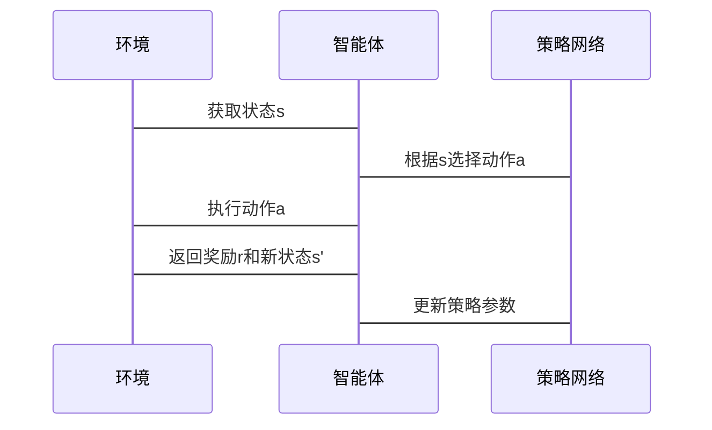

                 


# 深度强化学习在AI Agent策略优化中的应用

> 关键词：深度强化学习, AI Agent, 策略优化, 算法原理, 实战应用

> 摘要：本文系统地探讨了深度强化学习在AI Agent策略优化中的应用。从基本概念到核心算法，再到系统设计与实战案例，全面分析了深度强化学习如何提升AI Agent的决策能力和策略优化效果。通过详细讲解DQN、PG等算法原理，并结合实际项目案例，展示了深度强化学习在AI Agent中的广泛应用和优化策略。

---

## 第一部分: 深度强化学习与AI Agent概述

### 第1章: 深度强化学习与AI Agent的基本概念

#### 1.1 深度强化学习的定义与特点
深度强化学习（Deep Reinforcement Learning, DRL）是人工智能领域的重要分支，结合了深度学习和强化学习的优势，能够在复杂环境中优化决策策略。

- **强化学习**：通过智能体与环境的交互，逐步优化策略以最大化累积奖励。
- **深度学习**：利用神经网络处理高维复杂数据，提取特征并进行分类或预测。
- **深度强化学习**：将深度学习应用于强化学习，通过神经网络直接逼近最优策略或价值函数。

**特点**：
1. **端到端学习**：直接从输入到输出，无需手动设计特征。
2. **自适应性**：能够在动态环境中调整策略。
3. **高维度处理**：能够处理高维状态和动作空间。

#### 1.2 AI Agent的定义与分类
AI Agent（智能体）是指在环境中能够感知并自主决策的实体。

- **感知**：通过传感器或接口获取环境信息。
- **决策**：基于感知信息，选择最优动作。
- **执行**：将决策动作执行，影响环境状态。

**分类**：
1. **基于规则的Agent**：依赖预定义规则进行决策。
2. **基于学习的Agent**：通过机器学习算法优化决策策略。
3. **基于模型的Agent**：利用环境模型进行规划和决策。

#### 1.3 深度强化学习在AI Agent中的作用
深度强化学习为AI Agent提供了强大的策略优化能力。

- **策略优化**：通过强化学习优化动作选择，提升决策质量。
- **复杂环境适应**：深度学习的强大表征能力使得AI Agent能够处理复杂环境。
- **端到端决策**：通过神经网络直接逼近最优策略，简化了传统强化学习的复杂性。

---

## 第二部分: 深度强化学习的核心概念与算法原理

### 第2章: 深度强化学习的核心概念

#### 2.1 状态、动作与奖励函数
在强化学习中，智能体通过与环境交互，感知状态，选择动作，并获得奖励。

- **状态（State）**：环境在某一时刻的描述。
- **动作（Action）**：智能体选择的行为。
- **奖励（Reward）**：智能体执行动作后获得的反馈，用于指导策略优化。

#### 2.2 策略与价值函数
- **策略（Policy）**：描述智能体在每个状态下选择动作的概率分布。
- **价值函数（Value Function）**：评估某状态下智能体采取某动作后的期望累积奖励。

#### 2.3 深度强化学习的核心算法
- **Q-learning**：通过值函数逼近最优策略。
- **Deep Q-Network (DQN)**：利用深度神经网络近似Q值函数。
- **Policy Gradient (PG)**：通过优化策略直接最大化累积奖励。

### 第3章: 深度强化学习的核心算法原理

#### 3.1 Q-learning算法的原理与实现
Q-learning通过更新Q表逼近最优策略。

- **数学模型**：
  $$ Q(s, a) \leftarrow Q(s, a) + \alpha [r + \max Q(s', a') - Q(s, a)] $$
- **实现步骤**：
  1. 初始化Q表。
  2. 选择动作并执行。
  3. 更新Q值。

#### 3.2 Deep Q-Network (DQN)算法的原理与实现
DQN通过神经网络近似Q值函数，解决高维状态空间问题。

- **数学模型**：
  $$ Q(s, a; \theta) \approx Q^*(s, a) $$
- **实现步骤**：
  1. 环境交互生成经验。
  2. 经验回放减少相关性。
  3. 神经网络更新参数。

#### 3.3 Policy Gradient (PG)算法的原理与实现
PG通过优化策略直接最大化累积奖励。

- **数学模型**：
  $$ \nabla \theta J(\theta) = \mathbb{E}[\nabla \log \pi(a|s) Q(s, a)] $$
- **实现步骤**：
  1. 初始化策略参数。
  2. 采样动作并执行。
  3. 更新策略参数。

---

## 第三部分: AI Agent的系统分析与架构设计

### 第3章: AI Agent的系统分析与架构设计

#### 3.1 系统功能设计
AI Agent系统需要具备以下功能：
1. 状态感知：通过传感器或接口获取环境信息。
2. 动作选择：基于当前状态选择最优动作。
3. 奖励反馈：根据动作效果获得奖励。
4. 策略优化：通过深度强化学习算法优化策略。

#### 3.2 系统架构设计
- **感知层**：负责与环境交互，获取状态信息。
- **决策层**：基于强化学习算法进行策略优化。
- **执行层**：将决策转化为具体动作。

#### 3.3 系统交互设计
通过Mermaid序列图展示系统交互流程。



---

## 第四部分: 项目实战：深度强化学习在AI Agent中的应用

### 第4章: 项目实战

#### 4.1 环境安装与配置
安装必要的库：
- Python 3.x
- TensorFlow或PyTorch
- OpenAI Gym

#### 4.2 系统核心实现源代码
以下是一个DQN算法的Python实现示例：

```python
import numpy as np
import gym
from collections import deque
import tensorflow as tf

class DQN:
    def __init__(self, state_space, action_space, learning_rate=0.01, gamma=0.99, epsilon=1.0):
        self.state_space = state_space
        self.action_space = action_space
        self.learning_rate = learning_rate
        self.gamma = gamma
        self.epsilon = epsilon
        self.memory = deque(maxlen=1000)
        self.model = self.build_model()

    def build_model(self):
        model = tf.keras.Sequential([
            tf.keras.layers.Dense(24, activation='relu', input_shape=(self.state_space,)),
            tf.keras.layers.Dense(self.action_space, activation='linear')
        ])
        model.compile(optimizer=tf.keras.optimizers.Adam(lr=self.learning_rate),
                      loss='mean_squared_error')
        return model

    def remember(self, state, action, reward, next_state):
        self.memory.append((state, action, reward, next_state))

    def act(self, state):
        if np.random.random() < self.epsilon:
            return np.random.randint(self.action_space)
        state = np.array([state])
        q = self.model.predict(state)
        return np.argmax(q[0])

    def replay(self, batch_size):
        if len(self.memory) < batch_size:
            return
        minibatch = np.random.choice(self.memory, batch_size)
        x = []
        y = []
        for memory in minibatch:
            state, action, reward, next_state = memory
            target = reward
            if not np.all(next_state == -1):
                target = reward + self.gamma * np.max(self.model.predict(np.array([next_state]))[0])
            target_vec = self.model.predict(np.array([state]))[0]
            target_vec[action] = target
            x.append(state)
            y.append(target_vec)
        self.model.fit(np.array(x), np.array(y), batch_size=batch_size, epochs=1, verbose=0)
```

#### 4.3 实际案例分析
以OpenAI Gym中的CartPole环境为例，展示DQN算法的应用。

- **环境描述**：智能体通过左右摆动杆子保持平衡。
- **状态空间**：4维（位置、速度、角度、角速度）。
- **动作空间**：2个动作（向左、向右）。
- **奖励函数**：每保持一次平衡获得1分，倒下扣分。

#### 4.4 代码实现与解读
1. 初始化DQN对象：
```python
env = gym.make('CartPole-v0')
dqn = DQN(4, 2)
```

2. 训练过程：
```python
EPISODES = 200
for episode in range(EPISODES):
    state = env.reset()
    total_reward = 0
    done = False
    while not done:
        action = dqn.act(state)
        next_state, reward, done, _ = env.step(action)
        dqn.remember(state, action, reward, next_state)
        dqn.replay(32)
        total_reward += reward
        state = next_state
    print(f"Episode {episode+1}, Reward: {total_reward}")
```

3. 测试过程：
```python
state = env.reset()
total_reward = 0
done = False
while not done:
    env.render()
    action = dqn.act(state)
    next_state, reward, done, _ = env.step(action)
    total_reward += reward
    state = next_state
print(f"Final Reward: {total_reward}")
```

---

## 第五部分: 总结与展望

### 第5章: 总结与展望

#### 5.1 本章总结
深度强化学习为AI Agent提供了强大的策略优化能力，能够在复杂环境中实现自主决策和优化。

#### 5.2 未来展望
1. **多智能体协作**：研究多个AI Agent协作的强化学习方法。
2. **复杂环境适应**：提升AI Agent在高维复杂环境中的适应能力。
3. **实时决策优化**：探索在线优化策略，提升实时决策效率。

---

## 作者：AI天才研究院 & 禅与计算机程序设计艺术

---

通过本文的详细讲解，读者可以系统地理解深度强化学习在AI Agent策略优化中的应用，从理论到实践都能有所收获。

