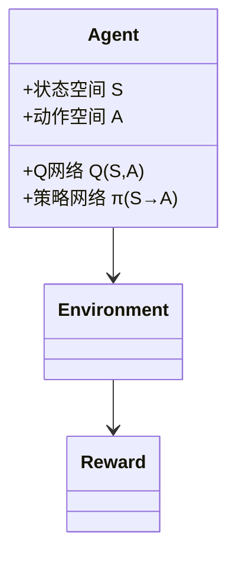
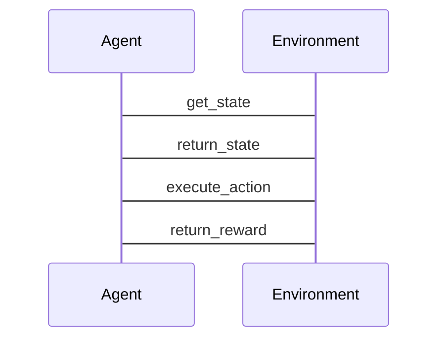

                 


```markdown
# 深度强化学习在AI Agent行为生成中的应用

> 关键词：深度强化学习、AI Agent、行为生成、强化学习、神经网络

> 摘要：本文深入探讨了深度强化学习（DRL）在AI Agent行为生成中的应用，从基础概念到高级算法，结合系统架构设计和项目实战，全面解析DRL的核心原理及其在实际场景中的应用。

---

## 第一部分: 深度强化学习基础

### 第1章: 深度强化学习概述

#### 1.1 强化学习的基本概念
##### 1.1.1 什么是强化学习
强化学习（Reinforcement Learning, RL）是一种机器学习范式，通过智能体与环境交互，学习最优策略以最大化累积奖励。与监督学习和无监督学习不同，RL强调通过试错和奖励机制来优化决策过程。

##### 1.1.2 强化学习的核心要素
- **状态（State）**：智能体所处环境的当前情况。
- **动作（Action）**：智能体在特定状态下采取的行为。
- **奖励（Reward）**：智能体执行动作后获得的反馈，用于指导学习。
- **策略（Policy）**：智能体选择动作的规则，决定如何从状态中选择动作。
- **值函数（Value Function）**：预测在特定状态下采取某个动作后的期望累积奖励。

##### 1.1.3 深度强化学习的定义与特点
深度强化学习（Deep Reinforcement Learning, DRL）是强化学习与深度学习的结合，通过深度神经网络来近似值函数或策略。其特点是：
- 高维度状态和动作空间的处理能力。
- 自动特征提取能力。
- 在复杂环境中实现端到端学习。

#### 1.2 强化学习的基本原理
##### 1.2.1 Q-learning算法简介
Q-learning是一种经典的强化学习算法，通过维护一个Q表，记录状态-动作对的期望奖励。公式为：
$$ Q(s, a) = Q(s, a) + \alpha [r + \max Q(s', a') - Q(s, a)] $$
其中，$\alpha$是学习率，$r$是即时奖励，$s'$是下一状态。

##### 1.2.2 Q-learning的数学模型
Q-learning的目标是找到使累积奖励最大的策略，即：
$$ \pi(s) = \arg\max_a Q(s, a) $$

##### 1.2.3 DQN算法
DQN（Deep Q-Network）将Q值函数用深度神经网络近似，通过经验回放和目标网络优化，稳定训练过程。

#### 1.3 深度强化学习在行为生成中的应用
##### 1.3.1 智能体行为生成的定义
智能体行为生成是指智能体根据环境状态，通过学习策略生成最优动作。

##### 1.3.2 深度强化学习的优势
- 自动学习策略。
- 处理高维复杂环境。
- 通过经验优化行为。

---

## 第二部分: 深度强化学习的核心算法

### 第2章: Q-learning算法
#### 2.1 Q-learning的基本原理
Q-learning通过更新Q表，逐步逼近最优策略。适用于离散动作空间。

#### 2.2 DQN算法
##### 2.2.1 DQN的算法流程
1. 环境交互，收集经验。
2. 通过经验回放训练神经网络。
3. 更新目标网络。

##### 2.2.2 DQN的网络结构
- 输入层：接收状态向量。
- 隐藏层：提取特征。
- 输出层：输出动作值。

##### 2.2.3 DQN的优缺点
优点：稳定、适用于复杂环境；缺点：需要大量数据，训练时间长。

### 第3章: 策略梯度方法
#### 3.1 策略梯度的基本原理
策略梯度直接优化策略，通过梯度上升更新参数，公式为：
$$ \theta = \theta + \alpha \nabla_\theta J(\theta) $$
其中，$J(\theta)$是策略的值函数。

#### 3.2 策略梯度的数学模型
- 策略函数：$\pi_\theta(a|s)$
- 值函数：$V_\theta(s)$

#### 3.3 策略梯度的实现步骤
1. 初始化参数。
2. 采样动作，与环境交互。
3. 计算梯度，更新参数。

---

## 第三部分: AI Agent行为生成的系统架构

### 第3章: 系统架构设计
#### 3.1 问题场景介绍
智能体在复杂环境中需要实时生成行为，要求系统具备高效的决策能力和快速的响应速度。

#### 3.2 系统功能设计
##### 3.2.1 领域模型


##### 3.2.2 系统架构
```mermaid
graph TD
    Agent --> [状态] Environment
    Environment --> [奖励] Agent
    Agent --> [动作] Environment
```

#### 3.3 系统实现
##### 3.3.1 环境接口设计
- 状态获取：`get_state()`
- 动作执行：`execute_action(action)`
- 奖励获取：`get_reward()`

##### 3.3.2 交互设计


---

## 第四部分: 项目实战

### 第4章: 项目实战
#### 4.1 环境搭建
安装必要的库：
```bash
pip install tensorflow gym numpy
```

#### 4.2 系统核心实现
##### 4.2.1 DQN实现
```python
import numpy as np
import gym
import tensorflow as tf

class DQNetwork:
    def __init__(self, state_size, action_size):
        self.state_size = state_size
        self.action_size = action_size
        self.model = self.build_model()

    def build_model(self):
        model = tf.keras.Sequential([
            tf.keras.layers.Dense(64, activation='relu', input_shape=(self.state_size,)),
            tf.keras.layers.Dense(64, activation='relu'),
            tf.keras.layers.Dense(self.action_size, activation='linear')
        ])
        model.compile(optimizer='adam', loss='mse')
        return model

    def predict(self, state):
        return self.model.predict(state)

    def train(self, x, y):
        self.model.fit(x, y, epochs=1, verbose=0)
```

##### 4.2.2 训练过程
```python
env = gym.make('CartPole-v1')
state_size = env.observation_space.shape[0]
action_size = env.action_space.n
dqn = DQNetwork(state_size, action_size)
EPISODES = 1000

for episode in range(EPISODES):
    state = env.reset()
    total_reward = 0
    done = False
    while not done:
        q_values = dqn.predict(np.array([state]))
        action = np.argmax(q_values[0])
        next_state, reward, done, _ = env.step(action)
        target = q_values[0][action] + reward
        target_q = q_values.copy()
        target_q[0][action] = target
        dqn.train(np.array([state]), target_q)
        total_reward += reward
        state = next_state
    print(f'Episode {episode}, Reward: {total_reward}')
```

#### 4.3 案例分析
训练过程显示，智能体在CartPole环境中逐步学会平衡杆子，累积奖励逐步增加，最终达到稳定状态。

---

## 第五部分: 总结与展望

### 第5章: 总结
深度强化学习通过神经网络近似值函数，为AI Agent行为生成提供了强大的工具。本文从算法原理到系统架构，再到项目实战，全面解析了DRL的核心技术。

### 第5.1 最佳实践
- 合理设计神经网络结构。
- 优化超参数。
- 使用经验回放和目标网络稳定训练。

### 第5.2 小结
深度强化学习在AI Agent行为生成中展现出巨大潜力，未来研究方向包括多智能体协作、神经符号编程结合等。

---

作者：AI天才研究院/AI Genius Institute & 禅与计算机程序设计艺术 /Zen And The Art of Computer Programming
```

