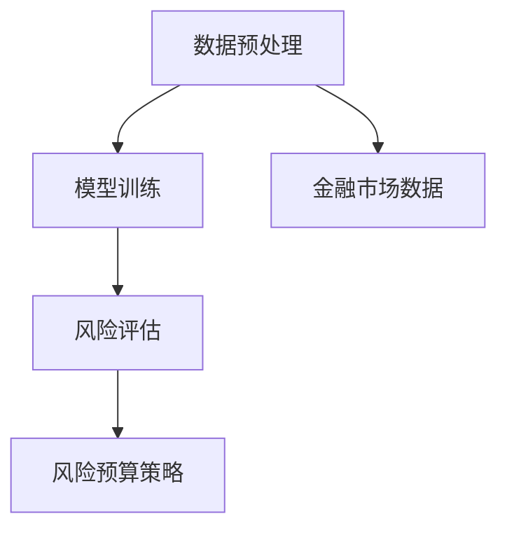
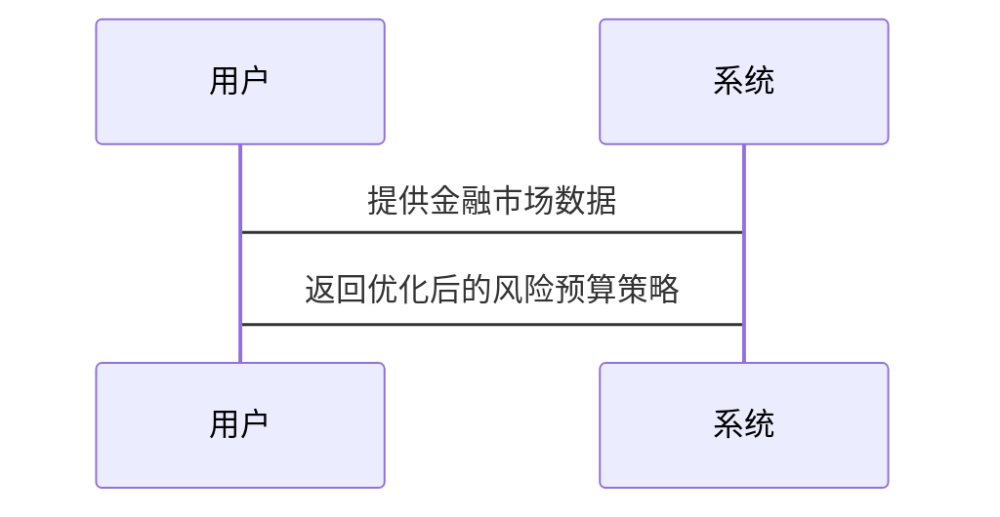

                 


# 深度强化学习在动态风险预算中的应用

## 关键词
深度强化学习, 动态风险预算, 金融投资, 算法原理, 系统架构, 项目实战

## 摘要
本文详细探讨了深度强化学习在动态风险预算中的应用，首先介绍了深度强化学习和动态风险预算的核心概念，然后分析了其在金融投资中的应用前景。接着，深入讲解了Q-learning和策略梯度算法的原理及其在动态风险预算中的应用，通过对比分析和实例说明，展示了深度强化学习在优化风险预算中的优势。最后，通过实际项目案例，详细阐述了系统的架构设计、功能实现和应用效果，为读者提供了一个完整的解决方案。

---

## 第一部分: 深度强化学习与动态风险预算概述

### 第1章: 深度强化学习与动态风险预算概述

#### 1.1 深度强化学习的基本概念
##### 1.1.1 强化学习的定义与特点
强化学习是一种通过与环境交互来学习最优策略的机器学习方法，其核心在于通过试错机制不断优化决策。与监督学习和无监督学习不同，强化学习强调与环境的动态交互，通过奖励机制指导学习过程。

##### 1.1.2 深度强化学习的核心思想
深度强化学习是强化学习与深度学习的结合，利用神经网络来近似最优策略或值函数。其核心思想是通过神经网络对高维状态空间进行高效表示，从而实现复杂决策任务。

##### 1.1.3 深度强化学习与传统强化学习的区别
| 特性            | 传统强化学习                  | 深度强化学习                  |
|-----------------|-----------------------------|-----------------------------|
| 状态表示        | 低维特征表示                  | 高维复杂特征表示              |
| 决策策略        | 策略函数或值函数              | 神经网络近似策略或值函数      |
| 处理复杂度      | 适用于简单任务                | 适用于复杂高维任务            |
| 应用场景        | 游戏、机器人控制               | 金融投资、自动驾驶等复杂领域  |

#### 1.2 动态风险预算的定义与特点
##### 1.2.1 风险预算的定义
风险预算是指在投资组合管理中，根据风险承受能力分配风险的策略。它通过设定不同资产或投资组合的风险暴露上限，来控制整体投资风险。

##### 1.2.2 动态风险预算的核心思想
动态风险预算是一种动态调整风险暴露的策略，根据市场变化和投资目标不断优化风险分配。其核心思想是通过实时调整投资组合的风险暴露，以适应市场波动。

##### 1.2.3 动态风险预算与静态风险预算的区别
| 特性            | 静态风险预算                  | 动态风险预算                  |
|-----------------|-----------------------------|-----------------------------|
| 调整频率        | 固定时间周期调整              | 实时动态调整                  |
| 响应市场变化    | 不考虑市场波动                | 根据市场波动调整风险暴露      |
| 灵活性          | 较低                         | 较高                         |

#### 1.3 深度强化学习在动态风险预算中的应用前景
##### 1.3.1 深度强化学习在金融领域的应用潜力
深度强化学习能够处理高维复杂问题，适合金融市场的非线性特征和动态变化。

##### 1.3.2 动态风险预算在金融投资中的重要性
动态风险预算是现代投资组合管理的核心策略，能够有效应对市场波动和风险。

##### 1.3.3 深度强化学习与动态风险预算结合的可行性
通过深度强化学习优化动态风险预算的决策过程，能够实现更高效的资产配置和风险控制。

---

## 第二部分: 深度强化学习的核心算法原理

### 第2章: 深度强化学习的核心算法

#### 2.1 Q-learning算法
##### 2.1.1 Q-learning的基本原理
Q-learning是一种基于值函数的强化学习算法，通过学习状态-动作对的最优值函数来优化决策。

##### 2.1.2 Q-learning的数学模型
状态值函数更新公式：
$$ Q(s, a) = Q(s, a) + \alpha [r + \max_{a'} Q(s', a') - Q(s, a)] $$
其中，$\alpha$是学习率，$r$是奖励，$s'$是下一个状态。

##### 2.1.3 Q-learning在动态风险预算中的应用
通过Q-learning优化投资组合的风险暴露，动态调整资产配置以实现风险收益平衡。

#### 2.2 策略梯度算法
##### 2.2.1 策略梯度的基本原理
策略梯度算法通过直接优化策略参数，最大化累积奖励，适用于高维复杂问题。

##### 2.2.2 策略梯度的数学模型
策略梯度更新公式：
$$ \theta_{t+1} = \theta_t + \alpha \nabla_\theta \mathbb{E}[R(\theta)] $$
其中，$\nabla_\theta$是梯度，$\alpha$是步长。

##### 2.2.3 策略梯度在动态风险预算中的应用
通过策略梯度优化风险预算策略，实现动态风险调整。

#### 2.3 深度强化学习算法对比分析
##### 2.3.1 Q-learning与策略梯度的对比
| 特性            | Q-learning                  | 策略梯度                  |
|-----------------|-----------------------------|-----------------------------|
| 更新方式        | 值函数更新                  | 策略直接优化              |
| 稳定性          | 较高                        | 较低                      |
| 应用场景        | 离散动作空间                | 连续动作空间              |

---

## 第三部分: 动态风险预算的系统架构与实现

### 第3章: 系统架构设计

#### 3.1 系统功能模块设计
##### 3.1.1 数据预处理模块
对金融市场数据进行清洗和特征提取，生成适合模型输入的状态。

##### 3.1.2 模型训练模块
使用深度强化学习算法训练模型，生成优化后的风险预算策略。

##### 3.1.3 风险评估模块
根据模型输出的策略，评估投资组合的风险暴露，并动态调整。

#### 3.2 系统架构图


#### 3.3 系统交互图


---

## 第四部分: 项目实战与应用

### 第4章: 项目实战

#### 4.1 环境安装
安装必要的Python库：
```bash
pip install tensorflow numpy pandas scikit-learn
```

#### 4.2 核心代码实现
##### 4.2.1 Q-learning实现
```python
import numpy as np

class QLearning:
    def __init__(self, state_space, action_space, alpha=0.1, gamma=0.9):
        self.state_space = state_space
        self.action_space = action_space
        self.alpha = alpha
        self.gamma = gamma
        self.Q = np.zeros((state_space, action_space))

    def update(self, state, action, reward, next_state):
        self.Q[state, action] += self.alpha * (reward + self.gamma * np.max(self.Q[next_state, :]) - self.Q[state, action])
```

##### 4.2.2 动态风险预算实现
```python
import pandas as pd

def dynamic_risk_budget(Q, portfolio, risk_tolerance=0.05):
    # 计算当前风险暴露
    risk_exposure = portfolio.risk_contributions.sum()
    # 动态调整风险预算
    target_exposure = min(risk_exposure, risk_tolerance)
    # 返回调整后的投资组合
    adjusted_portfolio = portfolio.rebalance(target_exposure)
    return adjusted_portfolio
```

#### 4.3 实际案例分析
##### 4.3.1 数据准备
```python
data = pd.read_csv('market_data.csv')
data.head()
```

##### 4.3.2 模型训练与应用
```python
# 初始化Q-learning模型
ql = QLearning(state_space=10, action_space=5)
# 训练模型
for episode in range(100):
    state = get_current_state(data)
    action = ql.Q[state].argmax()
    reward = get_reward(state, action)
    next_state = get_next_state(data)
    ql.update(state, action, reward, next_state)
# 应用到动态风险预算
portfolio = apply_risk_budget(ql, initial_portfolio)
```

#### 4.4 项目小结
通过深度强化学习优化动态风险预算，能够有效降低投资组合的风险暴露，同时提高收益。

---

## 第五部分: 最佳实践与总结

### 第5章: 最佳实践

#### 5.1 小结
深度强化学习在动态风险预算中的应用能够显著提升投资组合的风险管理能力。

#### 5.2 注意事项
- 数据质量：确保金融市场数据的准确性和完整性。
- 模型选择：根据具体问题选择合适的深度强化学习算法。
- 超参数调整：合理设置学习率、折扣因子等参数。

#### 5.3 拓展阅读
-《Deep Reinforcement Learning: Theory and Algorithms》
-《Dynamic Risk Management in Financial Markets》

---

## 结语
深度强化学习为动态风险预算提供了新的解决方案，通过结合强化学习的决策优化能力和动态调整的优势，能够有效提升金融投资的风险管理能力。

---

## 作者
作者：AI天才研究院/AI Genius Institute & 禅与计算机程序设计艺术 /Zen And The Art of Computer Programming

