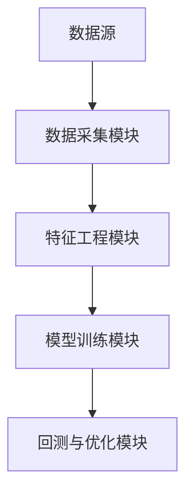

                 


# 深度强化学习在多周期资产配置中的应用

## 关键词
深度强化学习, 多周期资产配置, 强化学习算法, 资产配置系统, 系统架构设计

## 摘要
本文详细探讨了深度强化学习（Deep Reinforcement Learning）在多周期资产配置中的应用。通过分析深度强化学习的核心概念、算法原理及其在资产配置中的实际应用，本文提出了一个基于深度强化学习的多周期资产配置系统架构，并通过具体案例展示了系统的实现过程和优化方法。文章还结合实际应用场景，总结了深度强化学习在资产配置中的优势与挑战，并提出了未来的研究方向。

---

## 第一部分: 深度强化学习与多周期资产配置概述

### 第1章: 深度强化学习与资产配置的背景

#### 1.1 深度强化学习的基本概念
##### 1.1.1 强化学习的定义与特点
强化学习（Reinforcement Learning, RL）是一种机器学习范式，通过智能体在与环境的交互中学习策略，以最大化累计奖励。其特点包括：
- **自主性**：智能体通过与环境交互自主决策。
- **延迟反馈**：奖励信号通常是延迟的，且不直接指导每一步动作。
- **探索与利用**：智能体需要在探索新策略和利用已知策略之间找到平衡。

##### 1.1.2 深度学习在强化学习中的作用
深度学习（Deep Learning）通过多层神经网络提取复杂特征，为强化学习提供了强大的函数近似工具。深度强化学习（Deep RL）将深度学习与强化学习结合，能够处理高维、非线性的状态和动作空间。

##### 1.1.3 深度强化学习的核心要素
- **状态（State）**：智能体所处环境的特征表示。
- **动作（Action）**：智能体在给定状态下的决策。
- **奖励（Reward）**：智能体执行动作后获得的反馈。
- **策略（Policy）**：从状态到动作的映射函数，决定智能体如何选择动作。
- **值函数（Value Function）**：评估某状态下策略的优劣。

#### 1.2 资产配置的基本概念
##### 1.2.1 资产配置的定义与目标
资产配置是指将资金分配到不同的资产类别（如股票、债券、现金等）以实现投资目标的过程。其目标通常包括最大化收益、最小化风险或实现特定的收益目标。

##### 1.2.2 多周期资产配置的挑战
多周期资产配置需要在多个时间周期内动态调整资产分配比例，面临以下挑战：
- **复杂性**：资产价格波动、市场环境变化等增加了配置的复杂性。
- **延迟性**：资产配置的效果需要较长时间才能显现。
- **不确定性**：市场风险、流动性风险等增加了决策的难度。

##### 1.2.3 深度强化学习在资产配置中的优势
- **非线性建模**：深度强化学习能够捕捉复杂的市场规律。
- **动态适应性**：通过实时反馈调整策略，适应市场变化。
- **全局优化**：能够在多周期内进行全局优化，寻找最优配置方案。

---

## 第2章: 深度强化学习的核心概念与联系

### 2.1 深度强化学习的核心原理
#### 2.1.1 状态空间与动作空间
- **状态空间**：智能体所处环境的所有可能状态的集合。
- **动作空间**：智能体在给定状态下所有可能的动作的集合。

#### 2.1.2 奖励函数的设计
奖励函数定义了智能体在执行动作后获得的反馈。设计有效的奖励函数是深度强化学习的关键，通常需要考虑以下因素：
- **及时性**：奖励应尽可能及时，以便智能体快速学习。
- **可区分性**：奖励应能够区分不同动作的好坏。
- **合理性**：奖励应与目标一致，避免误导性奖励。

#### 2.1.3 策略与价值函数的关系
- **策略（Policy）**：直接定义了从状态到动作的映射。
- **价值函数（Value Function）**：评估某状态下策略的优劣，辅助策略优化。

### 2.2 多周期资产配置的数学模型
#### 2.2.1 资产配置的数学表达
资产配置问题可以表示为一个优化问题，目标是找到最优的资产分配比例：
$$ \text{maximize } \mu^T w - \lambda w^T \Sigma w $$
其中，$\mu$ 是资产的期望收益向量，$w$ 是资产权重向量，$\Sigma$ 是资产收益的协方差矩阵，$\lambda$ 是风险厌恶系数。

#### 2.2.2 多周期资产配置的动态优化模型
多周期资产配置需要考虑时间序列数据的动态变化，通常采用马尔可夫决策过程（MDP）建模：
$$ \max_{\pi} \mathbb{E}\left[\sum_{t=1}^T r_t(a_t, s_t)\right] $$
其中，$a_t$ 是第 $t$ 个时间步的动作，$s_t$ 是第 $t$ 个时间步的状态。

#### 2.2.3 深度强化学习与资产配置的结合
通过将资产配置问题转化为强化学习问题，可以利用深度强化学习的非线性建模能力，捕捉复杂的市场动态。

### 2.3 核心概念对比表
| 对比维度 | 强化学习 | 监督学习 | 多周期资产配置 |
|----------|----------|----------|----------------|
| 数据来源 | 环境反馈 | 标签数据 | 市场数据       |
| 目标     | 最大化奖励 | 分类/回归 | 最优化收益     |
| 动态性   | 动态环境 | 静态数据 | 动态市场       |

---

## 第3章: 深度强化学习的算法原理

### 3.1 基础算法
#### 3.1.1 Q-Learning算法
Q-Learning是一种经典的强化学习算法，通过维护一个Q表来记录状态-动作对的期望奖励：
$$ Q(s, a) \leftarrow Q(s, a) + \alpha (r + \gamma \max Q(s', a') - Q(s, a)) $$
其中，$\alpha$ 是学习率，$\gamma$ 是折扣因子。

#### 3.1.2 Deep Q-Networks (DQN)算法
DQN通过神经网络近似Q函数，避免了Q表的维度爆炸问题。其核心思想是：
1. 使用两个神经网络，一个用于评估当前策略（主网络），一个用于稳定学习（目标网络）。
2. 通过经验回放和目标网络更新，减少样本依赖性。

#### 3.1.3 策略梯度方法（Policy Gradient）
策略梯度方法直接优化策略，通过梯度 ascent 更新参数：
$$ \theta \leftarrow \theta + \alpha \nabla_\theta J(\theta) $$
其中，$J(\theta)$ 是目标函数，通常为期望奖励。

### 3.2 高级算法
#### 3.2.1 Actor-Critic方法
Actor-Critic结合了策略梯度和值函数的优势，通过两个网络分别优化策略和值函数：
- Actor网络负责生成动作。
- Critic网络负责评估状态-动作对的Q值。

#### 3.2.2 熵化方法（Entropy Method）
熵化方法通过引入熵正则化，平衡探索与利用：
$$ \mathcal{L} = -\sum p_i \log p_i - \lambda H $$
其中，$H$ 是熵，$\lambda$ 是调节参数。

#### 3.2.3 多智能体强化学习（Multi-Agent RL）
多智能体强化学习适用于多周期资产配置中的团队决策问题，通过多个智能体协同优化。

### 3.3 深度强化学习的数学模型
#### 3.3.1 Q-learning的数学推导
通过贝尔曼方程：
$$ Q(s, a) = r + \gamma \max_{a'} Q(s', a') $$
Q-Learning通过迭代更新逼近最优解。

#### 3.3.2 DQN的网络结构与损失函数
DQN使用两个DNN网络，目标网络的损失函数为：
$$ \mathcal{L} = \mathbb{E}[ (y - Q(s, a))^2 ] $$
其中，$y = r + \gamma Q'(s', a')$。

#### 3.3.3 策略梯度的数学公式
策略梯度方法通过最大化期望奖励：
$$ \nabla_\theta J(\theta) = \mathbb{E}[\nabla_\theta \log \pi(a|s) Q(s, a)] $$

---

## 第4章: 多周期资产配置的系统分析与架构设计

### 4.1 问题场景介绍
#### 4.1.1 资产配置的目标与约束
- 目标：最大化收益，最小化风险。
- 约束：流动性约束、风险预算等。

#### 4.1.2 多周期资产配置的复杂性
- 时间序列数据的动态变化。
- 多个周期之间的相互影响。

#### 4.1.3 深度强化学习在多周期配置中的应用
通过强化学习模型，动态调整资产分配比例，适应市场变化。

### 4.2 系统功能设计
#### 4.2.1 数据采集模块
从金融市场数据源获取历史数据，包括股票价格、指数等。

#### 4.2.2 特征工程模块
对原始数据进行特征提取，如移动平均、波动率等。

#### 4.2.3 模型训练模块
训练深度强化学习模型，生成最优资产配置策略。

#### 4.2.4 回测与优化模块
通过回测验证模型的性能，并进行参数优化。

### 4.3 系统架构设计
#### 4.3.1 系统架构图


---

## 第5章: 深度强化学习在多周期资产配置中的应用实例

### 5.1 项目环境配置
- Python 3.8+
- PyTorch 1.9+
- gym库
- numpy

### 5.2 核心代码实现
#### 5.2.1 DQN算法实现
```python
class DQN(nn.Module):
    def __init__(self, state_dim, action_dim, hidden_dim=64):
        super(DQN, self).__init__()
        self.fc1 = nn.Linear(state_dim, hidden_dim)
        self.fc2 = nn.Linear(hidden_dim, action_dim)
    
    def forward(self, x):
        x = F.relu(self.fc1(x))
        x = self.fc2(x)
        return x

# 初始化
state_dim = 4
action_dim = 3
dqn = DQN(state_dim, action_dim)
```

#### 5.2.2 策略优化
通过回测优化模型参数，找到最优资产配置策略。

### 5.3 案例分析
通过具体案例展示模型的训练过程和回测结果，分析其在多周期资产配置中的表现。

---

## 第6章: 总结与展望

### 6.1 核心总结
深度强化学习为多周期资产配置提供了强大的工具，能够捕捉复杂市场动态，实现动态优化。

### 6.2 未来研究方向
- 更复杂的市场建模。
- 多智能体协同优化。
- 鲁棒性与解释性研究。

### 6.3 最佳实践 tips
- 数据质量是关键。
- 确保模型的可解释性。
- 定期更新模型以适应市场变化。

---

## 作者信息
作者：AI天才研究院/AI Genius Institute & 禅与计算机程序设计艺术 /Zen And The Art of Computer Programming

---

通过以上内容，文章系统地介绍了深度强化学习在多周期资产配置中的应用，从理论到实践，为读者提供了全面的知识和指导。

