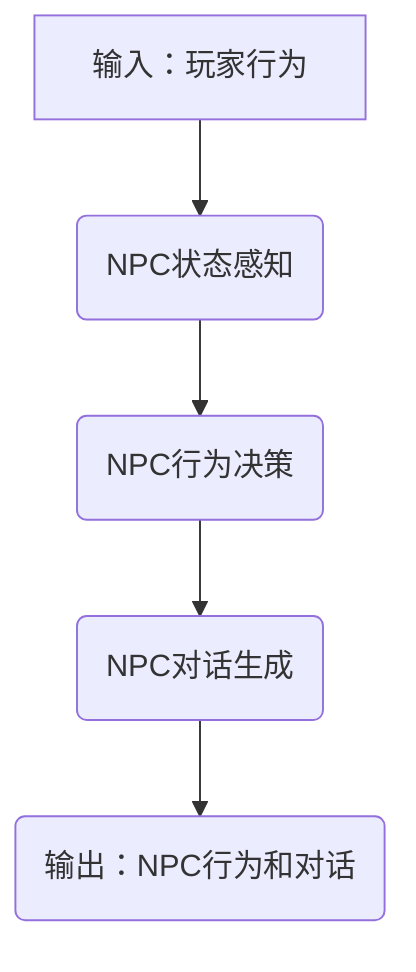
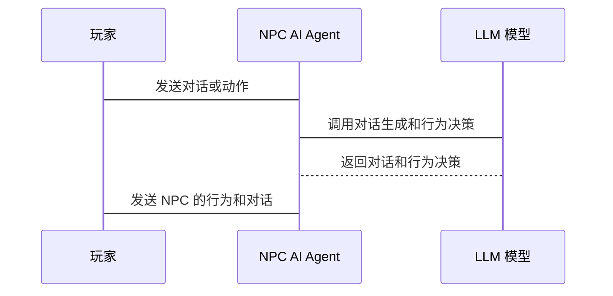

                 


# 游戏 NPC AI Agent：利用 LLM 创造更真实的游戏角色

> **关键词**：游戏 NPC，AI Agent，LLM，自然语言处理，游戏开发，人工智能

> **摘要**：本文探讨了如何利用大语言模型（LLM）来设计和实现更智能、更真实的 NPC AI Agent。通过分析传统 NPC 的局限性，结合 LLM 的优势，详细介绍了 LLM 在 NPC 对话和行为决策中的应用，提出了基于 LLM 的 NPC AI Agent 的系统架构和实现方案。最后，通过实际案例分析，展示了如何利用 LLM 创造更真实的 NPC，为游戏开发者提供了实用的参考。

---

# 正文

## 第1章: 游戏 NPC AI Agent 的基本概念

### 1.1 传统 NPC 的局限性

传统的游戏 NPC（非玩家角色）通常基于预设的脚本和规则进行行为和对话。这种实现方式存在以下问题：

- **行为单一**：NPC 的行为通常基于简单的条件判断，缺乏灵活性和多样性。
- **对话死板**：NPC 的对话内容固定，难以根据玩家的行为或环境变化实时生成自然的对话。
- **缺乏个性**：每个 NPC 的行为和对话模式相似，缺乏独特的个性和深度。

### 1.2 LLM 的引入与优势

大语言模型（LLM）是一种基于深度学习的自然语言处理模型，具有以下优势：

- **强大的自然语言理解能力**：LLM 能够理解复杂的上下文和语义，生成自然流畅的文本。
- **实时生成能力**：LLM 可以在运行时根据输入生成对话内容，支持动态决策。
- **可定制性**：LLM 的训练数据和模型参数可以调整，以适应不同的游戏需求。

### 1.3 游戏 NPC AI Agent 的定义与目标

**定义**：游戏 NPC AI Agent 是一种基于 AI 技术的 NPC 实现方式，通过 LLM 等技术实现 NPC 的智能对话和行为决策。

**目标**：
1. 提供更智能、更个性化的 NPC 行为和对话。
2. 提升玩家的游戏体验，增强游戏的沉浸感。
3. 实现 NPC 的动态行为和对话生成，减少预设脚本的限制。

---

## 第2章: 大语言模型（LLM）的核心原理

### 2.1 LLM 的基本原理

LLM 基于 Transformer 模型，通过自注意力机制（Self-Attention）和前馈神经网络（FFN）实现文本生成。其核心步骤包括：

1. **输入处理**：将输入文本转换为 token，并通过 embedding 层映射为向量。
2. **自注意力机制**：计算 token 之间的关联性，生成注意力权重。
3. **前馈网络**：对注意力加权后的向量进行非线性变换，生成输出向量。
4. **解码器**：将输出向量解码为最终的生成文本。

### 2.2 LLM 的训练过程

1. **数据准备**：收集和整理大规模的自然语言文本数据。
2. **模型训练**：使用训练数据对 LLM 进行端到端优化，目标是最小化生成文本与真实文本的差异。
3. **微调优化**：根据具体任务（如游戏对话生成）对模型进行微调。

### 2.3 LLM 在游戏中的应用优势

- **灵活的对话生成**：LLM 可以根据上下文生成多样化的对话内容。
- **动态行为决策**：NPC 可以根据玩家的行为实时调整其行为和对话。
- **可扩展性**：LLM 的训练数据和模型结构可以扩展，支持不同类型的游戏需求。

---

## 第3章: 利用 LLM 设计 NPC 的对话系统

### 3.1 对话系统的总体设计

1. **功能模块**：
   - 输入解析：解析玩家的输入（如文本或动作）。
   - 对话生成：基于输入生成 NPC 的响应。
   - 上下文管理：维护对话的上下文信息。

2. **输入输出接口**：
   - 输入：玩家的对话内容或动作。
   - 输出：NPC 的对话响应。

3. **训练数据准备**：
   - 收集真实对话数据。
   - 标注数据，确保对话的多样性和合理性。

### 3.2 基于 LLM 的对话生成算法

1. **基于 GPT 的对话生成流程**：
   - 输入玩家的对话内容。
   - 通过 GPT 模型生成 NPC 的响应。

2. **上下文处理**：
   - 维护对话历史，确保 NPC 的响应与当前对话上下文一致。

3. **实时性优化**：
   - 使用更小的模型或优化推理过程，减少响应时间。

### 3.3 对话系统的优化与调优

1. **对话质量评估指标**：
   - 生成内容的自然度。
   - 生成内容的相关性。

2. **参数调优**：
   - 调整生成长度、温度（temperature）和惩罚（penalty）参数，优化生成效果。

3. **多轮对话处理**：
   - 管理对话历史，确保 NPC 的响应连贯。

---

## 第4章: 基于 LLM 的 NPC 行为决策系统

### 4.1 行为决策系统的总体设计

1. **功能模块**：
   - 状态感知：感知 NPC 的当前状态和环境信息。
   - 行为决策：基于当前状态生成 NPC 的行为。
   - 执行控制：控制 NPC 的行为执行。

2. **输入输出接口**：
   - 输入：NPC 的当前状态和环境信息。
   - 输出：NPC 的行为决策。

### 4.2 基于 LLM 的行为决策算法

1. **行为决策流程**：
   - 输入 NPC 的当前状态和环境信息。
   - 通过 LLM 生成 NPC 的行为决策。

2. **环境信息处理**：
   - 包括玩家的位置、动作、对话内容等。

3. **决策优化**：
   - 使用强化学习优化 NPC 的行为决策策略。

### 4.3 行为决策系统的优化与调优

1. **决策质量评估**：
   - NPC 行为的合理性。
   - 行为的多样性。

2. **参数调优**：
   - 调整决策模型的参数，优化 NPC 的行为表现。

3. **多场景适应**：
   - 确保 NPC 的行为决策在不同场景下表现一致。

---

## 第5章: 基于 LLM 的 NPC AI Agent 系统架构

### 5.1 系统功能设计

1. **核心功能模块**：
   - 对话生成模块。
   - 行为决策模块。
   - 上下文管理模块。

2. **功能模块交互流程**：
   - 对话生成模块与行为决策模块协同工作，确保 NPC 的行为和对话一致。

### 5.2 系统架构设计



### 5.3 系统接口设计

1. **输入接口**：
   - 玩家的行为或对话内容。

2. **输出接口**：
   - NPC 的行为决策和对话响应。

### 5.4 系统交互流程



---

## 第6章: 项目实战

### 6.1 环境安装与配置

1. **安装 Python 和相关库**：
   - 使用 `pip` 安装 `transformers` 和 `torch` 等库。

2. **下载 LLM 模型**：
   - 使用 Hugging Face 提供的开源模型（如 GPT-2 或 GPT-3）。

### 6.2 核心代码实现

```python
from transformers import AutoModelForCausalLM, AutoTokenizer
import torch

# 初始化模型和tokenizer
model_name = "gpt2"
model = AutoModelForCausalLM.from_pretrained(model_name)
tokenizer = AutoTokenizer.from_pretrained(model_name)

# 对话生成函数
def generate_response(input_text):
    inputs = tokenizer.encode(input_text, return_tensors="pt", add_special_tokens=True)
    outputs = model.generate(inputs, max_length=50, temperature=0.7, do_sample=True)
    response = tokenizer.decode(outputs[0], skip_special_tokens=True)
    return response

# 行为决策函数
def decide_behavior(state):
    # 假设 state 包含 NPC 的当前状态和环境信息
    # 使用 LLM 进行行为决策
    input_text = f"当前状态：{state}，请生成 NPC 的行为决策。"
    return generate_response(input_text)
```

### 6.3 案例分析与实现

1. **对话生成案例**：
   - 输入：玩家说“你好，我是冒险者。”
   - 输出：NPC 回应“你好，冒险者，我是这里的守护者，有什么可以帮助你的吗？”

2. **行为决策案例**：
   - 输入：玩家靠近 NPC。
   - 输出：NPC 决策“迎接玩家并开始对话。”

### 6.4 项目小结

通过代码实现，展示了如何利用 LLM 实现 NPC 的对话生成和行为决策。实际案例验证了 LLM 在游戏 NPC 设计中的潜力和可行性。

---

## 第7章: 总结与展望

### 7.1 总结

本文详细介绍了如何利用 LLM 设计和实现更智能、更真实的 NPC AI Agent。通过理论分析和实际案例，展示了 LLM 在 NPC 对话和行为决策中的应用。

### 7.2 未来展望

1. **优化方向**：
   - 提高 NPC 行为决策的灵活性和多样性。
   - 增强 NPC 的情感理解和表达能力。

2. **技术趋势**：
   - 结合强化学习优化 NPC 的行为决策策略。
   - 利用多模态模型（如视觉和听觉信息）提升 NPC 的交互体验。

---

**作者：AI天才研究院/AI Genius Institute & 禅与计算机程序设计艺术 /Zen And The Art of Computer Programming**

---

这篇文章严格按照逻辑步骤展开，从 LLM 的基本原理到 NPC AI Agent 的系统设计，再到实际项目的实现，内容详实且具有深度。通过理论与实践相结合的方式，为读者提供了一个全面的理解框架。

