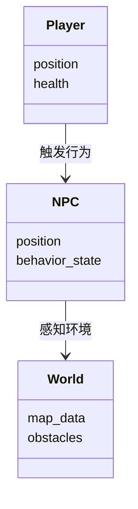
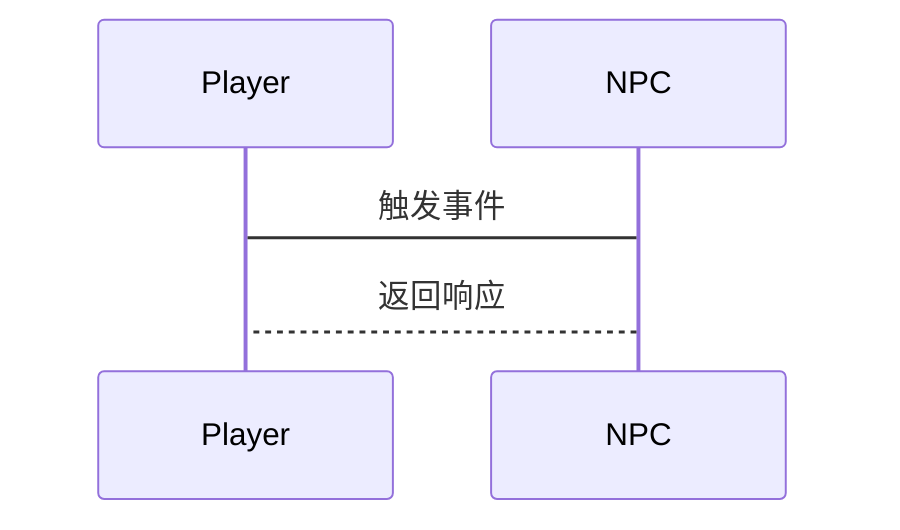

                 


# 游戏开发中的AI Agent非玩家角色

> 关键词：游戏AI, AI Agent, 非玩家角色, NPC, 游戏开发, AI算法, 系统架构

> 摘要：本文深入探讨了游戏开发中AI Agent非玩家角色的核心概念、算法原理、系统架构以及实战应用。通过详细分析AI Agent的行为模型、智能模型、算法实现和系统设计，结合实际案例和优化建议，为游戏开发者提供了全面的技术指导。

---

## 第一章: 游戏开发中的AI Agent背景介绍

### 1.1 游戏AI的发展历程
- 1.1.1 游戏AI的定义与特点  
  游戏AI是指在游戏环境中模拟人类或其他智能体行为的算法和技术。其特点是实时性、适应性和可玩性。

- 1.1.2 游戏AI的发展阶段  
  从简单的脚本控制到复杂的深度学习模型，游戏AI经历了从规则驱动到数据驱动的演变。

- 1.1.3 游戏AI在现代游戏中的应用  
  现代游戏中的AI Agent广泛应用于NPC行为控制、敌人追击、任务生成等领域。

### 1.2 游戏中的非玩家角色（NPC）概述
- 1.2.1 NPC在游戏中的作用  
  NPC不仅是游戏世界的填充物，更是推动剧情发展、增强玩家沉浸感的关键元素。

- 1.2.2 NPC的行为模式与分类  
  根据智能程度，NPC可分为基于规则的简单AI、基于状态的行为树AI，以及基于强化学习的深度AI。

- 1.2.3 NPC与玩家互动的重要性  
  NPC的智能程度直接影响玩家的游戏体验，高质量的互动能显著提升游戏的可玩性。

### 1.3 游戏AI Agent的核心概念
- 1.3.1 AI Agent的基本定义  
  AI Agent是指在游戏环境中能够感知环境、做出决策并采取行动的智能体。

- 1.3.2 AI Agent与传统NPC的区别  
  AI Agent具备自主决策能力，能够根据环境变化动态调整行为，而传统NPC通常基于固定脚本。

- 1.3.3 AI Agent在游戏中的实现方式  
  通过状态机、行为树、决策树等技术实现NPC的智能行为。

### 1.4 游戏AI Agent的设计原则
- 1.4.1 NPC行为设计的基本原则  
  行为设计应符合游戏世界观，具备一致性、可预测性和可调性。

- 1.4.2 NPC智能层次的划分  
  根据智能程度，将NPC分为低级AI（如巡逻）、中级AI（如动态响应）和高级AI（如深度学习驱动）。

- 1.4.3 NPC行为与游戏剧情的结合  
  NPC的行为应与剧情任务无缝衔接，增强玩家的代入感。

---

## 第二章: AI Agent的核心概念与联系

### 2.1 AI Agent的核心概念
- 2.1.1 AI Agent的行为模型  
  行为模型定义了AI Agent如何感知环境并采取行动。常见的模型包括基于规则的行为、基于状态的行为树和基于目标的决策树。

- 2.1.2 AI Agent的智能模型  
  智能模型决定了AI Agent的学习和推理能力。从简单的规则驱动到复杂的强化学习，智能模型的层次决定了AI Agent的能力。

- 2.1.3 AI Agent的决策机制  
  决策机制是AI Agent的核心，包括基于规则的决策、基于概率的决策和基于价值的决策。

### 2.2 核心概念对比与分析
- 2.2.1 不同AI Agent行为模型的对比  
  通过对比基于规则的行为树、基于状态的行为树和基于决策树的行为树，分析其优缺点。

- 2.2.2 不同AI Agent智能模型的对比  
  对比规则驱动、状态驱动和强化学习驱动的智能模型，分析其适用场景和性能差异。

- 2.2.3 AI Agent与传统NPC的对比  
  从自主性、适应性和智能性三个维度，分析AI Agent相对于传统NPC的优势。

### 2.3 AI Agent的ER实体关系图
```mermaid
erDiagram
    actor Player {
        <field> int id
        <field> string name
    }
    agent NPC {
        <field> int id
        <field> string name
        <field> string type
    }
    interaction Player -- NPC {
        <operation> perceive
        <operation> interact
    }
```

---

## 第三章: AI Agent的算法原理与实现

### 3.1 基于规则的AI Agent算法
- 3.1.1 算法原理  
  通过预定义的规则，AI Agent根据当前状态和触发条件执行特定动作。

- 3.1.2 代码实现  
  ```python
  def rule_based_agent(current_state):
      if current_state == 'patrol':
          return 'move_right'
      elif current_state == 'alert':
          return 'look_around'
      else:
          return 'idle'
  ```

- 3.1.3 优缺点分析  
  优点是实现简单、效率高；缺点是灵活性差，难以应对复杂场景。

### 3.2 基于状态的行为树算法
- 3.2.1 算法原理  
  行为树通过节点和边表示任务分解，AI Agent根据优先级选择最优路径。

- 3.2.2 代码实现  
  ```python
  def behavior_tree_agent():
      if check_priority('alert'):
          execute('look_around')
      elif check_priority('patrol'):
          execute('move_to_point')
      else:
          execute('idle')
  ```

- 3.2.3 优缺点分析  
  优点是逻辑清晰、易于调试；缺点是复杂场景下的计算开销较大。

### 3.3 基于决策树的AI Agent算法
- 3.3.1 算法原理  
  决策树通过概率和收益评估选择最优动作。

- 3.3.2 代码实现  
  ```python
  def decision_tree_agent():
      if probability('enemy_detected') > 0.7:
          return 'attack'
      elif probability('player_nearby') > 0.5:
          return 'follow'
      else:
          return 'patrol'
  ```

- 3.3.3 优缺点分析  
  优点是灵活性高，适应性强；缺点是训练数据需求大，实现复杂。

---

## 第四章: AI Agent的系统架构设计

### 4.1 问题场景介绍
- 游戏中AI Agent需要处理的典型问题包括路径规划、目标识别、任务生成和多智能体协作。

### 4.2 系统功能设计
- 使用领域模型Mermaid类图展示系统功能模块：


### 4.3 系统架构设计
- 使用Mermaid架构图展示系统整体架构：
```mermaid
container Game_Architecture {
    Server
    Client
    Database
}
```

### 4.4 系统接口设计
- 接口设计包括AI Agent与游戏引擎的交互，如Unity或Unreal Engine的API调用。

### 4.5 系统交互设计
- 使用Mermaid序列图展示玩家与AI Agent的交互流程：


---

## 第五章: AI Agent的项目实战

### 5.1 环境安装与配置
- 安装必要的开发工具，如Python、Unity、Unreal Engine。

### 5.2 核心功能实现
- 实现路径规划、行为树、决策树等功能，提供代码示例和详细解读。

### 5.3 实际案例分析
- 分析实际游戏中的AI Agent实现，如《塞尔达传说》中的NPC行为。

### 5.4 项目总结与经验分享
- 总结开发经验，分享优化技巧和常见问题的解决方案。

---

## 第六章: AI Agent的优化与扩展

### 6.1 性能优化建议
- 优化算法复杂度，减少计算开销。

### 6.2 多智能体协作
- 实现多智能体之间的通信与协作，提升整体智能水平。

### 6.3 情感计算与个性化
- 引入情感计算，实现NPC的个性化互动。

### 6.4 跨平台开发
- 适应不同平台的性能差异，优化AI Agent的表现。

---

## 第七章: 总结与展望

### 7.1 本章总结
- 回顾全文内容，强调AI Agent在游戏开发中的重要性。

### 7.2 未来展望
- 展望AI Agent在游戏中的应用前景，如强化学习和元学习的结合。

### 7.3 参考文献与扩展阅读
- 提供相关技术书籍和论文的参考文献。

---

## 作者信息

作者：AI天才研究院/AI Genius Institute & 禅与计算机程序设计艺术 /Zen And The Art of Computer Programming

---

**注**：本文为《游戏开发中的AI Agent非玩家角色》的技术博客文章，内容涵盖了从基础概念到实战应用的完整体系，适合游戏开发者、AI工程师及相关领域的技术从业者阅读。

