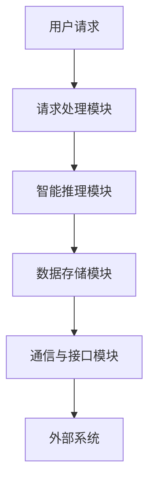

                 


# 灾难恢复：确保AI Agent服务的高可用性

> 关键词：灾难恢复, 高可用性, AI Agent, 容灾策略, 分布式系统, 故障恢复, 系统架构

> 摘要：本文将深入探讨如何确保AI Agent服务的高可用性，重点介绍灾难恢复的核心概念、系统架构设计、容灾策略实施以及最佳实践。通过详细分析AI Agent服务的特点和挑战，结合实际案例，本文将为读者提供一套完整的解决方案，帮助他们在面对系统故障时，快速恢复并确保服务的连续性。

---

## 第二章: AI Agent服务的高可用性架构设计

### 2.2 容灾策略的设计原则

#### 2.2.1 数据备份与恢复策略
- 数据备份是高可用性系统的核心，确保在灾难发生后能够快速恢复数据。
- 常用的备份策略包括全备份、增量备份和差异备份。
- 数据恢复过程需要设计高效的恢复机制，例如基于版本控制的恢复点目标（RPO）和恢复时间目标（RTO）。

#### 2.2.2 服务冗余与负载均衡
- 服务冗余：通过部署多个AI Agent实例，确保在单点故障发生时，其他实例能够接管服务。
- 负载均衡：使用负载均衡技术（如轮询、随机、加权等算法）分配请求，避免单点过载。
- 实例间的通信机制：确保冗余实例能够同步状态，防止数据不一致。

#### 2.2.3 故障检测与自动切换机制
- 故障检测：使用心跳检测机制（心跳包、超时检测等）来监测服务实例的状态。
- 自动切换：当检测到故障时，系统自动将请求切换到健康的实例，减少停机时间。

### 2.3 灾难恢复的实施步骤

#### 2.3.1 灾难预防措施
- 数据冗余：通过分布式存储或副本机制，确保数据在多个节点上备份。
- 网络冗余：部署冗余的网络设备和链路，避免网络故障导致服务中断。
- 电源和硬件冗余：使用冗余电源、网络设备和服务器，确保硬件故障不影响服务。

#### 2.3.2 灾难发生时的响应策略
- 快速检测：通过监控系统及时发现故障，并触发应急预案。
- 自动切换：使用负载均衡和故障转移机制，将请求切换到可用的服务实例。
- 状态同步：在切换过程中，确保新实例能够快速同步状态，减少服务中断时间。

#### 2.3.3 灾后恢复与评估
- 数据恢复：从备份中恢复数据，确保数据一致性。
- 系统修复：修复受损的硬件或软件，恢复系统到正常状态。
- 恢复测试：在恢复完成后，进行全面的测试，确保系统正常运行。
- 恢复评估：分析灾难恢复过程中的问题，总结经验，优化未来预案。

---

## 第三章: 高可用性系统的关键技术

### 3.1 分布式系统与容灾技术

#### 3.1.1 分布式系统的基本概念
- 分布式系统由多个独立的节点组成，通过网络进行通信。
- 分布式系统的特点包括高可用性、扩展性和容错性。

#### 3.1.2 分布式系统中的容灾技术
- 数据冗余：通过在多个节点上存储数据副本，确保数据的可用性。
- 负载均衡：将请求均匀分配到多个节点，避免单点过载。
- 故障转移：当某个节点故障时，自动将请求切换到其他节点。

#### 3.1.3 分布式系统中的一致性问题
- 一致性是分布式系统的核心问题，确保所有节点的数据同步。
- 使用一致性算法（如Paxos、Raft）实现分布式系统的一致性。

### 3.2 负载均衡与故障转移

#### 3.2.1 负载均衡算法
- 轮询（Round Robin）：依次将请求分配到不同的节点。
- 随机（Random）：随机选择一个节点处理请求。
- 加权轮询（Weighted Round Robin）：根据节点的处理能力分配请求比例。

#### 3.2.2 故障转移机制
- 故障检测：通过心跳检测机制监测节点状态。
- 自动切换：当检测到故障时，将请求切换到健康的节点。

#### 3.2.3 基于AI的自适应负载均衡
- 使用AI算法（如机器学习）预测节点负载，动态调整负载均衡策略。
- 根据实时数据和历史数据优化负载分配。

### 3.3 数据冗余与同步机制

#### 3.3.1 数据冗余的基本原理
- 在多个节点上存储数据副本，确保数据的可用性。
- 数据副本的数量和分布策略需要根据具体场景设计。

#### 3.3.2 数据同步机制
- 使用同步协议（如两阶段提交、三阶段提交）实现分布式系统中的数据一致性。
- 异步复制：数据副本异步更新，减少同步开销。

#### 3.3.3 数据一致性保障
- 通过一致性算法确保所有副本的数据一致。
- 处理数据冲突时，需要设计合理的仲裁机制。

---

## 第四章: 容灾策略的具体实施

### 4.1 灾难恢复的实施步骤

#### 4.1.1 灾难预防措施
- 数据备份：定期备份数据，确保数据的安全性。
- 网络冗余：部署冗余的网络设备和链路，避免网络故障。
- 硬件冗余：使用冗余的硬件设备，确保硬件故障不影响服务。

#### 4.1.2 灾难发生时的响应策略
- 快速检测：通过监控系统及时发现故障，触发应急预案。
- 自动切换：使用故障转移机制，将请求切换到健康的节点。
- 状态同步：确保新节点能够快速同步状态，减少服务中断时间。

#### 4.1.3 灾后恢复与评估
- 数据恢复：从备份中恢复数据，确保数据一致性。
- 系统修复：修复受损的硬件或软件，恢复系统正常运行。
- 恢复测试：全面测试系统，确保服务正常。
- 恢复评估：分析恢复过程中的问题，优化未来预案。

### 4.2 容灾策略的优化

#### 4.2.1 容灾策略的评估与优化
- 定期评估容灾策略的有效性，发现问题并优化。
- 根据业务需求变化，动态调整容灾策略。

#### 4.2.2 容灾策略的实施工具
- 使用云服务（如AWS、Azure、GCP）提供的高可用性服务。
- 部署容器化技术（如Docker、Kubernetes）实现服务的快速恢复。

---

## 第五章: 项目实战

### 5.1 项目背景与目标

#### 5.1.1 项目背景
- 某公司AI Agent服务出现故障，导致服务中断，影响用户体验。
- 为了确保服务的高可用性，需要设计和实施容灾策略。

#### 5.1.2 项目目标
- 实现AI Agent服务的高可用性，确保在单点故障发生时，服务能够快速恢复。
- 设计容灾策略，优化系统架构，减少停机时间和数据丢失。

### 5.2 系统架构设计

#### 5.2.1 系统功能设计
- 请求处理模块：接收用户请求，进行AI推理，返回结果。
- 数据存储模块：存储AI Agent的上下文和历史数据。
- 通信与接口模块：处理与外部系统的通信和接口。

#### 5.2.2 系统架构图


#### 5.2.3 系统交互图
```mermaid
sequenceDiagram
    participant 用户
    participant 请求处理模块
    participant 智能推理模块
    participant 数据存储模块
    participant 通信与接口模块
    用户 -> 请求处理模块: 发送请求
    请求处理模块 -> 智能推理模块: 进行推理
    智能推理模块 -> 数据存储模块: 获取上下文数据
    智能推理模块 -> 通信与接口模块: 返回结果
    用户 <-- 请求处理模块: 接收结果
```

### 5.3 核心代码实现

#### 5.3.1 心跳检测机制
```python
import time

def send_heartbeat(node_id):
    while True:
        try:
            # 发送心跳包到监控系统
            monitor.send_heartbeat(node_id)
            time.sleep(30)  # 每30秒发送一次心跳
        except Exception as e:
            # 心跳失败，触发故障检测
            handle_failure(node_id, e)
```

#### 5.3.2 状态同步机制
```python
import threading

def sync_state(node_id):
    while True:
        try:
            # 获取最新的状态数据
            state_data = get_latest_state(node_id)
            # 同步到本地副本
            update_local_state(state_data)
            time.sleep(10)  # 每10秒同步一次
        except Exception as e:
            # 同步失败，记录日志
            logging.error(f"Failed to sync state: {e}")
```

### 5.4 实际案例分析

#### 5.4.1 案例背景
- 某AI Agent服务在运行过程中，由于网络故障导致部分节点无法通信。
- 服务出现中断，用户请求无法被处理。

#### 5.4.2 恢复过程
1. 快速检测：监控系统检测到部分节点网络中断，触发应急预案。
2. 故障转移：将中断节点的请求切换到其他可用节点。
3. 状态同步：新节点快速同步中断节点的状态数据，恢复服务。
4. 灾后恢复：修复网络故障，恢复中断节点，并重新同步状态。

### 5.5 项目小结

---

## 第六章: 最佳实践与小结

### 6.1 最佳实践

#### 6.1.1 定期演练
- 定期进行灾难恢复演练，确保团队熟悉恢复流程。
- 通过演练发现和优化恢复过程中的问题。

#### 6.1.2 日志与监控
- 部署完善的日志和监控系统，实时监测系统状态。
- 使用日志分析工具，快速定位问题根源。

#### 6.1.3 代码审查与测试
- 定期进行代码审查，确保代码质量。
- 部署自动化测试，验证容灾策略的有效性。

### 6.2 小结

### 6.3 注意事项

### 6.4 拓展阅读

---

作者：AI天才研究院/AI Genius Institute & 禅与计算机程序设计艺术 /Zen And The Art of Computer Programming

---

本文通过详细分析AI Agent服务的特点和挑战，结合实际案例，为读者提供了一套完整的灾难恢复解决方案。从系统架构设计到容灾策略实施，再到项目实战和最佳实践，本文为确保AI Agent服务的高可用性提供了全面的技术指导。

