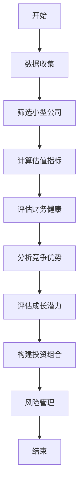
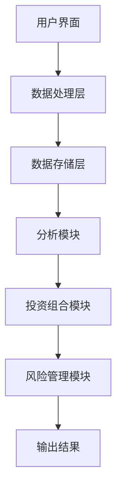

                 


# 爱德华·拉姆的小型价值股策略：规模效应与价值投资

## 关键词：价值投资，小型价值股，规模效应，投资策略，爱德华·拉姆

## 摘要

本文深入探讨了爱德华·拉姆提出的小型价值股投资策略，结合规模效应与价值投资的理论，分析了该策略的实施步骤、数学模型以及实际案例。通过系统分析和项目实战，展示了如何利用规模效应在小型价值股中实现超额收益，并提供了最佳实践和未来展望。

---

## 第一部分：背景介绍

### 第1章：价值投资的核心概念

#### 1.1 价值投资的定义与背景

- 价值投资是一种基于对公司内在价值评估的投资策略，旨在以低于内在价值的价格购买优质资产。其核心理念是寻找市场低估的公司，长期持有以实现收益。

- 爱德华·拉姆作为价值投资领域的权威，专注于小型价值股的研究，提出了一套结合规模效应的策略，强调在小盘股中寻找具有强大基本面和竞争优势的公司。

#### 1.2 问题背景与挑战

- 小型价值股市场流动性较低，信息不透明，波动性较大，增加了投资的难度。
- 规模效应在小型公司中的应用需要考虑企业成长阶段和市场结构的影响。
- 投资者需平衡短期波动与长期增长，避免市场恐慌或过度乐观的影响。

#### 1.3 爱德华·拉姆策略的目标

- 确定小型价值股的定义和筛选标准。
- 利用规模效应优化投资组合，实现长期稳定收益。
- 提供可操作的投资策略和风险管理方法。

## 第二部分：核心概念与联系

### 第2章：小型价值股的定义与特点

#### 2.1 小型价值股的定义

- 小型价值股通常指市值在一定范围内的公司，其股票价格低于其内在价值。
- 筛选标准包括低市盈率、低市净率、高股息率等财务指标。

#### 2.2 小型价值股与其他投资策略的对比

- 与成长股相比，小型价值股注重稳定增长和低估值。
- 与大盘价值股相比，小型股风险更高但潜在回报更大。
- 与指数投资相比，小型价值股策略更具灵活性和选择性。

#### 2.3 小型价值股的优势

- 成本优势：小型公司通常具有更低的估值倍数。
- 市场效率：小型市场可能存在未被发现的机会。
- 成长空间：小型公司有更大的发展空间和增长潜力。

### 第3章：规模效应的经济原理

#### 3.1 规模效应的定义与表现

- 规模效应是指随着企业规模的扩大，单位成本下降，效率提高的现象。
- 在投资中，规模效应体现在公司成长过程中，规模扩大带来的竞争优势。

#### 3.2 规模效应与股票价值的关系

- 公司规模增大，运营效率提高，利润增长，股价上涨。
- 规模效应与企业生命周期阶段相关，成熟企业规模效应更显著。

#### 3.3 规模效应在投资中的应用

- 识别具有规模效应的公司，评估其成长潜力。
- 在小型价值股中寻找具有潜在规模效应的公司，长期持有以获得收益。

---

## 第三部分：算法原理与数学模型

### 第4章：爱德华·拉姆策略的算法原理

#### 4.1 策略概述

- 筛选小型公司：市值小于10亿美元。
- 估值指标：低市盈率（低于市场平均值）、低市净率（低于行业平均水平）、高股息率。
- 财务健康：ROE（净资产收益率）高于行业平均水平，负债率低于50%。
- 竞争优势：行业地位稳固，护城河明显。

#### 4.2 算法步骤

1. 数据收集：收集目标市场的所有小型公司的财务数据。
2. 筛选标准：根据估值指标、财务健康和竞争优势进行初步筛选。
3. 进一步分析：评估公司的成长潜力和规模效应。
4. 投资组合构建：将筛选出的公司按权重分配，构建投资组合。
5. 风险管理：定期评估组合，调整持仓，分散风险。

#### 4.3 用mermaid流程图展示策略



### 第5章：数学模型与公式

#### 5.1 市盈率（P/E）计算

公式：
$$ P/E = \frac{股价}{每股收益} $$

- 低市盈率（<15）表示股价可能被低估。

#### 5.2 净资产收益率（ROE）计算

公式：
$$ ROE = \frac{净利润}{平均净资产} $$

- 高ROE（>15%）表明公司盈利能力强。

#### 5.3 规模效应模型

公式：
$$ 规模效应 = \frac{收入增长}{公司规模} $$

- 随着公司规模扩大，收入增长与规模的比值下降，表明规模效应显现。

---

## 第四部分：系统分析与架构设计

### 第6章：系统功能设计

#### 6.1 系统模块

- 数据收集模块：收集小型公司的财务数据。
- 筛选模块：根据指标筛选目标公司。
- 分析模块：评估公司基本面和竞争优势。
- 投资组合模块：构建和管理投资组合。
- 风险管理模块：监控和调整持仓。

#### 6.2 系统架构设计



---

## 第五部分：项目实战与案例分析

### 第7章：项目实战

#### 7.1 实战环境

- 数据来源：某市场的小型公司数据。
- 工具：Excel或Python进行数据处理和分析。

#### 7.2 核心代码实现

```python
import pandas as pd

# 数据加载
df = pd.read_csv('small-cap_stocks.csv')

# 筛选小型公司
df = df[df['Market Cap'] < 100000000]

# 计算估值指标
df['PE'] = df['Price'] / df['EPS']
df['PB'] = df['Price'] / df['Book Value per Share']
df['ROE'] = df['Net Income'] / df['Average Equity']

# 筛选低估值公司
selected_stocks = df[(df['PE'] < 15) & (df['PB'] < 2) & (df['ROE'] > 15)]
```

---

## 第六部分：最佳实践与小结

### 第8章：总结与注意事项

#### 8.1 总结

- 爱德华·拉姆的小型价值股策略通过筛选低估值、高ROE的小型公司，结合规模效应，实现了长期稳定的收益。
- 该策略在实践中需结合市场环境和公司基本面，动态调整投资组合。

#### 8.2 注意事项

- 重视风险管理，避免过度集中。
- 定期评估持仓，及时调整。
- 保持对市场的敏感性，应对突发事件。

### 第9章：未来展望

- 结合大数据和人工智能，优化筛选模型。
- 开发自动化投资系统，提高效率。
- 进一步研究规模效应在不同市场环境中的表现。

---

## 参考文献

1. 爱德华·拉姆，《小型价值股投资策略》
2. 彭慕阳，《价值投资实战》
3. 约翰·涅夫，《价值投资策略》

---

## 作者信息

作者：AI天才研究院/AI Genius Institute & 禅与计算机程序设计艺术 /Zen And The Art of Computer Programming

---

通过系统性的分析和详细的内容阐述，本文为读者提供了爱德华·拉姆小型价值股策略的全面解析，结合理论与实践，帮助投资者在复杂多变的市场中找到优质投资机会。

