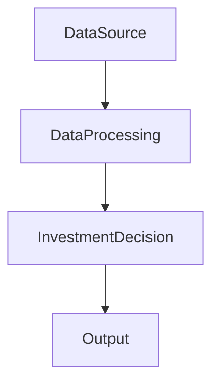
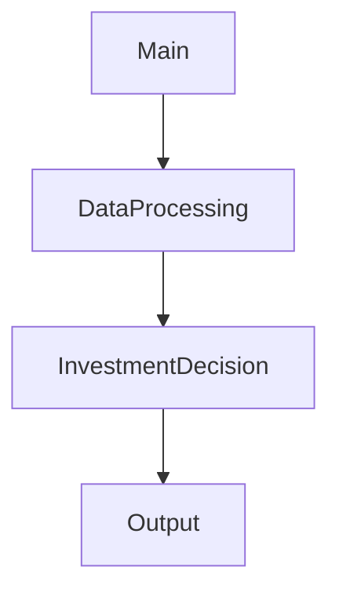

                 


# 爱德华·索普的价值平均投资法

> 关键词：价值平均投资法，市场估值，内在价值，投资策略，爱德华·索普

> 摘要：本文深入探讨了爱德华·索普的价值平均投资法，从其数学模型、系统架构到实际应用，详细分析了该方法的核心思想、实现过程和投资策略。通过理论分析和实战案例，展示了如何利用价值平均法进行有效的投资决策。

---

# 第一部分：价值平均投资法概述

## 第1章：价值平均投资法的背景与核心概念

### 1.1 价值平均投资法的背景介绍

#### 1.1.1 投资学的基本概念
投资学是研究如何有效配置和管理资金，以实现资产增值的学科。在投资领域，投资者通常关注资产的内在价值和市场价值，以决定何时买入或卖出资产。爱德华·索普（Edward Thorp）是投资学领域的先驱，他的价值平均投资法（VAM，Value Average Investment Method）是一种基于市场估值的投资策略，旨在通过长期持有低估资产来实现超额收益。

#### 1.1.2 价值投资的起源与发展
价值投资起源于20世纪初，由本杰明·格雷厄姆（Benjamin Graham）和戴维·多德（David Dodd）提出，强调购买低于其内在价值的资产。爱德华·索普进一步发展了这一理念，提出了价值平均法，通过计算资产的内在价值与市场价值的平均值来确定投资时机。

#### 1.1.3 爱德华·索普的学术贡献
爱德华·索普是著名的数学家和投资理论家，他的研究领域包括概率论、随机过程和投资策略。价值平均法是其最具影响力的贡献之一，该方法通过量化分析，帮助投资者在市场低估时买入，在高估时卖出，从而实现长期收益最大化。

### 1.2 价值平均投资法的核心概念

#### 1.2.1 投资的定义与分类
投资是将资金配置到不同资产或项目中，以期获得收益的过程。根据资产的流动性、风险性和收益性，投资可以分为股票、债券、房地产等多种形式。价值平均法主要应用于股票投资，通过分析股票的市场估值和内在价值来指导投资决策。

#### 1.2.2 市场价值与内在价值的对比
市场价值是指资产在市场上的当前价格，受市场供需关系和投资者情绪的影响较大。内在价值是资产基于其基本面因素（如盈利能力、现金流、行业地位等）的合理价值，是投资者进行投资决策的重要依据。价值平均法强调内在价值的重要性，认为市场价值会在长期内回归内在价值。

#### 1.2.3 价值平均法的数学模型
价值平均法的核心在于计算资产的内在价值和市场价值的平均值，从而判断资产是否被低估或高估。其数学模型如下：

$$
\text{平均值} = \frac{\text{内在价值} + \text{市场价值}}{2}
$$

如果市场价值低于平均值，则资产被低估，应买入；反之，如果市场价值高于平均值，则资产被高估，应卖出。

### 1.3 价值平均投资法的优缺点

#### 1.3.1 投资策略的优势分析
1. **长期视角**：价值平均法强调长期投资，避免了短期市场波动的干扰。
2. **量化分析**：通过数学模型量化内在价值和市场价值，提高了投资决策的科学性。
3. **风险控制**：通过平均值的计算，投资者可以在市场低估时逐步买入，分摊投资风险。

#### 1.3.2 方法的局限性与挑战
1. **模型假设的局限**：价值平均法假设市场价值会在长期内回归内在价值，但在现实中，市场可能会长期偏离这一假设。
2. **数据依赖性**：该方法依赖于准确的内在价值和市场价值数据，数据误差可能影响决策的准确性。
3. **市场环境的影响**：在市场剧烈波动或经济危机时，价值平均法可能无法有效应对。

#### 1.3.3 与其他投资策略的对比
与技术分析相比，价值平均法更注重基本面分析，强调长期价值。与指数投资法相比，价值平均法更注重市场估值，能够在市场低估时增加仓位，高估时减少仓位。

---

## 第2章：价值平均投资法的数学模型与算法

### 2.1 价值平均法的数学公式

#### 2.1.1 内在价值的计算公式
内在价值的计算通常基于资产的现金流折现模型（DCF）。例如，股票的内在价值可以表示为：

$$
\text{内在价值} = \frac{\text{预期现金流}}{\text{折现率}}
$$

#### 2.1.2 市场价值与平均值的比较
市场价值与平均值的比较公式为：

$$
\text{市场价值} < \text{平均值} \quad \Rightarrow \quad \text{买入}
$$

$$
\text{市场价值} > \text{平均值} \quad \Rightarrow \quad \text{卖出}
$$

#### 2.1.3 投资决策的数学模型
投资决策的逻辑如下：

1. 计算资产的内在价值。
2. 计算市场价值与内在价值的平均值。
3. 比较市场价值与平均值，决定是否买入或卖出。

### 2.2 价值平均法的算法流程

#### 2.2.1 数据输入与处理
1. 获取资产的财务数据（如收入、利润、现金流）。
2. 计算内在价值。

#### 2.2.2 计算内在价值与市场价值
1. 根据现金流折现模型计算内在价值。
2. 获取市场价值。

#### 2.2.3 投资决策的判断逻辑
1. 计算平均值。
2. 比较市场价值与平均值，决定投资行动。

### 2.3 算法实现的代码示例

#### 2.3.1 Python代码实现
```python
def calculate_intrinsic_value(cash_flow, discount_rate):
    return cash_flow / discount_rate

def value_average_method(intrinsic_value, market_value):
    average = (intrinsic_value + market_value) / 2
    if market_value < average:
        return "买入"
    elif market_value > average:
        return "卖出"
    else:
        return "持有"

# 示例
cash_flow = 100  # 假设的现金流
discount_rate = 0.05  # 折现率
intrinsic_value = calculate_intrinsic_value(cash_flow, discount_rate)
market_value = 80  # 市场价值
decision = value_average_method(intrinsic_value, market_value)
print(f"投资决策：{decision}")
```

#### 2.3.2 算法的运行流程
1. 输入现金流和折现率，计算内在价值。
2. 输入市场价值。
3. 计算平均值。
4. 比较市场价值与平均值，输出投资决策。

---

## 第3章：价值平均投资法的系统架构与实现

### 3.1 系统架构设计

#### 3.1.1 系统功能模块划分
系统架构包括以下几个模块：
1. 数据获取模块：获取资产的财务数据和市场数据。
2. 数据处理模块：计算内在价值和市场价值。
3. 投资决策模块：根据价值平均法判断投资行动。
4. 结果输出模块：输出投资决策结果。

#### 3.1.2 数据流与模块交互
数据从数据源流向数据处理模块，经过计算后，投资决策模块根据结果输出决策。

#### 3.1.3 系统架构的 Mermaid 图


### 3.2 数据获取与处理

#### 3.2.1 数据来源与获取方式
数据来源包括财务报表、市场数据等。可以通过API（如Yahoo Finance API）获取数据。

#### 3.2.2 数据清洗与预处理
数据清洗包括处理缺失值、异常值等。

#### 3.2.3 数据存储与管理
数据可以存储在数据库中，便于后续处理和分析。

### 3.3 算法实现与接口设计

#### 3.3.1 算法接口的设计
接口设计包括数据输入、计算内在价值、计算市场价值、判断投资行动等。

#### 3.3.2 接口调用的实现
通过调用函数实现接口功能。

#### 3.3.3 系统交互的 Mermaid 图


### 3.4 系统实现的代码示例

#### 3.4.1 系统主程序代码
```python
def main():
    # 获取数据
    data = get_data()
    # 处理数据
    processed_data = process_data(data)
    # 计算内在价值和市场价值
    intrinsic_value = calculate_intrinsic_value(processed_data)
    market_value = get_market_value()
    # 判断投资行动
    decision = value_average_method(intrinsic_value, market_value)
    # 输出结果
    print(decision)

if __name__ == "__main__":
    main()
```

#### 3.4.2 各模块之间的交互代码
```python
def get_data():
    # 从API获取数据
    pass

def process_data(data):
    # 数据清洗和预处理
    pass

def calculate_intrinsic_value(data):
    # 计算内在价值
    pass

def get_market_value():
    # 获取市场价值
    pass

def value_average_method(intrinsic_value, market_value):
    # 判断投资行动
    pass
```

---

## 第4章：价值平均投资法的项目实战

### 4.1 项目背景与目标

#### 4.1.1 项目需求分析
通过实现价值平均法，帮助投资者做出科学的投资决策。

#### 4.1.2 项目目标设定
实现价值平均法的自动化投资决策系统。

#### 4.1.3 项目范围与约束
项目范围包括数据获取、计算和决策输出，约束包括数据获取的实时性、系统的稳定性等。

### 4.2 项目实施步骤

#### 4.2.1 数据收集与准备
收集资产的财务数据和市场数据。

#### 4.2.2 算法实现与测试
实现价值平均法的算法，并进行测试。

#### 4.2.3 系统部署与验证
部署系统并进行验证。

### 4.3 项目成果展示

#### 4.3.1 系统功能演示
通过示例展示系统功能。

#### 4.3.2 投资决策案例分析
以苹果股票为例，分析如何应用价值平均法进行投资决策。

#### 4.3.3 项目总结与反思
总结项目成果，反思不足之处。

---

## 第5章：价值平均投资法的最佳实践与注意事项

### 5.1 投资策略的优化建议

#### 5.1.1 理解市场的波动性
市场波动是不可避免的，投资者应保持耐心，避免短期决策。

#### 5.1.2 定期调整投资组合
根据市场变化定期调整投资组合，降低风险。

#### 5.1.3 风险控制的策略
设定止损点，避免重大损失。

### 5.2 系统实现的注意事项

#### 5.2.1 数据源的可靠性
确保数据来源可靠，避免数据误差影响决策。

#### 5.2.2 算法的可扩展性
设计算法时考虑其可扩展性，便于未来优化和升级。

#### 5.2.3 系统的稳定性与维护
确保系统的稳定运行，定期维护和更新。

---

# 总结

爱德华·索普的价值平均投资法是一种科学的投资策略，通过量化分析和长期视角帮助投资者做出明智的投资决策。本文从数学模型、系统架构到实际应用，全面探讨了该方法的核心思想和实现过程。通过实际案例分析，展示了如何将理论应用于实践。未来的研究可以进一步优化算法，提高投资决策的准确性。

作者：AI天才研究院/AI Genius Institute & 禅与计算机程序设计艺术/Zen And The Art of Computer Programming

