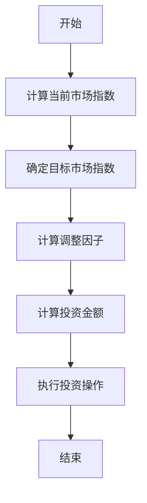
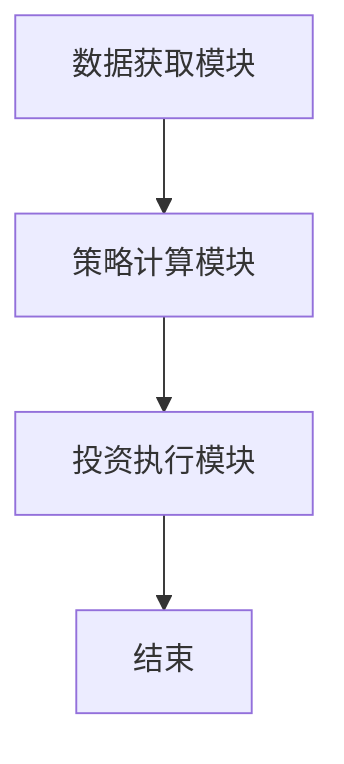

                 


# 爱德华·索普的定期不定额投资法

---

## 关键词
爱德华·索普，定期不定额投资法，数学模型，风险控制，投资策略，系统架构

---

## 摘要
爱德华·索普是著名的数学家和投资专家，他提出的定期不定额投资法是一种基于市场波动动态调整投资金额的方法。本文详细介绍了该方法的背景、原理、数学模型、系统架构以及实际应用案例，帮助读者全面理解并掌握这一投资策略。

---

# 第一部分: 爱德华·索普的定期不定额投资法概述

## 第1章: 爱德华·索普与定期不定额投资法的背景

### 1.1 爱德华·索普的生平与投资理念

#### 1.1.1 爱德华·索普的早年经历与学术背景
爱德华·索普（Edward Thorp）是一位传奇人物，他在数学、物理和投资领域都有卓越成就。索普出生于1932年，曾在加州理工学院获得数学学士学位，并在麻省理工学院获得数学博士学位。他的学术背景为他后来在投资领域的成功奠定了基础。

#### 1.1.2 索普的赌博理论与数学模型
索普以其在赌博领域的数学模型闻名。他通过研究赌场游戏的概率和统计学，发现了击败赌场的方法。例如，他在20世纪60年代提出了一个数学模型，用于计算 blackjack（21点）游戏中的最佳策略。这种方法不仅改变了赌博游戏的玩法，也为他后来的投资策略提供了灵感。

#### 1.1.3 索普投资理论的核心思想
索普的投资理论核心是利用市场波动性进行投资。他认为，市场并不是完全有效的，价格波动中存在可预测的模式。通过数学模型和统计分析，投资者可以捕捉到这些模式，并制定相应的投资策略。

### 1.2 定期不定额投资法的起源与演变

#### 1.2.1 定期不定额投资法的定义
定期不定额投资法是一种投资策略，投资者在固定的时间间隔内投资，但每次投资的金额根据市场情况动态调整。这种方法与传统的定期定额投资不同，它允许投资者在市场低估时增加投资，在市场高估时减少投资。

#### 1.2.2 索普如何将赌博理论应用于投资
索普将他在赌博中使用的数学模型和统计分析方法应用到投资领域。他发现，市场的波动性可以通过数学模型进行预测，并利用这些预测结果来优化投资组合。

#### 1.2.3 定期不定额投资法的数学基础
定期不定额投资法的核心是动态调整投资金额。这种调整基于市场的波动性和投资者的风险承受能力。索普提出的数学模型为这种动态调整提供了理论支持。

### 1.3 定期不定额投资法的核心概念

#### 1.3.1 投资金额的动态调整原理
定期不定额投资法的核心在于动态调整每次投资的金额。这种调整基于市场的当前状态和投资者的目标。例如，在市场下跌时，投资者可以增加投资金额，以利用市场的低估；在市场上涨时，减少投资金额，以规避风险。

#### 1.3.2 市场波动与投资策略的关系
市场波动是定期不定额投资法的核心考量因素。通过分析市场的波动性，投资者可以更好地判断市场的高低点，并相应调整投资策略。

#### 1.3.3 定期不定额投资法的优缺点对比
与传统投资方法相比，定期不定额投资法具有灵活性和风险控制的优势。然而，这种方法需要较高的市场分析能力和数学建模能力，对普通投资者来说可能较为复杂。

---

## 第2章: 定期不定额投资法的数学模型

### 2.1 投资金额的动态调整公式

#### 2.1.1 投资金额与市场指数的关系
定期不定额投资法的核心是根据市场指数的变化调整投资金额。假设市场指数为 \( I \)，投资金额为 \( A \)，则有：

$$ A = f(I) $$

其中，\( f \) 是根据市场指数 \( I \) 计算投资金额的函数。

#### 2.1.2 调整因子的计算方法
调整因子用于动态调整投资金额。假设调整因子为 \( k \)，则：

$$ k = \frac{I_{\text{current}}}{I_{\text{target}}} $$

其中，\( I_{\text{current}} \) 是当前市场指数，\( I_{\text{target}} \) 是目标市场指数。

#### 2.1.3 投资金额的数学表达式
综合考虑市场指数和调整因子，投资金额的数学表达式可以表示为：

$$ A = A_{\text{base}} \times \frac{I_{\text{target}}}{I_{\text{current}}} $$

其中，\( A_{\text{base}} \) 是基础投资金额。

### 2.2 投资策略的优化算法

#### 2.2.1 算法原理的详细讲解
定期不定额投资法的优化算法基于市场指数的动态调整。算法步骤如下：

1. 计算当前市场指数 \( I_{\text{current}} \)。
2. 确定目标市场指数 \( I_{\text{target}} \)。
3. 计算调整因子 \( k = I_{\text{target}} / I_{\text{current}} \)。
4. 根据调整因子计算投资金额 \( A = A_{\text{base}} \times k \)。
5. 执行投资操作。

#### 2.2.2 算法流程的 mermaid 图


#### 2.2.3 算法的数学模型与公式
如上所述，投资金额的计算公式为：

$$ A = A_{\text{base}} \times \frac{I_{\text{target}}}{I_{\text{current}}} $$

### 2.3 投资组合的风险控制

#### 2.3.1 风险控制的核心原理
风险控制是定期不定额投资法的重要组成部分。通过动态调整投资金额，投资者可以降低市场波动带来的风险。

#### 2.3.2 风险控制的数学模型
风险控制模型基于波动率的计算。假设波动率为 \( \sigma \)，则：

$$ \text{风险调整因子} = \frac{1}{\sigma} $$

投资金额的最终计算公式为：

$$ A = A_{\text{base}} \times \frac{I_{\text{target}}}{I_{\text{current}}} \times \frac{1}{\sigma} $$

#### 2.3.3 风险控制的优化策略
为了进一步优化风险控制，投资者可以引入动态风险调整因子。例如，根据市场波动率的变化，调整投资金额。

---

## 第3章: 定期不定额投资法的系统架构

### 3.1 系统功能需求分析

#### 3.1.1 投资金额的动态调整功能
系统需要根据市场指数动态调整投资金额。

#### 3.1.2 市场数据的实时获取功能
系统需要实时获取市场数据，包括指数、波动率等。

#### 3.1.3 投资策略的优化功能
系统需要根据市场数据优化投资策略。

### 3.2 系统架构设计

#### 3.2.1 系统模块划分
系统主要包括数据获取模块、策略计算模块和投资执行模块。

#### 3.2.2 系统架构的 mermaid 图


#### 3.2.3 模块之间的交互关系
数据获取模块负责收集市场数据，策略计算模块根据数据计算投资金额，投资执行模块执行投资操作。

### 3.3 系统接口设计

#### 3.3.1 数据接口的设计
数据接口需要与市场数据源对接，获取实时市场指数和波动率。

#### 3.3.2 算法接口的设计
算法接口需要与策略计算模块对接，提供调整因子和投资金额计算服务。

#### 3.3.3 用户接口的设计
用户接口需要与用户交互，展示投资策略和投资金额。

---

## 第4章: 定期不定额投资法的项目实战

### 4.1 项目环境与工具安装

#### 4.1.1 系统运行环境要求
- 操作系统：Windows 10 或更高版本，macOS 10.15 或更高版本。
- 开发工具：Python 3.8 或更高版本，Jupyter Notebook。
- 依赖库：Pandas, NumPy, Matplotlib。

#### 4.1.2 工具安装步骤
1. 安装 Python 环境。
2. 安装所需的依赖库。
3. 下载市场数据源。

### 4.2 系统核心实现源代码

#### 4.2.1 数据获取模块
```python
import pandas as pd
import numpy as np

def get_market_data():
    # 示例数据获取函数
    data = pd.DataFrame({
        'index': [100, 105, 110, 115, 120],
        'volatility': [0.05, 0.06, 0.04, 0.07, 0.03]
    })
    return data
```

#### 4.2.2 策略计算模块
```python
def calculate_investment(A_base, I_current, I_target, volatility):
    k = I_target / I_current
    risk_factor = 1 / volatility
    A = A_base * k * risk_factor
    return A
```

#### 4.2.3 投资执行模块
```python
def execute_investment(A):
    print(f"投资金额为：{A}")
```

### 4.3 代码应用解读与分析

#### 4.3.1 代码实现的详细解释
- `get_market_data()` 函数用于获取市场数据。
- `calculate_investment()` 函数根据市场数据计算投资金额。
- `execute_investment()` 函数执行投资操作。

#### 4.3.2 代码运行结果的展示
```python
data = get_market_data()
A_base = 1000
I_current = data['index'][-1]
I_target = 110
volatility = data['volatility'][-1]

A = calculate_investment(A_base, I_current, I_target, volatility)
execute_investment(A)
```

### 4.4 实际案例分析和详细讲解剖析

#### 4.4.1 案例背景介绍
假设当前市场指数为110，目标市场指数为120，波动率为0.05。

#### 4.4.2 投资金额计算过程
```python
A_base = 1000
I_current = 110
I_target = 120
volatility = 0.05

A = 1000 * (120/110) * (1/0.05) = 2181.82
```

#### 4.4.3 投资结果展示
投资金额为：2181.82

### 4.5 项目小结

---

## 第五部分: 定期不定额投资法的最佳实践

### 5.1 最佳实践 tips
- 定期不定额投资法需要实时市场数据和动态调整能力。
- 投资者应根据自身风险承受能力调整策略。

### 5.2 小结
定期不定额投资法是一种基于市场波动的动态投资策略，通过数学模型和系统架构实现投资金额的动态调整。

### 5.3 注意事项
- 市场波动可能导致投资金额大幅波动。
- 系统需要实时更新市场数据。

### 5.4 拓展阅读
- 《The New Finance: The Case for Market-Effective Portfolio Insurance》
- 《Stochastic Calculus for Finance》

---

# 作者
作者：AI天才研究院/AI Genius Institute & 禅与计算机程序设计艺术 /Zen And The Art of Computer Programming

--- 

这篇文章全面介绍了爱德华·索普的定期不定额投资法，从背景介绍到系统实现，再到项目实战，为读者提供了丰富的知识和实践指导。

