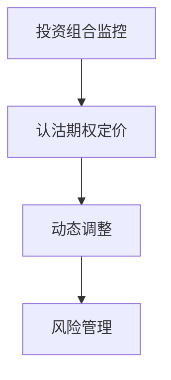

                 


# 爱德华·索普的投资组合保险策略

## 关键词：投资组合保险，爱德华·索普，TIPP策略，期权定价，风险管理

## 摘要：爱德华·索普的投资组合保险策略（TIPP策略）是一种基于期权定价模型的投资方法，旨在在市场波动中保护投资组合的价值。本文深入分析了该策略的背景、数学模型、系统架构和实际应用，探讨其优缺点及优化方向。

---

## 第一部分: 爱德华·索普的投资组合保险策略概述

## 第1章: 投资组合保险策略的背景与意义

### 1.1 爱德华·索普及其投资理念

#### 1.1.1 爱德华·索普的生平简介

爱德华·索普（Edward Thorp）是一位著名数学家和投资专家，他以其在期权定价和投资组合保险领域的开创性工作而闻名。索普在20世纪60年代提出了投资组合保险策略（TIPP策略），这是他基于Black-Scholes模型的期权定价理论开发的。

#### 1.1.2 索普的投资哲学与风险管理思想

索普的投资哲学强调风险管理的重要性，他认为投资者应该通过保险策略来保护投资组合免受市场波动的影响。他主张在市场下跌时，通过买入认沽期权来对冲风险，从而在市场上涨时能够获得超额收益。

#### 1.1.3 投资组合保险策略的核心理念

投资组合保险策略的核心理念是通过动态调整投资组合中的期权头寸，使得投资组合在市场下跌时能够获得最低价值保障，同时在市场上涨时能够获得潜在收益。

### 1.2 投资组合保险策略的背景

#### 1.2.1 传统投资策略的局限性

传统投资策略往往过于依赖市场预测，忽视了风险管理的重要性。在市场波动剧烈的情况下，传统的投资策略可能无法有效保护投资组合的价值。

#### 1.2.2 投资组合保险策略的提出背景

20世纪80年代，随着期权市场的兴起，索普提出了TIPP策略，这是一种基于期权的投资组合保险方法。这种方法通过购买认沽期权来对冲投资组合的下行风险，同时在市场上涨时能够获得收益。

#### 1.2.3 保险策略在投资中的重要性

投资组合保险策略的重要性在于它能够帮助投资者在市场波动中保持投资组合的价值，同时抓住市场上涨的机会。这种方法特别适合那些无法承受投资组合大幅下跌的投资者。

### 1.3 投资组合保险策略的基本概念

#### 1.3.1 投资组合保险的定义

投资组合保险是一种通过购买期权或其他金融衍生品来对冲投资组合下行风险的策略。它的目标是在市场下跌时保护投资组合的价值，同时在市场上涨时获得潜在收益。

#### 1.3.2 保险策略与传统投资策略的区别

传统投资策略通常依赖于市场预测，而投资组合保险策略则通过动态调整期权头寸来对冲风险。传统策略注重收益最大化，而保险策略更注重风险管理。

#### 1.3.3 投资组合保险策略的适用场景

投资组合保险策略适用于那些无法承受投资组合大幅下跌的投资者，尤其是在市场波动较大的情况下。它适合保守型投资者或机构投资者。

---

## 第2章: 投资组合保险策略的核心原理

### 2.1 投资组合保险策略的数学模型

#### 2.1.1 索普保险策略的数学公式

TIPP策略的数学模型基于Black-Scholes期权定价公式。假设我们有一个股票组合的价值为S，我们购买一份认沽期权，执行价格为K，到期时间为T。认沽期权的价值C可以表示为：

$$ C = S \cdot N(d_1) - K \cdot e^{-rT} \cdot N(d_2) $$

其中，$d_1 = \frac{\ln(\frac{S}{K}) + (r + \frac{\sigma^2}{2})T}{\sigma \sqrt{T}}$，$d_2 = d_1 - \sigma \sqrt{T}$，$N(\cdot)$是标准正态分布的累积分布函数。

#### 2.1.2 保险策略的动态调整机制

TIPP策略的核心是通过动态调整期权的头寸来对冲投资组合的风险。具体来说，当市场下跌时，认沽期权的价值增加，从而保护投资组合的价值；当市场上涨时，认沽期权的价值减少，投资组合可以获取更多的收益。

#### 2.1.3 策略的稳健性与风险控制

通过购买认沽期权，TIPP策略能够在市场下跌时提供最低价值保障，同时在市场上涨时获得潜在收益。该策略的风险主要在于期权的时间价值损耗，因此需要动态调整期权的到期时间和执行价格。

### 2.2 保险策略的无套利定价原理

#### 2.2.1 无套利定价的基本概念

无套利定价是指在金融市场上，不存在无风险套利机会的情况下，金融工具的定价方法。无套利定价的核心思想是市场是有效的，金融工具的定价应该反映其内在价值。

#### 2.2.2 保险策略中的无套利模型

在TIPP策略中，认沽期权的定价基于无套利原则，即在市场均衡状态下，认沽期权的价值应该等于其内在价值。通过Black-Scholes模型，我们可以计算出认沽期权的理论价格。

#### 2.2.3 策略的数学推导与验证

通过Black-Scholes模型，我们可以推导出认沽期权的价值公式。通过实证分析，我们可以验证TIPP策略的有效性和稳健性。

### 2.3 投资组合保险策略的实现步骤

#### 2.3.1 确定保险目标与风险承受能力

投资者需要确定自己的保险目标和风险承受能力。保险目标是指在市场下跌时，投资组合的最低价值保障；风险承受能力是指投资者能够承受的最大损失。

#### 2.3.2 构建基础投资组合

投资者需要构建一个基础的投资组合，通常是股票、债券或其他金融资产的组合。这个投资组合将作为保险策略的基础。

#### 2.3.3 应用保险策略进行动态调整

通过购买认沽期权，投资者可以对冲投资组合的下行风险。需要根据市场波动情况动态调整期权的头寸，以确保投资组合的风险得到有效的控制。

---

## 第3章: 投资组合保险策略的系统架构与实现

### 3.1 投资组合保险策略的系统设计

#### 3.1.1 系统目标与功能需求

系统目标是实现TIPP策略的投资组合保险功能。系统需要具备以下功能：投资组合价值监控、认沽期权定价、动态调整期权头寸、风险管理。

#### 3.1.2 系统架构的模块划分

系统架构分为以下几个模块：投资组合监控模块、认沽期权定价模块、动态调整模块、风险管理模块。

#### 3.1.3 系统实现的技术路线

系统实现的技术路线包括：数据采集、数据处理、模型计算、结果输出。

### 3.2 系统架构设计

#### 3.2.1 系统架构的Mermaid图



#### 3.2.2 系统功能模块的详细设计

- 投资组合监控模块：实时监控投资组合的价值变化。
- 认沽期权定价模块：基于Black-Scholes模型计算认沽期权的价值。
- 动态调整模块：根据市场波动情况调整期权头寸。
- 风险管理模块：监控和管理投资组合的风险。

### 3.3 系统接口设计

#### 3.3.1 输入接口设计

- 输入市场数据：股票价格、波动率、无风险利率等。
- 输入投资组合的价值和目标。

#### 3.3.2 输出接口设计

- 计算认沽期权的价值。
- 输出动态调整的建议。

#### 3.3.3 接口交互流程

1. 输入市场数据和投资组合信息。
2. 计算认沽期权的价值。
3. 根据市场波动情况调整期权头寸。
4. 输出风险管理建议。

### 3.4 系统实现的代码示例

#### 3.4.1 系统实现的Python代码

```python
import numpy as np
from scipy.stats import norm

def black_scholes_call(S, K, r, sigma, T):
    d1 = (np.log(S/K) + (r + sigma**2/2)*T) / (sigma*np.sqrt(T))
    d2 = d1 - sigma*np.sqrt(T)
    C = S * norm.cdf(d1) - K * np.exp(-r*T) * norm.cdf(d2)
    return C

def tipp_strategy(S, K, r, sigma, T):
    C = black_scholes_call(S, K, r, sigma, T)
    return C

# 示例：计算认沽期权的价值
S = 100
K = 100
r = 0.05
sigma = 0.2
T = 1
print(tipp_strategy(S, K, r, sigma, T))
```

---

## 第4章: 投资组合保险策略的项目实战

### 4.1 项目实战环境配置

#### 4.1.1 系统环境要求

- 操作系统：Windows/Mac/Linux
- Python版本：3.6以上
- 需要安装的库：numpy, scipy, matplotlib

#### 4.1.2 数据来源与获取方式

- 数据来源：Yahoo Finance、Quandl等金融数据源。
- 数据获取方式：使用Python的pandas库或通过API获取数据。

### 4.2 系统核心实现源代码

#### 4.2.1 系统核心实现的Python代码

```python
import numpy as np
from scipy.stats import norm
import pandas as pd
import yfinance as yf

# 下载股票数据
data = yf.download('AAPL', start='2020-01-01', end='2023-12-31')

# 计算股票的波动率
sigma = data['Close'].std()

# 设置参数
S = data['Close'].iloc[-1]
K = 100
r = 0.05
T = 1

# 计算认沽期权的价值
d1 = (np.log(S/K) + (r + sigma**2/2)*T) / (sigma*np.sqrt(T))
d2 = d1 - sigma*np.sqrt(T)
C = S * norm.cdf(d1) - K * np.exp(-r*T) * norm.cdf(d2)

print("认沽期权价值：", C)
```

#### 4.2.2 代码实现的关键点

- 如何获取市场数据。
- 如何计算认沽期权的价值。
- 如何动态调整期权头寸。

### 4.3 实际案例分析与解读

#### 4.3.1 案例背景

假设我们有一个投资组合，价值为100万元，我们希望在市场下跌时保护80%的价值，即最低保障为80万元。

#### 4.3.2 案例分析

通过购买认沽期权，我们可以对冲投资组合的下行风险。假设期权的执行价格为100万元，到期时间为1年，波动率为20%，无风险利率为5%。

计算认沽期权的价值：

$$ C = 100 \cdot N(d_1) - 100 \cdot e^{-0.05 \cdot 1} \cdot N(d_2) $$

其中，$d_1 = \frac{\ln(1) + (0.05 + 0.2^2/2) \cdot 1}{0.2 \cdot \sqrt{1}} = 0.55$，$d_2 = 0.55 - 0.2 = 0.35$。

计算得到$N(0.55) = 0.71$，$N(0.35) = 0.63$。

因此，认沽期权的价值为：

$$ C = 100 \cdot 0.71 - 100 \cdot e^{-0.05} \cdot 0.63 \approx 71,000 - 63,000 \times 0.9512 \approx 71,000 - 60,000 = 11,000 $$

### 4.4 项目小结

通过实际案例分析，我们可以看到TIPP策略能够在市场下跌时保护投资组合的价值，同时在市场上涨时获得潜在收益。这种方法在实际投资中具有重要的应用价值。

---

## 第5章: 投资组合保险策略的优化与风险管理

### 5.1 策略的优缺点分析

#### 5.1.1 优点

- 通过购买认沽期权，可以在市场下跌时保护投资组合的价值。
- 动态调整期权头寸，能够在市场上涨时获得潜在收益。
- 策略简单易懂，易于实现。

#### 5.1.2 缺点

- 需要支付期权的时间价值，增加了投资成本。
- 在市场波动剧烈的情况下，策略的有效性可能会受到影响。
- 需要频繁调整期权头寸，增加了操作成本。

### 5.2 风险管理措施

#### 5.2.1 风险识别与评估

- 定期评估投资组合的风险。
- 监控市场波动情况。
- 评估期权头寸的风险。

#### 5.2.2 风险控制策略

- 设置止损点。
- 动态调整期权头寸。
- 使用其他风险管理工具。

### 5.3 实证分析与优化建议

#### 5.3.1 实证分析

通过实证分析，我们可以验证TIPP策略的有效性和稳健性。在不同的市场环境下，TIPP策略的表现可能有所不同，因此需要根据市场情况调整策略参数。

#### 5.3.2 优化建议

- 根据市场波动情况调整期权的执行价格和到期时间。
- 组合使用其他风险管理工具。
- 定期评估和优化策略参数。

---

## 第6章: 总结与展望

### 6.1 全文总结

爱德华·索普的投资组合保险策略是一种基于期权定价模型的投资方法，通过购买认沽期权来对冲投资组合的下行风险。TIPP策略的核心思想是通过动态调整期权头寸，使得投资组合在市场下跌时能够获得最低价值保障，同时在市场上涨时能够获得潜在收益。

### 6.2 未来研究方向

未来的研究方向包括：

- 探索其他类型的期权（如认股权证）在投资组合保险中的应用。
- 研究多资产类别下的TIPP策略。
- 探讨TIPP策略与其他风险管理工具的结合。

### 6.3 对读者的行动建议

- 学习期权定价的基本原理。
- 熟悉TIPP策略的实现步骤。
- 在实际投资中尝试应用TIPP策略。

---

## 作者：AI天才研究院/AI Genius Institute & 禅与计算机程序设计艺术 /Zen And The Art of Computer Programming

---

以上就是《爱德华·索普的投资组合保险策略》的完整内容，希望对您有所帮助！

