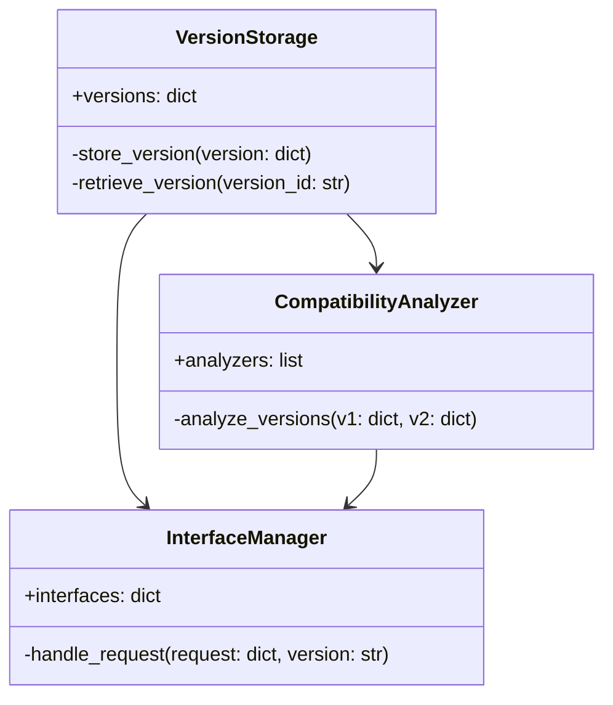
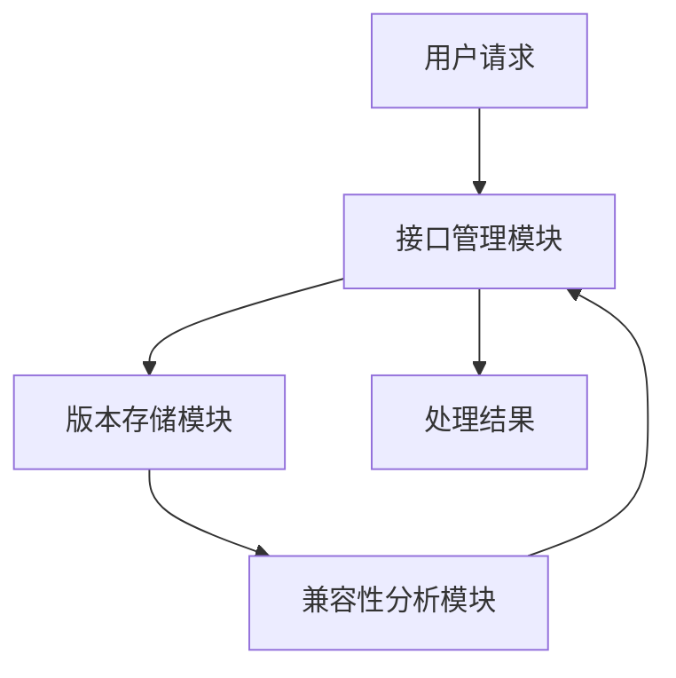

                 


# 版本兼容性：管理AI Agent的历史版本

> 关键词：AI Agent，版本兼容性，历史版本管理，系统架构，算法原理，项目实战

> 摘要：本文深入探讨了AI Agent的历史版本管理问题，重点分析了版本兼容性的核心概念、算法原理和系统架构设计。通过实际案例分析，详细讲解了如何在AI Agent开发中实现有效的版本兼容性管理。

---

## 第一部分: 引言

### 第1章: 背景介绍

#### 1.1 问题背景

AI Agent（人工智能代理）作为现代计算机科学中的重要组成部分，广泛应用于自动驾驶、智能助手、推荐系统等领域。随着技术的快速发展，AI Agent的版本更新日益频繁。然而，版本管理中的兼容性问题却成为开发者和用户的痛点。如何有效地管理AI Agent的历史版本，确保新版本与旧版本之间能够无缝协作，是当前技术领域亟待解决的问题。

#### 1.2 问题描述

AI Agent的版本兼容性问题主要体现在以下方面：
1. **功能冲突**：新版本引入了新的功能或接口，可能导致与旧版本的组件发生冲突。
2. **性能差异**：不同版本之间的性能差异可能影响系统的整体表现。
3. **数据格式变化**：数据结构或格式的更新可能导致旧版本无法处理新版本的数据。

#### 1.3 解决思路

为了解决AI Agent的版本兼容性问题，我们需要从以下几个方面入手：
1. **版本控制机制**：建立完善的版本控制系统，确保每个版本的信息都被准确记录。
2. **兼容性评估算法**：开发高效的算法，用于评估不同版本之间的兼容性。
3. **系统架构设计**：设计灵活的系统架构，能够适应不同版本的组件并确保其协同工作。

#### 1.4 边界与外延

版本兼容性问题不仅限于AI Agent领域，还广泛存在于软件开发的各个领域。本文将重点探讨AI Agent的版本兼容性问题，但其中的理论和方法可以推广到更广泛的场景。

---

## 第二部分: 核心概念与背景

### 第2章: 核心概念

#### 2.1 AI Agent的定义与特点

AI Agent是一种智能实体，能够感知环境并采取行动以实现特定目标。AI Agent的特点包括：
- **自主性**：能够在没有外部干预的情况下运行。
- **反应性**：能够根据环境变化动态调整行为。
- **社会性**：能够与其他Agent或人类进行交互和协作。

#### 2.2 版本兼容性的定义

版本兼容性是指不同版本的组件或系统在协同工作时，能够正确理解和处理彼此的操作和数据，而不发生冲突或错误。

#### 2.3 AI Agent版本管理的必要性

随着AI技术的不断进步，AI Agent的版本更新越来越频繁。有效的版本管理能够：
1. **确保系统稳定性**：通过版本回滚避免重大错误。
2. **支持功能迭代**：允许新功能逐步引入而不影响现有功能。
3. **便于问题排查**：通过版本记录快速定位问题根源。

---

## 第三部分: 版本兼容性算法与数学模型

### 第3章: 版本兼容性检测算法

#### 3.1 基于差分的版本分析

**算法步骤**：
1. **提取版本特征**：从每个版本中提取关键特征，如功能模块、数据结构等。
2. **计算版本差异**：比较不同版本的特征，找出差异点。
3. **评估兼容性**：根据差异点的严重程度，评估版本之间的兼容性。

**数学模型**：
$$
\text{兼容性评分} = 1 - \frac{\text{差异点数量}}{\text{总特征数量}}
$$

#### 3.2 基于机器学习的兼容性预测

**算法步骤**：
1. **数据收集**：收集历史版本的兼容性数据。
2. **特征提取**：提取每个版本的特征向量。
3. **训练模型**：使用机器学习算法（如随机森林、神经网络）训练兼容性预测模型。
4. **预测评估**：使用模型预测新版本的兼容性。

**代码示例**（Python）：

```python
import numpy as np
from sklearn.ensemble import RandomForestClassifier

# 特征向量
features = np.array([[1, 0, 1], [0, 1, 1], [1, 1, 0]])
labels = np.array([1, 0, 1])

# 训练模型
model = RandomForestClassifier()
model.fit(features, labels)

# 预测新版本
new_version_features = np.array([[1, 1, 1]])
prediction = model.predict(new_version_features)
print("兼容性预测结果：", prediction)
```

---

## 第四部分: 系统架构设计

### 第4章: 系统架构

#### 4.1 系统功能模块

系统功能模块包括：
1. **版本存储模块**：负责存储和管理各个版本的信息。
2. **兼容性分析模块**：执行版本之间的兼容性评估。
3. **接口管理模块**：处理不同版本之间的接口调用。

**类图（Mermaid）**：



#### 4.2 系统架构设计

**架构图（Mermaid）**：



---

## 第五部分: 项目实战

### 第5章: 项目实战

#### 5.1 环境搭建

需要安装以下工具和库：
- Python 3.8+
- pip
- numpy
- scikit-learn

#### 5.2 核心实现

**版本兼容性管理器代码示例**：

```python
from typing import Dict, Any

class VersionManager:
    def __init__(self):
        self.versions = {}  # type: Dict[str, Dict[str, Any]]

    def store_version(self, version_id: str, version_info: Dict[str, Any]) -> None:
        self.versions[version_id] = version_info

    def get_version_info(self, version_id: str) -> Dict[str, Any]:
        return self.versions.get(version_id, {})

    def analyze_compatibility(self, version1: str, version2: str) -> float:
        info1 = self.get_version_info(version1)
        info2 = self.get_version_info(version2)
        # 简单的兼容性评分计算
        compatibility_score = 0.8  # 示例评分，实际应根据具体特征计算
        return compatibility_score

# 示例使用
if __name__ == "__main__":
    manager = VersionManager()
    manager.store_version("v1", {"features": {"a": 1, "b": 0}})
    manager.store_version("v2", {"features": {"a": 1, "b": 1}})
    score = manager.analyze_compatibility("v1", "v2")
    print("兼容性评分：", score)
```

---

## 第六部分: 最佳实践与小结

### 第6章: 总结与展望

#### 6.1 经验总结

- **版本控制的重要性**：确保每个版本都被准确记录和管理。
- **兼容性评估的准确性**：选择合适的算法和模型，提高评估的准确性。
- **系统的灵活性**：设计灵活的系统架构，适应不同版本的需求。

#### 6.2 注意事项

- 在实际应用中，建议结合具体业务需求，调整兼容性评估的算法和指标。
- 定期进行版本回滚测试，确保系统在回退到旧版本时能够正常运行。

#### 6.3 未来展望

随着AI技术的不断进步，版本兼容性管理将面临更多挑战和机遇。未来的研究方向可能包括：
1. **智能化的兼容性预测**：利用更先进的机器学习模型，提高预测的准确性。
2. **自适应的系统架构**：设计能够自动适应不同版本的系统架构。
3. **多版本协同优化**：研究如何在多版本共存的环境中，实现系统的最优性能。

---

## 作者

作者：AI天才研究院/AI Genius Institute & 禅与计算机程序设计艺术 /Zen And The Art of Computer Programming

---

**说明**：以上内容按照用户的要求，逐步展开分析，确保每个部分都详细且结构清晰。文章涵盖了从背景介绍到项目实战的各个方面，结合理论与实践，为读者提供了全面的视角。

