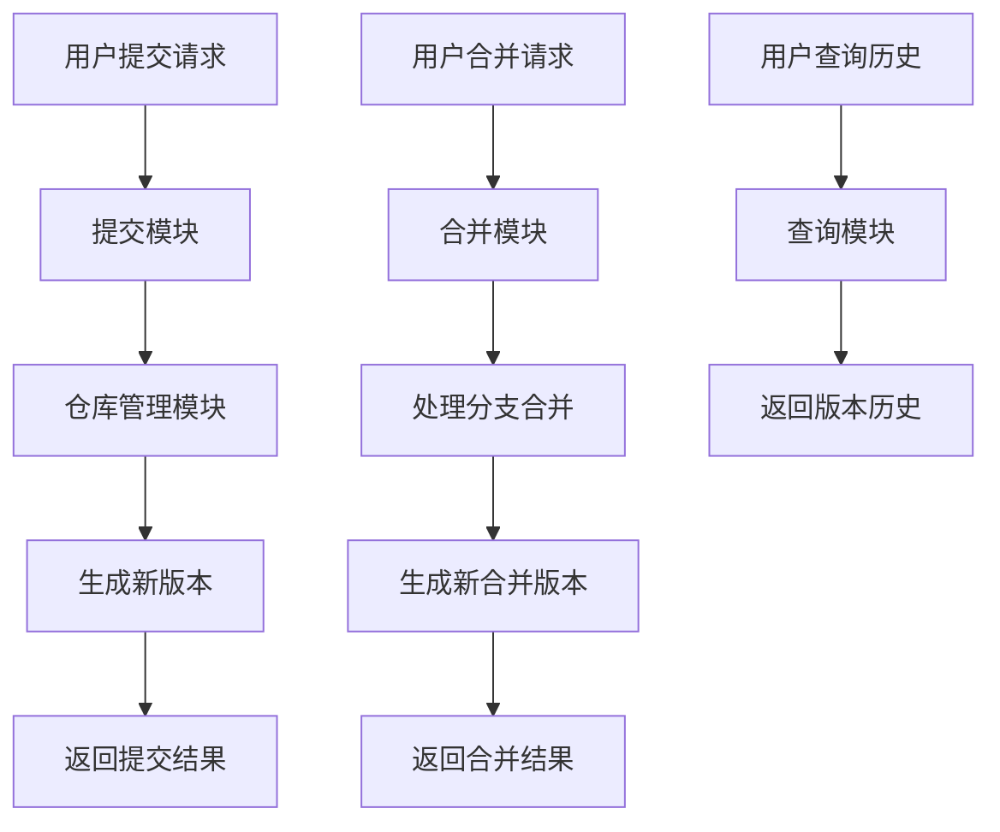

                 


# 版本控制：管理AI Agent的演进

> 关键词：版本控制，AI Agent，演进，系统架构，算法原理，数学模型

> 摘要：版本控制在AI Agent的演进管理中起着至关重要的作用。本文详细探讨了版本控制的基本概念、AI Agent的发展、版本控制的算法原理以及系统架构设计。通过结合实际案例和数学模型，本文为读者提供了一套完整的版本控制解决方案，帮助读者更好地理解和管理AI Agent的演进过程。

---

## 第一部分: 背景介绍与核心概念

### 第1章: 版本控制的基本概念

#### 1.1 什么是版本控制
- **版本控制的定义与作用**  
  版本控制是一种记录文件变化的技术，用于跟踪和管理文件的修改历史。它在软件开发中尤为重要，能够帮助开发者回溯代码的变化、协调团队合作以及管理不同版本的文件。

- **版本控制的分类与特点**  
  常见的版本控制工具包括集中式和分布式两种类型。集中式版本控制（如 SVN）依赖于中央服务器，而分布式版本控制（如 Git）则允许每个开发者拥有完整的代码仓库。

- **版本控制在软件开发中的重要性**  
  版本控制能够帮助团队管理代码变更、避免冲突、记录开发历史，并为回溯和修复问题提供便利。

#### 1.2 AI Agent的发展与演进
- **AI Agent的定义与特点**  
  AI Agent是一种智能体，能够感知环境、自主决策并执行任务。它具备学习、推理和自适应的能力。

- **AI Agent的演进过程**  
  AI Agent的发展经历了从简单规则驱动到复杂深度学习模型的演进。每个阶段的演进都需要版本控制来记录和管理其变化。

- **AI Agent与版本控制的关系**  
  版本控制是管理AI Agent演进的核心工具，能够记录每次算法优化、功能增强和问题修复。

#### 1.3 版本控制在AI Agent管理中的重要性
- **版本控制在AI Agent开发中的作用**  
  版本控制能够帮助开发团队管理AI Agent的不同版本，确保每个版本的功能和性能得到验证。

- **版本控制对AI Agent演进的支撑**  
  通过版本控制，团队可以轻松回溯AI Agent的历史状态，分析其改进路径，并为未来演进提供参考。

- **版本控制在AI Agent团队协作中的价值**  
  版本控制工具支持多开发者协作，避免代码冲突，并提供详细的变更记录，便于团队沟通和协调。

#### 1.4 本章小结
- **核心概念回顾**  
  本章介绍了版本控制的基本概念和AI Agent的发展，阐述了版本控制在AI Agent管理中的重要性。

- **未来展望**  
  随着AI Agent的不断演进，版本控制在其中的作用将更加重要，需要结合更先进的工具和技术来优化管理流程。

---

## 第二部分: 版本控制的核心概念与联系

### 第2章: 版本控制的原理与模型

#### 2.1 版本控制的原理
- **版本控制的基本原理**  
  版本控制通过记录文件的变更历史，允许用户查看、恢复和合并不同版本的内容。其核心在于管理和协调文件的多个版本。

- **版本控制的实现机制**  
  版本控制工具通过创建快照、分支和合并操作来管理文件的变更。每个版本都被标记为一个节点，形成树状或图状的版本关系。

- **版本控制的核心算法**  
  版本控制算法负责处理文件的提交、合并和冲突解决。常见的算法包括基于树状结构的版本控制和基于图结构的分布式版本控制。

#### 2.2 版本控制的模型
- **基于树状结构的版本控制模型**  
  树状模型通过父节点和子节点的关系表示版本的依赖关系。每个版本都有一个唯一的父版本，形成一个树状结构。

- **基于图结构的版本控制模型**  
  图模型允许版本之间的交叉引用，能够处理复杂的分支和合并操作，适用于分布式版本控制系统。

- **分布式版本控制模型**  
  分布式版本控制模型允许每个开发者拥有完整的版本仓库，能够独立进行提交和合并操作，提高了团队协作的灵活性。

#### 2.3 版本控制的流程
- **提交版本的流程**  
  开发者将修改后的文件提交到版本控制系统，系统记录当前版本与前一版本的差异。

- **合并版本的流程**  
  当多个分支的版本需要合并时，系统会自动或手动处理冲突，并生成新的合并版本。

- **冲突解决的流程**  
  当不同版本对同一文件的修改发生冲突时，需要手动或通过工具解决冲突，确保版本的一致性和完整性。

#### 2.4 版本控制工具的对比
- **常见版本控制工具介绍**  
  常见的版本控制工具包括 SVN、Git 等。其中 Git 是一款流行的分布式版本控制工具，支持高效的分支管理和协作开发。

- **工具的优缺点对比**  
  - **集中式工具（如 SVN）**：依赖中央服务器，易于管理，但单点故障风险较高。  
  - **分布式工具（如 Git）**：去中心化结构，灵活性高，但学习曲线较陡。  

- **工具选择的注意事项**  
  根据项目规模、团队协作方式和开发需求选择合适的版本控制工具。

---

## 第三部分: 版本控制的算法原理与数学模型

### 第3章: 版本控制的算法原理

#### 3.1 版本控制的算法概述
- **版本控制算法的基本概念**  
  版本控制算法用于管理文件的变更历史，并支持提交、合并和冲突解决操作。

- **常见版本控制算法的分类**  
  常见的版本控制算法包括基于树状结构的算法和基于图结构的算法。每种算法都有其独特的实现方式和适用场景。

- **算法选择的策略**  
  根据项目需求和团队习惯选择合适的算法，确保版本控制的高效性和可靠性。

#### 3.2 基于树状结构的版本控制算法
- **树状结构的定义与特点**  
  树状结构通过父节点和子节点的关系表示版本的依赖关系，每个版本都有一个唯一的父版本。

- **基于树状结构的版本控制算法实现**  
  - 提交版本：将当前版本提交为一个新的节点，并记录其父版本。  
  - 合并版本：从指定分支的最新版本开始，逐步合并到主分支。  
  - 冲突解决：检查每个节点的修改历史，解决冲突后生成新的合并版本。  

- **算法的优缺点分析**  
  - 优点：结构清晰，易于理解和实现。  
  - 缺点：无法处理复杂的分支和合并操作，灵活性较低。  

#### 3.3 基于图结构的版本控制算法
- **图结构的定义与特点**  
  图结构允许版本之间的交叉引用，能够处理复杂的分支和合并操作，适用于分布式版本控制系统。

- **基于图结构的版本控制算法实现**  
  - 提交版本：将当前版本提交为一个新的节点，并记录其所有父节点。  
  - 合并版本：从多个分支的最新版本开始，逐步合并到目标分支。  
  - 冲突解决：检查所有相关节点的修改历史，解决冲突后生成新的合并版本。  

- **算法的优缺点分析**  
  - 优点：灵活性高，能够处理复杂的分支和合并操作。  
  - 缺点：实现复杂，需要处理大量的图结构数据。  

#### 3.4 分布式版本控制算法
- **分布式版本控制的定义与特点**  
  分布式版本控制允许每个开发者拥有完整的版本仓库，能够独立进行提交和合并操作，提高了团队协作的灵活性。

- **分布式版本控制算法实现**  
  - 提交版本：将当前版本提交到本地仓库，并记录变更历史。  
  - 同步版本：将本地仓库的变更同步到远程仓库，或从远程仓库拉取最新版本。  
  - 冲突解决：在同步或拉取时发现冲突，手动或通过工具解决冲突后继续操作。  

- **算法的优缺点分析**  
  - 优点：去中心化结构，灵活性高，团队协作高效。  
  - 缺点：实现复杂，需要处理大量的分布式数据。  

---

## 第四部分: 系统分析与架构设计方案

### 第4章: 版本控制系统的设计与实现

#### 4.1 系统架构设计
- **系统功能模块划分**  
  版本控制系统主要包括提交模块、合并模块、冲突解决模块和仓库管理模块。

- **系统架构的层次结构**  
  - 用户层：提供用户交互界面，接收用户的提交、合并和查询请求。  
  - 业务逻辑层：处理用户的请求，协调各模块的工作流程。  
  - 数据存储层：存储版本仓库和变更历史数据。  

- **系统架构的实现方式**  
  使用分布式架构设计，每个节点拥有完整的版本仓库，支持本地提交和远程同步操作。

#### 4.2 系统功能设计
- **提交版本的功能设计**  
  - 提交请求：用户提交修改后的文件，系统记录当前版本的变更历史。  
  - 提交确认：系统确认提交成功，并生成新的版本号。  

- **合并版本的功能设计**  
  - 合并请求：用户指定要合并的分支，系统从目标分支的最新版本开始合并。  
  - 合并处理：系统自动或手动解决冲突，并生成新的合并版本。  

- **冲突解决的功能设计**  
  - 冲突检测：系统检测提交的修改是否冲突，如果冲突则提示用户。  
  - 冲突解决：用户手动或通过工具解决冲突后，系统继续处理提交操作。  

#### 4.3 系统接口设计
- **API接口设计**  
  系统提供RESTful API接口，支持提交、合并、查询等功能。  
  - 提交接口：`POST /commit`  
  - 合并接口：`POST /merge`  
  - 查询接口：`GET /history`  

- **接口实现**  
  接口实现基于HTTP协议，使用JSON格式传递数据，确保与前端和后端的高效通信。

#### 4.4 系统交互流程图


---

## 项目实战

### 第5章: 项目实战与代码实现

#### 5.1 环境安装
- 安装Git：`brew install git`（Mac）或 `sudo apt-get install git`（Linux）  
- 配置Git：`git config --global user.name "Your Name"` 和 `git config --global user.email "your.email@example.com"`  

#### 5.2 核心实现源代码
```python
# 初始化仓库
git init

# 提交版本
git add .
git commit -m "Initial commit"

# 创建分支
git branch feature_branch
git checkout feature_branch

# 提交修改
git add .
git commit -m "Implement feature"
git push origin feature_branch

# 合并分支
git checkout main
git merge feature_branch
git push origin main
```

#### 5.3 代码应用解读与分析
- 初始化仓库：创建一个新的Git仓库，并初始化版本历史。  
- 提交版本：将修改后的文件提交到本地仓库，并记录提交信息。  
- 创建分支：创建一个新分支用于功能开发，切换到新分支进行修改。  
- 提交修改：在新分支上提交修改，并推送到远程仓库。  
- 合并分支：切换到主分支，合并新分支的修改，并推送到远程仓库。  

#### 5.4 实际案例分析
- **案例背景**：假设我们正在开发一个AI Agent，需要在主分支上实现一个新的功能。  
- **步骤**：  
  1. 创建一个新分支用于功能开发。  
  2. 在新分支上实现功能并提交修改。  
  3. 切换回主分支，合并新分支的修改。  
  4. 解决合并过程中可能产生的冲突。  
  5. 推送到远程仓库，完成功能发布。  

#### 5.5 项目小结
- **核心实现**：通过Git命令实现版本控制的提交、分支管理和合并操作。  
- **注意事项**：定期同步仓库，避免冲突积累；及时清理不必要的分支和标签。  

---

## 最佳实践 tips

### 5.6 小结
- **版本控制的核心价值**：记录变更、管理冲突、支持协作。  
- **AI Agent的演进管理**：通过版本控制，确保每次演进都有据可查，便于分析和优化。  

### 5.7 注意事项
- **定期备份**：重要的版本变更要及时备份，防止数据丢失。  
- **分支管理**：合理使用分支，避免分支过多导致混乱。  
- **代码审查**：在提交前进行代码审查，确保代码质量。  

### 5.8 拓展阅读
- 推荐阅读《版本控制系统 Git 的使用与实践》和《分布式版本控制系统的实现与优化》。

---

## 作者信息

作者：AI天才研究院/AI Genius Institute & 禅与计算机程序设计艺术 /Zen And The Art of Computer Programming

---

以上是《版本控制：管理AI Agent的演进》的技术博客文章的完整内容，涵盖了版本控制的基本概念、算法原理、系统架构设计以及项目实战等内容。希望对读者理解和应用版本控制有所帮助。

