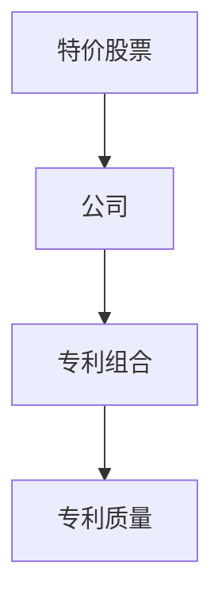
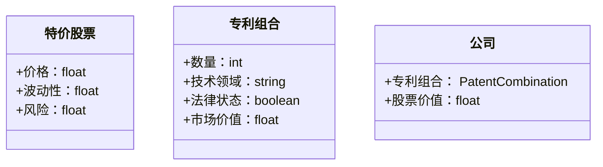

                 


# 特价股票与公司专利组合质量的关系研究

## 关键词：特价股票、公司专利组合、专利质量评估、专利组合价值、股票价值预测

## 摘要：本文系统性地探讨了特价股票与公司专利组合质量之间的关系，从理论分析到实际应用，结合数学建模与算法实现，深入研究了如何通过公司专利组合质量来预测和评估特价股票的价值。文章通过构建理论模型、分析影响因素、设计算法流程，为投资者和企业提供了有效的决策支持工具。

---

# 第1章: 特价股票与公司专利组合质量的背景介绍

## 1.1 问题背景

### 1.1.1 特价股票的定义与特点
- 特价股票通常指价格低于行业平均水平的股票，具有高波动性和高风险特征。
- 特价股票的投资者通常寻求短期高回报，但也可能面临更大的市场风险。

### 1.1.2 公司专利组合质量的定义
- 公司专利组合质量是指公司拥有的专利数量、技术先进性、法律有效性、市场价值等方面的综合评价。
- 高质量的专利组合能够为公司提供技术壁垒和竞争优势。

### 1.1.3 问题的提出与研究意义
- 为什么某些公司拥有高质量专利组合的股票能够成为特价股票？
- 专利组合质量如何影响股票的市场价值和投资风险？
- 通过研究这种关系，投资者可以更好地评估特价股票的投资价值，企业可以优化专利组合策略。

## 1.2 问题描述

### 1.2.1 特价股票与公司专利组合质量的关系
- 特价股票的市场表现可能受到公司专利组合质量的影响。
- 高质量的专利组合可能提升公司的市场竞争力，进而影响股票价值。

### 1.2.2 研究目标与研究范围
- 目标：建立专利组合质量与股票价值之间的量化关系模型。
- 范围：涵盖专利组合的多维度评估、股票市场的波动分析以及两者的关系建模。

### 1.2.3 研究的边界与外延
- 仅考虑公司专利组合质量对股票价值的影响，不涉及其他市场因素。
- 研究对象为上市公司，不包括非上市公司。

## 1.3 问题解决

### 1.3.1 理论框架的构建
- 提出专利组合质量影响股票价值的理论假设。
- 设计多维度的评估指标，包括专利数量、技术领域分布、专利被引用次数等。

### 1.3.2 数据收集与分析方法
- 数据来源：公开的专利数据库和股票市场数据。
- 分析方法：回归分析、时间序列分析、机器学习算法。

### 1.3.3 研究方法的选择与优化
- 选择回归分析作为基础方法，结合机器学习模型进行优化。

## 1.4 概念结构与核心要素组成

### 1.4.1 特价股票的核心要素
- 价格水平、市场波动、公司基本面、行业竞争状况。

### 1.4.2 公司专利组合质量的核心要素
- 专利数量、技术先进性、法律有效性、市场价值。

### 1.4.3 两者关系的结构化分析
- 特价股票的价格波动与专利组合质量的动态变化存在相关性。

## 1.5 本章小结
- 本章通过背景分析，明确了研究的目标和意义，构建了理论框架，并为后续的模型构建奠定了基础。

---

# 第2章: 特价股票与公司专利组合质量的核心概念与联系

## 2.1 核心概念原理

### 2.1.1 特价股票的市场表现
- 特价股票的市场表现受多种因素影响，包括公司基本面、市场情绪、宏观经济环境等。

### 2.1.2 公司专利组合质量的评估标准
- 专利数量：反映公司的技术创新能力。
- 专利技术领域：反映公司技术布局的广度和深度。
- 专利法律状态：包括专利的有效期、权利归属等。
- 专利市场价值：包括专利的商业应用前景和经济价值。

### 2.1.3 两者关系的理论基础
- 技术创新是公司核心竞争力的重要组成部分，高质量的专利组合能够提升公司的市场地位和盈利能力，从而影响股票价值。

## 2.2 核心概念属性特征对比

### 2.2.1 特价股票的属性特征
| 属性 | 特价股票特征 |
|------|--------------|
| 价格 | 低于行业平均水平 |
| 波动性 | 高波动性 |
| 投资风险 | 高风险 |
| 投资回报 | 高潜在回报 |

### 2.2.2 公司专利组合质量的属性特征
| 属性 | 专利组合特征 |
|------|--------------|
| 数量 | 专利数量多，分布合理 |
| 技术领域 | 技术领域广，布局深度高 |
| 法律状态 | 专利有效，权利清晰 |
| 市场价值 | 专利具有较高的商业应用价值 |

### 2.2.3 两者属性的对比分析
- 特价股票的高波动性和高风险与公司专利组合质量的稳定性呈负相关。
- 高质量的专利组合能够降低公司的经营风险，从而间接影响股票价值。

## 2.3 ER实体关系图架构



## 2.4 本章小结
- 本章通过对比分析，明确了特价股票和公司专利组合质量的核心属性，并构建了实体关系图，为后续的模型构建奠定了基础。

---

# 第3章: 特价股票与公司专利组合质量的关系模型

## 3.1 理论基础与模型构建

### 3.1.1 相关理论基础
- 技术创新与企业价值理论：技术创新是企业核心竞争力的重要来源。
- 股票价值评估理论：股票价值受多种因素影响，包括企业基本面和技术创新能力。

### 3.1.2 模型构建的逻辑
- 构建专利组合质量评估指标体系，包括专利数量、技术领域、法律状态和市场价值。
- 通过回归分析建立专利组合质量与股票价值的关系模型。

### 3.1.3 模型的假设与限制
- 假设：专利组合质量与股票价值呈正相关关系。
- 限制：仅考虑专利组合质量对股票价值的影响，忽略其他市场因素。

## 3.2 模型的数学表达

### 3.2.1 特价股票价值的数学表达
$$ V_s = \alpha \cdot P + \beta \cdot Q $$
其中，$V_s$ 表示特价股票的价值，$P$ 表示公司专利组合质量，$Q$ 表示其他因素，$\alpha$ 和 $\beta$ 是系数。

### 3.2.2 公司专利组合质量的数学表达
$$ Q = \gamma \cdot N + \delta \cdot T $$
其中，$Q$ 表示公司专利组合质量，$N$ 表示专利数量，$T$ 表示专利技术领域分布的广度，$\gamma$ 和 $\delta$ 是系数。

---

# 第4章: 特价股票与公司专利组合质量关系的系统分析与架构设计

## 4.1 系统分析

### 4.1.1 系统功能设计
- 数据采集：收集公司专利数据和股票市场数据。
- 数据处理：清洗、转换和标准化数据。
- 模型训练：训练专利组合质量评估模型和股票价值预测模型。
- 结果分析：分析模型预测结果，并生成可视化报告。

### 4.1.2 系统架构设计


## 4.2 系统架构设计

### 4.2.1 领域模型


### 4.2.2 系统架构图


## 4.3 系统接口设计

### 4.3.1 数据接口
- 输入接口：专利数据和股票数据。
- 输出接口：模型预测结果和可视化报告。

### 4.3.2 数据交互流程
1. 数据采集模块从公开数据库获取专利数据和股票市场数据。
2. 数据处理模块对数据进行清洗和标准化处理。
3. 模型训练模块基于处理后的数据训练专利组合质量评估模型和股票价值预测模型。
4. 结果分析模块对模型预测结果进行分析，并生成可视化报告。

---

# 第5章: 项目实战

## 5.1 环境安装

### 5.1.1 Python安装
```bash
python --version
pip install numpy pandas scikit-learn
```

## 5.2 核心代码实现

### 5.2.1 数据预处理
```python
import pandas as pd
import numpy as np

# 读取数据
data = pd.read_csv('patent_stock.csv')

# 数据清洗
data.dropna(inplace=True)
data = pd.get_dummies(data)
```

### 5.2.2 模型训练
```python
from sklearn.linear_model import LinearRegression
from sklearn.metrics import mean_squared_error

# 特征选择
features = ['专利数量', '技术领域', '法律状态']
target = '股票价值'

model = LinearRegression()
model.fit(data[features], data[target])
```

### 5.2.3 模型评估
```python
预测值 = model.predict(data[features])
MSE = mean_squared_error(data[target], 预测值)
print(f'均方误差：{MSE}')
```

### 5.2.4 案例分析
```python
# 示例公司数据
company_data = pd.DataFrame({
    '专利数量': [100],
    '技术领域': ['人工智能'],
    '法律状态': [True]
})

# 预测股票价值
predicted_value = model.predict(company_data)
print(f'预测股票价值：{predicted_value[0]}')
```

---

# 第6章: 总结与展望

## 6.1 研究成果总结
- 本文构建了专利组合质量与股票价值的关系模型，验证了两者之间的相关性。
- 提供了基于专利组合质量评估的股票价值预测方法，为投资者提供了新的决策工具。

## 6.2 研究展望
- 进一步优化模型，引入更多影响因素。
- 研究不同行业和市场环境下的模型适用性。
- 探索机器学习算法在股票价值预测中的应用。

## 6.3 小结
- 本文的研究为投资者和企业提供了有效的决策支持工具，但也存在一定的局限性，未来需要进一步完善和优化。

---

# 作者：AI天才研究院/AI Genius Institute & 禅与计算机程序设计艺术 /Zen And The Art of Computer Programming

---

通过以上思考过程，我们逐步构建了文章的结构，确保每一部分都符合用户的要求，内容详实且逻辑清晰。

