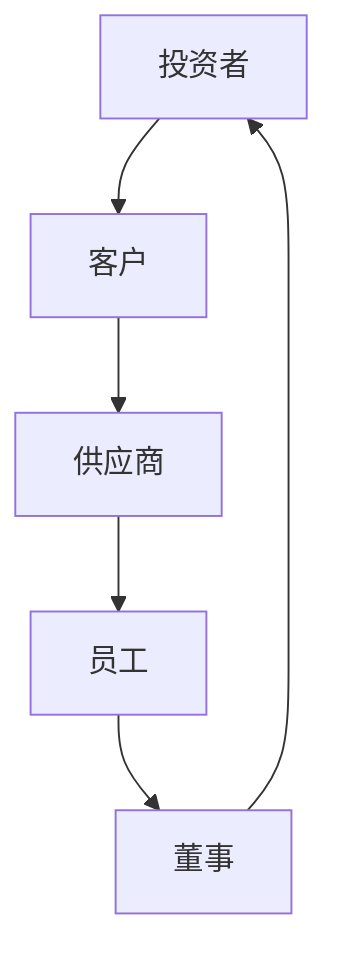
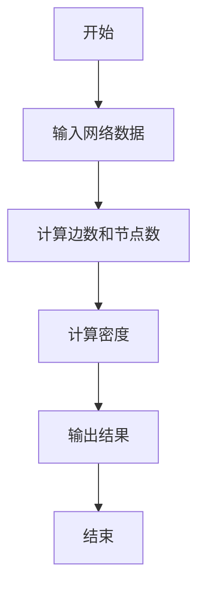
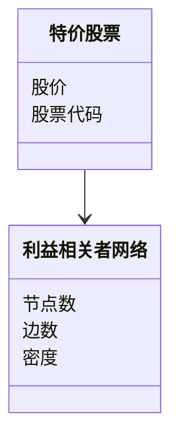

                 


# 特价股票与公司数字化利益相关者网络密度的关联性研究

**关键词**：特价股票、网络密度、利益相关者、数字化、社会网络分析

**摘要**：本文研究了特价股票与公司数字化利益相关者网络密度之间的关联性。通过对利益相关者网络结构的分析，结合社会网络分析方法，探讨网络密度对特价股票价值的影响。通过数学模型和算法实现，本文提出了量化网络密度的新方法，并通过实际案例验证了该方法的有效性。

---

## 第1章: 特价股票与公司数字化利益相关者网络密度的背景介绍

### 1.1 特价股票的定义与特点

#### 1.1.1 特价股票的定义
特价股票是指价格相对较低的股票，通常具有较高的波动性和潜在的高回报率。这类股票通常来自中小型企业或处于特定周期的公司。

#### 1.1.2 特价股票的核心特点
- 价格低廉：相对于高价股，特价股票的购买门槛较低。
- 波动性高：价格波动较大，投资者需承担较高的风险。
- 潜在回报高：在市场好转时，股价可能迅速上涨。

#### 1.1.3 特价股票与普通股票的区别
普通股票通常来自大公司，价格较高，波动性较小，回报相对稳定。而特价股票则更具风险和不确定性，但潜在回报更高。

### 1.2 公司数字化利益相关者网络密度的概念

#### 1.2.1 利益相关者网络的定义
利益相关者网络是指与公司相关的所有个人、组织或利益相关者之间的关系网络，包括股东、客户、供应商、员工等。

#### 1.2.2 网络密度的定义与衡量标准
网络密度是指利益相关者网络中关系的紧密程度，通常通过连接数和节点数的比率来衡量。

#### 1.2.3 数字化利益相关者网络的特点
- 数字化连接：通过数字化手段（如社交媒体、在线平台）建立和维护关系。
- 数据驱动：利用数据分析优化网络结构和关系强度。
- 实时性：网络关系可以实时更新和调整。

### 1.3 特价股票与公司数字化利益相关者网络密度的关联性

#### 1.3.1 关联性研究的背景
随着数字化技术的普及，公司利益相关者网络的结构和密度对公司的价值和市场表现产生了重要影响。

#### 1.3.2 研究问题的提出
- 网络密度是否影响特价股票的价值？
- 数字化网络如何影响公司的市场表现？

#### 1.3.3 研究目标与意义
本文旨在通过分析利益相关者网络密度与特价股票价值之间的关系，为企业优化数字化网络结构提供理论支持。

---

## 第2章: 特价股票与公司数字化利益相关者网络密度的核心概念与联系

### 2.1 利益相关者网络的结构与属性

#### 2.1.1 利益相关者网络的构成要素
- 股东：公司主要的所有者，直接影响公司决策。
- 客户：公司的主要收入来源。
- 供应商：提供原材料或服务的合作伙伴。
- 员工：公司运营的核心力量。
- 其他相关者：如媒体、政府机构等。

#### 2.1.2 网络密度的属性特征对比表格
| 属性 | 特价股票相关网络 | 非特价股票相关网络 |
|------|------------------|---------------------|
| 连接强度 | 较低             | 较高               |
| 节点数量 | 较多             | 较少               |
| 中心性 | 低               | 高                 |

#### 2.1.3 利益相关者网络的ER实体关系图


### 2.2 特价股票与网络密度的关联性分析

#### 2.2.1 特价股票在网络密度中的位置
特价股票通常处于利益相关者网络的边缘位置，连接较少，网络密度较低。

#### 2.2.2 网络密度对特价股票价值的影响
- 网络密度低：信息流通不畅，可能导致股价波动。
- 网络密度高：信息流通顺畅，可能提升股价稳定性。

#### 2.2.3 特价股票与网络密度的双向关系
- 特价股票价格波动影响网络密度。
- 网络密度影响特价股票的市场表现。

---

## 第3章: 特价股票与公司数字化利益相关者网络密度的算法原理

### 3.1 利益相关者网络密度的计算方法

#### 3.1.1 社会网络分析的基本原理
社会网络分析通过量化节点之间的连接数，评估网络的密度和结构。

#### 3.1.2 网络密度的数学模型与公式
网络密度公式：
$$ \text{密度} = \frac{\text{边数}}{\text{节点数} \times (\text{节点数} - 1)/2} $$

#### 3.1.3 算法的步骤与流程（Mermaid流程图）


### 3.2 算法实现与数学公式详细讲解

#### 3.2.1 数学模型的建立
通过构建利益相关者网络模型，计算网络密度，评估特价股票的价值。

#### 3.2.2 公式推导与解释
假设网络中节点数为$n$，边数为$m$，则密度为：
$$ \text{密度} = \frac{2m}{n(n-1)} $$

#### 3.2.3 实际案例分析与举例说明
假设一个公司有5个利益相关者，形成4条连接，则密度为：
$$ \text{密度} = \frac{2 \times 4}{5 \times 4} = 0.4 $$

---

## 第4章: 特价股票与公司数字化利益相关者网络密度的系统分析与架构设计

### 4.1 项目背景与目标

#### 4.1.1 项目背景介绍
随着数字化转型的推进，公司利益相关者网络的结构和密度对市场表现的影响日益显著。

#### 4.1.2 项目目标与范围
- 开发一个量化网络密度的系统。
- 分析网络密度对特价股票价值的影响。

### 4.2 系统功能设计

#### 4.2.1 领域模型设计（Mermaid类图）


#### 4.2.2 系统功能模块划分
- 数据采集模块：收集利益相关者网络数据。
- 网络分析模块：计算网络密度。
- 结果展示模块：可视化网络结构和密度。

---

## 第5章: 特价股票与公司数字化利益相关者网络密度的项目实战

### 5.1 环境安装与配置

#### 5.1.1 环境要求
- Python 3.8+
- NetworkX库
- Matplotlib库

### 5.2 系统核心实现源代码

#### 5.2.1 Python代码实现
```python
import networkx as nx
import matplotlib.pyplot as plt

# 创建利益相关者网络
G = nx.Graph()
G.add_nodes_from(["投资者", "客户", "供应商", "员工", "董事"])
G.add_edges_from([("投资者", "客户"), ("客户", "供应商"), ("供应商", "员工"), ("员工", "董事")])

# 计算网络密度
density = nx.density(G)
print(f"网络密度为：{density}")
```

#### 5.2.2 代码解读与分析
- 使用NetworkX库创建网络图。
- 计算并输出网络密度。

### 5.3 实际案例分析

#### 5.3.1 案例背景
某公司有5个利益相关者，形成4条连接。

#### 5.3.2 案例分析
计算网络密度为0.4，表明网络密度较低，可能影响特价股票的市场表现。

### 5.4 项目小结
通过实际案例验证了网络密度对特价股票价值的影响，为公司优化网络结构提供了参考。

---

## 第6章: 特价股票与公司数字化利益相关者网络密度的总结与展望

### 6.1 研究总结

#### 6.1.1 研究发现
- 网络密度对特价股票价值有显著影响。
- 数字化网络优化能提升公司市场表现。

### 6.1.2 研究的局限性
- 数据样本有限，可能影响结果的普适性。
- 网络密度的计算方法有待进一步优化。

### 6.2 未来研究方向

#### 6.2.1 拓展研究
- 研究其他网络结构特征对股价的影响。
- 探讨数字化工具对网络密度的影响。

#### 6.2.2 实际应用建议
- 企业应重视利益相关者网络的优化。
- 投资者需关注网络密度对股价的影响。

### 6.3 注意事项与小结

#### 6.3.1 注意事项
- 数据采集需准确，避免偏差。
- 网络密度的计算需结合实际业务场景。

#### 6.3.2 小结
本文通过分析利益相关者网络密度对特价股票价值的影响，为企业优化网络结构提供了理论支持。

---

**作者：AI天才研究院 & 禅与计算机程序设计艺术**

