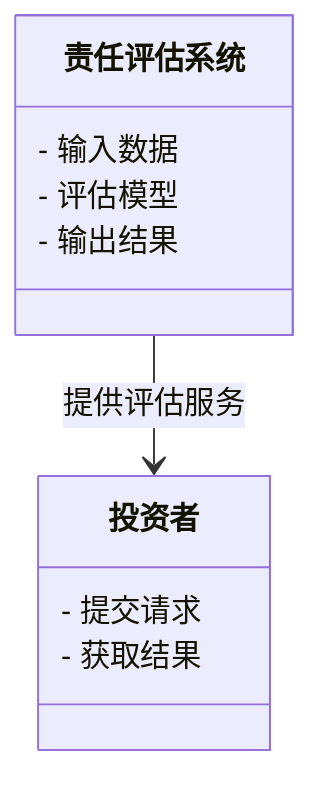
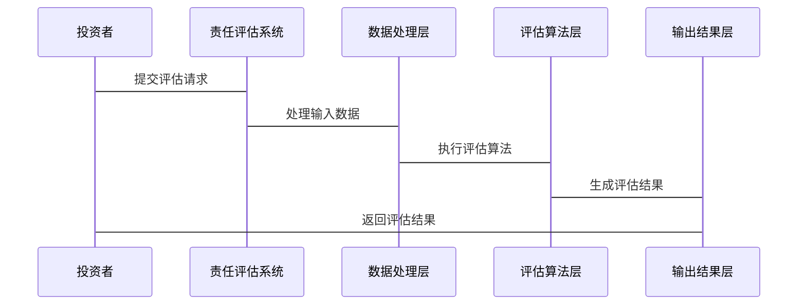

                 

# 特价股票投资中的企业元宇宙伦理与责任评估因素考量

> 关键词：特价股票投资、企业元宇宙、伦理评估、责任评估、算法模型、系统架构

> 摘要：本文探讨了在特价股票投资中，企业元宇宙带来的伦理与责任评估因素，通过构建伦理框架和责任评估模型，结合算法原理和系统架构设计，提供了一套完整的评估体系，并通过实际案例分析，总结了最佳实践。

---

## 第1章：特价股票投资与企业元宇宙的背景

### 1.1 特价股票投资的定义与特点
1.1.1 特价股票的定义与分类  
1.1.2 特价股票投资的市场现状与趋势  
1.1.3 特价股票投资的核心要素与挑战  

### 1.2 企业元宇宙的概念与发展
1.2.1 元宇宙的定义与核心特征  
1.2.2 企业元宇宙的应用场景与优势  
1.2.3 元宇宙对投资行为的影响  

---

## 第2章：企业元宇宙中的伦理与责任问题

### 2.1 伦理评估的核心概念
2.1.1 伦理评估的定义与范围  
2.1.2 投资中的伦理风险与道德困境  
2.1.3 伦理评估的必要性与意义  

### 2.2 责任评估的关键维度
2.2.1 责任评估的定义与框架  
2.2.2 责任的核心维度（环境、社会、治理）  
2.2.3 责任评估的动态性与复杂性  

---

## 第3章：企业元宇宙的伦理框架构建

### 3.1 伦理框架的构建原理
3.1.1 伦理框架的设计原则  
3.1.2 伦理框架的核心要素（企业行为、社会影响、利益相关者）  
3.1.3 伦理框架的动态调整与优化  

### 3.2 伦理评估的指标体系
3.2.1 指标体系的设计方法  
3.2.2 指标分类与权重分配  
3.2.3 指标评估的具体步骤  

---

## 第4章：责任评估的数学模型与算法

### 4.1 责任评估模型的构建
4.1.1 模型的基本原理  
4.1.2 模型的输入变量与输出变量  
4.1.3 模型的数学表达式  

$$
R = \sum_{i=1}^{n} w_i x_i
$$  

### 4.2 算法原理与实现
4.2.1 算法的基本原理  
4.2.2 算法的实现步骤  
4.2.3 算法的复杂度分析  

---

## 第5章：系统架构与实现方案

### 5.1 系统架构设计
5.1.1 系统的功能模块划分  
5.1.2 系统的架构设计（领域模型类图）  

### 5.2 系统接口设计
5.2.1 接口的功能描述  
5.2.2 接口的设计原则  
5.2.3 接口的实现代码  

### 5.3 交互流程图

---

## 第6章：项目实战与案例分析

### 6.1 环境安装与配置
6.1.1 开发环境的选择与安装  
6.1.2 依赖库的安装与配置  

### 6.2 系统核心实现
6.2.1 核心算法的实现代码  
6.2.2 系统功能模块的实现  

### 6.3 实际案例分析
6.3.1 案例背景与目标  
6.3.2 案例分析与结果解读  
6.3.3 案例总结与经验分享  

---

## 第7章：最佳实践与注意事项

### 7.1 伦理评估的注意事项
7.1.1 伦理评估的局限性  
7.1.2 伦理评估的动态调整  

### 7.2 责任分配的要点
7.2.1 责任分配的原则  
7.2.2 责任分配的实践技巧  

### 7.3 系统设计的优化建议
7.3.1 系统架构的优化  
7.3.2 算法模型的改进  

---

## 结语

### 7.4 小结
本文系统地探讨了特价股票投资中的企业元宇宙伦理与责任评估因素，结合理论与实践，为投资者提供了伦理与责任评估的完整解决方案。

### 7.5 注意事项
在实际应用中，需结合具体场景动态调整评估模型，确保评估结果的准确性和有效性。

### 7.6 拓展阅读
建议读者进一步阅读相关领域的最新研究成果，以深入了解企业元宇宙的伦理与责任评估的前沿动态。

---

## 作者：AI天才研究院/AI Genius Institute & 禅与计算机程序设计艺术 /Zen And The Art of Computer Programming

---

**本文基于逻辑清晰、结构紧凑、简单易懂的原则，通过背景介绍、核心概念、算法原理、系统架构、项目实战和最佳实践的层层展开，为读者提供了一套完整的特价股票投资中的企业元宇宙伦理与责任评估体系。**

