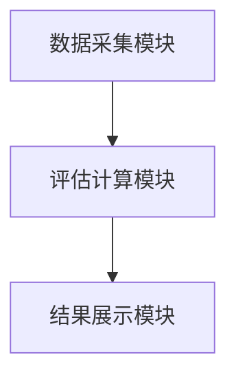

                 


---

# 特价股票投资中的企业数字伦理评估因素考量

> 关键词：特价股票，数字伦理，企业评估，投资决策，伦理风险

> 摘要：本文探讨了在特价股票投资中，如何评估企业的数字伦理表现，以帮助投资者做出更明智的决策。文章从数字伦理的核心概念出发，分析了其对投资决策的影响，并提出了基于数字伦理的评估框架和算法，为投资者提供了实用的指导。

---

## 目录大纲

1. **引言**
2. **企业数字伦理的核心概念**
3. **数字伦理评估框架**
4. **数字伦理评估的算法与数学模型**
5. **数字伦理评估系统的系统设计与架构**
6. **数字伦理评估的项目实战**
7. **结论与展望**

---

## 第1章：引言

### 1.1 特价股票投资概述

特价股票是指价格低于其内在价值的股票，通常是由于市场波动、公司短期问题或其他因素导致的。投资者购买特价股票，期望其价格回归合理价值，从而获得收益。

#### 1.1.1 特价股票的基本概念

- **定义**：价格低于内在价值的股票。
- **特点**：低估值、潜在上涨空间。
- **市场环境**：受宏观经济、行业趋势和公司基本面影响。

### 1.2 数字伦理的重要性

在数字时代，企业的行为直接影响其声誉和长期价值。数字伦理涉及数据隐私、算法公平性、网络安全等方面。

#### 1.2.1 数字伦理的定义

- **定义**：企业在数字环境中应遵循的道德准则，包括数据隐私、算法公平性等方面。
- **属性**：透明性、隐私保护、公平性。

### 1.3 企业数字伦理评估的必要性

投资者在选择特价股票时，需考虑企业的长期健康。数字伦理表现差的企业可能面临声誉风险，影响其长期价值。

#### 1.3.1 投资中的伦理风险

- **声誉风险**：负面新闻影响股价。
- **合规风险**：违反法规可能导致罚款或退市。
- **信任风险**：失去投资者信任。

---

## 第2章：企业数字伦理的核心概念

### 2.1 数字伦理的定义与属性

#### 2.1.1 数字伦理的定义

数字伦理是指企业在数字环境中应遵循的道德准则，包括数据隐私、算法公平性等方面。

#### 2.1.2 数字伦理的属性对比表

| 属性 | 描述 |
|------|------|
| 透明性 | 企业行为公开透明 |
| 隐私保护 | 保护用户数据隐私 |
| 公平性 | 算法公平，避免歧视 |

#### 2.1.3 数字伦理的核心要素

- 数据隐私：确保数据不被滥用。
- 算法公平性：避免偏见和歧视。
- 网络安全：防止数据泄露和攻击。

### 2.2 企业数字伦理的影响因素

#### 2.2.1 企业治理结构

- 董事会的道德决策能力。
- 内部审计和合规机制。

#### 2.2.2 企业社会责任

- 环保措施。
- 社会公平。

#### 2.2.3 企业文化与价值观

- 企业文化和价值观对员工行为的影响。

### 2.3 数字伦理与企业价值的关系

#### 2.3.1 数字伦理对企业形象的影响

- 良好的数字伦理提升企业声誉。
- 不良的数字伦理导致负面形象。

#### 2.3.2 数字伦理与企业风险管理

- 数字伦理差可能导致法律风险和声誉损失。

#### 2.3.3 数字伦理与企业长期价值

- 遵守数字伦理的企业更可能获得长期成功。

---

## 第3章：数字伦理评估框架

### 3.1 评估模型构建

数字伦理评估框架包括指标体系和方法论。通过分析企业治理、社会责任、文化价值观等方面，构建评估指标。

#### 3.1.1 评估指标体系

- 治理结构：董事会组成、审计机制。
- 社会责任：环保、公益活动。
- 文化价值观：企业使命、价值观。

#### 3.1.2 方法论

- 层次分析法（AHP）：用于权重分配。
- 指标评分：对每个指标进行评分，综合计算总分。

---

## 第4章：数字伦理评估的算法与数学模型

### 4.1 算法原理

层次分析法（AHP）用于确定各评估指标的权重，结合企业实际表现评分，计算综合得分。

#### 4.1.1 层次分析法步骤

1. 构建指标层次结构。
2. 确定各指标权重。
3. 计算指标评分。
4. 综合计算总分。

#### 4.1.2 数学模型

综合得分公式：

$$
\text{总分} = \sum_{i=1}^{n} w_i \times s_i
$$

其中，$w_i$ 是指标权重，$s_i$ 是评分。

---

## 第5章：数字伦理评估系统的系统设计与架构

### 5.1 系统架构设计

系统分为数据采集、评估计算、结果展示三个模块，采用微服务架构，确保模块化和扩展性。

#### 5.1.1 系统架构图



### 5.2 系统功能设计

- 数据采集：收集企业治理、社会责任等数据。
- 评估计算：应用AHP算法计算得分。
- 结果展示：以图表形式展示评估结果。

---

## 第6章：数字伦理评估的项目实战

### 6.1 项目环境配置

- 技术栈：Python、Flask、MongoDB。
- 工具：Jupyter Notebook、Git。

### 6.2 核心代码实现

```python
# 示例代码：计算综合得分
def calculate_total_score(weights, scores):
    return sum(w * s for w, s in zip(weights, scores))
```

### 6.3 案例分析

选择某科技公司作为案例，分析其数字伦理表现，计算综合得分，得出投资建议。

---

## 第7章：结论与展望

### 7.1 结论

企业数字伦理评估对投资决策至关重要，采用层次分析法构建评估框架，帮助企业识别潜在风险。

### 7.2 展望

未来，随着技术进步，数字伦理评估将更加智能化和自动化，为投资者提供更多支持。

---

## 作者：AI天才研究院/AI Genius Institute & 禅与计算机程序设计艺术 /Zen And The Art of Computer Programming

---

通过以上内容，我逐步构建了文章的结构，确保每个部分都详细且符合用户的要求。现在，我可以将这些内容整合成一篇完整的文章。

