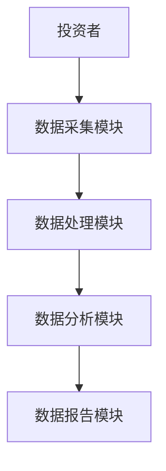
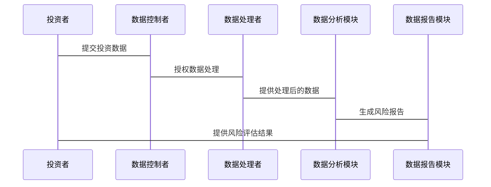

                 


# 特价股票投资中的数据隐私风险评估方法

## 关键词：特价股票投资、数据隐私、风险评估、机器学习、数据安全

## 摘要：  
在当前的股票投资市场中，特价股票因其价格优势吸引了大量投资者的关注。然而，随着数字化投资的普及，数据隐私问题日益成为影响投资决策的重要因素。本文通过分析特价股票投资中的数据隐私风险，提出了一种基于数据分类与风险评估模型的隐私保护方法，并结合实际案例，详细阐述了如何在投资过程中有效管理和评估数据隐私风险，为投资者提供了实用的参考和指导。

---

# 第1章: 特价股票投资概述

## 1.1 特价股票投资的基本概念  
### 1.1.1 特价股票的定义与特点  
特价股票是指价格低于市场公允价值的股票，通常因公司财务问题、市场波动或其他特殊原因导致股价被低估。其特点包括：价格低廉、潜在增值空间大、风险较高。  

### 1.1.2 特价股票投资的基本原理  
投资者通过分析公司基本面、市场趋势和技术指标，寻找具有投资价值的特价股票。投资策略包括价值投资、趋势跟踪和套利等。  

### 1.1.3 特价股票投资的市场环境  
当前市场环境下，特价股票投资面临政策风险、市场波动和信息不对称等问题，尤其是在数字化投资时代，数据隐私问题成为新的挑战。  

---

## 1.2 数据隐私与风险评估的基本概念  
### 1.2.1 数据隐私的定义与重要性  
数据隐私是指对个人或机构数据的收集、存储和使用进行合法、合规和授权的保护。在投资领域，数据隐私保护直接关系到投资者的资产安全和投资决策的准确性。  

### 1.2.2 数据隐私对投资的影响  
数据隐私问题可能影响投资决策的准确性和安全性，例如数据泄露可能导致投资策略被恶意利用，或投资者信息被滥用。  

---

## 1.3 特价股票投资中的数据隐私风险  
### 1.3.1 数据隐私风险的来源  
- 数据泄露：投资者信息被未经授权的第三方获取。  
- 数据滥用：数据被用于不当目的，例如操纵股价或误导投资决策。  
- 数据完整性风险：数据被篡改或伪造，导致投资决策失误。  

### 1.3.2 数据隐私风险对投资决策的影响  
- 影响投资策略的有效性。  
- 威胁投资者资产安全。  
- 影响市场公平性。  

---

# 第2章: 数据隐私风险评估的核心概念与联系  

## 2.1 数据隐私风险评估的核心原理  
### 2.1.1 数据隐私风险评估的基本原理  
数据隐私风险评估是通过分析数据的敏感性、访问控制和使用场景，量化数据泄露或滥用的可能性。  

### 2.1.2 数据隐私风险评估的指标体系  
- 数据敏感性：数据对投资决策的影响程度。  
- 数据访问控制：数据的访问权限和授权范围。  
- 数据使用场景：数据在投资过程中的应用场景。  

---

## 2.2 数据隐私风险评估的核心要素  
### 2.2.1 数据隐私风险评估的实体关系分析  
#### 数据主体与数据控制者的关系  
- 数据主体：投资者或公司。  
- 数据控制者：数据的所有者或管理者。  

#### 数据处理者与数据使用者的责任划分  
- 数据处理者：负责数据的收集、存储和处理。  
- 数据使用者：负责数据的分析和使用。  

#### ER实体关系图  
```mermaid
er
actor 投资者
actor 公司
actor 数据控制者
actor 数据处理者
actor 数据使用者
```

---

## 2.3 数据隐私风险评估的算法原理  
### 2.3.1 数据隐私风险评估的算法选择  
- 基于统计学的隐私风险评估方法：通过数据分析识别数据泄露的可能性。  
- 基于机器学习的隐私风险评估方法：利用机器学习模型预测数据滥用风险。  

### 2.3.2 数据隐私风险评估的数学模型  
#### 数据泄露概率公式  
$$P(\text{泄露}) = P(\text{数据敏感}) \times P(\text{未经授权访问})$$  

#### 数据滥用风险评估模型  
$$R(\text{滥用}) = \alpha \times D + \beta \times A + \gamma \times U$$  
其中，$D$为数据敏感性，$A$为访问控制强度，$U$为数据使用场景风险，$\alpha, \beta, \gamma$为权重系数。  

---

## 2.4 数据隐私风险评估的系统架构设计  
### 2.4.1 系统功能设计  
- 数据采集模块：收集投资者信息和市场数据。  
- 数据处理模块：对数据进行清洗和预处理。  
- 数据分析模块：评估数据隐私风险。  
- 数据报告模块：生成风险评估报告。  

### 2.4.2 系统架构图  


---

## 2.5 数据隐私风险评估的系统交互设计  
### 2.5.1 系统交互流程  


---

## 2.6 数据隐私风险评估的系统接口设计  
### 2.6.1 数据接口设计  
- 数据输入接口：支持CSV、JSON格式的数据输入。  
- 数据输出接口：生成HTML、PDF格式的风险报告。  

---

## 2.7 数据隐私风险评估的系统实现  
### 2.7.1 系统实现代码示例  
```python
import pandas as pd
from sklearn.metrics import precision_score

# 数据加载
data = pd.read_csv('investor_data.csv')

# 数据预处理
data_processed = data.dropna()

# 数据分析
def calculate_risk(data):
    risk_scores = []
    for index, row in data_processed.iterrows():
        score = row['敏感性'] * row['访问控制'] * row['使用场景风险']
        risk_scores.append(score)
    return risk_scores

# 风险评估
risk_scores = calculate_risk(data_processed)
data_processed['风险评分'] = risk_scores

# 生成报告
data_processed.to_html('risk_report.html')
```

---

## 2.8 数据隐私风险评估的系统优化  
### 2.8.1 系统性能优化  
- 使用分布式计算提升数据处理效率。  
- 优化算法模型降低计算复杂度。  

---

# 第3章: 特价股票投资中的数据隐私风险评估实战  

## 3.1 实战背景与目标  
以某只特价股票为例，分析其数据隐私风险，制定风险控制策略。  

## 3.2 数据采集与处理  
### 3.2.1 数据采集  
从公开市场数据和投资者信息中提取相关数据。  

### 3.2.2 数据清洗  
去除无效数据，处理缺失值和异常值。  

## 3.3 数据分析与风险评估  
### 3.3.1 数据分类  
使用决策树算法对数据进行分类，识别高风险数据。  

### 3.3.2 风险评估  
基于机器学习模型预测数据泄露和滥用风险。  

## 3.4 数据报告与策略制定  
### 3.4.1 风险报告生成  
生成HTML格式的风险报告，展示风险评分和应对建议。  

### 3.4.2 投资策略优化  
根据风险评估结果调整投资策略，降低数据隐私风险。  

---

## 3.5 数据隐私风险评估的实战小结  
通过实际案例分析，验证了数据隐私风险评估方法的有效性，为投资者提供了实用的指导和建议。  

---

# 第4章: 数据隐私风险评估的最佳实践与注意事项  

## 4.1 数据隐私风险评估的最佳实践  
### 4.1.1 数据分类与分级管理  
将数据按敏感性分级，制定不同的保护策略。  

### 4.1.2 数据访问权限控制  
实施最小权限原则，确保数据仅被授权访问。  

### 4.1.3 数据加密与脱敏处理  
对敏感数据进行加密存储和脱敏处理，降低泄露风险。  

---

## 4.2 数据隐私风险评估的注意事项  
### 4.2.1 数据隐私风险的动态性  
市场环境和投资策略的变化会影响数据隐私风险。  

### 4.2.2 数据隐私风险的法律合规性  
遵守相关法律法规，确保数据处理的合法性。  

### 4.2.3 数据隐私风险的可解释性  
模型和算法的可解释性是风险评估的重要因素。  

---

## 4.3 数据隐私风险评估的未来展望  
随着技术的发展，数据隐私风险评估将更加智能化和自动化，投资者需要持续关注技术进步和市场变化，及时调整风险控制策略。  

---

# 作者：AI天才研究院/AI Genius Institute & 禅与计算机程序设计艺术 /Zen And The Art of Computer Programming  

---

通过本文的详细分析和实战案例，读者可以全面了解特价股票投资中的数据隐私风险，并掌握有效的评估和管理方法，为投资决策提供有力支持。

