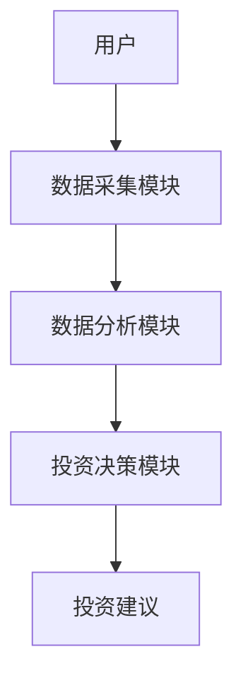
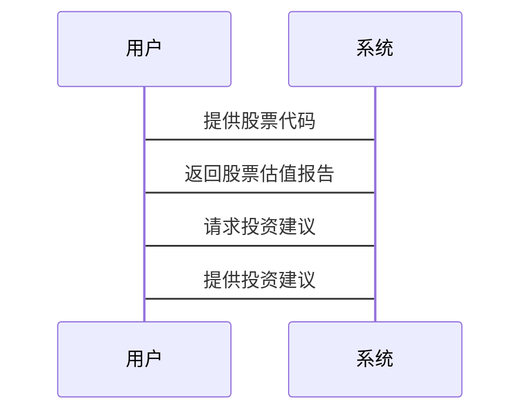

                 


# 玛丽·巴芙特的新兴市场价值投资：高风险中的高回报

---

## 关键词

- 玛丽·巴芙特
- 价值投资
- 新兴市场
- 高风险高回报
- 投资策略
- 风险管理

---

## 摘要

本文探讨了玛丽·巴芙特在新兴市场的价值投资策略，分析了高风险中的高回报机制。通过详细阐述价值投资的核心理念、新兴市场的特点、投资策略、风险管理以及实际案例，本文为投资者提供了深入的理论和实践指导。文章结合数学模型、图表和代码示例，全面解析了如何在新兴市场中运用价值投资策略，帮助投资者在高风险中实现高回报。

---

### 目录大纲

# 玛丽·巴芙特的新兴市场价值投资：高风险中的高回报

> 关键词：玛丽·巴芙特，价值投资，新兴市场，高风险高回报，投资策略，风险管理

---

## 第1章: 玛丽·巴芙特与价值投资概述

### 1.1 玛丽·巴芙特的背景与投资理念

#### 1.1.1 玛丽·巴芙特的生平简介

- 简述玛丽·巴芙特的生平，强调她的投资哲学和长期投资策略。
- 提及她的著作和影响力，说明她为何在投资领域享有盛誉。

#### 1.1.2 价值投资的核心理念

- 定义价值投资：购买低于内在价值的股票，长期持有。
- 强调安全边际、内在价值和市场先生的概念。
- 比较价值投资与成长投资的异同。

#### 1.1.3 玛丽·巴芙特的投资风格特点

- 长期持有优质股票，注重企业基本面。
- 低估值、高盈利能力、强大的竞争优势。
- 风险控制和分散投资的重要性。

### 1.2 新兴市场的定义与特点

#### 1.2.1 新兴市场的定义

- 新兴市场指经济快速发展、资本 markets 不发达的国家，如中国、印度等。
- 比较新兴市场与成熟市场的区别，包括市场规模、流动性、监管等。

#### 1.2.2 新兴市场的经济与投资环境

- 经济增长快，但波动性大。
- 市场流动性不足，信息不对称严重。
- 政治和经济政策的不确定性高。

#### 1.2.3 新兴市场与成熟市场的对比

- 从市场规模、投资者结构、监管环境等方面进行对比。
- 分析新兴市场在高风险中的潜在回报。

### 1.3 高风险与高回报的辩证关系

#### 1.3.1 高风险投资的定义

- 投资者面临更高的本金损失风险。
- 高风险通常伴随着高波动性和不确定性。

#### 1.3.2 高回报投资的特征

- 在高风险市场中，潜在回报更高。
- 需要识别并投资于具有强大竞争优势的企业。

#### 1.3.3 风险与回报的平衡策略

- 通过分散投资降低风险。
- 选择具有长期竞争优势的企业，减少短期波动影响。

---

## 第2章: 价值投资的核心概念与原理

### 2.1 价值投资的定义与核心要素

#### 2.1.1 价值投资的定义

- 价值投资是购买低于其内在价值的股票，并长期持有。
- 强调安全边际，即价格显著低于内在价值。

#### 2.1.2 核心要素分析

- 内在价值：企业的未来现金流的现值。
- 安全边际：买入价格与内在价值的差距。
- 市场情绪：市场的波动为价值投资者提供了机会。

#### 2.1.3 价值投资与成长投资的区别

- 价值投资关注低估值，成长投资关注高增长。
- 价值投资者更注重安全边际，成长投资者更注重未来增长潜力。

### 2.2 安全边际的概念与计算

#### 2.2.1 安全边际的定义

- 安全边际 = 内在价值 - 市场价格。
- 确保在市场价格波动时，投资者仍有获利空间。

#### 2.2.2 安全边际的计算方法

- 内在价值计算：使用DCF模型或其他方法。
- 市场价格与内在价值的差异即为安全边际。

#### 2.2.3 安全边际在投资决策中的应用

- 选择安全边际高的股票，降低投资风险。
- 在市场恐慌时，利用安全边际高的机会。

### 2.3 基本面分析的步骤与方法

#### 2.3.1 基本面分析的步骤

1. **行业分析**：了解行业的发展前景和竞争格局。
2. **财务报表分析**：审查公司的收入、利润、现金流等。
3. **竞争优势评估**：分析公司的护城河，如品牌、技术、成本优势等。

#### 2.3.2 财务报表分析方法

- 利润表：关注收入和利润的增长率。
- 资产负债表：评估公司的负债和资产状况。
- 现金流量表：分析现金流的健康状况。

#### 2.3.3 行业分析与企业竞争优势评估

- 行业生命周期分析：处于成长期的行业更具投资价值。
- 企业竞争优势：强大的竞争优势意味着更高的护城河。

### 2.4 价值投资的数学模型与公式

#### 2.4.1 市盈率（P/E）公式

$$ P/E = \frac{Price}{Earnings} $$

- 低P/E比率可能意味着低估。

#### 2.4.2 市净率（P/B）公式

$$ P/B = \frac{Price}{Book\ Value} $$

- 低P/B比率可能意味着低估。

#### 2.4.3 内在价值计算模型

$$ Intrinsic\ Value = \sum \frac{CF_t}{(1+r)^t} $$

- 使用现金流折现模型计算企业的内在价值。

### 2.5 本章小结

---

## 第3章: 新兴市场的投资策略与实践

### 3.1 新兴市场的行业分析与选择

#### 3.1.1 行业分析的步骤与方法

- 选择具有高增长潜力的行业，如科技、消费、金融等。
- 分析行业的进入壁垒和竞争格局。

#### 3.1.2 新兴市场的优势行业

- 高科技行业：技术创新驱动增长。
- 消费行业：人口红利和消费升级驱动需求。
- 金融行业：经济发展带动金融服务需求。

#### 3.1.3 行业风险与机会评估

- 行业风险：政策风险、竞争风险、周期性风险。
- 行业机会：技术创新、消费升级、政策支持。

### 3.2 玛丽·巴芙特的选股标准

#### 3.2.1 企业财务健康状况评估

- 低债务、高盈利能力、稳定的现金流。
- 关注ROE（净资产收益率）和ROA（资产回报率）。

#### 3.2.2 企业竞争优势分析

- 强大的品牌优势。
- 技术壁垒。
- 成本优势。

#### 3.2.3 管理层素质评估

- 诚实、有能力、以股东利益为导向的管理层更值得信赖。

### 3.3 投资组合的构建与优化

#### 3.3.1 投资组合的基本原则

- 分散投资，降低风险。
- 保持投资的长期性，避免短期波动干扰。

#### 3.3.2 股票权重分配方法

- 根据企业的竞争优势和估值，合理分配权重。
- 避免过度集中，防止单一股票风险过大。

#### 3.3.3 投资组合的动态调整策略

- 定期审视投资组合，重新评估企业的竞争优势和估值。
- 根据市场变化，调整持仓比例。

### 3.4 价值投资在新兴市场的应用案例

#### 3.4.1 某新兴市场的成功投资案例

- 以印度某信息技术公司为例，分析其低估值、高增长的特性。
- 计算其内在价值，评估安全边际。

#### 3.4.2 案例分析与经验总结

- 成功案例的关键因素：低估值、高增长、强大竞争优势。
- 失败案例的教训：忽视风险管理，过度集中投资。

### 3.5 本章小结

---

## 第4章: 风险管理与投资心理

### 4.1 投资风险管理的重要性

#### 4.1.1 风险管理的定义与分类

- 风险管理是识别、评估和控制投资风险的过程。
- 分为市场风险、流动性风险、信用风险等。

#### 4.1.2 风险管理在投资中的作用

- 降低投资组合的波动性。
- 保护投资者免受重大损失。
- 提高投资组合的稳定性。

### 4.2 投资心理与决策

#### 4.2.1 投资者心理偏差

- 过度自信：可能导致错误决策。
- 从众心理：可能导致跟风投资。
- 恐慌与贪婪：可能导致非理性决策。

#### 4.2.2 理性决策的重要性

- 基于事实和数据，而非情绪。
- 避免从众和过度自信。

### 4.3 风险控制的具体措施

#### 4.3.1 分散投资

- 将资金分配到不同的行业和资产类别中。
- 降低单一投资的风险。

#### 4.3.2 设置止损点

- 为每个投资设定止损点，限制潜在损失。
- 严格执行止损纪律。

#### 4.3.3 定期回顾与调整

- 定期审视投资组合的表现和风险。
- 根据市场变化和自身风险承受能力，进行调整。

### 4.4 本章小结

---

## 第5章: 系统架构与技术实现

### 5.1 系统架构设计

#### 5.1.1 系统功能模块

- 数据采集：收集企业的财务数据、行业信息等。
- 数据分析：计算估值指标，如P/E、P/B、内在价值等。
- 投资决策：根据分析结果，生成投资建议。

#### 5.1.2 系统架构图



#### 5.1.3 系统接口设计

- 数据接口：与金融数据供应商对接，获取实时数据。
- 用户接口：提供用户友好的界面，展示分析结果和投资建议。

### 5.2 系统实现

#### 5.2.1 环境安装

- 安装Python和相关库，如Pandas、NumPy、Matplotlib。
- 安装金融数据分析库，如Yahoo Finance API。

#### 5.2.2 核心代码实现

```python
import pandas as pd
import numpy as np

# 示例代码：计算股票的内在价值
def calculate_intrinsic_value(FCF, discount_rate):
    # 假设自由现金流是每年的值
    # 使用永续年金公式计算
    intrinsic_value = FCF / discount_rate
    return intrinsic_value

# 示例数据：某公司的自由现金流和折现率
FCF = 10000000  # 年现金流
discount_rate = 0.08  # 8%

iv = calculate_intrinsic_value(FCF, discount_rate)
print(f"内在价值: ${iv:.2f}")
```

#### 5.2.3 代码应用解读与分析

- 代码功能：计算企业的内在价值，用于评估是否低估。
- 应用场景：在新兴市场中，帮助投资者识别具有安全边际的企业。

### 5.3 系统交互流程

#### 5.3.1 序列图



---

## 第6章: 案例分析与实战

### 6.1 案例分析

#### 6.1.1 某新兴市场企业的分析

- 股票代码：假设为XX公司。
- 财务数据：收入、利润、现金流等。
- 估值指标：P/E、P/B、内在价值。

#### 6.1.2 分析结果

- 当前股价低于内在价值，具有安全边际。
- 公司竞争优势明显，成长性强。

### 6.2 投资决策

#### 6.2.1 投资建议

- 建议买入该股票，长期持有。
- 设置止损点，控制风险。

#### 6.2.2 实战操作

- 下订单买入XX公司股票，按建议设置止损点。
- 定期回顾股价和财务数据，评估是否继续持有。

### 6.3 案例总结

- 成功案例的关键：正确的选股标准和严格的风险管理。
- 失败案例的教训：忽视风险管理，可能导致重大损失。

---

## 第7章: 总结与展望

### 7.1 本章总结

- 玛丽·巴芙特的价值投资理念在新兴市场中仍然有效。
- 高风险中的高回报需要正确的投资策略和严格的风险管理。
- 通过基本面分析和安全边际筛选，可以在新兴市场中找到优质投资标的。

### 7.2 对未来投资的展望

- 新兴市场将继续在全球经济中扮演重要角色。
- 人工智能和大数据技术将为投资分析提供更多支持。
- 投资者需不断提升自身能力，适应市场变化。

---

## 参考文献

1. 巴菲特，沃伦。《巴菲特致股东的信》。
2. 《投资学》（教材）。
3. 各种金融数据和研究报告。

---

## 作者

作者：AI天才研究院/AI Genius Institute & 禅与计算机程序设计艺术/Zen And The Art of Computer Programming

