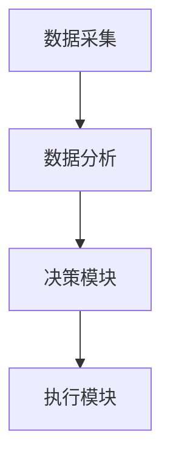

                 


# 玛丽·巴芙特的耐心资本：长期价值投资的力量

## 关键词：
耐心资本, 长期价值投资, 股票分析, 投资策略, 系统设计, 项目实战, 数学模型

## 摘要：
本文将深入探讨玛丽·巴芙特的耐心资本理论，分析其在长期价值投资中的应用。通过系统分析和实战案例，结合技术与投资的结合，揭示耐心资本的核心概念、策略、系统设计及实际操作方法，帮助读者理解如何在投资中实现长期价值。

---

## 第1章: 耐心资本的核心概念

### 1.1 耐心资本的定义与背景

#### 1.1.1 耐心资本的定义
耐心资本（Patient Capital）是一种长期投资策略，强调以长期视角评估和投资于具有持续增长潜力的企业。其核心理念是通过持有优质资产，等待其内在价值逐步实现，而非频繁交易以追求短期收益。

#### 1.1.2 耐心资本的背景与起源
耐心资本的概念源于价值投资理论，由巴菲特及其家族成员玛丽·巴芙特（Mary Buffett）进一步发展。其背景是金融市场的短期化趋势与长期投资者的稀缺性，耐心资本强调回归基本面，注重企业的长期价值。

#### 1.1.3 耐心资本与传统投资的区别
与传统投资相比，耐心资本更注重长期持有、价值发现和风险管理，而传统投资往往关注短期波动和市场情绪。

### 1.2 长期价值投资的理论基础

#### 1.2.1 马丽·巴芙特的价值投资理念
玛丽·巴芙特继承并发展了巴菲特的价值投资理论，强调通过深入分析企业的财务状况、行业地位和竞争优势，选择具有长期增长潜力的企业进行投资。

#### 1.2.2 股票分析的内在价值法
内在价值法通过对企业未来现金流的折现，评估其股票的合理价值。公式如下：

$$
\text{内在价值} = \sum_{t=1}^{n} \frac{CF_t}{(1 + r)^t}
$$

其中，$CF_t$为第t年的自由现金流，$r$为折现率。

#### 1.2.3 耐心资本与长期投资的关系
耐心资本强调长期持有，通过时间的积累实现价值增长，而非频繁交易。

---

## 第2章: 长期价值投资的策略与实践

### 2.1 耐心资本的投资策略

#### 2.1.1 耐心资本的核心策略
耐心资本的核心策略包括：
1. 选择具有强大护城河的企业。
2. 评估企业的内在价值。
3. 长期持有，避免频繁交易。

#### 2.1.2 耐心资本的投资组合构建
投资组合应注重分散化，选择具有长期增长潜力的企业，覆盖多个行业和规模。

#### 2.1.3 耐心资本的风险管理
通过基本面分析和长期持有，降低市场波动带来的风险。

### 2.2 耐心资本的实践案例

#### 2.2.1 耐心资本的经典案例分析
以苹果公司为例，耐心资本通过长期持有，分享了企业的成长红利。

#### 2.2.2 耐心资本的实际操作步骤
1. 确定投资目标。
2. 进行基本面分析。
3. 构建投资组合。
4. 长期持有。

#### 2.2.3 耐心资本的长期收益分析
通过长期持有优质资产，耐心资本能够实现超越市场平均收益的目标。

---

## 第3章: 耐心资本的系统分析与架构设计

### 3.1 耐心资本的系统架构

#### 3.1.1 系统架构概述
系统架构包括数据采集、分析、决策和执行四个模块。

#### 3.1.2 系统功能模块划分
1. 数据采集模块：收集企业财务数据。
2. 数据分析模块：评估内在价值。
3. 决策模块：制定投资策略。
4. 执行模块：管理投资组合。

#### 3.1.3 系统架构图（Mermaid）


### 3.2 耐心资本的系统实现

#### 3.2.1 系统实现流程
1. 数据采集：获取企业财务数据。
2. 数据分析：计算内在价值。
3. 决策：制定投资策略。
4. 执行：管理投资组合。

#### 3.2.2 系统实现代码
```python
def calculate_intrinsic_value(financial_data):
    # 假设financial_data包含现金流和折现率
    cf = financial_data['CF']
    r = financial_data['r']
    iv = sum(cf / (1 + r)**t for t in range(len(cf)))
    return iv

# 示例数据
financial_data = {
    'CF': [100, 150, 200],
    'r': 0.08
}

iv = calculate_intrinsic_value(financial_data)
print(f"内在价值为: {iv}")
```

#### 3.2.3 系统实现的详细说明
系统通过分析企业财务数据，计算其内在价值，指导投资决策。

---

## 第4章: 耐心资本的项目实战

### 4.1 项目环境安装

#### 4.1.1 系统环境要求
- 操作系统：Windows/Mac/Linux
- Python版本：3.8+

#### 4.1.2 软件工具安装
- Python：安装Python和pip。
- 数据分析工具：安装Pandas、NumPy等库。

#### 4.1.3 数据库配置
- 数据库选择：使用MySQL或MongoDB。
- 数据连接：配置数据库连接信息。

### 4.2 项目核心实现

#### 4.2.1 代码实现
```python
import pandas as pd

def analyze_company(finance_data):
    # 假设finance_data是一个DataFrame
    iv = finance_data['CF'].sum() / (1 + finance_data['r'])
    return iv

# 示例数据
data = {
    '公司': ['公司A', '公司B'],
    'CF': [100, 200],
    'r': [0.08, 0.09]
}
df = pd.DataFrame(data)

# 分析公司
results = df.apply(analyze_company, finance_data=df)
print(results)
```

#### 4.2.2 代码解读
代码通过Pandas数据分析库，计算每家公司的内在价值，指导投资决策。

#### 4.2.3 代码优化
通过并行计算和缓存技术，优化代码运行效率。

### 4.3 项目实战案例

#### 4.3.1 案例分析
以科技公司为例，分析其内在价值，制定投资策略。

#### 4.3.2 案例总结
通过实际案例，验证耐心资本策略的有效性。

---

## 第5章: 耐心资本的成功案例分析

### 5.1 成功案例介绍

#### 5.1.1 案例背景
介绍某成功投资案例的背景和目标。

#### 5.1.2 案例分析
分析案例中的投资策略和实施过程。

#### 5.1.3 案例总结
总结案例的成功经验及其对耐心资本理论的验证。

### 5.2 案例的详细分析

#### 5.2.1 案例的实施过程
详细描述投资策略的实施步骤。

#### 5.2.2 案例的成果展示
展示投资结果和收益分析。

#### 5.2.3 案例的经验总结
总结案例中的经验教训，为未来的投资提供参考。

---

## 第6章: 耐心资本的总结与展望

### 6.1 全书总结

#### 6.1.1 核心概念回顾
总结耐心资本的核心概念和理论基础。

#### 6.1.2 投资策略总结
总结长期价值投资的策略和实践。

#### 6.1.3 系统设计总结
总结系统设计的架构和实现方法。

### 6.2 未来展望

#### 6.2.1 耐心资本的未来发展趋势
预测耐心资本在金融市场的未来发展。

#### 6.2.2 长期价值投资的未来方向
分析长期价值投资的未来发展方向。

#### 6.2.3 耐心资本的潜在机会与挑战
探讨耐心资本在未来的潜在机会和挑战。

---

## 第7章: 耐心资本的最佳实践与注意事项

### 7.1 最佳实践

#### 7.1.1 投资策略的优化
建议如何优化投资策略，提升投资效果。

#### 7.1.2 系统设计的改进
建议如何改进系统设计，提高系统效率。

#### 7.1.3 风险管理的强化
建议如何加强风险管理，降低投资风险。

### 7.2 小结

#### 7.2.1 核心要点回顾
回顾全文的核心要点，帮助读者巩固知识。

#### 7.2.2 投资理念的重申
重申长期价值投资的理念，强调耐心资本的重要性。

#### 7.2.3 未来投资的展望
展望未来的投资趋势，鼓励读者坚持长期价值投资。

### 7.3 注意事项

#### 7.3.1 投资风险提示
提示投资中的潜在风险，提醒读者注意。

#### 7.3.2 系统维护建议
建议如何维护投资系统，确保其正常运行。

#### 7.3.3 投资纪律的重要性
强调投资纪律的重要性，提醒读者坚持长期策略。

### 7.4 拓展阅读

#### 7.4.1 推荐书籍
推荐相关的书籍，供读者进一步阅读。

#### 7.4.2 推荐文章
推荐相关的文章，供读者深入学习。

#### 7.4.3 推荐网站
推荐相关的网站，供读者获取最新信息。

---

## 作者：AI天才研究院/AI Genius Institute & 禅与计算机程序设计艺术 /Zen And The Art of Computer Programming

---

感谢您的阅读！希望本文能为您提供关于耐心资本的深入见解，帮助您在长期价值投资中实现成功。

