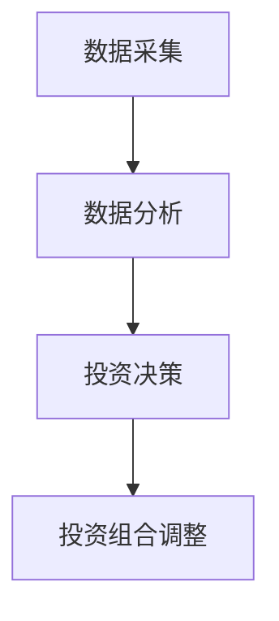

                 


---

# 玛丽·巴芙特的质量价值投资：寻找优质且低估的公司

> 关键词：价值投资，质量公司，低估公司，现金流贴现模型，安全边际，投资组合

> 摘要：本文深入探讨了玛丽·巴芙特的质量价值投资理念，从基础概念到数学模型，从系统架构到实战案例，全面解析如何寻找优质且低估的公司。通过详细分析质量投资的核心概念、估值方法、投资策略及实际应用，本文为投资者提供了从理论到实践的完整指导。

---

## 第1章: 质量价值投资的背景与基本概念

### 1.1 投资的基本概念与背景

#### 1.1.1 投资的定义与分类
投资是指将资金投入某个领域以期望在未来获得收益或资本增值的行为。根据投资对象的不同，可以将投资分为股票、债券、房地产等多种类型。在股票投资中，价值投资是一种以公司基本面分析为基础的投资策略，旨在通过寻找市场价格低于内在价值的公司来获得长期收益。

#### 1.1.2 价值投资的起源与发展
价值投资起源于20世纪20年代，由本杰明·格雷厄姆和戴维·多德提出，后来被玛丽·巴芙特发扬光大。这种方法强调以合理的价格买入具有强大基本面的公司，长期持有，等待市场重新认识到其价值。

#### 1.1.3 玛丽·巴芙特的投资理念
玛丽·巴芙特认为，投资的本质是寻找那些具有持续竞争优势、良好管理和强大财务状况的公司，并在市场价格低估时买入，长期持有，避免频繁交易。

---

### 1.2 现金流与时间价值

#### 1.2.1 现金流的概念与重要性
现金流是企业在一定时期内的现金流入和流出。企业的现金流状况直接反映了其盈利能力和偿债能力，是评估公司价值的重要指标。

#### 1.2.2 时间价值的基本原理
资金的时间价值是指资金随着时间的推移而产生的价值变化。未来现金流的现值可以通过贴现率计算得出，这是价值投资中估值的基础。

#### 1.2.3 现金流贴现模型的初步介绍
现金流贴现模型（DCF模型）是通过将未来现金流按适当贴现率折现，计算出公司内在价值的方法。DCF模型是价值投资中最重要的工具之一。

---

## 第2章: 质量价值投资的核心概念

### 2.1 质量投资的定义与特征

#### 2.1.1 质量投资的定义
质量投资是指选择那些具有强大竞争优势、稳定的盈利能力、良好的管理和健康的财务状况的公司进行投资。

#### 2.1.2 质量公司的核心特征
- **竞争优势**：公司在行业中具有独特的竞争优势，如专利、品牌、技术等。
- **盈利能力**：公司能够持续产生高于行业平均水平的利润。
- **管理团队**：公司管理团队能力强，有良好的治理结构。
- **财务健康**：公司财务状况稳健，负债低，现金流充足。

#### 2.1.3 质量投资与成长投资的区别
- 质量投资关注公司当前的盈利能力，注重安全性和稳定性。
- 成长投资关注公司未来的增长潜力，愿意为高增长支付较高估值。

---

### 2.2 低估公司的识别标准

#### 2.2.1 估值的基本方法
公司估值可以通过市盈率（P/E）、市净率（P/B）、股息率等多种指标进行初步判断。

#### 2.2.2 市盈率、市净率等指标的解读
- **市盈率（P/E）**：股价除以每股收益，反映市场对公司盈利能力的评价。
- **市净率（P/B）**：股价除以每股净资产，反映市场对公司资产价值的评价。
- **股息率**：股息与股价的比率，反映公司的分红能力。

#### 2.2.3 企业内在价值的计算公式
$$ \text{内在价值} = \sum_{t=1}^{n} \frac{\text{现金流}_t}{(1+r)^t} $$
其中，\( r \) 是折现率，\( \text{现金流}_t \) 是第 \( t \) 年的现金流。

---

### 2.3 安全边际的概念与应用

#### 2.3.1 安全边际的定义
安全边际是指市场价格与内在价值之间的差距，确保在市场价格波动时，投资者仍有获利空间。

#### 2.3.2 安全边际的计算方法
$$ \text{安全边际} = \text{内在价值} - \text{市场价格} $$

#### 2.3.3 安全边际在投资决策中的作用
通过建立安全边际，投资者可以避免过度支付，降低投资风险。

---

## 第3章: 质量价值投资的数学模型与估值方法

### 3.1 财务报表分析的基础

#### 3.1.1 利润表、资产负债表与现金流量表的解读
- **利润表**：反映公司一定时期内的收入和利润情况。
- **资产负债表**：反映公司某一时点的资产、负债和所有者权益情况。
- **现金流量表**：反映公司一定时期内的现金流情况。

#### 3.1.2 主要财务指标的计算公式
- **净利润率**：净利润 / 收入。
- **资产负债率**：负债 / 资产。
- **现金流**：经营活动、投资活动和筹资活动的现金流。

#### 3.1.3 财务报表分析的注意事项
- 重点关注公司的现金流状况，因为现金流是公司财务健康的核心指标。

---

### 3.2 现金流贴现模型的详细讲解

#### 3.2.1 现金流贴现模型的基本原理
通过将未来现金流贴现，计算出公司内在价值，作为估值的基础。

#### 3.2.2 永续年金与贴现率的计算
$$ \text{永续年金现值} = \frac{\text{年金}}{r} $$

#### 3.2.3 企业自由现金流的计算公式
$$ \text{企业自由现金流} = \text{息税折旧摊销前利润} - \text{资本支出} $$

---

### 3.3 估值方法的对比与选择

#### 3.3.1 市盈率法与市净率法的优缺点
- **市盈率法**：优点是简单易懂，缺点是无法反映公司的资产价值。
- **市净率法**：优点是能够反映公司资产价值，缺点是无法反映公司的盈利能力。

#### 3.3.2 现金流贴现法的适用场景
适用于对公司未来现金流有明确预测的情况。

#### 3.3.3 其他估值方法的简要介绍
- **股息贴现模型**：基于股息的现金流贴现。
- **重置成本法**：基于重置成本的估值。

---

## 第4章: 质量价值投资的系统架构与流程

### 4.1 投资流程的系统化

#### 4.1.1 投资目标的设定
- **短期目标**：获取稳定的股息收益。
- **长期目标**：通过资本增值实现财富增长。

#### 4.1.2 投资策略的选择
- **价值投资策略**：寻找优质且低估的公司。
- **成长投资策略**：投资于高增长潜力的公司。

#### 4.1.3 投资组合的构建与调整
- **分散投资**：避免过度集中，降低风险。
- **定期调整**：根据市场变化和公司情况，及时调整投资组合。

---

### 4.2 数据收集与分析工具

#### 4.2.1 数据来源的选择
- **财务报表**：公司年报、季报。
- **行业报告**：行业分析报告。
- **市场数据**：股价、成交量等市场数据。

#### 4.2.2 数据分析工具的使用
- **Excel**：用于基本的数据分析和图表绘制。
- **Python**：用于高级的数据分析和建模。

#### 4.2.3 数据可视化的基本方法
- **折线图**：用于展示股价走势。
- **柱状图**：用于比较不同公司的财务指标。

---

### 4.3 投资决策的系统架构

#### 4.3.1 投资决策的层次划分
- **宏观层面**：市场趋势、经济周期。
- **中观层面**：行业竞争格局。
- **微观层面**：公司基本面。

#### 4.3.2 系统架构的模块化设计
- **数据采集模块**：收集公司和市场数据。
- **数据分析模块**：进行财务分析和估值。
- **投资决策模块**：基于分析结果做出投资决策。

#### 4.3.3 系统交互的流程图展示


---

## 第5章: 实战案例分析与解读

### 5.1 玛丽·巴芙特的经典投资案例

#### 5.1.1 可口可乐案例
- **公司分析**：可口可乐拥有强大的品牌和全球市场。
- **估值过程**：使用DCF模型计算其内在价值。
- **投资决策**：在股价低估时买入并长期持有。

#### 5.1.2 苹果公司案例
- **公司分析**：苹果具有强大的技术创新能力和市场地位。
- **估值过程**：通过分析现金流和市盈率进行估值。
- **投资决策**：在市场波动时买入。

---

## 第6章: 项目实战

### 6.1 环境安装与数据收集

#### 6.1.1 环境安装
- **Python**：安装Anaconda或Miniconda。
- **数据收集工具**：使用Yahoo Finance API获取数据。

#### 6.1.2 数据收集
```python
import pandas as pd
import yfinance as yf

# 下载可口可乐的历史数据
cocacola = yf.download('KO', start='2020-01-01', end='2023-01-01')
```

---

### 6.2 系统核心实现源代码

#### 6.2.1 DCF模型实现
```python
def calculate_intrinsic_value(fcf, discount_rate):
    # 现金流贴现模型计算内在价值
    return sum(fcf / (1 + discount_rate) ** t for t in range(len(fcf)))

# 示例数据
fcf = [100, 100, 100, 100]
discount_rate = 0.10
iv = calculate_intrinsic_value(fcf, discount_rate)
print(f"内在价值: {iv:.2f}")
```

---

### 6.3 代码应用解读与分析

#### 6.3.1 代码功能解读
上述代码实现了现金流贴现模型，用于计算公司的内在价值。

#### 6.3.2 代码实现细节
- **现金流输入**：需要输入未来几年的自由现金流。
- **贴现率**：根据市场情况调整贴现率。

---

### 6.4 实际案例分析

#### 6.4.1 现金流分析
假设某公司未来5年的自由现金流分别为100, 110, 120, 130, 140万元，贴现率为10%。

$$ \text{内在价值} = \frac{100}{1.1} + \frac{110}{1.1^2} + \frac{120}{1.1^3} + \frac{130}{1.1^4} + \frac{140}{1.1^5} $$

计算结果为：
$$ \text{内在价值} \approx 445.33 \text{万元} $$

#### 6.4.2 投资决策
如果当前股价为400万元，则市场价格高于内在价值，应避免投资。

---

## 第7章: 最佳实践、小结与注意事项

### 7.1 最佳实践 tips

#### 7.1.1 长期持有优质公司
避免频繁交易，耐心等待市场重新认识到公司价值。

#### 7.1.2 保持分散投资
不要将所有资金投入到单一公司或行业，降低风险。

#### 7.1.3 定期复盘与调整
根据市场变化和公司情况，定期复盘并调整投资组合。

### 7.2 小结

玛丽·巴芙特的质量价值投资理念强调寻找优质且低估的公司，通过长期持有实现资本增值。本文通过理论分析、数学模型和实战案例，详细讲解了质量价值投资的核心概念和应用方法。

### 7.3 注意事项

- **风险提示**：投资有风险，需谨慎决策。
- **持续学习**：市场变化莫测，需不断学习和更新知识。
- **纪律性**：坚持投资策略，避免情绪化决策。

---

## 第8章: 拓展阅读与深入思考

### 8.1 拓展阅读

- **书籍推荐**：
  - 《巴菲特的资本主义》
  - 《投资的智慧》
- **在线资源**：
  - 玛丽·巴芙特官方网站
  - 投资分析论坛

### 8.2 深入思考

质量价值投资不仅是一种投资策略，更是一种投资哲学。通过不断学习和实践，投资者可以更好地理解市场，做出更明智的投资决策。

---

## 作者信息

作者：AI天才研究院/AI Genius Institute & 禅与计算机程序设计艺术 /Zen And The Art of Computer Programming

