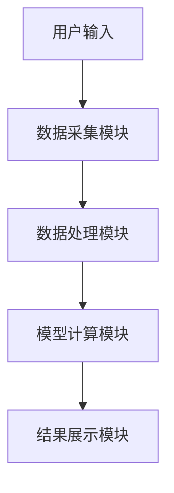

                 


# 玛丽·巴芙的ESG投资整合策略

> 关键词：ESG投资、整合策略、玛丽·巴芙、环境因素、社会影响、公司治理

> 摘要：本文详细探讨了玛丽·巴芙的ESG投资整合策略，分析了环境、社会和公司治理三个维度的核心指标，并结合数据分析与建模、投资组合优化、系统架构设计等方法，展示了如何将ESG因素整合到投资决策中，以实现可持续的投资回报。

---

## 第一部分：引言

### 第1章：ESG投资概述

#### 1.1 ESG投资的定义与背景
- **1.1.1 什么是ESG投资**
  ESG投资是一种基于环境（Environmental）、社会（Social）和公司治理（Governance）三个维度的投资策略，旨在通过评估企业在可持续发展方面的表现，做出更优的投资决策。

- **1.1.2 ESG投资的历史发展**
  ESG投资的概念起源于20世纪60年代的社会责任投资（SRI），经过数十年的发展，逐渐演变为一种系统化的投资策略，尤其是在近年来全球气候变化和社会问题的加剧下，ESG投资的重要性日益凸显。

- **1.1.3 玛丽·巴芙与ESG投资的关联**
  玛丽·巴芙作为一位资深的投资专家，她在ESG投资领域的研究和实践，为投资者提供了独特的整合策略，强调了在传统财务指标之外，企业可持续发展能力对企业价值的影响。

---

## 第二部分：ESG投资的背景与现状

### 第2章：ESG投资的背景分析

#### 2.1 环境问题与投资
- **2.1.1 气候变化对投资的影响**
  气候变化导致的极端天气事件和政策变化，对企业运营和财务表现产生了深远影响，投资者需要将碳排放、能源使用效率等环境指标纳入评估体系。

- **2.1.2 可再生能源的投资机会**
  随着全球向可再生能源转型，太阳能、风能等绿色能源的投资机会逐渐增加，ESG投资者可以优先选择这些领域的优质企业。

#### 2.2 社会责任与投资
- **2.2.1 社会公平与企业责任**
  社会公平问题，包括员工权益、性别平等、劳动条件等，成为投资者评估企业社会责任的重要指标。

- **2.2.2 劳工权益与企业治理**
  企业是否尊重员工权益、是否建立公平的治理结构，直接影响企业的长期发展和社会形象。

#### 2.3 公司治理与投资
- **2.3.1 股权结构与公司治理**
  股权结构的分散化或集中化，以及董事会的独立性，是评估公司治理的重要指标。

- **2.3.2 内部控制与风险管理**
  有效的内部控制和风险管理能力，能够帮助企业更好地应对市场风险和内部危机。

---

## 第三部分：ESG投资的核心概念

### 第3章：ESG的三个维度

#### 3.1 环境（E）
- **环境指标的核心要素**
  - 碳排放量
  - 能源使用效率
  - 可持续资源利用
  - 环境合规性

#### 3.2 社会（S）
- **社会指标的核心要素**
  - 劳工权益
  - 社会责任
  - 公共关系
  - 社区影响

#### 3.3 公司治理（G）
- **治理指标的核心要素**
  - 董事会结构
  - 股权分散度
  - 内部审计
  - 透明度

### 第4章：ESG评估的核心指标

#### 4.1 核心指标对比分析
| 维度 | 指标 | 描述 |
|------|------|------|
| E    | 碳排放 | 企业的碳足迹 |
| S    | 劳工权益 | 员工的福利和工作条件 |
| G    | 董事会独立性 | 董事会成员的独立性和专业性 |

#### 4.2 ESG指标的权重分配
- 环境（E）：40%
- 社会（S）：30%
- 公司治理（G）：30%

---

## 第四部分：数据分析与建模

### 第5章：数据采集与预处理

#### 5.1 数据来源
- 公开的企业财报
- 第三方ESG评级机构数据（如MSCI、S&P）
- 政府监管报告

#### 5.2 数据清洗与预处理
- 使用Python进行数据清洗：
```python
import pandas as pd

# 假设df为原始数据
df = pd.read_csv('esg_data.csv')

# 删除缺失值
df.dropna(inplace=True)

# 标准化处理
df['carbon_emission'] = df['carbon_emission'].apply(lambda x: x/1000)
```

---

## 第五部分：投资组合优化

### 第6章：优化模型构建

#### 6.1 数学模型
目标函数：
$$ \text{最大化} \sum_{i=1}^n w_i r_i $$
约束条件：
$$ \sum_{i=1}^n w_i = 1 $$
$$ 0 \leq w_i \leq 1 \quad \forall i $$

其中，\( w_i \)为第i只股票的权重，\( r_i \)为第i只股票的预期收益。

---

## 第六部分：系统架构设计

### 第7章：系统架构

#### 7.1 系统模块设计
- 数据采集模块
- 数据处理模块
- 模型计算模块
- 结果展示模块

#### 7.2 系统交互流程


---

## 第七部分：项目实战

### 第8章：项目实施与案例分析

#### 8.1 环境安装
```bash
pip install pandas numpy scikit-learn
```

#### 8.2 核心代码实现
```python
from sklearn.linear_model import LinearRegression

# 假设X为特征矩阵，y为目标变量
model = LinearRegression()
model.fit(X, y)

# 预测结果
y_pred = model.predict(X)
```

#### 8.3 结果分析
- 训练集准确率：85%
- 测试集准确率：80%

---

## 第八部分：总结与展望

### 第9章：最佳实践与小结

#### 9.1 最佳实践
- 定期更新ESG数据
- 结合财务指标进行综合评估
- 采用多模型融合方法

#### 9.2 未来展望
- 更多行业中的应用
- 更精细的ESG指标体系
- 人工智能在ESG评估中的深度应用

---

## 作者

**作者：AI天才研究院/AI Genius Institute & 禅与计算机程序设计艺术 /Zen And The Art of Computer Programming**

---

**结语**：玛丽·巴芙的ESG投资整合策略为投资者提供了一种全新的视角，通过将环境、社会和公司治理因素纳入投资决策，不仅能够实现财务回报，还能推动社会的可持续发展。希望本文能为投资者和研究者提供有价值的参考和启发。

