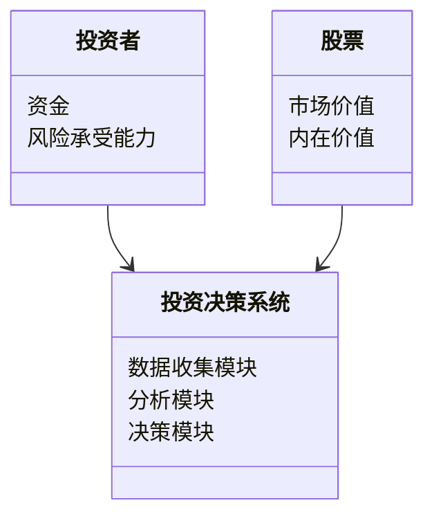

                 


# 玛丽·巴芙的全球价值投资策略

---

## 关键词：价值投资，玛丽·巴芙，安全边际，DCF模型，投资策略，全球市场

---

## 摘要：  
本文系统性地介绍玛丽·巴芙的全球价值投资策略，从其核心理念、数学模型到实际应用，全面解析其投资方法。文章首先介绍价值投资的背景与核心思想，然后深入分析玛丽·巴芙的投资策略，包括安全边际、市场先生理论和内在价值评估。接着，从系统架构和数学模型的角度，详细阐述其投资决策系统的构建与实现。最后，通过实际案例分析和代码实现，验证其策略的有效性，并总结最佳实践。

---

## 第1章 价值投资的背景与核心理念

### 1.1 价值投资的起源与发展

#### 1.1.1 投资学说的历史演变
- 17世纪的荷兰郁金香泡沫：早期投机与风险管理的萌芽。
- 19世纪的英国工业革命：实业投资与股票市场的兴起。
- 20世纪初的巴菲特时代：价值投资理论的形成与发展。

#### 1.1.2 玛丽·巴芙的背景与投资理念
- 玛丽·巴芙的学术背景与职业生涯。
- 玛丽·巴芙对巴菲特投资理念的继承与发展。
- 她在全球市场中的独特视角与策略。

#### 1.1.3 价值投资的核心思想与全球应用
- 价值投资的核心思想：寻找市场低估的企业，长期持有。
- 价值投资在全球市场的适用性：新兴市场与发达市场的差异。

---

### 1.2 价值投资的基本概念

#### 1.2.1 投资的定义与分类
- 投资的定义：将资金投入到能够产生收益的资产中。
- 投资的分类：股票、债券、房地产、 commodities 等。

#### 1.2.2 价值投资的特征与属性对比
- 表格对比：价值投资与其他投资策略（如成长投资、指数投资）的差异。

| 投资策略 | 价值投资 | 成长投资 | 指数投资 |
|----------|-----------|----------|----------|
| 核心目标 | 寻找低估企业 | 寻找高成长企业 | 按照市场指数配置资产 |
| 风险控制 | 高 | 中 | 低 |
| 持股时间 | 长期 | 长期 | 长期 |

#### 1.2.3 价值投资的核心要素
- 安全边际：买入价格低于内在价值的部分。
- 市场先生：市场的波动性与投资者的心理。
- 内在价值：企业未来现金流的现值。

---

## 第2章 玛丽·巴芙的价值投资策略分析

### 2.1 玛丽·巴芙的核心投资理念

#### 2.1.1 安全边际的定义与计算
- 安全边际公式：  
  $$ 安全边际 = 内在价值 - 市场价格 $$  
- 安全边际的意义：降低投资风险，确保收益的稳定性。

#### 2.1.2 市场先生理论的解析
- 市场先生：市场的波动性与投资者情绪的关系。
- 玛丽·巴芙的应对策略：利用市场的波动性寻找低估资产。

#### 2.1.3 内在价值的评估方法
- 玛丽·巴芙的内在价值计算公式：  
  $$ 内在价值 = \frac{预期现金流}{折现率} $$  
- 现金流预测的准确性：历史数据与未来预期的结合。

---

### 2.2 价值投资的数学模型

#### 2.2.1 玛丽·巴芙策略的数学模型
- 现金流折现模型（DCF）：  
  $$ 理论价值 = \frac{FV}{(1 + r)^n} $$  
  其中，FV为未来现金流，r为折现率，n为时间跨度。

#### 2.2.2 玛丽·巴芙策略的优化算法
- 算法流程：  
  1. 确定目标企业。  
  2. 估算企业未来现金流。  
  3. 计算内在价值。  
  4. 比较市场价格与内在价值，决定是否投资。

---

### 2.3 玛丽·巴芙的投资决策流程

#### 2.3.1 确定投资目标
- 确定投资目标的标准：  
  1. 企业具备竞争优势。  
  2. 企业财务健康。  
  3. 市场价格低于内在价值。

#### 2.3.2 财务分析与估值
- 财务指标分析：ROE、ROA、毛利率等。  
- 内在价值计算：DCF模型的应用。

#### 2.3.3 风险评估与投资组合优化
- 风险评估：企业特定风险与市场风险。  
- 投资组合优化：分散投资以降低风险。

---

## 第3章 价值投资的系统化分析与架构

### 3.1 系统分析框架

#### 3.1.1 投资目标与问题场景
- 投资目标：实现长期稳定的收益。  
- 问题场景：如何在全球市场中找到低估企业。

#### 3.1.2 系统功能设计（领域模型）



---

### 3.2 系统架构设计

#### 3.2.1 分层架构
- 数据层：收集股票数据。  
- 业务逻辑层：计算内在价值。  
- 用户界面层：展示投资建议。

#### 3.2.2 模块划分
- 数据收集模块：获取股票的财务数据。  
- 分析模块：计算内在价值与安全边际。  
- 决策模块：生成投资建议。

#### 3.2.3 数据流与交互设计
- 数据流：投资者输入资金，系统输出投资建议。  
- 交互：用户查询股票信息，系统反馈分析结果。

---

## 第4章 玛丽·巴芙策略的数学模型与算法实现

### 4.1 算法原理

#### 4.1.1 玛丽·巴芙策略的数学模型
- 内在价值计算公式：  
  $$ 内在价值 = \frac{FV}{(1 + r)^n} $$  

#### 4.1.2 算法实现步骤
1. 收集目标企业的财务数据。  
2. 估算未来现金流。  
3. 计算折现率。  
4. 计算内在价值。  
5. 比较市场价格与内在价值，决定是否投资。

---

### 4.2 代码实现

#### 4.2.1 环境安装
- Python 3.8+  
- pandas、numpy、scipy库。

#### 4.2.2 核心代码实现

```python
import numpy as np
import pandas as pd
from scipy import stats

def calculate_intrinsic_value(future_cash_flows, discount_rate):
    """
    计算内在价值
    Parameters:
        future_cash_flows (list): 未来现金流
        discount_rate (float): 折现率
    Returns:
        float: 内在价值
    """
    present_value = 0
    for year, cash_flow in enumerate(future_cash_flows, start=1):
        present_value += cash_flow / (1 + discount_rate) ** year
    return present_value

# 示例数据
future_cash_flows = [100, 150, 200, 250]
discount_rate = 0.1

# 计算内在价值
intrinsic_value = calculate_intrinsic_value(future_cash_flows, discount_rate)
print(f"内在价值：{intrinsic_value:.2f}")
```

---

### 4.3 实际案例分析

#### 4.3.1 案例背景
- 公司名称：假设为一家科技公司。  
- 财务数据：未来5年的现金流分别为100万、150万、200万、250万、300万。  
- 折现率：假设为10%。

#### 4.3.2 代码实现与结果分析
```python
# 示例数据
future_cash_flows = [100, 150, 200, 250, 300]
discount_rate = 0.1

# 计算内在价值
intrinsic_value = calculate_intrinsic_value(future_cash_flows, discount_rate)
print(f"内在价值：{intrinsic_value:.2f}")
```

#### 4.3.3 结果解读
- 内在价值：假设计算结果为1000万元。  
- 市场价格：假设为800万元。  
- 结论：买入，安全边际为20%。

---

## 第5章 最佳实践与注意事项

### 5.1 最佳实践
- 定期复盘与调整投资组合。  
- 保持对市场的敏感性，及时调整策略。  
- 结合宏观经济环境进行投资决策。

### 5.2 注意事项
- 避免过度依赖模型，忽略市场情绪。  
- 控制仓位，分散投资。  
- 风险管理：设定止损点。

### 5.3 拓展阅读
- 巴菲特的《 Intelligent Investor 》。  
- 玛丽·巴芙的《The New Buffettology》。

---

## 结语

玛丽·巴芙的全球价值投资策略是一种长期有效的投资方法，通过安全边际、内在价值和市场先生理论，帮助投资者在全球市场中实现稳定收益。本文从理论到实践，详细解析了其策略的核心思想与实现过程，为读者提供了系统的指导。

---

## 作者

作者：AI天才研究院/AI Genius Institute & 禅与计算机程序设计艺术 /Zen And The Art of Computer Programming

