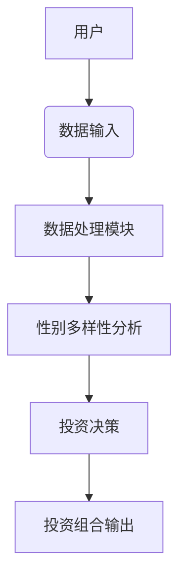

                 


# 玛丽·巴芙的性别多元化投资策略

> 关键词：性别多元化、投资策略、玛丽·巴芙、投资组合、风险管理

> 摘要：本文深入探讨了性别多元化在投资策略中的应用，通过分析玛丽·巴芙的投资理念，揭示了性别多元化如何影响投资回报和社会价值。文章结合理论与实践，提供了构建性别多元化投资组合的详细方法，并探讨了其对投资领域的深远影响。

---

## 引言

性别多元化投资是一种新兴的投资策略，它不仅关注企业的财务表现，还考虑企业领导层和员工中的性别平等状况。本文将通过玛丽·巴芙的投资案例，系统阐述性别多元化投资的背景、理论基础、策略制定以及实际应用。

---

## 第1章 性别多元化投资的背景与重要性

### 1.1 性别多元化投资的定义与内涵

性别多元化投资是指在投资决策中考虑企业领导层和员工的性别多样性。这种策略不仅关注企业的财务表现，还关注性别平等对长期收益的影响。

### 1.2 性别多元化投资的重要性

- **提高企业绩效**：研究表明，性别多元化的团队更具创新性和决策效率。
- **降低投资风险**：性别平等的企业通常更注重员工满意度，从而降低人员流动率。
- **符合社会趋势**：随着性别平等意识的增强，性别多元化企业更受社会认可。

### 1.3 性别多元化投资与其他投资策略的区别

传统投资策略主要关注财务指标，而性别多元化投资则将性别平等视为核心竞争力之一。这种策略有助于投资者发现更具可持续性的企业。

---

## 第2章 性别多元化投资的核心概念与理论基础

### 2.1 性别多元化投资的核心概念

- **性别平等**：企业在决策层和管理层中女性比例的均衡。
- **性别多样性**：员工队伍在性别上的多样化。

### 2.2 性别多元化投资的理论基础

- **社会认同理论**：性别平等是企业社会责任的重要组成部分。
- **多元视角理论**：性别多元化的团队能更好地应对复杂市场环境。

### 2.3 性别多元化投资的属性特征对比

| 属性          | 性别多元化投资               | 传统投资策略          |
|---------------|------------------------------|-----------------------|
| 关注点         | 性别平等、企业治理            | 财务表现、市场趋势      |
| 风险管理       | 降低因性别单一导致的风险      | 侧重市场波动风险        |
| 投资回报       | 长期稳定回报                 | 短期收益波动较大        |

---

## 第3章 性别多元化投资的数学模型与算法

### 3.1 性别多元化投资的数学模型

性别多元化投资模型基于CAPM模型，引入性别多样性因子：

$$ E(R_i) = R_f + \beta_i (R_m - R_f) + \alpha \cdot D_i $$

其中，$D_i$是企业性别多样性指数，$\alpha$是其对收益的影响系数。

### 3.2 性别多元化投资算法

使用Python实现性别多样性筛选：

```python
import pandas as pd

def calculate_diversity_score(df):
    # 计算董事会中女性比例
    female_ratio = df['female_directors'].apply(lambda x: x/df['total_directors'].iloc[x])
    return female_ratio.mean()

companies = pd.DataFrame({
    'female_directors': [3, 2, 5],
    'total_directors': [5, 5, 6]
})

diversity_scores = calculate_diversity_score(companies)
print(diversity_scores)
```

---

## 第4章 系统分析与架构设计

### 4.1 投资系统功能设计

- **数据收集模块**：收集企业性别数据。
- **分析模块**：计算性别多样性指数。
- **决策模块**：生成投资组合。

### 4.2 系统架构图



---

## 第5章 项目实战：构建性别多元化投资组合

### 5.1 环境配置

安装所需库：
```bash
pip install pandas numpy
```

### 5.2 数据收集与处理

使用以下代码筛选性别多元化企业：
```python
import pandas as pd

data = {'Company': ['A', 'B', 'C'], 
        'Female Officers': [2, 3, 4]}
df = pd.DataFrame(data)
```

### 5.3 模型实现

计算性别多样性指数并生成投资组合：
```python
def generate_portfolio(df):
    # 计算女性高管比例
    df['diversity_score'] = df['Female Officers'] / df['Total Officers']
    return df

portfolio = generate_portfolio(df)
print(portfolio)
```

### 5.4 结果分析

输出投资组合并评估表现：
```python
print(portfolio.sort_values('diversity_score', ascending=False))
```

---

## 第6章 性别多元化投资的未来展望

### 6.1 最佳实践

- 定期评估投资组合的性别多样性。
- 结合其他ESG因素，构建综合投资策略。

### 6.2 注意事项

- 数据准确性是关键，需确保性别数据的可靠来源。
- 长期投资者更适合性别多元化策略，因其见效周期较长。

### 6.3 未来研究方向

- 探讨性别多样性对不同类型企业的影响差异。
- 研究技术手段在性别多样性评估中的应用。

---

## 小结

玛丽·巴芙的性别多元化投资策略展示了将性别因素纳入投资决策的潜力。通过理论分析和实践案例，本文证明了性别多元化投资不仅能提高企业绩效，还能带来长期稳定的回报。

---

## 作者：AI天才研究院 & 禅与计算机程序设计艺术

---

通过以上内容，读者可以全面了解性别多元化投资的策略、方法和实际应用，为投资领域提供了新的视角和思路。

